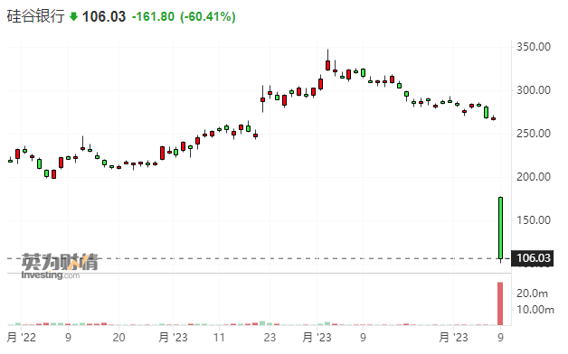

# 美股收盘：银行股全线暴跌引发恐慌 市场一线希望寄于糟糕非农

**财联社3月10日讯（编辑 牛占林）**
美东时间周四，美国股市遭遇了两周以来最糟糕的一天，银行板块全线暴跌，投资者担心银行业的一些问题可能潜藏着更广泛的危机。

在加密货币银行Silvergate宣布将关闭，以及硅谷银行遭遇流动性危机之后，引发了市场恐慌，投资者纷纷逃离银行板块。

投资机构Miller Tabak首席市场策略师Matt
Maley指出:“每个人都在担心，更高的利率将在2023年的某个时候导致更高的违约率，而问题现在已经出现了。”

在硅谷银行股价遭遇暴跌之后，其首席执行官Greg
Becker发出呼吁，请大家保持冷静并支持我们，不要恐慌，银行有充足的流动性来支持我们的客户，但如果每个人都说我们有麻烦了，那就真的“有麻烦了”。

富国证券的分析师在周四写道：“‘硅谷银行时刻’并不能完全说明行业的情况，但会影响人们的情绪。”

此外，随着投资者重新考虑对利率的预期，股市的涨势受到了抑制。许多交易员越来越相信，美联储将把利率推高至高于此前预期的水平，并将维持高利率更长时间。

投资者接下来将关注周五的非农数据，如果劳动力市场报告显示新增就业少于预期，股票价格可能会上涨，也会缓解加息的担忧。但如果非农就业人数再度超过预期，市场恐再度迎来一场大跌。

**市场动态**

截至收盘，道指跌543.54点，跌幅为1.66%，报32254.86点；纳指跌237.65点，跌幅为2.05%，报11338.35点；标普500指数跌73.69点，跌幅为1.85%，报3918.32点。

标普500指数的11个板块在全军覆没，金融板块收跌4.1%表现最差，原材料、可选消费、房地产、电信服务板块至多跌超2.5，工业板块跌1.47%，信息技术/科技板块跌1.45%，公用事业板块跌超0.8%跌幅最小。

美股行业ETF全线下跌，金融业相关ETF成重灾区，其中区域银行ETF重挫8.13%，银行业ETF跌7.30%，金融业ETF跌4.09%，全球航空业ETF跌3.07%，网络股指数跌2.64%，可选消费ETF跌2.38%，生物科技指数ETF跌1.92%。

**热门股表现**

大型科技股普跌，特斯拉跌约5%，苹果跌1.53%，Meta跌1.77%，奈飞跌4.5%，谷歌A跌2%，亚马逊跌1.78%。

KBW银行指数跌7.7%，创2020年6月以来最大单日跌幅，创2022年10月下旬以来新低。硅谷银行重挫60％，创纪录最大跌幅。Silvergate跌超42%，股价创历史新低。美国银行、富国银行跌超6%，摩根大通跌超5%，花旗集团跌超4.1%。

热门中概股全线下跌，纳斯达克中国金龙指数跌5.40%。京东跌超11%，哔哩哔哩跌超8%，拼多多、百度跌超7%，微博、富途控股、满帮跌超5%，阿里巴巴、蔚来、爱奇艺跌超4%，理想汽车跌超3%，唯品会、腾讯音乐跌超2%，网易、小鹏汽车跌超1%。

**公司消息**

**【瑞信推迟发布2022年年报 前一晚接到美国监管机构来电】**

瑞士信贷集团周四宣布将推迟公布2022年年报，该公司在前一日晚间接到来自美国美国证券交易委员会（SEC）的电话，谈话内容涉及2019年和2020年现金流量表。涉及SEC就早前披露的对2020和2019财年合并现金流量表的修订的意见。瑞士信贷称，管理层认为，谨慎起见，应暂时推迟公布账目，并说这不会影响其2月初发布的2022年财务业绩。

**【小i机器人正式在美国纳斯达克挂牌上市】**

小i机器人周四正式在美国纳斯达克挂牌上市，发行股票代码为“AIXI”。小i集团创始人、董事长兼CEO袁辉在上市仪式中表示：“小i的目标是打造中国版ChatGPT，目前小i机器人拥有中国自主研发并具有自有知识产权的认知智能平台，并已实现大规模商业化变现。”该股收盘跌逾14.5%。

**【甲骨文第三财季调整后收入124.0亿美元 分析师预期124.1亿美元】**

甲骨文（Oracle
Corporation）第三财季调整后收入124.0亿美元，分析师预期124.1亿美元；第三财季云服务和许可证支持收入89.2亿美元；第三财季调整后运营利润51.9亿美元，分析师预期51.0亿美元；第三财季运营利润率42.0%，分析师预期41.2%；宣布季度派息每股0.40美元，较之前一次派息增长25%。

**【硅谷银行遭遇流动性危机】**

硅谷银行表示，出售了其所有210亿美元的可销售证券，这个组合基本上由美国国债和抵押贷款支持证券组成。公司表示，其因此遭受了18亿美元的税后损失，将在2023年第一季度入账。随着利率上升，抵押贷款支持证券和国债等固定收益证券的价格下跌。为了抵消资产出售所带来的损失，SVB称正在筹集22.5亿美元，包括从私募股权公司泛大西洋投资那里筹集5亿美元，并向投资者发行12.5亿美元的可转换优先股和普通股。

（财联社 牛占林）

