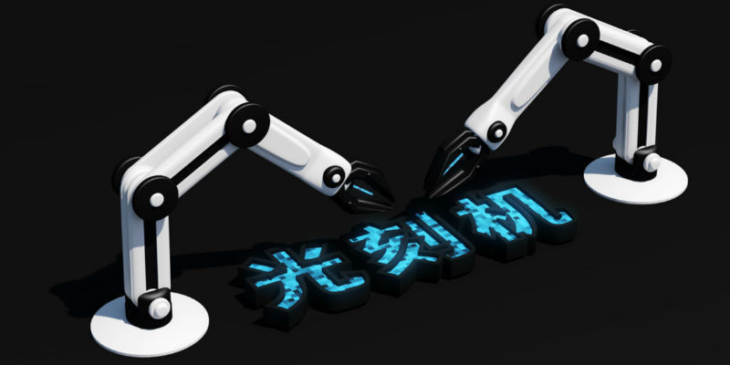

# 荷兰限制部分型号光刻机出口 中国市场影响几何

**经济观察网 记者 沈怡然** 荷兰政府要求ASML停止向中国提供DUV浸润式光刻机的消息得到了进一步证实，这一次出口管制的范围已经精确到设备型号。

3月8日，荷兰贸易和发展合作部长Liesje
Schreinemacher发布了一份主题为“宣布即将对先进半导体制造设备采取的出口管制措施”的公告表示，鉴于技术的发展和地缘政治的背景，政府已经得出结论，有必要扩大现有的特定半导体制造设备的出口管制。

当日ASML以公告方式作出回应：由于这些即将出台的法规，ASML将需要申请出口许可证才能装运最先进的浸润式DUV系统。ASML还将对管制范围的推断进一步精确到两款DUV浸润式光刻机TWINSCAN
NXT：2000i、TWINSCAN NXT：2050i。

3月9日，记者就此向ASML进一步询问。对方回应称，基于公司的了解，出口限制将针对新设备和备件的发运。

一位熟悉半导体建厂的人士对记者称，从目前公开的信息看，管制范围是非常精确和具体的。通常来说，使用者（半导体制造厂）进入40/45nm节点后就需要使用浸润式DUV，其中1980Di的使用在这个阶段较为普遍。2000i和2050i两款设备则更为先进，是有可能帮助使用者生产先进芯片的，也就是14nm及以下的芯片。

该人士称，从这两款设备的适用范围来看，不涉及目前中国绝大部分的制造厂，使用者集中在少数头部半导体制造厂，这些制造厂各自拥有不止一条产线，不同规模的产线所使用的机器数量不同，无法推断出每家公司具体的装机量。

就上述荷兰方面行为，3月9日，中国外交部发言人毛宁在例行记者会上表示，中方注意到有关报道，对荷方以行政手段干预限制中荷企业正常经贸往来的行为表示不满，已向荷方提出交涉。希望荷方秉持客观公正立场和市场原则，尊重契约精神，不滥用出口管制措施，维护国际产业链供应链稳定和自由开放的国际贸易秩序，维护中荷两国和双方企业共同利益。

**浸润式DUV光刻机受限**

光刻机按照光源波长可以划分为DUV和EUV系统。在DUV系统中，依照镜头和硅片之间的不同的介质可划分为干式DUV和浸润式DUV；从生产芯片的先进性来看，EUV
>DUV浸润式>DUV干式。

ASML在公告中将限制的范围进一步精确：新的出口管制措施并不针对所有浸润式光刻系统，而只涉及所谓“最先进”的浸润式光刻系统。尽管尚未收到有关“最先进”的确切定义的信息，ASML将其解读为“关键的浸润式光刻系统”，即TWINSCAN
NXT：2000i及后续推出的浸润式光刻系统。

根据官网，ASML推出的浸润式DUV有三款，依次是TWINSCAN NXT：1980Di、TWINSCAN NXT：2000i、TWINSCAN
NXT：2050i。依照ASML所说，受限制的只有后两款2000i和2050i。根据官网，2000i和2050i都可用于高级逻辑芯片和
DRAM节点的大批量制造。

Liesje
Schreinemacher在关于国家出口管制措施的设计中，以最先进的深紫外（DUV）浸润式光刻和沉积技术举例，认为这些技术与其他某些先进技术相结合，对先进半导体的生产起到关键作用，而荷兰在这方面又具有独特的领先优势。

在中国与ASML有直接供应关系的企业主要是芯片制造商，有中芯国际、华力半导体、长江存储等中国企业，还有三星的西安工厂、台积电南京厂、英特尔大连厂、无锡SK海力士厂等外资企业。

上述人士称，目前全国各地建设的半导体厂约有数百家，除了头部的半导体厂，真正能用上浸润式DUV的工厂并不多，整体的建设处于尚未形成规模效益的初期阶段，月产能达到数十万片晶圆的产线是非常少的。同时，这些产线不涉及先进芯片，主要用于生产技术相对成熟的芯片，如功率器件等。

对于这类光刻机在中国的装机量，目前尚无相关的公开数据。根据ASML提供的数据，目前全方位光刻解决方案下的装机量在中国已超过1000台，其中硬件上包括光刻机台和量测机台，但该公司没有公布光刻机所占的比例。

**精确的管制范围**

不过，这些管制措施需要一定时间才能付诸立法并生效。

在Liesje
Schreinemacher的公告中表示，一些具体的国家出口管制措施是必要的，而且会涉及半导体生产周期中非常具体的技术，政府对最终所选的技术点是非常谨慎和精确的，以避免对价值链造成不必要的干扰，并考虑到国际公平竞争的环境。政府的目标是在夏季之前将先进半导体制造设备的部级法规发布在政府公报上。

半导体已成为中美两个经济体之间日益加剧竞争的关键战场，ASML掌握的光刻技术是半导体生产工序中的关键。这家荷兰公司已经和中国有超过20多年的业务往来，目前在中国有1500名员工。记者从该公司获悉，ASML中国还在2023年扩充人力。

目前其对中国客户的销售可能再一次面临限制。该公司曾在2023年1月发布公告称，一些关于先进芯片制造技术的管制措施正在拟定中，包括但不限于先进的光刻工具。公司一直与当局讨论任何拟议法规的潜在影响，以确保对全球半导体供应链的影响得到适当评估。

在3月8日的公告中，ASML预计，这些管制措施不会对其已发布的 2023 年财务展望以及于去年 11 月投资者日宣布的长期展望产生重大性影响。

出于国际协定《瓦森纳协定》等因素，在本次DUV浸润式光刻机受限之前，ASML的EUV光刻系统已经受到限制。EUV光刻机是目前全球攻克7nm、5nm、3nm先进芯片批量生产的关键设备。

一直以来，ASML无法向中国客户出售EUV光刻机，出售这类光刻机需要荷兰政府的出口许可。但除此之外，ASML其他产品在中国一直未受到限制。

