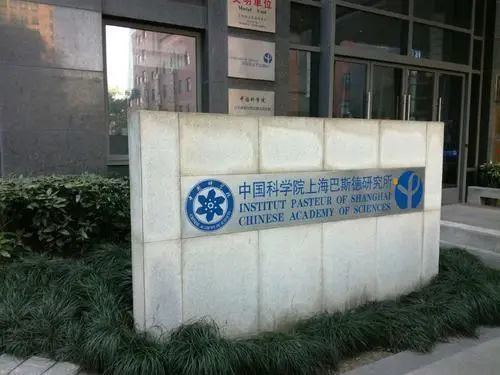

# 运行近20年的上海巴斯德研究所将改名，并由中科院全权管理

法国巴斯德研究所的一位发言人告诉《自然》杂志，在两个组织进行了一年的对话之后，巴斯德研究所决定在2022年12月停止与中国科学院共同领导中国科学院上海巴斯德研究所。他说：“做出这一选择是为了开始新一轮的对话，以改善两个组织之间的关系，并找到一种更有成效的合作方式。”

法国巴斯德研究所发言人表示，未来中国科学院上海巴斯德研究所将由中国科学院全权管理，并更改名称。

当地时间3月8日，据《自然》（Nature）杂志报道，著名的法国巴斯德研究所（Pasteur
Institute）宣布中断与中国科学院的合作，撤出在中国科学院上海巴斯德研究所的领导工作。

_《自然》（Nature）报道截图。_

3月9日，澎湃科技记者向中国科学院上海巴斯德研究所相关人士求证，得到其肯定答复，“真的。时代发展，合作模式也要发展。”

澎湃科技记者联系了两位从中国科学院上海巴斯德研究所毕业的青年科学家，他们都对这一消息表示震惊，一位科学家感慨道：“扎心呀，这是我们的母校。”

至于双方合作终止以后的影响，上海一位做病毒研究的科学家告诉澎湃科技，“肯定有影响，但是上海巴斯德（所）还是相对比较独立的，应该还好。”

法国巴斯德研究所官网显示，巴斯德研究所成立于1887年，是一个非营利性基金会，其使命是通过研究、创新、教育和公共卫生行动，为预防和治疗疾病（主要是传染病）做出贡献。巴斯德研究所与世界卫生组织等主要国际科学机构以及世界各地的许多组织、基金会、研究机构、大学或其他私人行为者合作，开发了许多重大国际项目。此外，巴斯德研究所是巴斯德网络的成员，巴斯德网络是一个公共卫生、教育和研究方面的国际合作网络，汇集了全球33名成员。

公开资料显示，中国科学院上海巴斯德研究所于2004年10月11日揭牌成立，时任法国总统希拉克在上海出席了揭牌仪式；2005年7月开始运行，2007年7月23日获中央机构编制委员会办公室批复，是中国科学院与法国巴斯德研究所共建的整建制从事人类传染性疾病基础研究和相关技术应用研究的综合性研究机构。2020年1月2日，中国科学院党组将上海巴斯德所正式纳入直属事业单位管理序列。

值得一提的是，2004年8月30日，中国科学院、上海市人民政府和法国巴斯德研究所在上海签署建立中国科学院上海巴斯德研究所的合作协议。2017年开始，上海巴斯德所共建方变更为中国科学院和法国巴斯德研究所。

上海巴斯德所聚焦病原微生物基本生命活动规律、重大传染性疾病的致病机制等关键科学问题，推动病原学、免疫学和疫苗学知识创新与学科发展。以创新国际合作机制为契机，建设标杆式国际化研究所，为健康“一带一路”提供支撑与保障。上海巴斯德所现设有生物学、基础医学
2 个专业一级学科博士研究生培养点，细胞生物学、微生物学、免疫学、病原生物学、生物与医药5个专业二级学科硕士研究生培养点。

上海巴斯德研究所是巴斯德国际网络成员之一，从
2016年起担任亚太区总协调单位（巴斯德国际网络作为世卫大会非政府成员，是传染病防治领域的一支重要国际科技组织），以科学和公共卫生使命为纽带，积极拓展国际科技合作。

上海巴斯德所下设中科院分子病毒与分子免疫重点实验室，微生物、发育与健康研究中心等学术单元，是首批“国家级国际联合研究中心”之一。截至2022年8月，该研究所在职员工146人，博士后29人（含联合培养博士后5人）。2020年9月，上海巴斯德研究所获得上海市委、市政府表彰，被授予“上海市抗击新冠肺炎疫情先进集体”称号。

法国巴斯德研究所的一位发言人告诉《自然》杂志，在两个组织进行了一年的对话之后，巴斯德研究所决定在2022年12月停止与中国科学院共同领导中国科学院上海巴斯德研究所。他说：“做出这一选择是为了开始新一轮的对话，以改善两个组织之间的关系，并找到一种更有成效的合作方式。”

这位发言人说，未来中国科学院上海巴斯德研究所将由中国科学院全权管理，并更改名称。

中国科学院方面表示，“两个研究所长期以来一直保持友好合作关系，中国科学院由衷感谢巴斯德研究所和法国科学家一直以来作出的贡献。两个研究所也正在积极探索新的合作方案，而非采用这种‘联合研究所’的形式，以更好地应对传染病研究的全球挑战。”

据《自然》杂志报道，巴斯德研究所和中国科学院都没有回答关于合作终止后资金分割的问题。

《自然》杂志报道称，中法科研机构终止合作的具体原因尚不清楚，但这让很多科学家感到惊讶。曾与中国科学院上海巴斯德研究所合作的香港大学自然保护生物学家爱丽丝·修斯（Alice
Hughes）表示，“这可能标志着科学伙伴时代的结束”。

但也有科学家不认为这一消息反映了更宏观的趋势。“这仅是个案。中国仍然鼓励国际间的科学合作，这对传染病学领域更是必不可少。”
曾在中国科学院上海巴斯德研究所工作的武汉大学病毒学家蓝柯在接受《自然》杂志采访时说。蓝柯教授曾于2006年至2016年任中国科学院上海巴斯德研究所研究员，2011年至2016年任该所副所长。

日本丰桥福志村医院（Fukushimura Hospital）的医生、病毒学家Tetsuya
Toyoda曾于2005年至2010年期间在上海巴斯德研究所工作，他向《自然》杂志表示，该研究所培养了许多生物安全和病毒学的研究人员。巴斯德研究所决定与中国科学院中断关系，对中国病毒学研究的影响微乎其微，因为病毒学研究是中国的优势之一。

