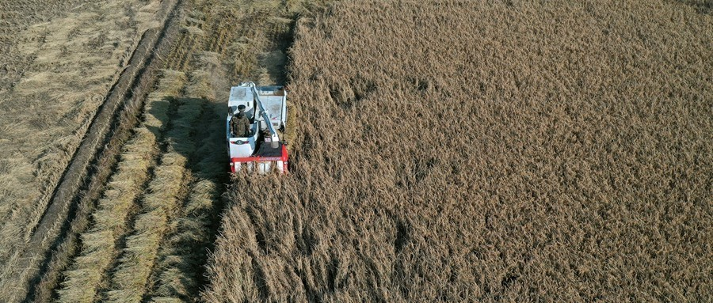
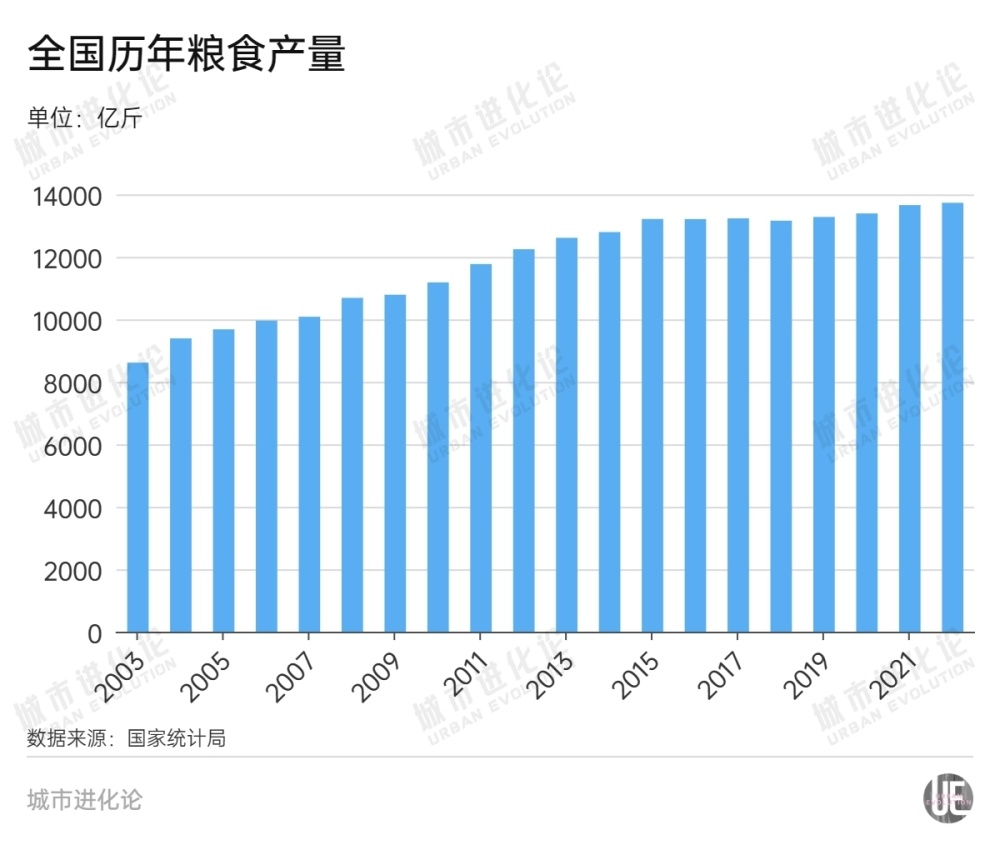
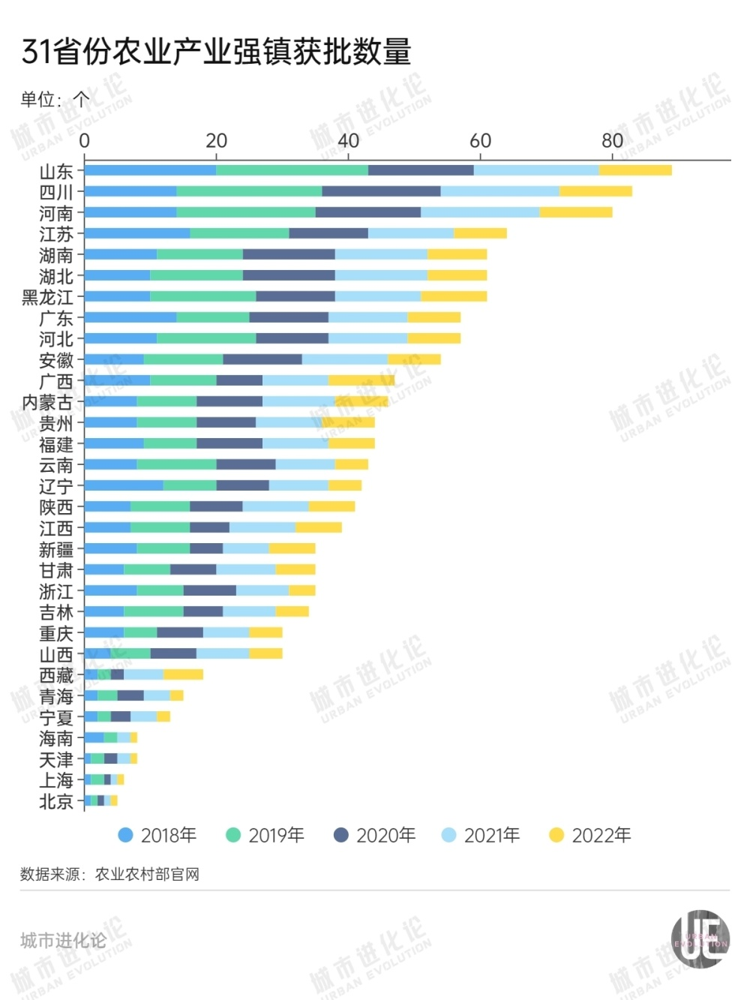
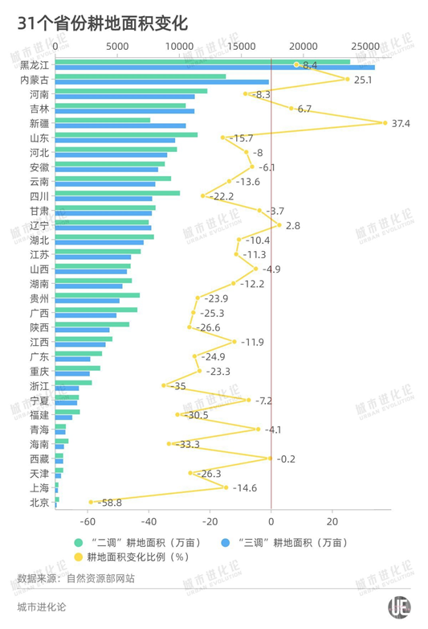

# 14亿人的“饭碗”安全靠谁挑大梁？这5个大省粮食产量占半壁江山

每经记者：程晓玲 每经编辑：刘艳美

_图片来源：新华社_

粮食安全是“国之大者”，谁来养活中国？2023年刚开局，从中央到地方，重磅动作不断——

全国层面，继2月发布的中央一号文件首提“农业强国”后，近日政府工作报告明确将“稳定粮食生产和推进乡村振兴”列入今年工作重点，并提出“实施新一轮千亿斤粮食产能提升行动”“加强农田水利和高标准农田等基础设施建设”“深入实施种业振兴行动”等；

聚焦地方，据不完全统计，全国已有超20个省份明确提出“建设农业强省（区）”，更有不少省份首次将这一目标纳入当地一号文件高位推进。

**14亿人的“饭碗”能不能端牢，很大程度上取决于几个农业大省能否挑起大梁。**

今年全国两会期间，河南、四川两省以全团名义提交多份建议，分别聚焦种业、耕地等关键领域寻求国家层面的相关支持。

在这场全国超半数省份参与的“强省”竞逐中，“开局抢跑”的川豫能否率先破题？

01

时隔14年，千亿斤粮食产能提升行动再次提上日程，一个现实背景不容忽视：我国粮食产需在今后相当长的时期内仍将处于紧平衡态势。

一方面，随着经济高质量发展和城镇化推进，粮食等重要农产品需求仍将呈刚性增长态势；另一方面，受气候变化、全球粮食产业链供应链不确定风险增加等因素影响，粮食增产难度进一步加大。

早在2009年，我国就曾发布专项规划，提出全国新增1000亿斤粮食产能。过去十多年间，我国粮食产量跨上三个千亿斤台阶，其中，从1.1万亿斤到1.2万亿斤用了2年时间，1.2万亿斤到1.3万亿斤用了3年，而从2015年突破1.3万亿斤至今，在这一台阶上已保持8年之久。

随着今年中央一号文件和政府工作报告相继提出“实施新一轮千亿斤粮食产能提升行动”，这也意味着我国粮食产量将加速向1.4万亿斤迈进。

**粮食产量迈向新“万亿”台阶，哪些省份将挑起大梁？**

根据国家统计局公布的历年数据，全国31个省份中，黑龙江、河南、山东、安徽、吉林产量稳居全国前五位，五省总产量占全国近半壁江山，可谓举足轻重。

2022年，全国实现粮食产量68652.8万吨，上述五省粮食产量分别达到7763.1万吨、6789.4万吨、5543.8万吨、4100.1万吨、4080.8万吨，总产量超过全国的41%。

从增量看，相比2021年，全国共有23个省份实现粮食增产。其中，河南由于此前洪涝灾害造成减产，2022年恢复性增产245.2万吨，增量最高；新疆、内蒙古、山东、山西、吉林紧随其后，年增量均超过41.6万吨。在去年粮食减产的8个省份中，黑龙江、四川、湖南、辽宁减产较多。

相比“产量”而言，“产业”更能印证农业大省的综合实力。其中，经国家层面认定的农业产业强镇，成为各地农业产业发展、打响名片的重要阵地。

公开数据显示，自2018年农业农村部、财政部启动农业产业强镇示范建设以来，全国已公布5批共1309个农业产业强镇。

其中，山东以89个镇位居全国第一，四川83个镇排名第二，紧随其后的河南、江苏分别获批80个、64个镇，黑龙江、湖北、湖南均获批61个镇、并列排名第五。

经过多年培育发展，农业产业强镇的带动效应不容小觑——几乎年年拿下“强镇”数量冠军的山东，同时也是全国首个农林牧渔业总产值过万亿元的省份；而获批“强镇”总数居全国前三的四川和河南，农林牧渔业总产值也仅次于山东，位列全国前三。

02

得益于农业大省的强力支撑，我国粮食总产量已实现“十九连丰”，人均粮食占有量高出国际安全线20%，实现谷物基本自给、口粮绝对安全。

与此同时，中国仍是全球第一大粮食进口国。海关数据显示，2022年我国累计进口粮食14687.2万吨，其中仅大豆进口量就达9108.1万吨。

**粮食结构性短缺、长期依赖国外进口，核心问题就在于缺少高产的“种子”。**

在此背景下，加速粮食“芯片”种子的升级培育，成为近年来我国三农领域的核心议题。相比往年，今年中央一号文件亦划出“主攻单产、力争多增产”的新重点，并专节提出深入实施种业振兴行动。

对此，不少省份已经行动在前。

比如全国第二产粮大省河南。数据显示，截至2021年底，河南全省农作物种子企业数量约占全国8.7%，位居第一。但同时，河南省种企“弱、小、散”特征突出，与其种业大省的地位明显不相匹配。

“我省周边的安徽、湖南、山东、北京、黑龙江、海南、甘肃均有种业上市公司，而我省在这方面还是空白。”河南省农业科学院曾在《河南日报》刊文指出，河南省农业农村厅资料显示，截至2020年12月，河南省登记在册的种子企业有600多家，但具有育繁推一体化资质的只有7家，整体种子企业小而弱，市场占有率偏低。

为打破这一局面，2022年初，河南省政府工作报告提出组建河南种业集团。当年12月，河南省政府印发《关于加快建设“中原农谷”种业基地的意见》，明确支持河南种业集团在“中原农谷”种业基地落地，打造一批有核心研发能力的龙头种企。

同年底，河南秋乐种业科技有限公司在北京证券交易所上市，不仅填补了河南种业上市企业空白，也成为我国2012年以来唯一上市的农业种业企业。对河南而言，这算得上是一个重大突破。

今年初，河南省政府工作报告再次明确，支持神农种业实验室争创国家实验室基地，组建河南种业集团。

为向上争取更多支持，3月6日，河南代表团以全团名义向十四届全国人大一次会议提交《关于恳请国家支持神农种业实验室融入国家种业实验室体系的建议》《关于恳请国家支持河南建设“中原农谷”的建议》。

不仅如此，河南省委书记楼阳生、省长王凯还分别在两会期间多个重要场合就上述建议作出提议、恳请，全省上下的重视程度不言而喻。

按照当地媒体的说法，“顶级平台，也要有顶级的政策支持”。中央出题，农业大省、粮食大省河南必须率先“答卷”。

03

相比动辄十年起的农作物种子研发周期，在“耕地”上下功夫见效相对更快。

农业农村部部长唐仁健曾在去年全国两会首场“部长通道”给出推演：中国14亿人口，每天一张嘴，就要消耗70万吨粮、9.8万吨油、192万吨菜和23万吨肉。要满足如此庞大的消费需求，每年的粮棉油糖菜播种面积大概稳定在23亿-24亿亩，如果按1.3的复种指数倒推计算，耕地必须保持在18亿亩。

然而，从现实情况看，要长期守住18亿亩耕地红线并非易事。

自然资源部公布的第三次国土调查数据显示，全国耕地19.18亿亩，守住了18亿亩耕地保护红线。不过，自第二次国土调查以来的10年间，全国耕地地类减少1.13亿亩，年均减少面积还略有扩大。

我国耕地数量减少趋势持续多年，人均耕地面积上也随之递减，从第一次国土调查的1.59亩/人到第二次1.52亩/人，再到第三次的1.36亩/人，不到世界平均水平的40%。

进一步看31个省份的耕地情况，2009到2019年的十年时间，全国仅内蒙古、新疆、黑龙江、吉林、辽宁五个省份耕地面积增加，其余26个省份耕地面积减少。

其中，四川减少最多，共减少2239万亩，其耕地面积占全国比重也从第六位下滑至全国第十。向来有“天府粮仓”之称的四川成都平原，耕地面积更是在10年间大幅减少40%。

一度严峻的“耕地非农化非粮化”问题，无疑给作为全国13个粮食主产省之一、西部唯一粮食主产区的四川带来巨大危机。

为守牢“天府良田”，四川近年来在耕地保护、高标准农田建设等方面频频发力。

值得注意的是，在今年2月正式发布的《建设新时代更高水平“天府粮仓”行动方案》中，四川明确提出，到2030年，耕地保有量和永久基本农田保护面积超额完成国家下达目标任务、永久基本农田基本建成高标准农田等定量定性目标，“天府粮仓”建设目标基本实现。

上述行动方案发布不到一个月，全国两会期间，四川代表团以全团名义提交《关于支持四川建设新时代更高水平“天府粮仓”和擦亮农业大省“金字招牌”的建议》和《关于持续加大高标准农田建设投入力度的建议》，期望得到更多国家层面的相关支持。

四川的积极姿态不难理解，在加快建设农业强国的起步之年，“快人一步”向上争取项目、资金、政策支持，或将成为助推农业大省向农业强省加速转变的关键之举。

每日经济新闻

