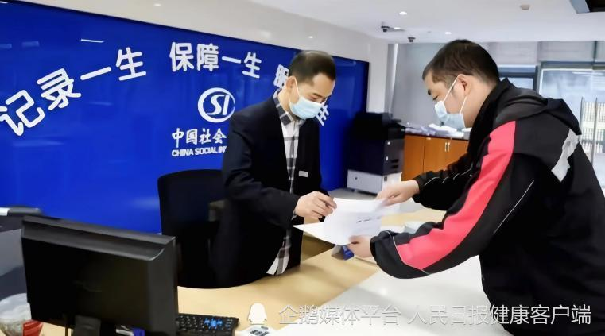

# 不在48小时内死亡就不认定工伤，人大代表：以抢救时间为条件太僵化

**人民日报健康客户端 记者 孔天骄**

据法治日报，全国人大代表、安徽古井集团有限责任公司董事长梁金辉表示，因为“48小时”工伤认定的规定过于倚重时间的限制，而且条文规定明确，囿于形式标准，造成很多工伤亡者不能享受工伤待遇。

根据《工伤保险条例》第十五条规定，职工在工作时间和工作岗位，突发疾病死亡或者在48小时之内经抢救无效死亡的，视同工伤。该规定自2003年《工伤保险条例》制定并实施以来，争议也不间断。目前来看，其执行过程中存在很多现实问题。

**以抢救时间作为认定条件过于僵化**

3月10日，医法汇创始人张勇律师告诉人民日报健康客户端记者：“以抢救时间来作为认定或者视同工伤与否的做法显然是不合理的，长期以来劳动部门对职工在工作岗位突发疾病的现象，均适用《工伤保险条例》第十五条中的只要不在48小时内死亡，就不能认定为工伤。这种情形在实践中饱受争议。”

张勇律师解释，“国家设置工伤保险制度的目的就是为了使受到工伤损害的劳动者获得医疗救治和经济补偿，以更好的保护劳动者的合法权益。目前随着医疗技术的进步，对患者的抢救超过48小时的情形非常常见，法律也应当与时俱进，适时做出相应的修改，不应僵化地用抢救时间来作为认定工伤的条件。”

_重庆市社保人员为快递员办理工伤保险业务，“重庆人社”微信公众号图_

**最初有其科学性，但当前救治水平早已进步**

2022年6月，健康时报就曾刊发《“死亡48小时”工伤认定的是是非非》稿件，其中，上海至合律师事务所创始合伙人卢昭宇律师曾对健康时报记者表示，“48小时的规定，从立法者的角度来说，是考虑了突发疾病抢救的一般时间、基于普遍性的医学诊疗经验而确定的，有它内在的科学性与合理性，同时，这项规定又是考虑到制度成本和执法经济性所必须作出的慎重决定。但如果下沉到每个具体的案件中，尤其是对于因事故而陷入重度昏迷的案件，抢救时间很可能超过48小时，对于家属来说，只要有一丝希望，就不愿意放弃，这是人之常情。”

梁金辉代表在接受法治日报采访时解释，随着医学的发展，一方面在现代先进的医疗技术设备和药品的作用下，维持病人的生命体征是比较容易做到的事情，有些病人家属为了保留一丝抢救的希望不愿意放弃治疗，可能导致抢救时间超过48小时。

另一方面，如果病人在发病时所在的医疗机构条件有限，病人不能得到及时、有效的治疗，有时还需要转至条件更好的医院进行救治，如果以医疗机构的初次诊断时间作为突发疾病的起算时间，大部分均会超过48小时。

“现实生活中患者的抢救时间并不会因为法律的明确规定而限定在某个时刻，把‘48小时’作为工伤认定的量化时间是将不确定的社会风险转嫁给弱势的劳动者，显然违背公平原则，而且这样的法律规定明显有违条例的立法初衷。”梁金辉说，这在司法实践中产生了诸多争议。

**应尽快优化细化工伤认定“48小时”之限**

卢昭宇律师建议，未来可以考虑在时机成熟的时候，适当延长这个“红线”。

工伤认定的基本条件应该是劳动者所受到的损害与“工作原因”有关，张勇律师建议，应当着眼于“因工作原因或者因履行工作职责受到伤害”这一要素，作为劳动者工伤的认定条件，无论抢救多长时间，只要劳动者所受的损害是因工作原因或者因履行工作职责，都应认定为工伤，这样才符合《工伤保险条例》保护职工权利的立法目的。

梁金辉代表认为，应该以人为本，结合当今医疗发展水平，尽快完善《工伤保险条例》，科学认定、优化细化“48小时之限”，切实加强对工伤、工亡者的法治保障。

他建议，完善“48小时内死亡”条款，增加其灵活性和可适用性，对工作时间工作岗位突发疾病在“48小时之内”抢救无效死亡的，视同工伤；“48小时之外”抢救无效死亡的或者经抢救未死亡，而丧失劳动能力的，如果有证据证明死亡或丧失劳动能力与工作有关，即死亡与工作之间具有因果关系，应认定为工伤；对因连续转院治疗的病人，“48小时”的起算时间以最后一次接诊时间为准。

