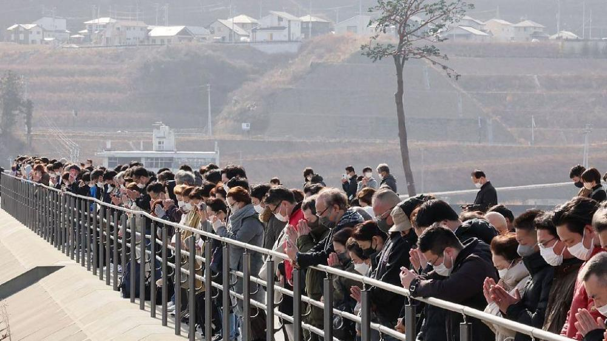

# 东日本大地震12周年：3.1万人仍未回家，有灾民孤独死去

_当地时间2023年3月11日，日本岩手县，人们在“奇迹松树”旁默哀，纪念2011年地震、海啸和核灾难12周年。
视觉中国 图_

3月11日，东日本“3·11”地震迎来12周年。日媒披露，尽管灾区基础设施建设取得进展，但受福岛核电站事故等因素影响，仍有约3.1万人至今还过着疏散在外、不能回家的生活。

当日，有许多遇难者家属在以岩手、宫城、福岛等三个县为主的灾区双手合十悼念逝者。“3·11”地震是日本在二战后遇到的最严重的自然灾害。据日本共同社3月11日报道，日本首相岸田文雄则在下午出席了福岛县主办的纪念仪式。

当地时间2011年3月11日下午2点46分，日本东部发生了里氏9.0级巨大地震，震源位于三陆近海。据日本警察厅统计，截至今年2月底，全国因这场地震共死亡15900人、失踪2523人。

日本共同社3月11日另一篇报道称，“3·11”地震还带来了“孤独死”和老年人困境的问题。截至2022年底，在岩手、宫城、福岛三县的灾害公共住宅中，共有465名入住者“孤独死”。这些灾害公共住宅收容的是在“3·11”地震中失去自家住宅的灾民。

“孤独死”没有明确的定义，岩手、宫城、福岛对此概念的定义均以独居为前提：岩手县统计的是“死后在房间内被发现的事例，但不包括自杀和室外事故死亡”，宫城县统计的是“在室内外死亡、由县警处理遗体的事例，包含自杀”，福岛县统计的是“死后在房间内被发现的事例”。

在这些灾害公共住宅中，65%岁以上的老年人占44%，这些老人近半数是独居。对这些灾民而言，孤独问题越显严重。

