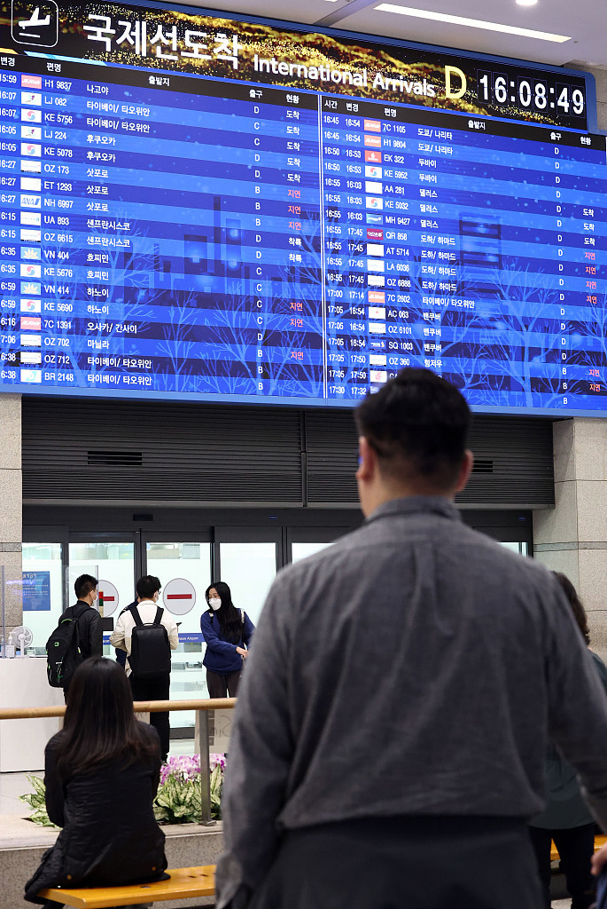

# 中国往来日本韩国泰国航线密集增班，部分航班票价环比降五成

国际航班加速恢复，中国往返日本、韩国、泰国的航班票价也呈回落趋势。

_当地时间2023年3月8日，韩国仁川，在仁川国际机场第一航站楼入境处。
视觉中国 图_

截至3月10日，据澎湃新闻记者不完全统计，3月以来，已有包括大韩航空、韩亚航空、日本航空等多家外航司宣布大面积恢复往返中国的航班。

票价方面，据第三方出行数据APP“航班管家”3月10日数据显示，整体来看最近一周的国际航班机票成交均价为4197元，同比去年12月下降15.16%，同比去年同期下降了42.90%。

其中，中韩航班将持续增开。据韩联社3月10日消息，韩国多家航司本月起将陆续增开赴华航班，上半年有望恢复至新冠疫情暴发前的逾四成水平。

大韩航空公司3月10日表示，公司计划到5月至6月将韩中往返航班数量（往返算1班）从目前的每周13班增至每周99班，这相当于2019年的43%水平。韩亚航空也将增加赴华航班，到4月将赴华航班从现在的每周10班增至每周89班，这相当于疫情前约50%的水平。

大韩航空还曾于3月7日表示，3月17日起中韩航线直飞航班将增至每周26班，大韩航空北京、西安至仁川航线复航。同时，上海（浦东）至仁川航线增至每日一班，沈阳、大连、青岛至仁川航线每周各增加一个运营班次。韩亚航空3月8日表示，3月19日起中韩直飞航班，北京/上海（浦东）/长春/广州，每周共将增加10班运营。

与此同时，中日航班的恢复也进入快车道。日本航空（JAL）宣布，3月26日起大面积恢复中日往返航班：上海虹桥-东京羽田航班恢复至每日运航；上海浦东-
东京成田航班恢复至每日运航；北京-东京羽田航班恢复至每周27班；天津-东京成田航班恢复至每周6班；广州-东京羽田航班恢复至每周13班；大连-
东京成田的航班恢复至每日运航；5月8日起，上海浦东-大阪航班恢复至每周6班，天津-名古屋恢复至每周4班。7月1日起，将新增上海浦东往返东京羽田航班。

航司持续宣布增班国际航班恢复，其中，东南亚航线最为火热，而中泰航线恢复速度更为迅猛。

澎湃新闻记者近期从“航班管家”方面获悉，今年2月，中国出发的国际航班目的地以东南亚为主，占国际航班量的48.5%，其次东亚为20.9%、欧洲为10%。

其中，3月1日至3月8日中泰直飞日均航班量63架次，环比2月增加36.6%。而中韩直飞日均航班量29架次，与2月基本持平。中日直飞日均航班量28架次，与2月基本持平。但与2019年同期相比，航班量仍有较大差距。

随着国际航班量逐步恢复，机票价格也迎来回落。

聚焦中日航班的票价方面，澎湃新闻从在线旅游平台“去哪儿”获悉，1月与2月，中日航班单程平均支付价格在5千元左右。3月在售的机票价格较高，达到8千元左右，而4月上旬机票预订价格将再次下降。

去哪儿相关人士告诉澎湃新闻记者，随着中日航班的大面积恢复，预计4月上旬航班可能还会下降，部分航线再次降至2千至3千元区间，但五一前期或将迎来反弹，期间也会存在部分航线临时涨价的情况。

韩国票价方面，据去哪儿数据显示，目前，大连、济南、青岛、烟台、威海、南京、上海飞往首尔的机票，在1000元至1600元之间。此前2月下旬的数据显示，国内出发价格普遍在2千至4千元左右，返程价格在1500元以下。泰国票价方面，去哪儿数据显示，3月上海、北京两地至泰国曼谷的航班价格环比2月下降一成左右。而成都往返曼谷环比降了六成左右，广州往返曼谷环比降了五成左右。

