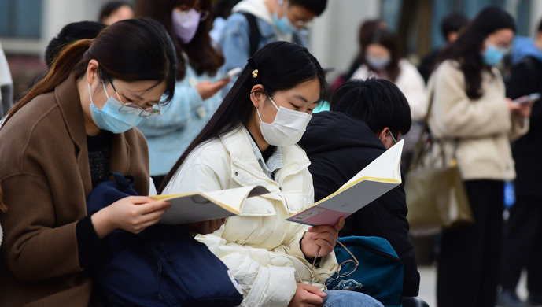

# 中央国家机关精减人员编制，热衷考“公”的毕业生们看懂了吗？

“中央国家机关各部门人员编制统一按照5%的比例进行精减，收回的编制主要用于加强重点领域和重要工作。对于精减后少数部门超编问题，给予5年过渡期逐步消化。”国务院机构改革方案10日获表决通过。其中提到的“精减人员编制”，连日来引发社会广泛热议。

时隔25年，国务院机构改革再次提出“精减”要求。“精减人员编制”一方面在“减”，要对国家机关内部人员进行整顿精简；另一方面也在“精”，即是将编制用于更多重点领域，促进机构内部人员配置的结构性优化。

这一改革为机构内部人员敲响警钟，它要求每一位工作人员都要尽职尽责，居其位谋其事。同时，对于机构外部正在备考公务员的人们而言，这一改革似乎也向公众抛出一个问题：公务员这个“铁饭碗”还“铁”吗？

近年来，大学生考公热情持续高涨，尤其是在大厂纷纷裁员的“就业寒潮”下，毕业生的职业不安定感逐渐增强，公务员这一职业作为传统意义上的“铁饭碗”成为越来越多应届毕业生竞相追逐的目标，不少人期待着考入编制内获得所谓“躺平”的生活和稳定的收入。

今年两会上，全国人大代表梅兵提出要警惕考研“高考化”的趋势。事实上，考公的“高考化”同样值得警惕——随着公务员岗位的大热，各类考公培训机构层出不穷，从选岗到笔试再到面试都有一套完整的应试培训体系。公务员岗位从选拔建设社会的人才变成选拔分数高的应试选手，这一切或许都来源于人们对于“编制”的狂热追求。

然而，“精减人员编制”意味着不少人追求的“铁饭碗”已经难以维系，进入编制内并不代表着可以直接“躺平”和“养老”。相比稳定体面而言，编制内的工作或许代表的是要承担更多能够真正推动社会民生发展的事情，而非许多人所追求的“一杯茶，一张报纸，一坐一整天”的清闲工作。

在此背景下，部分公众的就业观念亟需得到改变，应以更加严肃谨慎的态度对待“公务员”这个职业。“编制”的存在本是为那些想要为人民谋福祉，为祖国求发展的人群提供的保障，而非为那些期待依靠获得编制从此清闲度日的人提供的捷径。

当然，“精减编制”也不是单纯地“去编”，而是将编制更多地流向重要的岗位和领域，例如科技发展、金融安全等。“编随人走，人随事走”是此次改革的关键。这意味着，社会上关于“铁饭碗”的讨论不断推进，到底什么是真正的“铁饭碗”，“精减编制”改革给出的信号是，相比选择“编制”，选择工作本身或许才是真正的“铁饭碗”。

