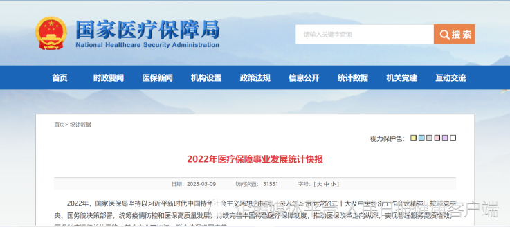

# 全国医保账本解读：数字“升”与“降”的背后

**人民日报健康客户端记者 谭琪欣 杨晓露**

“医保参保人数怎么降了？”“医保基金结余4万亿怎么花？”“核酸检测花了医保多少钱？”······3月9日，国家医保局发布2022年医疗保障事业发展统计快报。

人民日报健康客户端记者梳理了参保人员数量、基金结余、生育保险、药品集采等几组备受关注的数据，并邀请专家解读。

_3月9日，国家医保局发布2022年医疗保障事业发展统计快报。国家医保局官网截图_

**居民医保参保人数下降**

**专家解读：疫情期收入下降影响缴费意愿**

报告显示，截至2022年底，基本医疗保险参保人数134570万人，比上年同期减少1727万人，同比下降1.3%。

“2022年我国基本医疗保险参保人数同比有所下降，主要来自城乡居民基本医疗保险参保人数的下降。居民医保跟职工医保不一样，参保的形式以个人自愿缴费为主。人均三百元左右/年，一家三代六口人就是小两千元。根据我们的调研基本情况，去年居民基本医保参保人数的下降，主要还是因为在疫情的冲击下，外出务工人员、自由个体户收入下降，个人缴费能力减弱，个别地区财政补助资金也减少，从而导致居民参保意愿阶段性的下降有关。”
南开大学卫生经济与医疗保障研究中心主任朱铭来接受人民日报健康客户端记者采访时表示。

朱铭来建议，对于部分低收入人群，当地可以考虑通过扩大医疗救助的方式，减免部分个人缴费金额，以稳定参保人群。此外，随着经济和社会活动逐渐恢复正常，基本医保参保人数应该会恢复持续增长。

_医院医保业务办理窗口。新华社图_

与此同时，人民日报健康客户端记者注意到，在基本医保参保人数总体下降的情况下，参加职工基本医疗保险人数有所增长，参保人数36242万人，比2021年底增加811万人。

对此，中国人民大学劳动人事学院教授刘宏向人民日报健康客户端记者解释，职工医保参保人数的增加主要受到政策倾斜的影响，“职工医保相对而言会给予参保人更多的保障，近年来基本医疗保险关系转移接续的政策，让跨统筹地区就业人员的医保资金可以异地接续等政策的出台，都鼓励了更多的人从居民医保转入职工医保中来。”

**2022年医保基金累计结存超4万亿元**

**专家解读：毫无征缴也够运转1年半左右**

在基金结余方面，报告显示，2022年，基本医疗保险基金（含生育保险）总收入、总支出分别为30697.72亿元、24431.72亿元，年末基金累计结存42540.73亿元。而这一数字，在2021年时是36121.54亿元。

结余4万亿是什么概念？“这意味着即使在毫无征缴收入的情况下，也能够正常运转1年半左右。”朱铭来向记者解释。

“2022年医保基金累计结余的钱变多了，我们判断跟去年全年的支出减少有关。一方面，受到疫情的影响，住院报销的人次相较于往年下降，另外一方面，随着医保谈判和集采等价格招采政策的推进，不仅患者买药的费用下降了，也节省了部分医保基金的支出。”
朱铭来告诉记者。

结余的基金可以用来做什么？刘宏介绍，医保基金大部分用来支付老百姓住院看病的报销费用，随着政策的不断优化，门诊统筹的保障也在不断提高。“医保基金有剩余是一个好消息，结余的钱会在下一年滚动使用，同时国家也能更从容地应对类似新冠疫情的这种突发情况。”

刘宏还表示，尽管医保基金总体上有结存，但这是总账，具体在地区和结构上还是会有差异的，这也是为什么总会有“医保没钱了”这种声音出现。此外，去年医保基金的结余有一定比例在个人账户中，不能满足大多数人的统筹报销，医保改革也是为了满足多数人的报销需求。此外，人口老龄化是对医保基金不可忽视的挑战，未来医保基金还是要不断完善优化、健康持续发展，让更多人从中获益。

**一年医保基金支付核酸检测费用43亿元**

**专家解读：核酸检测费用对医保基金影响并不大**

在疫情支出方面，报告显示，全年医保基金支付核酸检测费用43亿元。2021年至2022年，全国累计结算新冠病毒疫苗及接种费用1500余亿元。

“很多网友很关心疫情防控的支出是不是会导致医保基金超支，但从总体基金结余来看，医保基金其实不缺钱。”
东南大学医疗保险与社会保障研究中心主任、江苏省医疗保险研究会副会长张晓教授告诉人民日报健康客户端记者，即使疫情期间，对医保基金的影响也并不大。

张晓进一步向记者指出，在重大公共卫生事件应对中，发挥医保基金作用的核心是基金支付与财政支付范围要清晰。建议加快完善相关的法规依据，同时可以考虑，通过建立有效的额外风险储备金制度，特殊调剂金机制，精算机制与费率调整机制，预算管理机制等，快速激发的基金应对机制，从而更好地发挥医保法定基金的作用。

