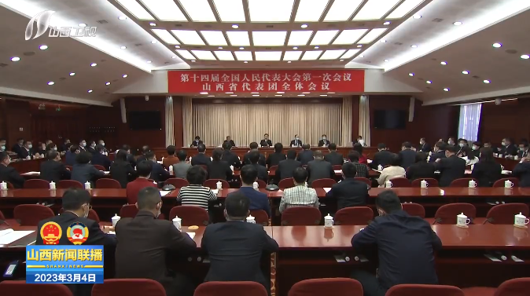
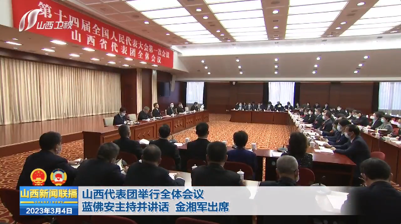
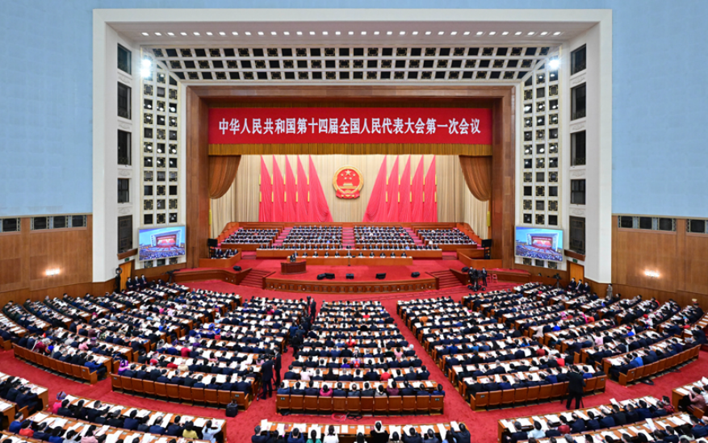

# 我省财力难满足建设需求，山西向全国人代会建议，望中央增加专项债限额

**撰文 | 高语阳**

近日，《山西日报》发文详解参加十四届全国人大一次会议的山西代表团全团建议。

其中，山西代表团向大会提交的全团建议中指出，2023年山西经梳理筛选新增债券项目1143个，“仅靠我省财力难以满足建设需求”，建议中央增加山西省政府专项债务限额。

**“提出明确具体、切实可行的议案建议”**

近日，十四届全国人大一次会议正在北京举行。政知君注意到，参会各代表团先后发布了以全团名义提交的全团议案、建议。

十四届全国人大一次会议正式开幕前，各代表团就纷纷召开全团会议酝酿全团建议。

其中，3月4日，山西代表团举行会议讨论酝酿以代表团名义提出的建议。

会议指出，要严把议案建议的政治关，聚焦党中央重大决策部署，聚焦人民群众所思所盼所愿，推动解决制约经济社会发展的突出矛盾和问题，提出有建设性的、明确具体、切实可行的议案建议。

要严把议案建议的质量关、程序关，提出的建议明确具体，有针对性、可行性。

会议披露了山西代表团将从7个方面提出建议，其中包括增加山西省政府专项债务限额，给予山西财税等方面资金扶持加大对智能化改造煤矿奖补力度等。

**将在兜牢风险底线的前提下发挥效能**

3月10日，《山西日报》发文详解山西代表团全团建议——增加山西省政府专项债务限额。

山西代表团建议中央增加山西省政府专项债务限额。山西将在兜牢风险底线的前提下，持续发挥专项债券政策效能。

该全团建议的“案由”部分指出，2023年是山西省推动高质量发展的关键之年，经梳理筛选新增债券项目1143个，年度资金需求1690亿元。

这些重点项目是贯彻落实党中央、国务院重大决策部署的关键之举。“仅靠我省财力难以满足建设需求，挖潜增收难度较大，需要通过专项债券资金满足建设需要”。

“案由”中还提到，根据财政部最新通报，山西省政府债务率不足80%，风险水平较低，仍具有一定规模的举债空间。

同时，对比中部和周围兄弟省份，山西省新增专项债务规模也较小。2021年全国新增地方政府专项债务限额3.65万亿元，山西省占全国的1.6%，低于其他中部五省和周边省份，仅高于内蒙古。

政知君注意到，2020年以来，中央共下达山西省政府专项债券额度1973亿元。

《山西日报》发文中介绍，2022年，山西省发行专项债券684亿元。其中近三分之一安排用于总投资超过20亿元的大型重点项目，87亿元用于太忻经济一体化发展和山西转型综合改革示范区战略项目，101.5亿元用于太原机场三期改扩建、汾石和临浮高速公路、大水网工程等重点基础设施项目，“有力支持了我省重大战略重点项目的落地实施”。

**“资金要素跟着项目走”**

地方政府发债只有一种形式，即地方政府债券。地方政府债券又分为一般债券和专项债券。一般债券纳入公共财政预算，用于弥补赤字；而专项债券则纳入政府性基金预算，主要是为公益性项目建设筹集资金。

地方政府专项债券是指省级政府为有一定收益的公益性项目发行的、约定一定期限内以公益性项目产生的政府性基金或专项收入还本付息的政府债券。

今年政府工作报告指出，要着力扩大国内需求，政府投资和政策激励要有效带动全社会投资，今年拟安排地方政府专项债券3.8万亿元，加快实施“十四五”重大工程，实施城市更新行动，促进区域优势互补、各展其长，鼓励和吸引更多民间资本参与国家重大工程和补短板项目建设，激发民间投资活力。

3月6日，在国务院新闻办举行“权威部门话开局”系列主题新闻发布会上，国家发展改革委副主任杨荫凯介绍，下一步，将进一步优化投资结构，集中力量办好国家层面的大事难事急事，积极组织做好地方政府专项债券项目准备工作，督促地方加快专项债券发行使用和项目开工建设。

杨荫凯表示，目前地方政府专项债券已成为地方政府建设项目的重要资金来源。将切实履行好“把投向、筛项目”的职责，加强项目审核把关，督促地方按照“资金要素跟着项目走”的要求，全部从筛选形成的准备项目清单中选择项目安排发行。

他还介绍，纳入准备项目清单的都是符合规划、政府主导、早晚要干、有一定收益的基础设施和公共服务项目。而且，将在目前交通、能源、农林水利、社会事业、市政和产业园区、新型基础设施等投向领域的基础上，会同有关方面积极研究进一步扩大专项债券投向领域。

**资料 | 山西日报 中国政府网 人民日报**

**【版权声明】本文著作权归政知新媒体独家所有，未经授权，不得转载。**

