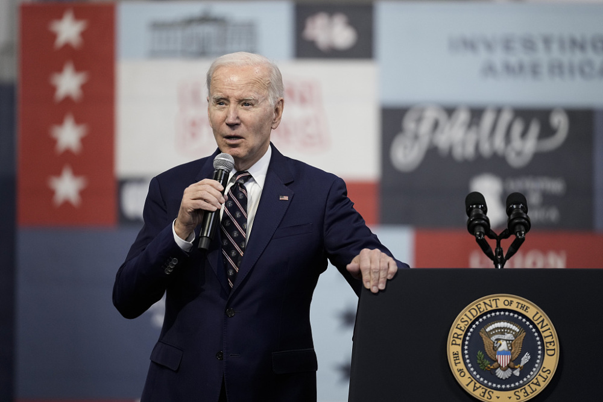

# 白宫新预算案凸显“抗衡中国”，美媒：不太可能在国会获得支持

【环球时报报道 记者 赵觉珵
王琪】美国总统拜登9日公布总金额达6.8万亿美元的2024财年联邦政府财政预算案，该预算案不仅计划继续扩大军费，同时也试图将更多资金投入到对抗中国当中。10日接受《环球时报》记者采访的美国问题专家认为，这份计划凸显出美国对外扩增军力，对内增强硬件实力的意图，其核心目的是与中国和俄罗斯开展大国竞争。

**加强在“印太地区”的存在**

尽管这份预算案与美国政府2024财年支出会存在差异，但其中涉及国防、外交等领域的支出计划依然被广泛讨论。据美国《国会山报》报道，在这份预算案中，拜登政府希望为五角大楼拨款8240亿美元，高于上一财年国会批准的8160亿美元。预算案提议增加投资以支持国防工业基地与核现代化工作，并将美国军队和文职人员的工资提升5.2%。

预算案显示，白宫希望为五角大楼拨款91亿美元，用于加强美国在“印太地区”的存在，这高于上一财年的61亿美元；计划为印太司令部拨款153亿美元，用于强化关岛和夏威夷的导弹防御系统等事项。美媒援引美国防长奥斯汀的话称，这些预算显示美军正在应对中国带来的挑战，加速美国军力的研发与现代化。

拜登政府希望在“印太地区”加大投入，例如要求提供20亿美元的强制性拨款用于支持印太基础设施项目，以“抗衡”中国提出的“一带一路”倡议。美国国务卿布林肯在一份声明中宣称，当前是前所未有的特殊时期，美国要在竞争中胜过中国，也要强化美国在“印太区域”的角色，并透过新投资促进美国的繁荣。

另据美媒报道，拜登政府还计划拨款用于扩大美国在太平洋岛屿的存在，与在太平洋岛屿影响力日益增长的中国抗衡。拜登提议斥资71亿美元持续巩固3个与美国签署《自由联系条约》的太平洋岛国的关系，在未来20年内给密克罗尼西亚联邦提供33亿美元、给马绍尔群岛提供23亿美元、给帕劳提供8.9亿美元，剩下的6.34亿美元，则将分配给美国邮政服务，以继续运营这3个国家的邮件。

**毫不掩饰地针对中国**

拜登在给国会的一封信中称，今年的预算案“巩固了我们应对全球挑战和维护美国安全的承诺”。拜登在信中点名中国和俄罗斯，宣称预算案覆盖了关键领域的投资，以在全球范围内超越中国，并在俄乌冲突中继续支持乌克兰。白宫在预算案摘要中毫不掩饰地表示：“中国是美国唯一一个既有重塑国际秩序的意图，也有越来越多的经济、外交、军事和技术力量来做到这一点的竞争对手。”

新加坡《联合早报》提到，根据美国国务院发布的说明，2024财年的预算提案还包括4亿美元用于“在全球范围内打击特定有问题的中国行为”资金。

中国社科院美国问题专家吕祥对《环球时报》记者表示，虽然这份预算案几乎不可能原封不动地获得通过，但预计两党争论的焦点将集中在美国国内，对于加大和中国竞争投入的问题上，两党是有共识的。吕祥同时认为，控制着众议院的共和党还可能利用预算问题，要求白宫在对华政策上作出更激进、更有攻击性的举动。

**不太可能获得国会支持**

根据白宫发布的介绍文件，拜登政府希望通过这份预算案重建美国的基础设施，使经济更具竞争力，更多投资于将定义未来的创新科技和产业。同时，该预算案还希望为工薪家庭降低生活成本和减税，并加强医疗保险和社会保障。

美国有线电视新闻网（CNN）称，预算案呼吁采取数十项新的举措，并对企业和富人征收更高的税收。白宫表示，这些计划中的政策将在未来10年减少近3万亿美元的赤字。不过，多家美国媒体均认为，这份预算案不太可能在国会获得支持，因为当前共和党正控制着众议院，他们认为政府支出已经失控，应该大幅削减或取消个别项目。

