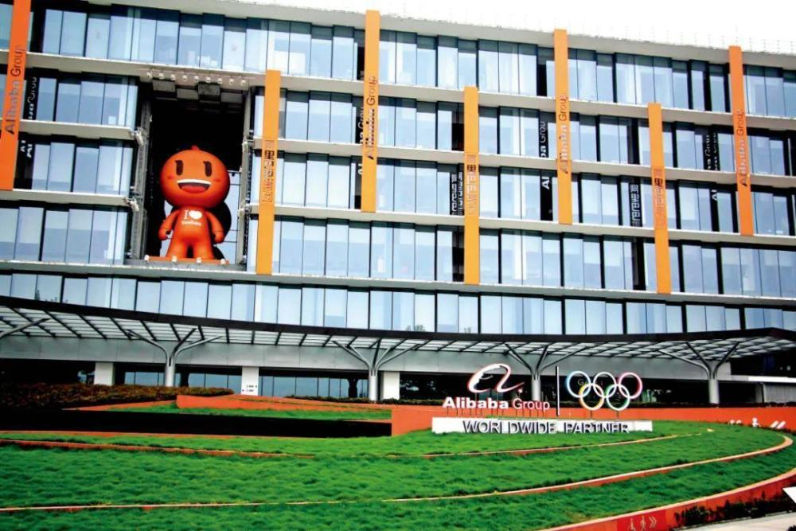

# 被武汉赶超，“平台经济第一城”坐不住了

未来科技城产业园坐落于西溪湿地以西，毗邻阿里巴巴即将建成的全球总部，汇聚了3万多家中小型科技企业，是杭州平台经济的核心地带之一。

未来科技城在2011年开建，十余年来，汇聚了上万家企业，撑起了余杭区平台经济的一片天。以全市为坐标，目前杭州市拥有120余个平台企业，平台内网店超900万家。2022年，余杭区数字经济核心产业总量占杭州市1/3。

2022年，余杭区GDP总量为2651.3亿元，同比增长仅1％。该成绩被宁波市鄞州区反超，打破了余杭区连续四年获得“浙江省第一区”的纪录。同期，杭州的GDP增速也仅为1.5％，GDP总量被武汉反超。

去年底召开的中央经济工作会议提出，支持平台企业在引领发展、创造就业、国际竞争中大显身手。今年2月10日，杭州市召开平台经济健康高质量发展座谈会，全市60家平台企业参会，释放支持平台经济发展的信号。对杭州市、余杭区来说，要打赢经济翻身仗，已离不开平台经济的健康发展。

**从高速到降速**

十多年前，李伟光刚入职余杭区政府工作时，负责未来科技城的招商工作。当时，未来科技城还属于杭州近郊板块，位于余杭区较为偏僻的地带。一开始，招商工作并不容易。直到2013年，位于未来科技城的阿里巴巴西溪园区建成。此后，李伟光的电话不断，每天都有希望入驻的商家前来咨询。

余杭区位于杭州市西部，由于离杭州市中心距离较远，一直以来，余杭区居民习惯将杭州市其他区称为“杭州”，而将自己认同为余杭。如今，这一习惯逐渐改变。

_位于浙江杭州市余杭区的未来科技城梦想小镇创业园。摄影/本刊记者 蒋芷毓_

2022年，余杭区提出将建设“杭州城市新中心”。从经济总量来说，余杭区已经多年蝉联杭州市GDP第一区，占杭州14.1％，数字经济核心产业总量占杭州市1/3。

余杭区近十年的爆发式增长离不开阿里巴巴的高速发展。

位于未来科技城的阿里巴巴西溪园区从2009年开始兴建，到2013年建成。在双十一购物节兴起前，阿里巴巴盈利微薄。最初招商时，阿里巴巴占地总共450亩，政府希望阿里巴巴每年交500万元的税，但由于阿里巴巴难以承担，最后打了7折，一年交350万元的税。

2014年，阿里巴巴双十一当天总销售额达到571亿元，实现高速增长。到2018年，阿里巴巴对外披露，2017年，阿里巴巴集团纳税366亿元，平均每天纳税超1亿元。这为未来科技城的发展奠定了经济基础。

十年来，未来科技城吸引了上万家企业入驻。常住人口从2011年的6万人涨到了2021年的42万人。这些人中，本科以上学历占总就业人数的84.5％，就业人口平均年龄也从46岁下降到32.5岁。

同一时期，杭州也是吸引人口流入最多的城市之一。杭州市常住人口在过去几年不断增长，吸引了北京、上海一线城市的人才。据公开数据，从2016到2022年，杭州常住人口增长了318万。根据猎聘大数据研究院的《2022年杭州流入人才画像》，近一年来杭州的人才主要来源于上海和北京两大城市。

人多了，房价也水涨船高，未来科技城周边房价从约8000元/平方米涨到了如今的6万元/平方米上下。

不过，去年开始，未来科技城的房地产市场出现了“松动”。在产业园，以往办公租金4元/平方米/天的写字楼，2022年第一次跌到了3元/平方米/天。即便如此，仍有企业因经营不畅，难以承受租金，不得不离开园区。

未来科技城企业流失导致的房租市场失衡一度被传为“经济不振”的信号，不过，在熟悉当地租赁市场的人士看来，未来科技城租金下跌是偶然事件导致的临时现象。房租下跌的主要原因是阿里云搬迁至新建成的紫荆港科技城，由于阿里云人数庞大、占地广阔，多达2万名员工的搬迁，导致租房市场供需失衡。

“在阿里云搬迁之前，办公楼租金4元/平方米/天可能都租不到，从中小企业发展来说，其实是不友好的。”上述人士表示，租金能下降，正好挤挤发展过程中产生的泡沫。“从租售比来说，2.5元/平方米/天才是合理的。”

不过，大企业对当地经济的影响也可见一斑。过去十年，余杭区的突飞猛进得益于阿里巴巴的高速成长，从杭州市边缘的区县，一跃成为了浙江省经济第一区，但这也导致了其产业结构不合理。对于产业结构而言，最稳定的是“正三角形”，即有扎实的产业基础、有体量大的腰部企业和数个头部企业，但余杭区的产业结构中，腰部企业明显不足。

2009年，余杭区全年GDP总量仅527.3亿元。经过10年增长，到2020年，余杭区生产总值为3051.6亿元。2021年，平台经济整顿开启，阿里巴巴增速放缓，该区乃至杭州市也相应受到冲击。余杭区当年GDP总量下滑至2502.2亿元。

“阿里巴巴的基数太大，很多数据依靠阿里巴巴的增长体现，比如网络零售总额、社会零售总额、跨境电商交易额、外贸数据、人才引进等等。”有熟悉余杭区经济发展的人士表示，要填补大企业波动带来的空缺，并非易事。

_位于杭州的阿里巴巴集团总部。图/IC_

**“平台企业流动率较高”**

未来科技城又叫浙江省海外高层次人才创新创业园（简称为“海创园”），十多年前，未来科技城挂牌时，目的是招引海外人才。

当时地处杭州近郊，配套设施发展并不完善。最初两年，未来科技城一穷二白，只有一条路，一个学校。领导来考察时能够看的东西捉襟见肘，没有项目，只能看沙盘、看安置房改造的人才公寓。

中共中央政治局常委、时任浙江省省长李强在2014年亲自圈定并命名的梦想小镇在未来科技城启动建设，希望能参考国际特色小镇建设经验，梦想小镇建设成为全球互联网创业高地。李强当时说，“梦想小镇是什么？当时之所以取这个名字，是希望这里成为天下有创业梦想的年轻人起步的摇篮，让梦想变成财富，让梦想成真。”

余杭区以杭州当地特色菜“羊锅”闻名，有不少建筑本打算用于开发餐饮业。未来科技城管委会创新经济促进局副局长屈永辉告诉《中国新闻周刊》，为建设梦想小镇，未来科技城给出初步方案，将小镇中12幢粮仓改建成办公空间，建成梦想小镇互联网村，还将原本计划做“羊锅”的空间用来打造成“梦想小镇创业集市”。

“有了物理空间后，有了骨架，就要考虑灵魂。”屈永辉说，时值国家倡导“大众创新、万众创业”，鼓励大学生创业，加上2014年阿里巴巴上市，不少高管凭借资本市场获得财富自由，有创业意愿。以大学生创业、阿里人才溢出为契机，未来科技城梦想小镇承接了第一批创业项目。

阿里有强大的数据中台建设能力，离开阿里创业的高管中，不少人的企业已经做到独角兽、准独角兽级别，如奇点云、数澜科技等。“阿里带来的溢出效应，除了人才的溢出、资本的溢出，还有产业项目的溢出。”屈永辉说，“未来科技城应该是全中国数据中台项目最为集中的地方。”

作为创业孵化器，梦想小镇在启用后，对于创业者前三年提供免费的150平方米精装办公空间、100兆宽带免费接到办公桌面，水电费、物业费打6折。对于优秀项目，还有最高20万元的创业梦想金支持。

在梦想小镇的创业孵化上，屈永辉透露，项目溢出率达到了30％以上。“到目前梦想小镇累计孵化项目达到5932家，有2090家已经从小镇走出去了。”

不过，一位熟悉杭州市招商领域的工作人员透露，为解决产业结构的问题，要么充分招商，将存量市场中的优秀企业吸引过来；要么扶持壮大小企业，使其迅速成长。不过，这两种办法都不容易，“招存量企业有激烈的外部竞争，培育企业则需要时间周期”。

“近两年招商都越来越难。”上述工作人员表示，全国同样竞争能级的平台之间，“越来越内卷”。招商是挖存量优秀企业，需要拿出更多的资源去竞争，甚至以项目做交换，最终导致成本过高。

他指出，去年平台企业流动率较高。一方面，随着杭州平台企业的发展，杭州也逐渐成为周边许多省份招商的主要目标地，一些企业难免被挖走。另一方面，杭州市生产空间有限，对于急需大面积生产空间的制造型企业来说，生产需求无法被满足，也会迁出杭州，但有可能将技术、研发总部留在杭州。

过去两年，由于经营困难，杭州市一批中生代平台企业出现流失，“倒闭或者迁移的都有”。对于因为疫情等原因陷入困难的企业，余杭区也采取了一系列措施帮扶。

屈永辉表示，过去两年，未来科技城管委会对一些本质良好、但陷入现金流动性危机的企业，多方面协调资源，打出助企稳企组合拳，及时为企业输血。

过去两年，阿里也产生了一批选择创业的员工。“这些离开的员工，对于未来科技城来说都是财富，把他们留在未来科技城创业，对我们来说也是非常好的机会。”屈永辉说，未来科技城积极主动对接，为创业项目提供场地、补贴资金等政策。过去一年，未来科技城就落地相关创业项目24个。

**监管转向**

杭州平台经济进入阵痛期，与行业整顿关系密切。

2021年4月，国家市场监管总局称，阿里巴巴集团滥用市场支配地位，对其在中国境内网络零售平台服务市场的垄断行为处罚182.28亿元。对于地方来说，也开启了平台经济监管元年。

当年6月，杭州召开全市平台企业行政指导会，从垄断和不正当竞争、违法广告、侵犯知识产权、侵犯消费者权益等5个方面，对平台企业实施为期50天的督查、整改。

余杭区市场监管局副局长邓帅告诉《中国新闻周刊》，平台企业意识到合规问题后，内部整改相当积极，追求主动合规。从市监局的角度而言，帮助企业主动合规是进一步推动平台内营商环境的有效举措，让龙头企业产生示范带动效应，更好引导其他平台。

“行政指导会后，余杭区对照指导会列出的116条清单，督导企业自查，对监管范围内32家平台企业上门一对一指导。”余杭区市场监管局网监分局局长王晓华对《中国新闻周刊》表示。

从2022开始，网监分局每月与平台企业召开一次例会，通过投诉数据和舆情分析，判断平台企业存在的潜在问题，并约定时间解决。“问题都是很实际的，比如去年的某牛奶事件，我们需要尽快提供解决方案。在协调消费者、商家、平台三方的同时，还要协调其他地区的监管部门。”王晓华说。

由于余杭区是阿里巴巴总部所在地，阿里电商平台的投诉举报案件都会流转到余杭区市监局解决。“去年承接阿里系的投诉举报量近60万件。”近年来，余杭区市监局在合规指导的基础上，严厉打击网上侵害消费者权益、发布虚假广告等违法行为。据了解，2022年余杭区市监局对网络领域的行政处罚案值总计超300万元。

邓帅表示，通过不断地整改规范，平台企业对合规问题更加重视，监管部门与企业之间也建立了良性协作机制，阿里巴巴成立团队专门与市监局对接。“如果没有合规整改的工作基础，很难找准切入点服务这么庞大的企业。”

去年，余杭区市监局开展直播行业营销治理，对全区15000多家直播营销主体、两家省级网络直播基地进行行政指导，探索建立直播行业的规范制度。“余杭区有越来越多的企业加入到直播行列，我们开展工作时，既要保护消费者合法合理的权益，也需要考虑到小微企业的发展。”邓帅说，“比如说直播期间产生口误，主播能立刻改正，且在这期间没有产生实际交易，那么监管层面也会考虑一定的容错机制。”

邓帅认为，监管态度会作为链条传递下去，“监管部门对平台的态度会传导到平台对商家的态度，在依法依规的范畴内，完善对平台治理的包容审慎监管，对一时看不准的新业态，设置一定的‘观察期’，分类采取行政指导、行政约谈、警示告诫等柔性执法方式，激活平台经济的消费活力。”

去年底，浙江省委书记易炼红赴阿里巴巴考察，强调要坚持发展和规范并重。邓帅表示，从余杭区市监局的角度来说，坚持服务与监管双管齐下。“若发生严重的侵犯消费者权益等违法行为，我们会公正评判，严格执法，但对于违法情节轻微且没有产生实质后果的行为，也会在一定范围内实行容错纠错机制。”

在杭州市召开平台经济高质量发展座谈会前，余杭区在1月30日就对监管范围内17家平台企业代表召开座谈会。王晓华表示，会议强调平台企业合规是底线，在此基础上，监管层将探索柔性执法，尝试触发式监管、沙盒监管等模式。

**行业新信号**

从今年开始，杭州市不断推出支持平台经济发展的新政策。

GDP增长5％以上是杭州市2023年的预期目标之一，而在2022年，杭州市GDP增速为1.5％。浙江工商大学区域经济研究所所长倪树高在接受媒体采访时表示，这一增长率在浙江省内11个城市中排名末位。过去十年，杭州市数字经济、平台经济和部分高新产业快速发展，但受疫情和平台经济发展环境变化等双重因素影响，杭州市经济发展的良好势头受到影响。

为实现GDP增长5％以上，杭州市多次提出要“打好经济翻身仗”。其中，作为杭州的特色优势产业，平台经济是杭州重点关注的领域。2月10日，杭州召开全市平台经济健康高质量发展座谈会，共60家平台企业参会。据报道，杭州市市长姚高员在会上强调，杭州将以最优环境支持平台经济再创辉煌。

“平台经济是杭州科技创新、产业发展的主战场主阵地，是杭州的城市金名片。”姚高员在会上表示，对平台经济，要落实更有针对性的政策供给、提供“店小二”“保姆式”服务、建立“全方位”“全天候”的沟通机制，妥善解决企业发展中遇到的各类问题，全力支持平台经济企业成为创新发展的引领者、融合发展的支撑者、规范发展的示范者。

网易集团党委书记、副总裁刘杰在座谈会上表示，创新对平台经济发展至关重要，广大企业今年要尽可能把资源投入到研发上去，政府也要在中小企业研发投入、知识产权保护方面出台更多政策。

接近杭州市政府部门的工作人员向《中国新闻周刊》透露，为优化营商环境，“店小二式的服务”一直被杭州市强调，要从企业提出需求政府再回应的“响应式”服务，转变为主动服务。“产业政策也一样，主动根据企业发展需要来制定。”在沟通上，各部门与企业的对接更密切、频繁，部分街道也与企业加深联系。

在杭州市2023年政府工作报告中，也表示将大力支持平台经济健康高质量发展，深化与重点平台企业战略合作，秉持包容审慎监管理念，健全创新容错发展机制，运用合规指南、行政指导等预防提醒措施，引导平台经营者依法竞争、合规经营。

杭州市各区也传达出新信号。2月17日，西湖区举行平台经济再出发活动，西湖区区委书记董毓民提出，要将平台经济国际化、科技化、品牌化作为未来的发展方向。会上强调，要把平台经济的事当作自己的事来做，要主动靠前解决平台企业发展过程中遇到的困难。3月4日，余杭区举办未来电商高峰论坛，从税收激励、人才政策、产业集聚等方面推动电子商务产业活跃发展。

2023年，杭州市发展目标包括社会消费品零售总额增长5％，网络零售额增长6％。为此，也出台了一系列政策支持电商领域发展。2月8日，《杭州市人民政府关于加快推进跨境电子商务高质量发展的实施意见》发布，鼓励企业建设独立站，推动中国品牌出海。对应用独立站开展跨境电商出口业务的企业，给予不超过200万元的一次性资金扶持。熟悉杭州市电商领域的人士表示，“今年对跨境电商的扶持力度明显加强，支持跨境电商做大规模、品牌化发展。”

在杭州，除了阿里巴巴，字节跳动、快手也设立了电商部门，近年来电商业绩不断增长。上述电商领域的人士表示，“在国内发展电商，首先还是会想到杭州，杭州仍然有产业、人才和政策优势。”

（应受访者要求，李伟光为化名）

发于2023.3.13总第1083期《中国新闻周刊》杂志

杂志标题：重塑“平台经济第一城”

记者：蒋芷毓

