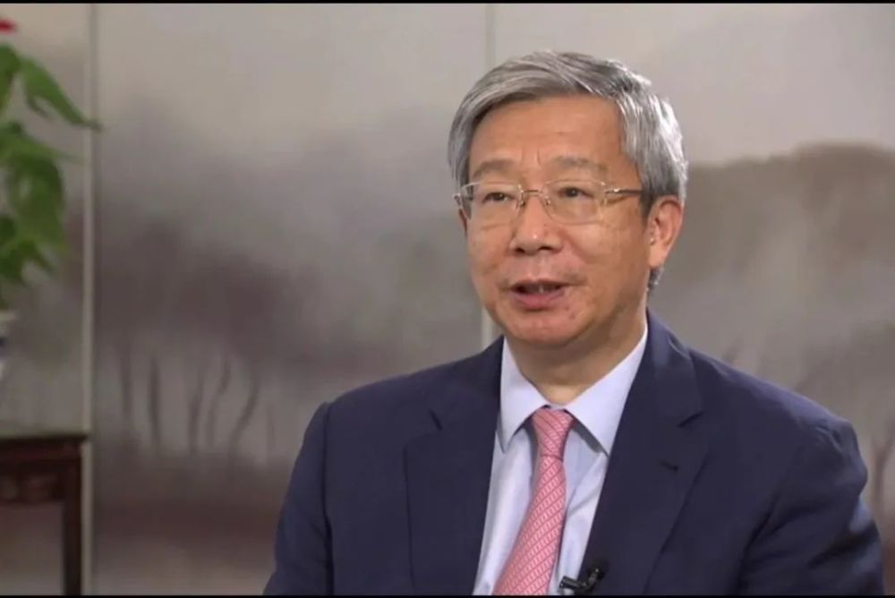

# “不能让老百姓票子变毛”的央行行长连任，两度见证金融监管改革

_来源：央行官网视频截图_

**文｜张威 唐郡 康恺**

**编辑｜袁满**

连任中国人民银行行长的易纲，将面对获任央行行长以来的二度金融监管改革。

**3月12日上午，据新华社消息，经十四届全国人大一次会议第五次全体会议投票表决，决定易纲为中国人民银行（下称“央行”）行长。**

出生于1958年的易纲，在今年两会召开之际迎来了65岁生日。3月10日，易纲被选举为政协第十四届全国委员会常务委员。

简历显示，易纲，1958年生于北京，中共党员，经济学博士，教授。先后在北京大学经济系、美国哈姆林大学工商管理专业、伊利诺大学经济学专业学习，获经济学博士学位。现任第十四届全国政协常委，中国人民银行党委副书记、行长。

2023年3月3日，国务院新闻办“权威部门话开局”系列主题新闻发布会，这位还未到古稀之年的央行行长已满头银发。“长期以来，媒体的各位朋友都非常关心和支持金融事业和人民银行工作。在此，我代表人民银行向各位记者朋友，向各家媒体表示衷心的感谢。”

**颇为简短、礼貌的几句问候用语尽显易纲的低调儒雅特质，在央行一些人士看来，易纲的另外一个特质是坚韧。**

2018年3月19日，全国“两会”期间，央行原副行长易纲接替周小川，被任命为新一任央行行长。

**同年，在中国运行长达15年的“一行三会”金融分业监管模式走向终结，取而代之的是金融稳定委员会辖下的“一行两会”新架构，即央行、中国证监会（下称“证监会”）、中国银保监会（下称“银保会”）。**

3月10日，据新华社消息，国务院机构改革方案获十四届全国人大一次会议表决通过。根据方案，中国金融监管体制将形成新的“一行一局一会”结构：央行、国家金融监督管理总局（下称“金监局”）、证监会。

调整后，一边是宏观审慎监管，旨在维护金融稳定，防范系统性风险；一边是市场行为监管，规范金融机构行为以实现消费者保护，经过几轮机构改革沉淀，具有中国特色的“双峰”监管模式初具。

**业内人士认为，此番机构改革强化了央行货币政策、金融稳定和金融服务的职能，更加侧重宏观审慎管理。**

过去5年，中国央行坚持了正常的货币政策，总量够、结构准，保持了币值稳定，汇率基本稳定，实现了低通胀、稳增长的最优组合。“放在全球范围内看，跟大国央行比，都是非常卓越的。”一位接近央行的权威学者向《财经》记者表示。

**市场颇为关注，在新的金融监管格局之下，历经二度金融监管改革的易纲及其执掌下的央行在接下来将如何落实新的改革细化动作。**

历经两次改革

**作为中国第一个就任央行行长的海归经济学博士，易纲不仅仅成就了学以致用的典范，且即将在其央行行长任上经历二度金融监管改革。**

2018年3月，易纲出任央行行长第一年，原银监会、保监会合并为银保会，中国的金融监管体系形成了金融稳定委员会辖下的“一行两会”的监管局面。

央行负责货币政策、宏观审慎、相关政策的制定，银保会主要行为监管，证监会相对独立。为此，央行的重要性进一步凸显。此前在“一行三会”的分业监管架构下，央行一直扮演牵头增强各监管机构间协调效率的角色。

彼时改革方案落地，央行职能则不限于货币政策、宏观审慎，更是扛鼎金融系统稳定，负责重要行业立法，统筹跨行业监管协调等。

**2018年3月25日，刚刚当选央行行长的易纲在中国发展高层论坛2018年会上，曾用三句话概括彼时中国金融方面的主要工作：实施好稳健的货币政策；推动金融业的改革和开放；打好防范和化解重大风险的攻坚战，保持金融业整体稳定。**

后经多位学者回忆，当时的中国金融监管改革源于混业经营，当控股公司成为金融公司主要的存在形式，监管重叠和监管真空以及监管套利相继出现时，分业监管便已不再适应当时的金融业发展。

**易纲曾表示，中国面临的一些潜在金融风险主要体现为三大方面，一是宏观上仍然存在高杠杆风险；二是部分领域和地区金融“三乱”问题仍然突出，如影子银行存量庞大等；三是少数野蛮生长的金融控股集团存在风险。**

与前任周小川相比，易纲行事更为低调内敛，公开曝光率相对较低。一位金融学者表示，“不过，在维持币值稳定、货币政策‘以我为主’、汇率市场化等方面，易纲的风格与周小川可谓一脉相承。”

**在新“一行两会”监管下的5年，注重求真务实的的易纲在新的监管模式下，其执掌的央行也发挥了颇多贡献，其中包括金融系统稳定、保持物价基本稳定、助力稳定宏观经济大盘、深化金融改革开放等。**

3月12日上午，据新华社消息，经十四届全国人大一次会议第五次全体会议投票表决，决定易纲为央行行长。

**掌舵5年，易纲再次留任央行行长。**

**与之并行的是，时隔5年，中国金融监管格局亦再度迎来调整。**
“一行两会”变为新的“一行一局一会”结构：央行、金监局、证监会，中国特色的“双峰”监管模式也初见端倪。

**调整后，一边是宏观审慎监管，旨在维护金融稳定，防范系统性风险；一边是市场行为监管，规范金融机构行为以实现消费者保护。**

根据方案，央行对金融控股公司等金融集团的日常监管职责、有关金融消费者保护职责，证监会的投资者保护职责划入金监局，不再保留银保会。金监局作为国务院直属机构。

**本次改革的背景和考量，上海新金融研究院副院长刘晓春表示，合并了保监会和银监会之后，有些问题实际上也没有彻底解决，例如一些新金融依然面临监管问题，包括新型的金控公司应该按照什么标准进行监管等，这些都没有完整的答案。人民银行接了很多监管的工作，这与其宏观调控工作实则形成一定的冲突。**

值得注意的是，两次金融监管改革的背景、环境也已经发生了些许变化。

**招联金融首席研究员董希淼认为，上一轮金融监管体制改革时，宏观经济还处于一个比较正常的发展态势，经济保持较快增长。**
所以那轮改革重点是通过完善金融监管体制，特别是加强金融监管的协调，更好地防范化解金融风险。而在本轮改革中，宏观经济进入下行周期，社会总需求存在不足。当下的改革既要有助于加强金融监管，防范金融风险，也需推动金融业更好服务实体经济，促进经济增长，激发有效需求。

“这一轮的改革的目标更加多元，需要金融监管部门在防风险、稳增长、促发展、调结构等多重目标中寻找一个动态的平衡。”董希淼说。

“一行两会”5年

易纲任职央行行长的5年间，相比国际主要央行，中国央行一直保持了“独行”的货币政策。在一位接近央行的权威人士看来，近5年间，中国央行采用的货币政策以及产生的效果，放在全球范围内看，跟大国央行比，都是非常卓越的。

**“中国央行坚持了正常的货币政策，总量够、结构准，保持了币值稳定，汇率基本稳定，实现了低通胀、稳增长的最优组合”。上述接近央行人士补充。**

2022年全球主要发达经济体经历了40年以来罕见的高通胀，全球平均通胀水平超过8%。而对比全球，2022年中国CPI（消费者价格指数）上涨2%，过去五年年均涨幅为2.1%，物价水平持续保持稳定，居民通胀预期保持平稳。

**“不能让老百姓手中的票子变‘毛’了，不值钱了。”2019年12月，易纲以《坚守币值稳定目标 实施稳健货币政策》为题发表文章。**

在易纲看来，评判和衡量货币政策，根本上是要看其是否有利于最广大人民群众的利益。守护好老百姓手里的钱，保持币值稳定，并以此促进经济增长，是货币政策的使命。

**一位宏观经济学家向《财经》记者表示，上述文章为后续疫情下中国独行的货币政策提供了重要的参考理论基础。**
为此，2020年初，全球暴发疫情，全球央行大放水，但中国央行坚持实施正常的货币政策。

**央行调查统计司原司长盛松成向《财经》记者表示，面对复杂严峻的国内外形势，中国始终坚持实施稳健的货币政策，维持正常的货币政策空间，坚持不搞“大水漫灌”、不超发货币，为中长期国内物价稳定奠定了基础。“在全球通胀大背景下保障了币值稳定，维护了央行威信，为稳定宏观经济大盘营造了适宜的货币金融环境。”**

现实中，中国经济则面临着一系列前所未见的挑战，要维持正常的货币政策并非易事。

**一位货币政策研究学者对《财经》记者表示，过去5年，中国经济至少面临三大方面的挑战，一是国内经济增速总体下行，面临经济结构优化、增长动能转换；二是外部环境不确定性增强，包括中美贸易摩擦、乌克兰危机、全球高通胀等；三是新冠肺炎疫情对经济的冲击。**

“在这样一个异常复杂的环境里，中国央行既要支持长期的经济结构调整，又要应对短期内各项不确定因素的冲击，还需针对疫情对不同实体经济部门产生的非对称冲击纾困，这让央行货币政策必须在多目标中寻求平衡。”前述学者表示。

**“过去5年，央行对货币政策工具的使用非常谨慎，一方面要保持正常的货币政策空间，另一方面要用好正常的货币政策空间。”中银证券全球首席经济学家管涛对《财经》记者表示。**

在防范化解重大金融风险攻坚战推进过程中，央行通过管好货币总闸门、抓实化解地方政府隐性债务风险、持续推动企业去杠杆等方式，扼制了宏观杠杆率快速上升势头。

数据显示，2017年-2019年，企业部门杠杆率稳中有降，居民和政府部门杠杆率增速放缓，宏观杠杆率总体稳定在250%左右，为后续应对疫情加大逆周期调节赢得了空间。

此外，央行联合银保监会等部门共同推出《关于规范金融机构资产管理业务的指导意见》，截至2022年，压缩“类信贷”高风险影子银行规模大约30万亿元；近5000家P2P网贷机构全部停业；累计立案查处非法集资案件大约2.5万件。

**多位学者认为，过去5年，央行在持续深化利率汇率市场化改革方面亦稳步推进。**

2019年8 月，央行推进贷款市场报价利率（LPR）改革，改革后的LPR
由报价行综合考虑市场利率走势并在参考中期借贷便利（MLF）利率的基础上市场化报价形成，由此LPR替代了贷款基准利率，存量贷款也完成了定价基准转换。

汇率方面，2018年-2022年，人民币对美元汇率年化波动率平均为4.5%，较2013年-2017年均值2.4%明显提高。面对波动加剧的汇率走势，央行引导企业树立“风险中性”理念，企业对汇率波动的适应性明显增强，企业外汇套保比率从2018年的16.8%上升到2022年的24%。

**两率改革之外，过去5年，央行着力深化金融改革开放，有序推进人民币国际化。**
2019年，“沪伦通”正式落地。同年，合格境外机构投资者（QFII）、人民币合格境外机构投资者（RQFII）额度限制全面取消。2021年至2022年间，“跨境理财通”业务试点、中国内地与香港的“互换通”相继启动等。

2022年，国际货币基金组织完成了五年一次的特别提款权（SDR）定值审查将人民币权重调升1.36个百分点至12.28%。

央行的双重挑战

历经中国央行26年的多重历练，以及5年的央行行长经历，易纲应当说熟悉央行的一切。
**多位金融界权威人士向《财经》表示，随着金融监管改革深化以及中国经济复苏，中国央行本身及货币政策无疑面临诸多挑战，对于留任行长易纲来说，未来的工作显然也并不轻松。**

上一轮金融监管改革(“一行两会”金融监管格局)，银保监会主席、党委书记郭树清同时兼任央行党委书记、副行长，被外界视为是中国金融混业监管进一步协调的特殊安排。

那么，新的“一行一局一会”金融监管格局下，业界颇为关注新的协调安排。对于央行而言，面临的一项要务是即将落地的金融监管体制改革。

根据改革方案，中国金融监管体制将形成新的“一行一局一会”结构：央行、金监局、证监会。在新格局下，金融监管的职能划分、部门融合、人事调整将是改革落地重点。

改革方案中涉及央行的内容有三项：把央行对金融控股公司等金融集团的日常监管职责、有关金融消费者保护职责划入金监局；统筹推进分支机构改革，大区分行体制调整为按照行政区设立分支机构，不再保留县(市)支行；分支机构工作人员均使用行政编制，纳入国家公务员统一规范管理。

**一位接近央行人士对《财经》记者表示，改革方案强化了央行货币政策、金融稳定和金融服务的职能，更加侧重宏观审慎管理，其中金融稳定相关职能将有金融稳定法来定位。而此前分支机构跨地区设置与行政管理体制顺畅度有提升空间，因此也作出调整。**

近期，关于不再保留县(市)支行和工作人员执行国家公务员工资待遇标准等改革方向引起各方热议。一方面，央行此前披露的数据中有1761个县(市)支行，涉及职工4.36万人；此前央行分支机构采用行员制度，执行国家公务员工资待遇标准后会如何？一切仍有待进一步明晰。

**多位受访学者向《财经》记者表示，央行面临另一项挑战是支持经济复苏。**

过去5年，中国经济经受了世界变局加快演变、新冠肺炎疫情冲击、国内经济下行等多重考验。

2022年中央经济工作会议指出，当前中国经济恢复的基础尚不牢固，需求收缩、供给冲击、预期转弱三重压力仍然较大，外部环境动荡不安，给中国经济带来的影响加深。

**2023年政府工作报告提出，今年的工作重点，首先是着力扩大国内需求。**
把恢复和扩大消费摆在优先位置。多渠道增加城乡居民收入。稳定大宗消费，推动生活服务消费恢复。

据国家统计局公布数据，2月CPI同比上涨1%，涨幅超预期下行，其中剔除食品项的核心CPI增速为0.6%。华创证券首席宏观分析师张瑜认为，核心通胀下跌趋势扭转，但回升幅度较慢，现阶段的经济处于复苏初期，需求相对不足仍是主要矛盾。

2月金融统计数据显示，居民部门中长期贷款增加863亿元，同比多增1322亿元。中金公司研究认为，剔除春节错位扰动后，居民中长期贷款增量位于近几年新低，反映地产销售回暖仍需时间的积累和实体信心的重建。

**此外，通胀亦被认为是央行未来或将面临的挑战之一。**

一位银行业分析人士对《财经》记者表示，疫情期间，住宿餐饮等领域主体大量减少，供给能力存在制约，消费恢复正常后，通胀有望回升。“当前美联储政策越来越难以有效影响通胀预期，输入性通胀可能令国内PPI（全国工业生产者出厂价格）抬升，进而推升CPI。”

**3月3日，央行副行长刘国强表示，我们非常重视物价问题，我们判断，2023年国通胀水平总体保持温和是主基调。**
“从更长的时间看，外部环境还有很多难以预料的事情，需求还在逐步恢复，虽然通胀的概率不大，但是不等于没有，我们要树立底线思维，对通胀保持警惕。”

易纲简历：

易纲，男，1958年出生，经济学博士

1978年至1980年，在北京大学经济系学习

1980年至1986年，分别在美国哈姆林大学工商管理专业、伊利诺大学经济学专业学习，获经济学博士学位

1986年至1994年，在美国印第安那大学经济系先后担任助理教授、副教授，1992年获终身教职

1994年回国，共同发起组建北京大学中国经济研究中心，任教授、副主任、博士生导师

1997年至2002年，任中国人民银行货币政策委员会副秘书长

2002年至2003年，任中国人民银行货币政策委员会秘书长（正司局级）兼货币政策司副司长

2003年10月，任中国人民银行货币政策司司长

2004年7月，任中国人民银行党委委员、行长助理（期间：2006年9月－2007年10月兼任中国人民银行营业管理部党委书记、主任、国家外汇管理局北京外汇管理部主任）

2007年12月，任中国人民银行党委委员、副行长

2009年7月，任中国人民银行党委委员、副行长，国家外汇管理局局长、党组书记

2015年12月，任中国人民银行党委委员、副行长

2016年3月，任中国人民银行党委副书记、副行长（2013年7月至2018年3月兼任中央财经领导小组办公室副主任）

2018年3月，任中国人民银行行长、党委副书记

中共十八大、十九大代表，十九届中央候补委员；十二届全国政协委员。

**(作者为《财经》记者)**

