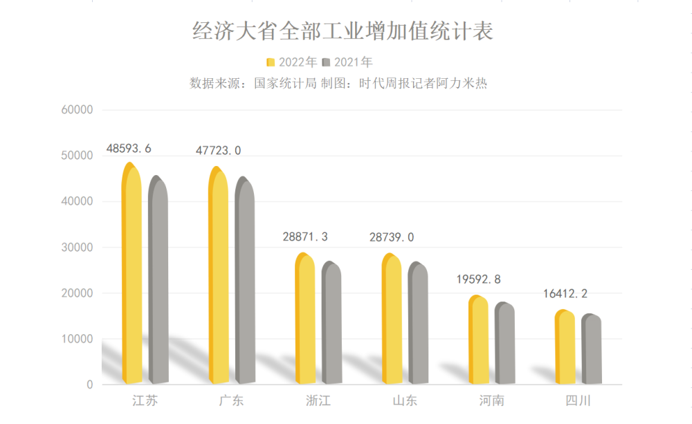
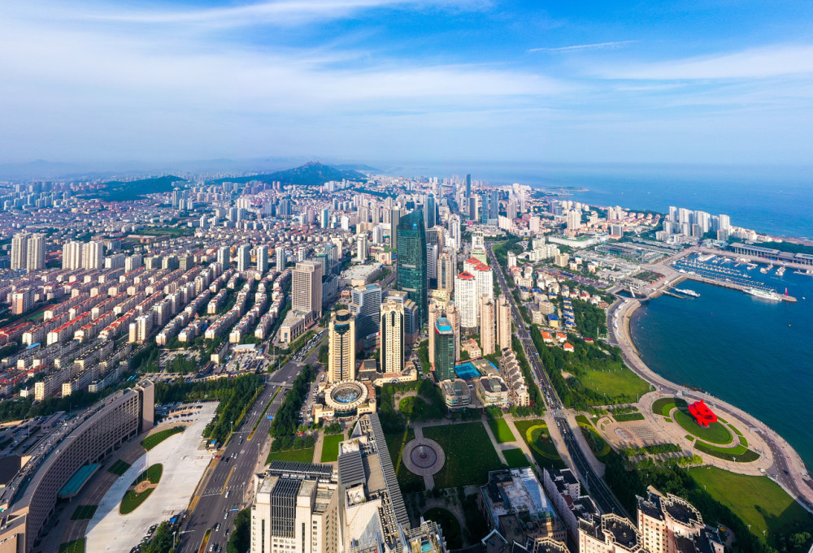

# “制造强省”的竞赛中，经济大省们准备怎么拼？

本文来源：时代周报 作者：阿力米热

谈及现代工厂，大家对它的想象是怎么样的？

明亮宽敞、机械自动运作的流水线代替了旧时拥挤、嘈杂、昏暗的车间。设备之间都能透过网络，迅速地交换资讯，没有部门或设备之间的隔阂，甚至可能有所谓的“数字大脑”，监测着工厂的运作，协助做出精准决策。

这样的想象早已变为现实。电气融入机械的骨骼，信息技术成为燃料，“机器繁忙、工人寥寥”的智能化生产已见雏形，全球制造业正走在数智化转型的道路上。

在加快推进新兴工业化的背景下，制造业已然成为决定区域竞争态势的关键变量，越来越多的省份加入新一轮构建“制造强省”的竞赛中。

_图源：图虫创意_

今年开年以来，广东、江苏、浙江、山东等经济大省多次提及要巩固制造业传统优势、强化转型升级、制造业增加值占比提升等计划。

除此之外，国家也对全社会再次释放了发展、改革和创新工业的信号。

2023年政府工作报告提出，将加快建设现代化产业体系；围绕制造业重点产业链，集中优质资源合力推进关键核心技术攻关；加快传统产业和中小企业数字化转型，着力提升高端化、智能化、绿色化水平。

制造业凭借其实体经济主体、国家经济命脉所系的地位，顺势成为2023年全国经济工作安排的重点领域。

**经济大省提质升级**

“工业增加值首次突破40万亿元大关，占GDP比重达到33.2%。其中，制造业增加值占比27.7%，连续13年居世界首位。高技术制造业占规模以上工业增加值比重15.5%，装备制造业占规模以上工业增加值比重31.8%……”

3月5日，工信部部长金壮龙在全国两会的首场“部长通道”采访活动上，用这组数据直观地说明，工业在宏观经济大盘中的“压舱石”作用进一步显现，新型工业化步伐正在显著加快。

值得注意的是，金壮龙也提及，要鼓励工业大省勇挑大梁，支持各地加大制造业发展，为稳定宏观经济大盘增长多做贡献。事实上，去年在工业经济领域，这些经济大省同样也担起了挑大梁的责任。

从工业规模来看，国家统计局数据显示，在六个经济大省中江苏、广东、浙江分列前三位，是稳定工业增长的主力军。其中，江苏省以48593.6亿元的工业增加值位居榜首。

_2021年及2022年经济大省全部工业增加值统计表（单位：亿元）_

实体经济是经济大省江苏的“看家本领”，江苏的制造业规模也多年保持全国第一。

统计数据显示，2022年，江苏制造业高质量发展指数为89.1，制造业增加值占地区生产总值（GDP）比重达37％以上，均居全国第一。与此同时，江苏作为首个创新型省份建设试点省，全国15.1%的领跑技术分布在此，五分之一的高技术产品出口来自江苏。

中国信息通信研究院两化所工业发展与区域经济研究部主任李媛恒告诉时代周报记者，从增长质量看，2022年江苏省工业企业营业收入利润率高于广东、浙江、山东、河南等经济大省，工业人均劳产率达到54万元，略高于全国平均水平，江苏省在实现工业规模总量第一的基础上，生产效率具有明显优势。

“从产业看，江苏省电子、电气机械、钢铁、化学原料及制品、通用设备等五大行业营收占工业比重超过一半，产业结构较为均衡，且在半导体、光伏、医疗器械和制药等高新领域竞争力较强。但相比传统领域，（高新领域）仍然缺乏龙头企业，2021年江苏省规模排名前5位的企业均为石化、钢铁企业。”李媛恒说。

当下，江苏聚焦稳链补链强链，正在加快构建现代化产业体系，锻造新的产业竞争优势。2023年江苏省政府工作报告提出，将加快构建现代化产业体系，要求进一步提升先进制造业集群能级，深入实施产业强链行动计划。

_江苏无锡城市夜景 图源：图虫创意_

与江苏相似，广东在工业经济发展中，产业链也较为完善，珠三角的工业注重上下游配套，在细分领域做精做专。

2022年，广东以47723亿元的工业增加值位居第二。支柱行业中，新能源汽车产销两旺，汽车制造业增长20.8%。

伴随着汽车制造业的增长，比亚迪、华为、广汽、小鹏等龙头企业，正在引领广东乃至全国的新能源汽车产业发展。乘联会数据显示，2022年比亚迪（狭义乘用车）零售销量为180.5万辆，同比增长149.4%，夺得国内车市销冠宝座。这是中国品牌首次在国内市场超越合资品牌。

“广东制造业的发展得益于境内资本与境外资本的双轮驱动，也带动了珠江三角洲城市化水平的提高。而珠三角在制造业上的发展其实也说明了，对外开放引进先进技术的重要性。其次，在科创领域，广东还有华为、腾讯、大疆等民营企业，这些对于发展外向型经济以及提升制造业的质量、规模都非常重要。”华南城市研究会会长胡刚说道。

_广东东莞
图源：图虫创意_

粤苏之后，浙江以28871.3亿元的工业增加值位居第三。从行业看，浙江省在医药、化学原料、汽车制造业、烟草制品业增加值分别增长16.2%、14.7%、13.7%和5.9%，增速较上年加快。

其中，浙江民营经济对工业的贡献较大。

胡刚告诉时代周报记者，浙江以民营经济为主导，很多县都形成了各自特色的产业集群，例如绍兴织造印染、嵊州领带、温州鞋革服装等产业基础非常牢靠，因此民营企业也是推动浙江工业乃至整体经济发展的主要力量。

据浙江统计局统计，2022年，民营企业增加值15385亿元，比上年增长5.2%，增速高于规模以上工业1.0个百分点，占规模以上工业的70.3%，比重比上年提高0.8个百分点，拉动规模以上工业增加值增长3.5个百分点，贡献率达83.2%。

在原有优势的基础上，《浙江省“415X”先进制造业集群建设行动方案（2023—2027年）》提出，到2027年，“浙江制造”在全球价值链创新链产业链的位势明显提升，制造业增加值占全球比重稳步提升。

_浙江杭州钱江新城
图源：图虫创意_

紧跟着浙江之后，2022年山东以23873.9亿元的工业增加值位居第四。工业向来是山东经济发展的“主引擎”之一，在全省经济体系中占比接近三分之一。

然而，曾经与江苏、广东并驾齐驱的山东，目前工业增加值与粤苏之间已经存在较大的差距。统计数据显示，2022年山东的工业增加值比江苏少19854.6亿元，这一数字比第五名河南的工业增加值还略多一些。

从山东工业发展的特点来看，传统产业包括煤、钢、冶金等重化工业产业占比较高，是“大象经济”的一大特色。不过在新旧动能转换的带动下，山东传统产业升级改造和新动能培育均取得不小的成效。

比如，已培育国家级绿色工厂223家，居全国第2位；“四新”经济（新技术、新业态、新产业、新商业）增加值占比为32.9%，比上年提高1.2个百分点。其中，锂离子电池制造、集成电路制造、电子专用材料制造等新能源新材料相关行业增加值分别增长86.9%、38.6%和60.7%。

在《先进制造业强省行动计划（2022-2025年）》中，山东明确提出，力争到2025年，制造业增加值占全省GDP比重达到30%左右，高新技术产业产值占规模以上工业总产值比重达到50%左右，初步建成先进制造业强省。

_山东青岛
图源：图虫创意_

在李媛恒看来，山东作为工业大省要积极发挥新旧动能转换综合试验区的重要作用，并发挥济南、青岛、烟台在数字经济发展方面的特色优势，积极布局未来产业，通过培育先进制造业集群，促进产业链群协同和新增长极的打造。

“同时，发挥独特的地理区位优势，深化与日韩等国外数字经济龙头企业战略合作，支持参与石化、农副食品、有色金属等省内重点行业数字化转型升级建设，形成一批可复制、可推广的行业数字化转型系统解决方案。”李媛恒说道。

这意味着，传统制造业大省山东将持续深化新旧动能转换，全面进入先进制造业强省建设的“施工”高峰期。

山东过后，河南、四川分别以19592.8亿元、16412.2亿元位居第五、第六位。去年以来，河南省把稳增长作为工业头等大事，统筹存量挖潜与增量提升。

“四川盆地，河南中原，都是我们国家的中原地区，历史悠久。在我国一些重要的拥有区位优势的地方，经济发展比较快，因此地理区位对拉动河南、四川工业发展起了很大的作用。其次，河南、四川一直是人口大省，劳动密集型企业较多，所以也是制造业比较集聚的地方。”胡刚说道。

作为制造业大省，2023年，河南、四川将把工业稳增长放在突出位置，将通过构建先进制造业体系，提升产业基础能力；传统产业数字化智能化改造；利用新技术新工艺推动工艺变革、结构优化、能级提升、方式转型等方面加快推进制造业强省建设。

**从制造到智造**

从这六个经济大省的发力方向来看，如何抓住科技创新这个关键变量，以科技创新、智能制造为高质量发展的支点，成为六个经济大省发力的重点。

而在各省份着力优化传统工业结构、数字升级的过程中，苏州作为中国制造业强市，历经农转工、内转外、量转质，再到“内外联动、共生共赢”，其发展历程可以视为制造业升级之路的浓缩版。

据苏州市政府官网的数据，早在2021年，苏州市规模以上工业总产值正式突破4万亿元大关，同比上一年增长17.2%，全年规模也正式超越上海、深圳，跻身全国第一大工业城市。

日前，工业强市苏州又交出一份成绩单。数据显示，2022年完成规模以上工业总产值43642.7亿元，比上年增长4.1%。电子信息产业、装备制造业两个万亿级产业实现产值26597.2亿元，增长7.1%，成为工业经济平稳运行的重要支撑。

公开资料显示，经过改革开放四十余年的发展，苏州在纳米技术、生物医药、高端纺织、优特钢铁、通信技术已经处于世界领先水平，在人工智能、半导体制造、区块链、航空制造已经处于亚洲一流水平。

_苏州市工业园区东方之门
图源：图虫创意_

而苏州取得现在的成绩，并非一时一刻之功。

李媛恒表示，改革开放以来，苏州将本地乡镇企业的发展基础、上海产业的机会溢出，以及外资企业落地带来的开放空间结合在一起，形成驱动苏州产业发展的三大动力源。

“近年来上海制造业逐渐占比下降并向周边城市转移外溢，苏州凭借距离近的区位、生产要素成本低的优势成为主要承接者。
一方面利用上海溢出制造业资源实现自身制造业从小到大、由低向高发展，另一方面为上海航空航天、集成电路等高端制造业提供产业链配套。”她说。

从战略层面看，早在2011年，苏州便开始开展质量强市活动，此后将开展活动升级为实施“质量强市”战略，并推出《苏州市“十四五”质量发展规划》《“苏州制造”品牌建设三年行动计划》《关于全力打响“苏州制造”品牌的若干措施》等高质量政策。

通过出台优惠产业政策，鼓励技术输出、工业互联网平台赋能、贴息奖补等措施，推动制造业向“智能化”“数字化”转型。不仅如此，还吸引了例如华为、微软等世界巨头落地，以科技巨头为核心培育出天聚地合等具备高成长潜力的创新企业。

苏州凭着在内外联动、新老平衡、智改数转以新带老等诸多举措之下，走出了制造业转型升级的鲜明路径，对于全国许多城市都将有着十分重要的借鉴意义。

苏州在今年的政府工作报告中提出，在2023年，苏州将坚守制造业立市之基加快创新链突破、促进产业链提升、强化资金链保障并夯实人才链支撑，全面加强产业创新集群的融合发展。

看得出，“融合”便是苏州创新集群建设由“起势”到“成势”的着力点。

_图源：图虫创意_

与苏州相似，广州作为制造业规模较大的城市，工业总体规模、综合实力、质量效益等都比较突出，拥有41个工业大类中的35个，制造产业链条丰富，配套能力位居全国前列。

在广州面临多重超预期因素影响的情况下，2022年经济下行压力进一步加大，工业生产明显承压。但高技术制造业作为知识密集、技术密集的产业类型，具备智力性、创新性、战略性和资源消耗少等特点，仍在2022年保持了较高速增长。

数据显示，去年广州市高技术制造业增加值占全市规上工业增加值的比重提高至19.5%，拉动全市规上工业增加值增长1.5个百分点，是当前提振广州工业经济发展的新动能新引擎。

2023年广州提出“坚持产业第一、制造业立市”。从产业集群看，广州将聚力打造智能网联和新能源汽车、生物医药与健康两个万亿级产业集群，建设绿色石化、现代高端装备、半导体与集成电路、超高清视频和新型显示等超千亿级产业集群。

这也表明广州不仅明确了“制造立市”，还将进一步把创新作为重点，开启从“广州制造”迈向“广州智造”的变革，进一步提升城市品牌价值。

