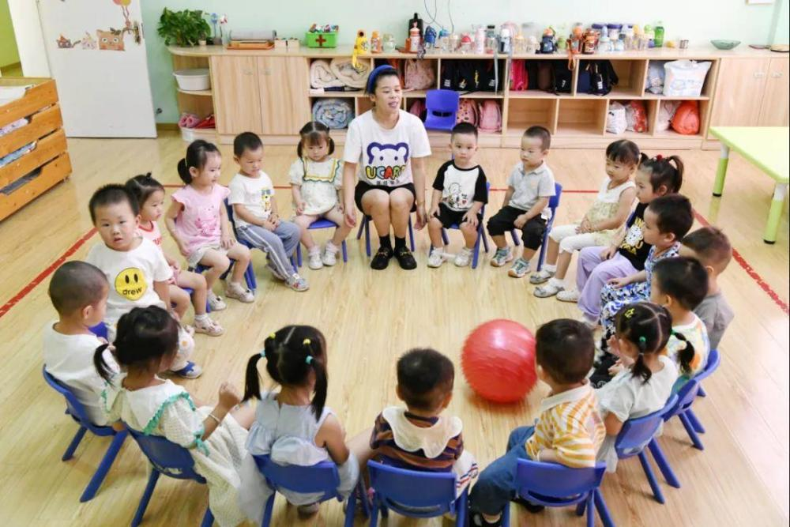
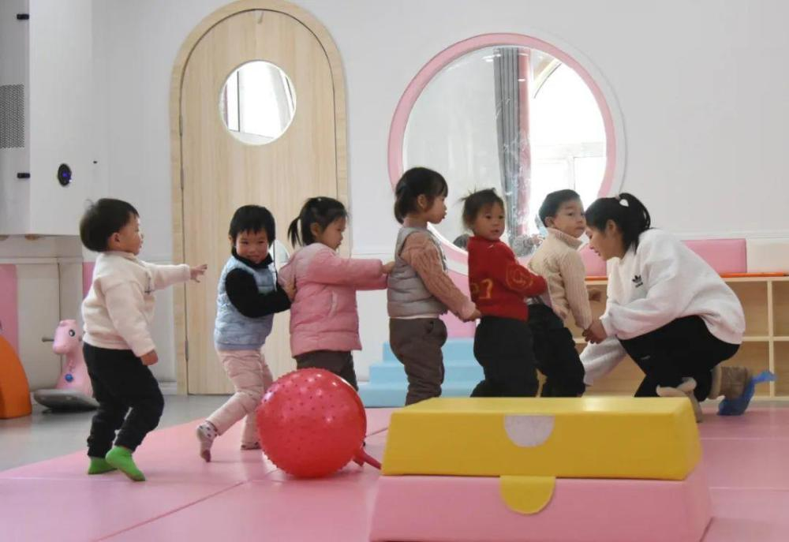

# 两岁就上幼儿园，可行吗？

如何平衡工作和育儿，成为职场年轻父母面临的难题。

全国两会上，0-3岁婴幼儿托育再次关注的焦点。多个代表、委员提出加快建立普惠托育服务体系的建议。

_福建省福州市鼓楼区安泰街道乌塔社区的一家托育园。图源/中新图片网_

全国政协委员、全国台联第十一届理事会常务理事陈小艳提出幼儿园入园年龄低龄化的建议。她表示，幼儿园规定三岁儿童才能入园，某种程度上制约了许多妈妈无法在产后尽快参与到社会生产生活当中，限制了个人能力的发挥。

降低幼儿园入学年龄，能解决眼下父母面临的困难么？

幼托一体化，不容易

提案中，陈小艳建议出台相关评估标准，在孩子能够基本自理的情况之下，不一定非要等到3岁入园，两岁或两岁半就能够入园了。

“让幼儿园招收2岁的孩子，实际上是幼托一体化的发展模式，目前已有不少地区开始实行。” 温州市瓯海区南白象第一幼儿园园长胡佩玲说。

胡佩玲向中国新闻周刊介绍，自己所在的温州市，一些民办幼儿园已经在近几年开设了幼托班，不过存在收费高、覆盖面少等问题。

江苏第二师范学院学前教育学院副教授、中国学前教育研究会理事徐琳对中国新闻周刊表示，在我国人口负增长和低出生率的背景下，从“一园难求”到“一孩难求”，部分幼儿园招生不得不向下延伸，开设幼托班，缓解3-6岁幼儿招生不足、学位过剩的情况，同时提供了育儿支持，满足了部分家长的托育服务需求。在当前人口、出生率变化的情况下，这将是未来大部分幼儿园的选择，但是会加剧幼儿园与托育机构之间的生源竞争。

不过，幼儿园和幼托班婴幼儿的发展还是存在明显差异，如果仅仅是降低幼儿园入园年龄，会带来不少问题。胡佩玲举例，幼儿园的装修、设备、班额、师资力量配备等，是根据3-6岁孩子的年龄特征设计的，显然无法满足2岁幼儿的托育需求。

“单是人员配备，就必须增加育婴师、托育员等等，要在幼儿的生活、卫生保健方面要投入更多的成本和更细致的精力。幼儿园的收费是有界定的，那对于2岁的孩子到底怎么收？”胡佩玲说。

_安徽省铜陵市义一家东城幼儿园开设托班。图/中新图片网_

“不管是降低幼儿园入学年龄，还是幼托一体化，这都不是一句话的事情，需要大方向调整，还要投入更多力量”。胡佩玲认为，目前，卫健部门虽然对托育机构的从业人员提供了专项培训，但缺乏管理和监督，“比如教育局对幼儿园各个学段的老师进行培养，但托育机构的人员拿到证就能上岗，没有持续、系统的培养。”

另一个问题在于部门之间管理机制的调整和衔接。徐琳解释，目前幼儿园归教育部门管理，而0-3岁托育机构由卫健部门负责，侧重于卫生保健和保育管理，“在具体执行工作时，部门之间的机制、协调问题还没有理顺。若推进幼托一体化，政府还需要出台相应指导文件和政策，统筹好学前教育和托育服务关系。”

在探索幼托一体化如何发展的问题上，徐琳和部分受访幼儿园园长均提到了上海。自1999年起，上海开始探索建设0～6岁一体化的学前教育管理体制机制。2018年，上海又在全国率先制定出台托育服务指导意见和行动方案，多渠道扩大托育服务供给，推动托育服务体系建设。

2023年起，上海市正式实施《上海市学前教育与托育服务条例》，其中进一步明确了学前教育与托育服务以政府主导，以提供普惠性服务为主体的原则。该《条例》将学前教育与托育服务合并立法，统筹推进学前教育与托育服务一体规划、一体实施、一体保障，进一步完善学前教育与托育服务体系，促进学前教育事业与托育服务健康发展，推动实现“幼有所育”向“幼有善育”发展。

在上海市妇联兼职副主席黄绮看来，将学前教育和托育服务一体化立法，既规定了政府在学前教育和托育服务中的职责范围，也规定了学前教育和托育机构的场所、人员等标准和要求，这一创新立法具有启示价值和现实意义。

目前，上海依托“政府主导、家庭为主、多方参与”的0-3岁婴幼儿托育服务发展思路，在全国率先探索并基本形成了以幼儿园托班为主体、普惠性资源为主导的托育服务体系。上海市教委发布的数据显示，截至2022年9月，全市已有856所幼儿园开设托班，占幼儿园总数50.6%。

“虽然上海的这种模式不一定能完全复制，但可以作为借鉴”，徐琳说。

托育服务供不应求

“双职工家庭，孩子不到3岁，老人身体原因带不了，保姆不放心，托班又太远，费用还贵”，社交平台上，不少家长表达了无人带娃的焦虑。

随着城市双薪家庭普及，托育服务的需求越来越显著。2021年6月，中共中央、国务院印发《关于优化生育政策促进人口长期均衡发展的决定》，明确将发展普惠托育服务体系作为积极生育支持措施；2022年7月，《关于进一步完善和落实积极生育支持措施的指导意见》出台，再次明确要大力发展普惠托育服务体系，提出增加普惠托育服务供给、降低托育机构运营成本、提升托育服务质量等三方面21项具体任务。

国家“十四五”规划纲要中，将“每千人口拥有3岁以下婴幼儿托位数”这一指标纳入经济社会发展的主要指标，提出到“十四五”期末每千人口拥有3岁以下婴幼儿托位数要达到4.5个的目标。

但国家卫健委公布的数据显示，截至2021年底，我国每千人口拥有的托位数为2.03个，这离目标仍相差甚远。

2021年，我国0-3岁婴幼儿约4200万，其中1/3有较强烈的托育服务需求。但调查显示，我国3岁以下婴幼儿入托率仅为5.5%左右，供给和需求缺口还比较大。

_江苏连云港首批11家普惠托育试点开始运营。图/中新图片网_

原本尚无法满足需求的幼托机构，在3年疫情中又经历了一波冲击。广西玉林某乡镇的李俊（化名）从事了十多年的学前教育工作，2019年开始从事校外托管工作。他的托育机构每学期招收约60个孩子，年龄在2岁-6岁之间不等，每学期每人收费在2500元。

疫情期间，李俊的托育园经历了数次关停，收入被迫中断，但场地费用、员工工资、消防及食药监等各项费用支出依然不减。因为经营困难，他曾一度想过关门，而全镇包括幼儿园在内的6所学前教育机构，如今只剩下2家。

李俊对中国新闻周刊表示，这几年里，为了招纳更多的生源，托育园的价格几乎没有上涨，但还是有一部分家长选择退学，“农村很多家长靠打工赚钱，收入不稳定，每个月花500多也很多”。

相比而言，一线城市的托育费用更高。例如北京，2020年的托育机构平均月收费超过7000元，价格较高，运营成本中场地租金和人力成本占比超过八成。

《2022年北京市托育行业发展报告》也显示，已送托家庭中，多数实际月托育费用在6000元以上。尽管收费水平并非他们选择托育机构的首要考虑因素，但多数已送托的家庭也希望每月的托育费用不超过4000元。

徐琳在调研中也发现，一些地方的托位虽然足够，但家长的送托还是有顾虑。“这里的原因很复杂，比如收费高，家长对商业托育机构的服务不信任，很多商业机构生存困难、经营不稳定，不专业等等。”

在全国政协委员、中国人口与发展研究中心主任贺丹看来，财政性托育经费不足仍是制约托育服务发展的主要障碍。

贺丹分析称，一方面，财政支持不足导致托育供给不足、家庭托育负担高，另一方面，婴幼儿托位供给不足和幼儿园学位供给过剩现象并存，托育发展缺乏主导模式引领。由于无论公共服务投资模式、补贴父母的市场化模式或政府购买服务模式都需要公共财政的支持，依靠社会力量提供优质价廉的托育服务极不现实。

对此，全国政协委员、河南省卫生健康委员会主任黄红霞也认为，与养老、学前教育等行业相比，各级政府对托育服务发展的政策和资金支持力度不足，托育服务和学前教育衔接、协同不顺畅，可能造成资源浪费和重复建设。

“最重要的是培养人才”

针对目前托育服务供给总量不足、质量不高等问题，不少代表、委员和专家提出了建议。

第十四届全国政协委员、湖北省妇联兼职副主席谢文敏建议，政府发挥在提供幼托服务上的主体作用，加大对托幼服务的公共财政投入，并大力发展普惠性婴幼儿托育机构，逐步建立以公共财政投入为主的经费分担机制。

贺丹也提出了同样的观点。她建议参照学前教育财政预算的相关规定，确定托育服务在公共财政预算中的比例，并建立中央财政对中西部地区支持政策，以降低家庭托育支出，促进托育服务的均衡发展。

“财政预算应重点扶持推进托幼一体化发展模式”，贺丹称，可以根据发达国家托育模式发展经验，公共服务投资模式比补贴父母的市场化模式更有规模优势、教育者培训优势，以及更高的公平程度、更高的覆盖率和更好的质量。

促进托育服务发展，还需要完善“普惠优先、市场补充”的多层次服务体系。贺丹认为，目前，我国正处于大力发展普惠托育的起步阶段，同时又面临国内各地区较大的经济社会差异，可以借鉴发达国家托育模式发展经验，建立以政府公共服务投资模式为主的托育模式，可以满足广大的中西部地区和发达地区中低收入家庭的托育需求。同时，依靠市场托育模式满足高收入群体托育需求，引导社会力量重点提供差异化的婴幼儿照护服务，补充休息日托管、临时托管、夜间紧急托管等服务形式，增强托育服务的多样性和灵活性，满足不同层次家庭的特殊托育服务需求。

发展普惠托育服务体系，也正是完善和落实积极生育支持措施的基础性举措。去年8月，国家卫健委、国家发改委等17部门联合发布的《关于进一步完善和落实积极生育支持措施的指导意见》中提出，要发展普惠托育服务体系，从增加普惠托育服务供给、降低托育机构运营成本、提升托育服务质量三方面出发，以推动积极生育支持政策体系的建立。

在徐琳看来，通过强化财政投入和政策支持，幼托机构的数量不足、费用高额将会逐步得到解决。不过，幼托机构的服务质量、从业人员的专业素质等问题，还需要更长时间的投入和政策支持，“硬件设备实现起来相对容易，软件性要求很难，最重要的是专业托育人才的培育培养。”

徐琳建议，应继续加强顶层设计，尽快明确普惠托育服务体系建设的目标和路径，提供制度保障，处理好普惠化托育服务与市场化托育服务的关系。同时，加快建立托育机构保教质量专业标准和规范，夯实托育服务从业人员的学历教育基础，培养高素质人才，完善职业资格认定与职称评定等制度，强化监管手段，特别是要加强对家政育儿服务人员的监管。

“0-3岁是孩子发展非常关键的时期，不仅仅是吃喝拉撒这么简单，无论是在家庭，还是在幼儿园或托育机构，实施有质量的保育和教育才是最佳途径。”徐琳说。

作者：王春晓

