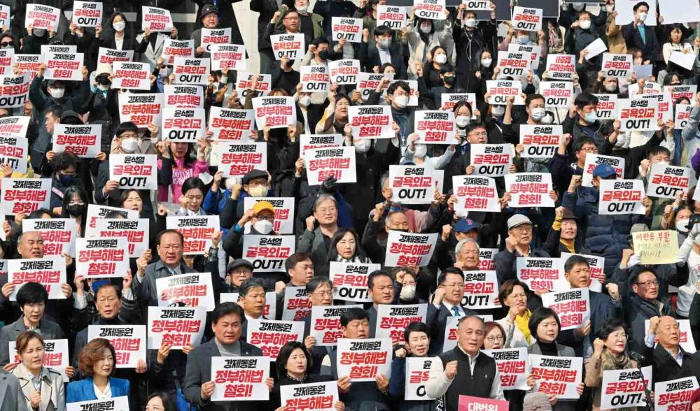
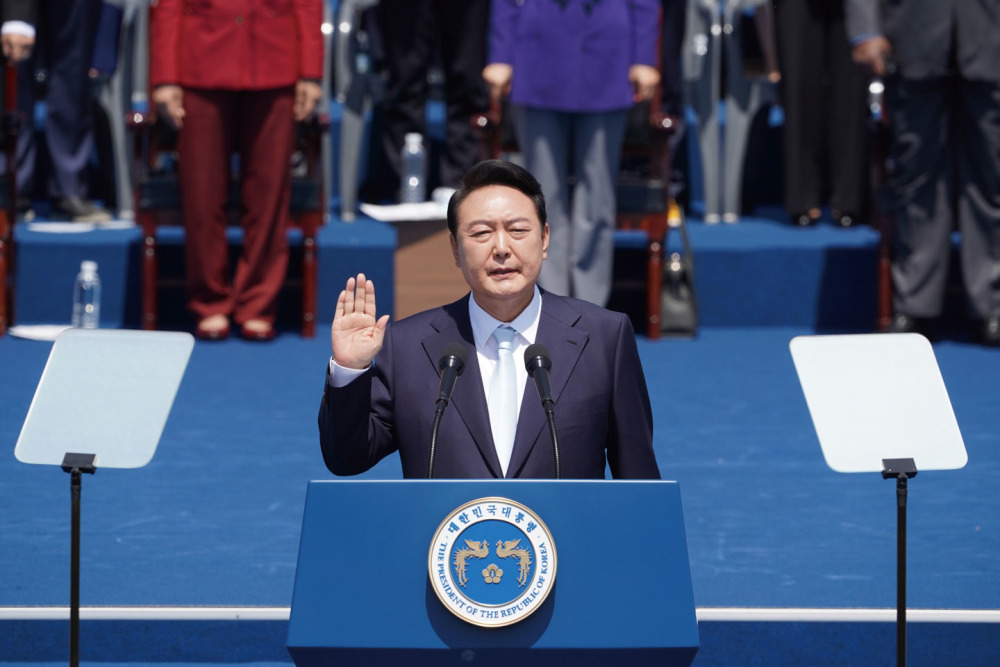
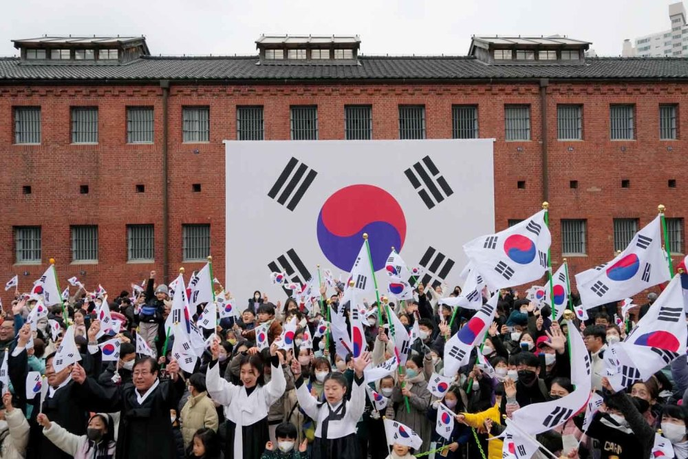

# 侵略者还是合作伙伴，韩国外交的日本难题

_2023年3月7日，韩国首尔，韩国议员和抗议者在国民议会的反政府集会上举着标语，谴责韩国赔偿日本战时强征劳工受害者的计划（视觉中国/图）_

2023年3月1日，韩国总统尹锡悦在首尔柳宽顺纪念馆参加“三一抗日独立运动”104周年纪念仪式时发表讲话，明确表示“日本已从军国主义侵略者转变为合作伙伴”。这番话和严厉谴责日本侵略行为的传统论调迥异，在韩国社会引发巨大争议，被反对党斥为“屈从外交、从属外交”。

日本在1910年到1945年间对朝鲜半岛实施殖民统治，1919年3月1日，朝鲜半岛爆发“三一运动”，这是日据时期最大规模的独立运动。1949年，韩国政府将3月1日定为国家法定纪念日。每年3月1日，韩国都会举办各种类型的纪念活动，在任总统也会发表讲话，提及韩日历史问题。

2013年，时任总统朴槿惠在纪念日讲话中讲话中就曾斩钉截铁地表示，“加害者和受害者的这一历史立场，即使过去千年也不会改变”；文在寅在2018年发表三一节纪念谈话时，对日本使用“加害者”、“反人类人权犯罪”等词语，敦促日本反省。

而尹锡悦在约5分钟、1300字的演讲中，没有直接提到日本强制征用劳工或慰安妇等历史遗留问题，也没有要求日本进行谢罪或反省，显示韩国现政府对日政策发生了明显的变化。这一变化的背后，其原因耐人寻味。

_韩国总统尹锡悦（新华社/图）_

韩日百年恩怨

朝鲜半岛历史上长期是中国封建王朝的附属国，中国的政治和文化对半岛的影响很大，朝鲜王朝的君主每年向中国朝贡三四次，这就是“事大政策”，也就是向强国称臣来自保。这种关系虽然不平等，但总体符合朝鲜自身利益。

而朝鲜和日本的关系几百年前就开始非常紧张，1592-1598年的壬辰倭乱，丰臣秀吉率领倭寇入侵朝鲜半岛，烧杀抢掠，日本的此次入侵最终被中朝联军击退。但此事在朝鲜历史上无疑写下了伤痛的一页。至今，日本京都还有一座埋着38000名朝鲜人耳朵和鼻子的耳冢，这些曾是当年丰臣秀吉军队的战利品。

2022年万圣节发生踩踏事件的首尔梨泰院，也和这段历史有关：日本人当时侵犯了一些尼姑，怀孕的尼姑在此生养他们的孩子，由于是混血儿，被韩国人称为“异胎”，这里也就被称为“异胎院”。这个词组合在一起也有“一大片梨树”的意思，后来就改成了“梨泰院”。

到了1876年，伴随着清王朝的衰弱，对朝鲜半岛的控制已经力不从心，日本乘虚而入，逼迫朝鲜王朝签订不平等的《江华条约》。1910年，日本通过《日韩合并条约》吞并了朝鲜半岛，实行残酷的殖民统治，一直到1945年。日本人的统治非常残暴，韩国人被迫取日本名字，说日语，还有数千名妇女被迫做慰安妇，这激起了韩国人的强烈不满和反抗。

1919年3月1日，朝鲜宗教界人士组成的“民族代表”33人和一些青年学生，以朝鲜高宗李熙的葬礼为契机，在京城（今韩国首尔）塔洞公园举行民众集会，宣读《己未独立宣言》，进行示威请愿活动要求独立，迅速席卷整个朝鲜半岛。由于日本的镇压，此次运动在1919年6月以失败告终。

尹锡悦此次讲话的地点柳宽顺纪念馆，是为纪念“三一运动”的受难者柳宽顺而修建的。柳宽顺出生于忠清南道天安，原来是梨花学堂（今梨花女子大学）的学生。1919年3月1日，柳宽顺在塔洞公园参与反对日本殖民统治的独立运动，之后把独立运动的消息带返家乡，并主导当地的独立运动，因此被捕并被日本殖民当局判处7年徒刑，其后更在西大门刑务所拘留所内因严刑拷问及营养不良而死，享年18岁，她被誉为“韩国的圣女贞德”。

为了达到吞并的目的，日本侵略者宣称韩国是日本民族的一个分支，焚毁了大约四百万册各种韩文书籍，绝大多数学校都要用日文授课。为了对抗这些荒谬的论述和做法，韩国人发展和强化了自己的民族意识。在日本统治之前，韩国人的民族主义并不明显，正是日本的统治激发出了韩国今天强烈的民族主义情绪。

二战之后，朝鲜半岛分裂为两个国家，美国要求日本与韩国单独建交。1951年10月，日韩建交预备会议开始。自1952年2月至1964年4月，两国举行了6次正式会谈，但因清算日本殖民统治、财产请求权、战争赔偿、捕鱼范围、旅日朝鲜人地位、竹岛归属等纠纷，谈判一再陷入僵局。

1965年6月22日，日本佐藤荣作政府和韩国朴正熙政府在东京签订《日韩基本关系条约》，实现关系正常化；双方同时还签订《关于解决请求权问题与经济合作的协定》等一系列文件。根据上述条约和协定，日本政府在10年内向韩国赔偿3亿美元，提供2亿美元的20年低息贷款，以及3亿美元的民间信用贷款。

而这8亿美元只是开头，后续的借款一直没断，从1965年到1981年，韩国从日本共获得了245.19亿美元的贷款。除此之外，日本民间资本也大量涌入韩国，为韩国经济的发展注入了大量资金和先进的设备技术。这一切，对韩国经济的起飞产生了至关重要的作用。

显然，在发展和尊严的选择上，朴正熙选择了前者，但因为让步太多，激起了韩国民众的强烈不满，引发了声势浩大的示威游行，国会表决的时候反对党纷纷离席，媒体疯狂抨击，差一点让朴正熙下台。直到现在，还有不少韩国人认为《日韩基本关系条约》对日本让步太多，主张将其废除，重新和日本谈判签订新条约。

1980年代后期韩国民主化之后，在民意的压力下，对日本的态度趋于强硬，慰安妇、日本强征劳工、岛屿争端等问题开始成为影响韩日关系的核心问题，两国关系围绕着历史问题不断载沉载浮。

2015年12月，韩国朴槿惠政府与日方达成了《韩日慰安妇问题协议》，日本政府出资10亿日元，由韩国政府设立“和解与治愈基金会”，用以向受害者发放抚慰金。但是，协议中关于韩国政府不能再提及慰安妇问题的条款，以及日本没有进行正式道歉和赔偿等问题，引发了韩国民众的不满。

文在寅上任后，以民众反对为由，要求对这一协议进行重新谈判，并在2018年11月撤销了慰安妇援助基金会的法人资格，在实质上废除了《韩日慰安妇协议》。日本政府则认为慰安妇问题已经得到了“最终和不可逆的解决”，政府更迭不应该影响协议的效力，多次催促韩国政府履行，但无果。

2018年10月，韩国最高法院对日本殖民统治时期强征劳工案作出终审判决，裁定新日本制铁公司向4名原告每人支付赔偿金1亿韩元。由于新日铁拒绝支付，2019年，韩国法院批准扣押其在韩资产，允许将这些资产变卖以作赔偿。

针对韩方判决，日本政府立场强硬，强调依据日韩1965年签订的《日韩请求权协定》，类似民间索赔问题已经得到了“完全且最终的解决”。2019年7月1日，日本经济产业省宣布，对氟化聚醯亚胺、光阻剂及氟化氢三种化学原料出口至韩国进行严格审查。这三种材料对生产半导体不可或缺，而日本企业掌控这三种化学原料七至九成的全球货源。此外，这些原料皆有剧毒、不易保存的特性，一般国家的存货通常不会超过一个月。因此，这一禁令对韩国半导体产业是当头一棒。这是日韩两国自1965年恢复邦交以来，日本政府首次对韩国施加“经济制裁”。此后，在民意的推动下，两国又相继将对方从最惠国名单上拉黑，双边关系跌入谷底。

_2019年11月20日，韩国首尔，韩国慰安妇受害者援助团体“正义记忆连带”在日本大使馆旧址举行集会示威，一名韩国和两名菲律宾“慰安妇”老人在现场参加活动，要求日本承认战争罪行，并作出道歉（视觉中国/图）_

尹锡悦的盘算

由于日本的禁令对韩国的半导体行业产生了立竿见影的不利影响，从2019年下半年开始，文在寅涉及日本的讲话调门明显降低，但由于劳工索赔问题的存在，双方关系一直冷淡。

转机出现在2022年5月尹锡悦上台之后：6月，尹锡悦和日本首相岸田文雄一起出席了在西班牙举行的北约峰会，9月，两人举行了日韩首脑3年多来的首次正式会谈，就早日解决强征劳工问题达成一致。日本自民党副总裁麻生太郎也在当月访问韩国，与韩方就强征劳工问题进行磋商。

2023年1月12日，韩国政府公布了最新版索赔问题解决方案。根据这一方案，韩国行政安全部下属的“日本帝国主义强制动员受害者支援财团”，将出面筹措韩国大法院2018年终审判决要求涉案日企支付的赔偿金，资金由韩国企业捐助。

从最初的日企道歉和赔偿，到后来的日企出资、韩国财团赔偿，再到现在的韩国第三方机构赔偿，韩国政府在不断让步，而日本政府的立场仍然像最初一样强硬，明确表示不会进行新的道歉，且只有韩方撤销对日企的索赔，日本政府才会考虑让日企出资。

_2023年3月1日，韩国首尔，民众在“三一运动”104周年纪念仪式上欢呼
（视觉中国/图）_

韩国之所以如此急迫要改善和日本的关系，主要有这么几个原因：

一是尹锡悦保守派价值观使然。

民主化之后，韩国政坛分化为进步和保守两大阵营，立场针锋相对，几近水火不容。进步派的基本价值是：在南北问题上，主张和朝鲜搞缓和；在慰安妇、日本强征韩国劳工等历史问题上，对日本态度严厉；在财阀问题上，主张改革财阀体制，终结大财团之间错综复杂的控股关系网，建立透明的经营结构。保守阵营则反其道而行之。也因此，两个阵营各有一顶针对对方的大帽子，一顶叫作“亲北（朝鲜）势力”，是保守派攻击进步派的拿手戏；另一顶叫作“亲日反民族”，是进步派反击保守派的杀手锏。进步派的文在寅对日强硬，保守派的尹锡悦上台后进行回调，这也符合韩国政坛斗争一直以来的规律。

二是韩国国家战略需要。

2021年7月2日，联合国贸发会议在日内瓦召开，通过韩国地位变更案，正式认定韩国为发达国家。跻身发达国家行列后，韩国在对外战略上开始追求更高的目标。尹锡悦上台后提出要把韩国打造成为“全球枢纽国家”，提升存在感和影响力，而无论是成为G7的新成员还是加入“四方安全对话”（Quad），或是加入“全面与进步跨太平洋伙伴关系协定”（CPTPP），这些都需要得到日本的认可和支持。

三是来自美国的压力。

在中美竞争和俄乌战争的背景下，美国加强了对盟友归边的要求和掌控力。2022年5月23日，韩国以创始成员国的身份加入了美国主导的印度太平洋经济框架（IPEF）。12月29日，韩国政府公布了韩国版印度太平洋战略，提出将自由、民主主义、人权等价值作为地区秩序的根本，与共享这些价值的国家联合，反对依靠力量改变现状。这与美国的印太战略一致。而作为美国在亚太的两大重要盟友，韩日之间关系的改善，是美国一直大力推动的事情。之前两国达成的慰安妇协议，就有美国大力拉拢斡旋的因素。

尹锡悦政府放下身段不计代价试图改善对日关系的举动，已经引发了韩国民意的强烈反弹，不过尹锡悦是一个不大在乎民意、倾向于一意孤行的政治人物，在国际格局变动的大背景下，他会继续力推劳工索赔新方案，来达到改善对日关系的目的。

不过韩国总统不能连任，在缺乏民意支持的情况下，即使韩日两国政府就强征劳工等历史问题在当下能达成解决方案，也很可能被继任者推翻。慰安妇协议就是明证。

南方人物周刊特约撰稿 赵灵敏

