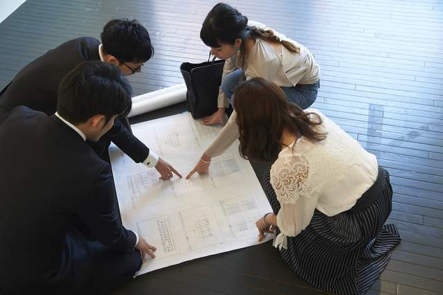
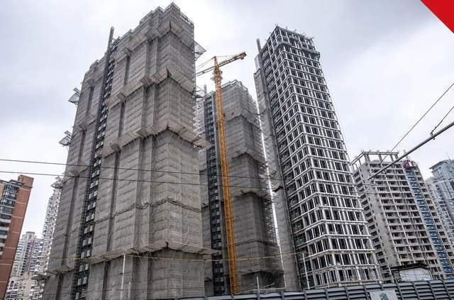
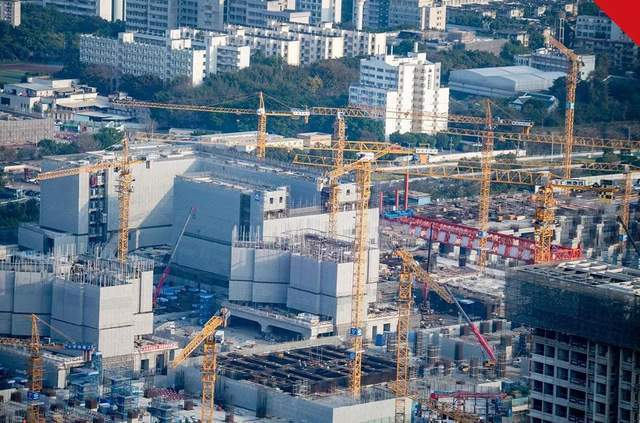
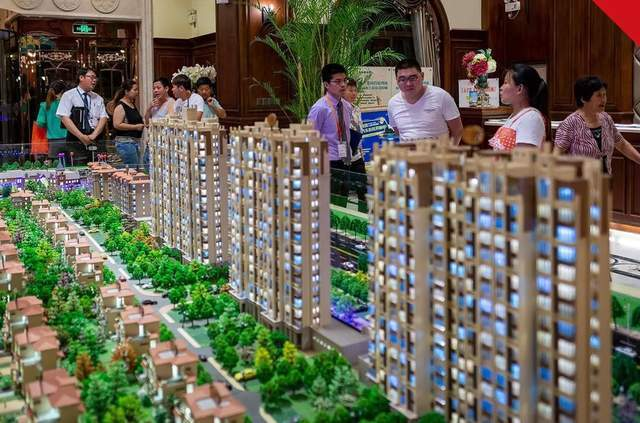

# 公摊面积，为何总被骂上热搜？

划重点：

  * _1_ 所谓公摊面积，包括楼道、电梯、公共门厅，甚至还有地下室、设备间、花园值班警卫室、物业管理用房等等。影响公摊面积的因素较多，主要有户型、套内面积、公共设施、建筑规模等。
  * _2_ 除登上热搜的郑女士买到了这样的房子外，2010年，山东高密某楼盘推出后的公摊系数为52%；2017年，南京某商住公寓一些户型的公摊系数发展到58%。
  * _3_ 地产黄金期，房企或许会在公摊上搞事情，但现在房子能卖出去就不错了，都拼的是产品力，没人去惦记那点公摊了。

凡是涉及买房的话题，都会挑动着大众的情绪。

进入3月以来，与“公摊面积”相关的词条屡上热搜。继“建议取消买房公摊面积”被热议之后，3月9日，“女子购74平米房仅得40平米”的新闻，霸屏热搜榜单。

据媒体报道，这名女子购买了一套74平方米的房子，事后，她才发现套内面积仅有40平方米，其余34平方米被开发商告知是公摊面积。据该女子讲述，当时她签完合同着急回家，就没有及时测量房屋套内面积，但没想到会差这么多。

不仅这名女子情绪激动，就连网友也替她鸣不平：“怎么一公摊，把房子将近一半都摊出去了？”

买房有公摊面积，在我国由来已久。中国“房地产之父”、前中房集团董事长孟晓苏，曾在一档节目中论述过他的观点。“这个最早是从当年我们中房开始的，为什么要这么做呢？”

“因为让老百姓按照建筑面积买房，它显得数多，面积大，容易让老百姓产生满足感，幸福感，所以我们就一直沿用了下来。建筑面积和使用面积差了多少，差了30%左右，公摊面积就是这么来的。”孟晓苏说。

_▲（图源/视觉中国）_

孟晓苏关于“公摊”的一家之言，在当时也是引起轩然大波。这些年，关于“取消公摊面积”，话题讨论度始终有增无减。大众之所以格外关注公摊面积，究其原因，是这切实关系到了购房者的实际利益，也成了我国楼市积怨已久的“痛点”。

带壳的榴莲有刺

买房就好比买榴莲，这是一个形象的比喻。

榴莲除了肉还有皮，还有皮肉之间白色的膜。如果将榴莲比作房子，白色的膜代表房子的墙、装饰之类的东西。膜跟肉加在一起，就是房子的套内面积，那榴莲的皮，就代表公摊面积。

榴莲的皮加上膜，再加上榴莲的肉，就相当于房子的建筑面积。这一切看起来似乎刚刚好，但偏偏那个皮，也就是“公摊面积”那个壳，是带刺的。

在有电梯的板式高层建筑中，公摊面积比例通常在18%~25%之间
；在有电梯的塔式小高层建筑中，公摊面积比例通常在18%~22%之间；在有电梯的塔式高层建筑中，公摊面积比例通常在20%~30%之间。

也就是说，你花200万元买的房子里，至少有35万元到60万元买的是公摊。买了100平方米的房子，到手只有约70平方米。这让购房者心中有了一根刺，“我只想买80平方米，但你非要让我多花20多平方米的钱，那20平方米我又住不了。单价倒是一视同仁啊！”

更有一些房子的公摊面积比例，甚至远高于30%。3月9日上热搜的“女子购74平米房仅得40平米”新闻中，主人公郑女士买的房子，公摊面积就达到46%。“她买的房子，是下边乡镇的新民居，不是霸州市区的。”河北霸州资深地产人王峰告诉「市界」。

所谓新民居，是指为了保证耕地面积，节约用地，改善农村宅基地急缺，改善农民生活环境设立的农村住宅生活区项目。“像这样46%的公摊面积，在霸州并不常见。一般霸州房子公摊面积在20%左右，24%~26%之间的公摊算大的。”王峰说。

距离霸州只有90多公里的天津，超高的公摊面积也不普遍。“我接触的回迁房公摊相对较大，差不多占32%左右，新房普遍公摊面积都在28%左右。”天津房产中介李卓阳告诉「市界」，回迁房的面积一般都不大，户数多，公摊面积相对会增加。

北京的情况大同小异。当地有房产中介告诉「市界」，“北京一般电梯房的得房率是73%~76%。我接触最极端的情况，得房率是63%，也就是公摊面积达到37%。”

这并不意味着市面上没有公摊面积畸高的房子。除登上热搜的郑女士买到了这样的房子外，2010年，山东高密某楼盘推出后的公摊系数为52%；2017年，南京某商住公寓一些户型的公摊系数发展到58%。

2022年8月，据《法治日报》报道，山东省青岛市一位市民购买的110平方米的房子，到手却发现套内面积只有60多平方米；购房时销售人员口头承诺的31%公摊面积，收房时却变成了46%。

每每看到这些新闻，购房人用洪荒之力吐槽，“我以为100平米的小家足够装下我的梦想，收房一看，只能装一半”“攒了半辈子钱就想换个大house养老，150平方米你跟我说套内105平方米，算完账我差点提前咽气”。

尽管这些话带着些赌气，但反映出的问题不得不正视：为何有的公摊面积，会超出如此之多？

所谓公摊面积，包括楼道、电梯、公共门厅，甚至还有地下室、设备间、花园值班警卫室、物业管理用房等等。影响公摊面积的因素较多，主要有户型、套内面积、公共设施、建筑规模等。

一般情况下，同一栋楼里，户型不同，公摊面积不同，点式楼和板式楼不同；房屋面积越大，公摊面积越大；公共设施、走廊越多，公摊面积越大。

“房子的管线综合，包括一些水井、管道井、电井等，位置摆不好、做不好，其实也会影响公摊。它还是需要一定的设计要求和功力。”某知名房企管理人士卢枫告诉「市界」。

_▲（图源/视觉中国）_

在现行建筑面积计价制度下，房企的一些“独家解释权”，也是高公摊面积的推手之一。如有些开发商跟测绘公司一起，将小区绿化带、以及售楼处等也算在公摊面积里了。

不过，一名知名房企工程人士告诉「市界」，“地产黄金期，房企或许会在公摊上搞事情，但现在房子能卖出去就不错了，都拼的是产品力，没人去惦记那点公摊了。”

买房更贵了吗？

“公摊”的概念诞生于20世纪60年代的香港，并于1995年引入内地。尽管当年公摊被引入，但其并非商品房唯一的计价方式。

2001年，建设部明确规定了可以选择三种计价方式：按套计价、按套内建筑面积计价和按建筑面积计价。但是，国内开发商却不约而同地选择了“套内建筑面积 +
公摊”的模式。这是为何？

北京市房地产法学会副会长兼秘书长赵秀池告诉「市界」：“包含公摊面积的建筑面积，更能明确告知购房者，开发商为其提供了哪些配套空间。如电梯井、楼梯间、垃圾道、变电室、设备间、公共门厅和过道、地下室、值班警卫室以及管理用房等等。”

“公摊面积也要写进购房合同，让购房者知道公摊面积都包含什么内容，提醒开发商提供相应配套服务。从这个角度也可以理解为对开发商配套建设的要求。”赵秀池说，比如一些老旧的公房，当初是以使用面积计算的，在出售时会折算为包含公摊面积的建筑面积。北京一般是按1.333倍折算的。

但后来，在实际生活中，公摊面积慢慢成了一些开发商的大箩筐，什么东西都能往里装，慢慢成了一笔糊涂账。对购买期房的业主来说，开发商告知的得房率都只是一个预估的数字，实际还要以交付后为准，这样一来，买新房变成了“拆盲盒”。

李清和家人就是不幸拆中两套回迁房盲盒：145平方米的大户型，套内面积不到100平方米。大户型的储藏室，再加上96.5平方米小户型的储藏室，有99.7平方米。“单价是便宜，但房子要全款买，储藏室就让你多出一套房子的钱。”李清告诉「市界」。

另一方面，公摊区域属于全体业主所有，物业使用应予以缴纳租金，但收益权却被不少开发商规避了。“说好的小区是我家，贡献靠大家，交钱我是第一个，回头小区的广告收入，怎就独独想不起我呢？”有网友吐槽。

与公摊有积怨的购房人并不在少数，他们纷纷举起“反公摊”的大旗。也因此，重庆成为第一个吃螃蟹的地方。2002年，重庆市以法规的形式明确要求：商品房现售和预售，以套内建筑面积为计价依据。2011年，重庆市又对这一政策进行了完善。

2007年，广州曾在全国首次提出小区共有建筑面积不再分摊到户，即取消了现有房产证上的“公摊面积”。目前，广州实行按建筑面积卖房、销售合同中也同时要求标明套内建筑面积的“双轨制”的做法。

香港则是彻底告别了公摊时代。2013年，由于香港开发商过于注水，引得购房者联合提议。香港颁布了住宅物业新规，彻底取消公摊面积。尽管重庆、广州等城市先行一步，但内地绝大多数城市，还在将“公摊面积”计入房价。

这些年，对于取消公摊，业内有不少讨论声。2021年、2022年两会期间，就分别有全国人大代表建议取消公摊面积，让老百姓明白付费，放心购房。

公摊面积如果取消，对各方的影响是各异的。对购房人来看，这是一件好事，买的房子是多少平方米，就是多少平方米。

对房企而言，“计价方式变了。给下游企业进行结算，或者进行成本核算时，大家一直用的是建筑面积的口径。如果变成套内面积的话，要进行一个口径的转变。”卢枫告「市界」。

羊毛出在羊身上。最直接的影响，是房子单价的上涨。这就是榴莲壳和榴莲肉的关系，整个卖就便宜，单买肉肯定贵。在赵秀池看来，房子的总价不会变。“公摊面积是客观存在的，即使以不含公摊的使用面积计量，公摊面积也是会纳入住房总价的。开发商不会因为计量单位的改变而少收费。”

_▲（图源/视觉中国）_

不过，如果从建筑面积变为套内面积，开发商没办法做一些“文章”了。其中的逻辑在于，“站在销售的角度来看，开发商会有一些赠送面积的灰色空间，如楼梯间等公共区间的活动，取消公摊后，这些也不复存在了。并且，开发商将使用率做到极致的热情也会减弱。”卢枫说。

公摊面积等待破题

据了解，欧美国家是按照实际使用面积计算，他们通常是这样做的：买卖双方先确定建房图纸，卧室、客厅、厨房、阳台等都清楚地标出位置和面积，建筑商必须按图施工，如使用面积有出入会受到监管部门严惩。

而香港的“去公摊之路”，则是以豁免部分地价的方式，鼓励开发商建设公用设施，且这些公用的建筑设施，必须以透明的形式呈现在买家面前，否则将面临巨额处罚。

尽管欧美和香港取消公摊的做法，对中国内地具有借鉴意义，但从种种迹象来看，内地取消公摊面积目前有点难。

入户大堂、电梯井等公共空间，在物理上不可能取消，正如一些网友所说，“没有公摊面积，那就没电梯、楼梯、走廊，业主连家都回不了”“如果业主不公摊面积，那业主每次回家可能都得给路费、电梯费，小区花园可能也被开发商出租做菜市场了”。

还有购房者担心，房价不计公摊是在大动开发商的“奶酪”，它们对公摊部分的重视程度就会下降，小区环境、房屋整体建设质量也可能受影响。这些问题不得不正视。

从目前来看，住房面积的计量有三种方式，包含公摊的建筑面积，不包含公摊的使用面积和居住面积。居住面积最小，使用面积次之，建筑面积最大。一般三者之间会有一个换算公式。

“但由于楼盘的高度不同、品质不同、公摊面积的多少、换算系数也不一致。虽然三种计量方式计算面积公式不一样，但公摊面积确实是存在的，没有外墙的公摊，无法遮风挡雨；没有楼梯的公摊，也是无法上楼的。”赵秀池认为。

并且，自从停止福利分房后，房本上的住房面积，一直是包含公摊面积的建筑面积，物业费、暖气费、维修基金等，也都是按包含公摊面积的建筑面积计量的。

所以，取消公摊面积，其难度还在于，“过去住房面积的计量方式要改变，相应的以住房面积为单位计量的物业、暖气、房价等收费标准也会改变，甚至需要重新制定。”赵秀池说。

重庆也并没有完全取消公摊面积。其主城区大多数新房销售，是按套内面积计价，但也有区县是按建筑面积销售。以套内面积计价的，合同上套内、建面都要计算。

“现实操作中，很多楼盘也还是会把套内面积价格和建筑面积价格都写明，用建筑面积计价确实有利于与全国进行比较和统计。”一名重庆地产人士告诉「市界」。

更重要的一点是，全国都采取按建筑面积售卖的这些年，政府制定了很多与建筑面积挂钩的规则。如建设部制定建筑面积计算和分摊规则、物价部门按建筑面积核算房屋单价、产权证还是按照建筑面积来制作等。

如果要取消公摊面积，意味着这些规则都要全部重新修正。这显然是一个艰难而漫长的过程。

不过，在没有取消公摊面积的日子里，除了必要时拿起法律武器维护自己的权益外，购房者也还是有办法分辨得房率的。

“开发商在售楼处，必须公开房屋面积预测报告（期房），或实测报告（现房）的，可以从这个报告中查出要购买房屋的相关面积数据，拿建筑面积减去套内的建筑面积再除以建筑面积，就可以算出公摊比例。”北京金诉律师事务所主任王玉臣告诉「市界」。

巧合的是，在2023年3月1日开始实施的强制性文件《民用建筑通用规范》里，其中最重要的一条修改就是：外墙面层计入建筑面积。尽管这条被外界一度解读成“公摊面积增加了”，但这很快就被住建部辟谣。

在一名资深建筑人士看来，这次修改测绘方式，恰好是取消公摊面积必须要走的一步。

无论如何，对苦公摊久矣的购房者来说，这总算有一点点安慰了。

（文中卢枫、李清为化名。）

作者 | 陶婷

编辑 | 田晏林

