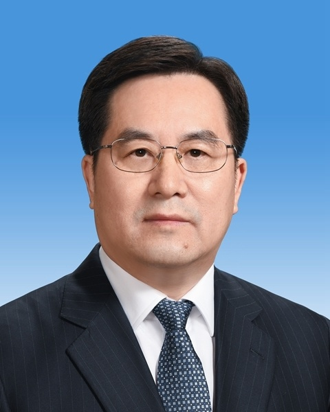
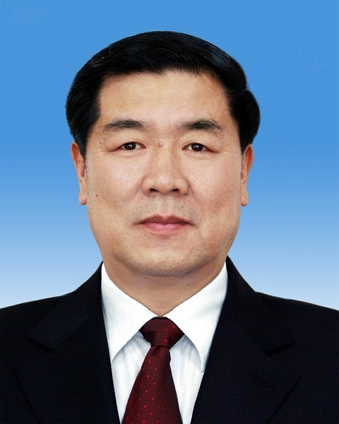
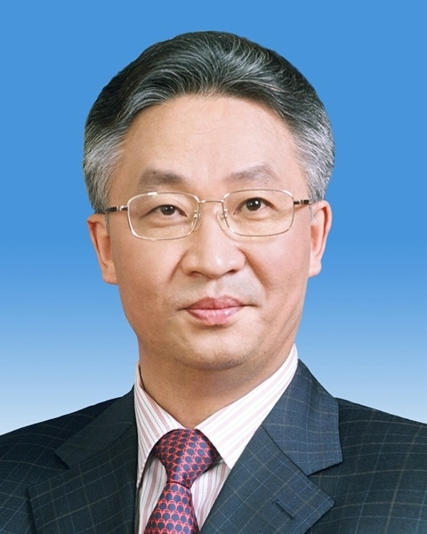
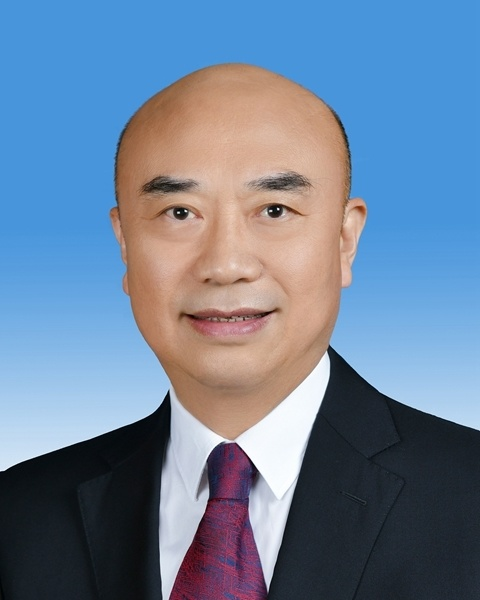

# 国务院副总理简历

新华社北京3月12日电 **国务院副总理简历**

**丁薛祥简历**

丁薛祥，男，汉族，1962年9月生，江苏南通人，1982年8月参加工作，1984年10月加入中国共产党，复旦大学管理学院行政管理专业毕业，在职研究生学历，理学硕士学位，教授级高级工程师。

现任中共二十届中央政治局常委，国务院副总理、党组副书记，中央和国家机关工作委员会书记。

**何立峰简历**

何立峰，男，汉族，1955年2月生，广东兴宁人，1973年8月参加工作，1981年6月加入中国共产党，厦门大学财政金融系财政学专业毕业，研究生学历，经济学博士学位。

现任中共二十届中央政治局委员，国务院副总理、党组成员。

**张国清简历**

张国清，男，汉族，1964年8月生，河南罗山人，1985年9月参加工作，1984年7月加入中国共产党，清华大学经济管理学院数量经济学专业毕业，在职研究生学历，经济学博士学位，研究员级高级工程师。

现任中共二十届中央政治局委员，国务院副总理、党组成员。

**刘国中简历**

刘国中，男，汉族，1962年7月生，黑龙江望奎人，1982年8月参加工作，1986年11月加入中国共产党，哈尔滨工业大学金属材料及工艺系压力加工专业毕业，研究生学历，工学硕士学位，助理工程师。

现任中共二十届中央政治局委员，国务院副总理、党组成员。

