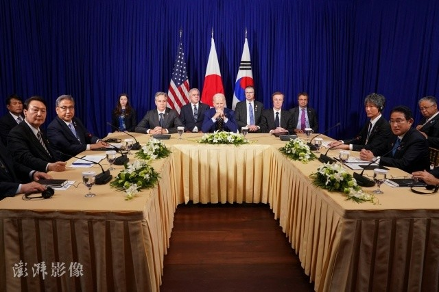
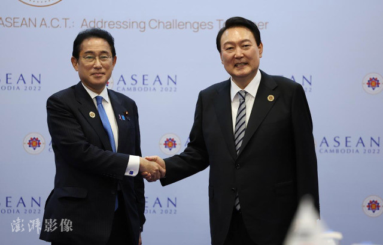
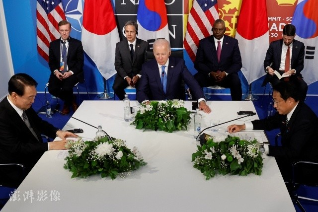
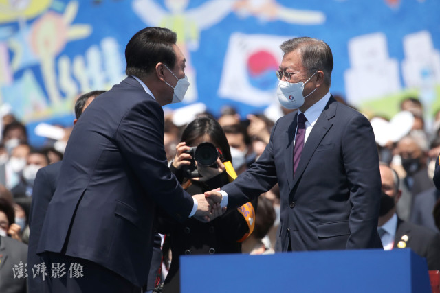
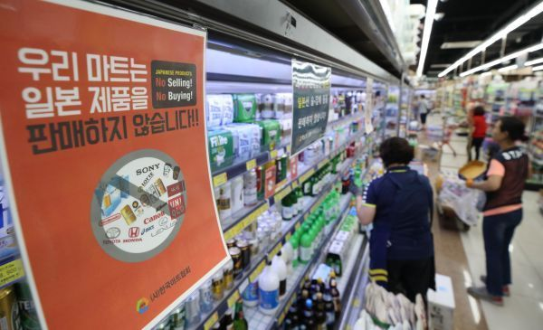

# 日韩“和解”、美国叫好，中国应警惕什么？

【文/观察者网 熊超然
编辑/冯雪、郭光昊】纪念“三一抗日独立运动”104周年当天，韩国总统尹锡悦抛出惊人之语，声称日本从“侵略者”变为“合作伙伴”，随即在韩国国内引起轩然大波。仅隔5天后，韩国政府火上浇油，宣布由韩方基金会代为赔偿二战日本强征韩籍劳工损失。

尹锡悦不惜背上“耻辱外交”骂名也要冲破韩日关系桎梏，大洋彼岸的美国拜登政府立刻“拍手叫好”，第一时间表达了赞赏，并很快宣布了尹锡悦高规格访美的消息。

此次韩国政府选择摆脱历史问题纠葛，加强日韩双边合作，势必牵动东亚变局，也让人将目光再度投射到“美日韩三国同盟”之上。

针对近期韩日关系走向和东北亚局势，观察者网特邀上海对外经贸大学朝鲜半岛研究中心主任詹德斌教授，以及中国社会科学院日本研究所外交室主任、研究员张勇，进行深入解读分析。

詹德斌指出，韩日关系的改善将有利于美国打造一个稳固的“美日韩同盟”。美国此举意在团结亚太盟友并形成对中国的围堵之势，这点毫无疑问。未来，美国若以“美日韩同盟”为核心去拓展，甚至也不排除有建立“亚太版北约”的企图，这一点需要提防。

张勇指出，借助强化“美日韩同盟安全合作”以及推动韩日关系的转圜，美国希望加大对华遏制力度，从而主导东北亚的安全结构，但这种“零和”的安全结构对地区长期稳定并不利。作为与中国同处东北亚的韩日两国，不应该在安全问题上被美国“牵着鼻子走”，而是应该发现东北亚还存在着一种“正和大于零和”的经济结构，认识到中日韩三国加强合作的必要性。

_2022年11月13日，柬埔寨金边，美国总统拜登、日本首相岸田文雄和韩国总统尹锡悦在东盟峰会期间举行美日韩三边首脑会谈。图自澎湃影像_

**“解套”劳工问题，尹锡悦寻求突破韩日关系**

此次韩日再度讨论劳工赔偿方案，这一争议事件的开端是2018年韩国大法院裁定日本企业对强征劳工受害者负有赔偿责任，部分韩国国民理应获得日企赔偿。然而，日方却主张称，包括个人赔偿在内的征用问题已经通过1965年签订的《韩日请求权协定》得到彻底解决，此后再无赔偿问题可言。因此问题，韩日僵持已久。

3月6日，韩国外交部长朴振在“关于强征劳工案大法院判决的政府立场发布会”上，正式公布了韩国政府在征求国内各界意见和与日方谈判的基础上形成的第三方代赔方案。

朴振表示，为了救济、援助受害劳工及遗属，韩国行政安全部下属日帝强制征工受害者支援基金会将出面代为支付2018年法院终审判决的赔偿金及拖欠利息。朴振解释说，目前压案未判的强征劳工对日索赔诉讼若终审判决原告胜诉，也将由韩方基金会向原告们如数支付赔偿金及拖欠利息。

_3月6日，在韩国外交部办公大楼，韩国外交部长朴振正式公布第三方代赔方案
图自韩联社_

日本首相岸田文雄则称：“该措施旨在将日韩关系恢复至健全状态，日本政府对此表示赞赏。”岸田还补充称，“韩国是重要邻国，应该在应对各种各样国际问题时进行合作”，“有必要根据当前战略环境进一步加强日韩以及日美韩的战略合作”。日本外务大臣林芳正则称：“这是让日韩关系重返健康之举，给予肯定。”

上海对外经贸大学朝鲜半岛研究中心主任詹德斌教授指出，此番尹锡悦政府作出这一决定，时机点相当耐人寻味。今年是韩美同盟70周年，尹锡悦去年就已决定要在今年上半年访美。今年2月初，韩国外长朴振赴美讨论筹备纪念同盟70周年活动事宜，韩方希望4月进行国事访问，但美方就是不置可否，实际上是开出了“搞好韩日关系”这一条件。

此前，无论是美韩、美日双边会谈，还是美韩日三边会谈，美方都不断强调了同盟合作的重要性，也强调了美国的同盟国之间（如韩日）合作的重要性。

“所以这个时间点很有意思，韩国正式宣布解决韩日劳工赔偿问题的前一天（3月5日），韩国国家安保室室长金圣翰赴美访问，他的主要任务就是协调尹锡悦访美事宜。”詹德斌说，而在韩国宣布方案后，美国总统拜登第一时间表示赞赏，白宫还在后一天（3月7日）宣布尹锡悦将于4月26日对美国进行国事访问。此前，拜登政府仅在去年12月以国事访问的规格接待过法国总统马克龙一人而已。

相比于此前仅有两成至三成的支持率，近期尹锡悦的国内支持率持续小幅上升，最新民调显示其支持率升至40.9%，而反观在野党共同民主党领导人李在明近期卷入涉嫌贪腐、渎职、受贿等丑闻，官司缠身，导致其政党支持率大幅下降，对尹锡悦政府的牵制力也在下降。

此外，韩国今年并无重大选举，直到明年4月才会迎来国会选举。重要的是，日本即将在5月主办七国集团（G7）峰会，尹锡悦希望受邀出席会议，时间日益逼近，而日本也是忽明忽暗地以韩国解决强征劳工问题为前提。综合考虑，尹锡悦可能认为此时是韩日关系取得突破的好机会。

**此时对日本“低头”，韩国的考量因素很多**

竞选上台前，尹锡悦就曾多次呼吁缓和文在寅任内恶化的韩日关系。在今年3月1日的“三一抗日独立运动”104周年纪念仪式上，尹锡悦发表了“三一节”讲话，认为日本已从过去的“军国主义的侵略者”转变为“携手合作的伙伴”，且并未特别敦促日本反省历史问题。他不仅强调韩日合作，还强调了韩美日三国合作的重要性。

“三一节”讲话一出，在野党纷纷抨击尹锡悦破坏了“三一运动”精神，是在推行“屈辱外交”，采取了“错误的”对日外交政策，韩国网民也骂声一片，怒批尹锡悦是“疯子”、“亲日派”等等，还有人要求其“赶快下台”。然而，不到一周后，尹锡悦政府又宣布了极具争议的劳工赔偿方案。

_2023年3月1日，韩国总统尹锡悦发表任内首次“三一节”讲话
图自韩联社_

除了当前时机点被认为较合适之外，尹锡悦政府此次对日本谈判劳工赔偿问题时作出犹如“低头”的姿态，从国际局势大背景来看，韩国自身外交路线、美国主导的阵营外交以及朝核问题等因素，都影响了这一决策。

詹德斌指出，韩国在解释加强与日本合作时，首先强调的是安全问题，安全问题的重中之重自然是朝核问题。尹锡悦政府对朝政策的口号是“以实力求和平”，这与文在寅政府寻求从制度或机制上达到和平是不同的。“以实力求和平”，就需要有足够的实力支撑，韩国认为凭自己的实力不足以达到，因此就需要日本的军事实力，特别是在导弹探测方面，日本具有技术和地理优势。

同时，随着近年来中美竞争日趋激烈，去年又有俄乌冲突等事件发生，这都深化了国际间的阵营对立，美国极力想把世界分为两个阵营并展开对峙，由此产生了新冷战的特征。而韩国恰好也是从新冷战的视角看待国际局势发展的，选边站队成为了一种必然。尹锡悦上台之后，从其出访行程和参加北约峰会等安排就可看出，他很看重同美西方的关系。

而在西方国家阵营中，日本毫无疑问是主要国家之一，同时又是美国的主要盟友和近邻，韩国去年底发布的韩版“印太战略”报告当中，就对日本作了这方面的定性，相当看重日本的国际影响力。尹锡悦上台后，将韩国定位为“全球枢纽国家”，想在国际社会发挥一定的作用，这在一定程度上也需要得到日本的支持。

譬如，日本在许多国际机制中都有着重要影响力，日本是美日印澳“四方安全对话”（QUAD）机制成员国，在美国退出后主导了全面与进步跨太平洋伙伴关系协定（CPTPP），今年又恰好是G7轮值主席国，而这些都是韩国一直希望融入和参与的国际多边体系。

_2022年11月13日，柬埔寨金边，东盟峰会期间，日本首相岸田文雄同韩国总统尹锡悦举行会谈。图自澎湃影像_

在这方面，中国社会科学院日本研究所外交室主任、研究员张勇也指出，尹锡悦上台后，其推动的韩国对外战略比文在寅时期要更具“全球性”，不再局限于朝鲜半岛，这可以从他将国家定位为“全球枢纽国家”看出。因此，韩国需要新的外交配置，这种配置需要韩国在对日外交上作出“提前部署”，让美国看到韩国既有信心又有准备，以此获得美国支持。

而考虑到国内因素，作为保守派的尹锡悦，事实上也有与文在寅的进步派政策加以疏离的需要——在对日政策上从“疏日”到“近日”。张勇表示，在朝鲜半岛问题上，韩国不仅需要美国的支持，也需要韩美日三方的强有力联系。尹锡悦当前的对日判断是，有必要和日本增加合作，以共同应对地区安全风险。

此番“解套”韩日劳工赔偿问题，张勇认为，尹锡悦最看重的还是推动韩日双边关系本身。与文在寅不同，尹锡悦从竞选到执政，向来重视对日关系，此次甘愿冒着国内批评声作出决断，他也希望用韩日关系中的最大障碍劳工问题作为切口，去一揽子解决两国之间存在的各种问题。

**打造“美日韩铁三角”，美国才能加大遏华力度**

此前尹锡悦发表“三一节”讲话，美国白宫和国务院就表示了赞赏。此次公布劳工赔偿问题解决方案，美国政府同样密切关注。美国总统拜登第一时间发表声明，称赞韩日两国关系“翻开突破性的新篇章”，美国国务卿布林肯也对这一“历史性方案”表示赞赏。

看到韩日两国“冰释前嫌”，美国驻日本大使伊曼纽尔也对岸田文雄和尹锡悦“大加称赞”，他甚至还将这比作一场“测试”：“对我而言，领导力考验的就是有没有足够的理想主义，对于自己正在做的事情有没有清楚的认知，然后能不能坚定地贯彻它，而岸田文雄和尹锡悦现在都通过了这项‘测试’。”

张勇表示，美国显然是十分希望强化韩日关系的，这有利于其介入东亚安全局势，此次美方表达赞赏态度，也是基于其本国利益的考虑。众所周知，从特朗普政府时期开始，由于美国的遏制与打压，中美战略博弈就由原来的贸易，逐步升级到多个层面，特别是战略和军事层面。借助强化“美日韩同盟安全合作”以及推动韩日关系的转圜，美国希望以此加大对华的遏制力度。

詹德斌也表示，美国数十年来在亚太地区的夙愿就是打造一个“美日韩三角同盟”，但这一同盟始终不成三角形，而是一个“V”字型，韩日关系的恶化当然是主要原因，很容易波及美日韩三边合作。尹锡悦政府上台之后，其智囊团队意识到一点，改善韩日关系，不仅可以促进美日韩合作，还可以反过来促进美韩合作，使美方重视同韩方的关系。

也正是因为意识到这一点，在韩国外长朴振今年2月访美“空手而归”之后，韩日之间连续密集地举行了局长级、副外长级和外长级的双边磋商，朴振还在磋商后立即会见强征劳工问题受害者，显然是收到了美方“布置的作业”——改善韩日关系。

_2022年6月29日，美国总统拜登，日本首相岸田文雄和韩国总统尹锡悦在北约马德里峰会期间举行会晤。图自澎湃影像_

詹德斌强调，美国打造“美日韩三角同盟”，意图团结亚太盟友，并形成对中国的围堵之势，这点毫无疑问。未来，美国若以“美日韩三角同盟”为核心去拓展，也不排除有建立“亚太版北约”的企图。事实上，公开资料显示，美国最早曾想用朝鲜战争时期的“联合国军司令部”为模板，转化成“亚太版北约”，而在特朗普政府时期，也有将QUAD机制转化为“亚太版北约”的想法。

“如果美国打造了一个比较稳固的美日韩三角联盟，也不排除会主动制造一些危机，以增强其在亚太地区的主导力。”不过，詹德斌认为，对于美国可能会在亚太复制乌克兰危机的一些说法，这种判断目前还为时尚早，至少韩国还没有做好被卷入一场新危机的准备，这并非是韩国恢复韩日关系或强化美日韩同盟的初衷。当然，这种说法也应该给韩国敲响一记“警钟”。

**韩国国内纷争“后劲十足”，日本密切监督方案履行**

詹德斌介绍，此次劳工赔偿方案与尹锡悦个人也有着密切关联，作为一位没有外交经验甚至是政治经验的韩国总统，他颇有些“无知者无畏”的感觉。据称，此项决定由尹锡悦个人拍板决定，而其幕僚们则认为应该“再等一等”。显然，尹锡悦实际上并未充分考虑到事件的负面影响和民族感情等因素。

对此方案，韩国持中间偏左政治立场的《民族日报》认为，由于日本被告企业未参与赔偿，日本政府也未就该事件直接道歉，预计将引发受害者团体和韩国国内舆论的强烈反对，而这是一直以“违反国际法”为由坚决拒绝韩国大法院判决的日本政府的“完胜”。

而保守派的《朝鲜日报》则刊发社论称，被韩国法院判处支付征用赔偿的日本三菱重工和日本制铁等公司，将以缴纳经团联会费或捐款的形式参与其中。换言之，韩方支付赔偿，日方将这笔钱以基金的方式回馈于两国未来一代，相当于“间接赔偿”。

除了媒体间争论，韩国朝野间和社会也反应强烈。韩国在野党共同民主党领导人李在明就发声抨击，称这是“外交史上最大的耻辱和污点”，并谴责“尹锡悦政府最终选择了背叛历史正义的道路”。一些进步活动人士则将该方案比作“1910年日本吞并朝鲜”，另一些人则称其“为明显的历史倒退”。

据韩联社报道，当地时间3月10日，民调机构韩国盖洛普公布的一项调查结果显示，近六成韩国民众对韩政府提出的二战时期掳日劳工受害者索赔案解法表示反对。

_3月7日下午，在韩国国会大楼前，由611个民间团体举行集会，谴责政府日前发布的二战掳日劳工受害者索赔案解法并敦促日本谢罪赔偿。图自韩联社_

值得注意的是，韩国政局通常会随着总统的党派阵营更迭而每五年变化一回，政策能否落实并不确定。此前，韩国就曾有过“爽约”的前例：朴槿惠政府曾就慰安妇问题与日本达成协议，而文在寅政府则抛弃了这一协议。如今，尹锡悦政府的这一方案，也有可能在未来不作数。

《民族日报》就认为，仅凭尹锡悦政府和岸田文雄政府的协议，强征劳工受害者索赔问题几乎不可能得到解决，该问题错综复杂，也不是尹锡悦政府单方面宣布“解决”就能解决的问题。

詹德斌提醒，此前朴槿惠政府签署的协议是在其执政末期，且存在“秘密条款”。由于朴槿惠最后是被赶下台的，韩国民众也对她比较反感，因此文在寅政府上台后很快就推翻了协议。而尹锡悦政府正值其执政初期，尚未满一年。倘若尹锡悦真的改善了韩日关系，此劳工赔偿方案至少未来四年是可以在韩日政府之间得以贯彻的。

不过，韩日政府之间解决了这一问题，并不代表这一问题本身得到了化解，只是把韩日之间的矛盾转化到了韩国国内，特别是其中的法律问题复杂丛生。所以，韩国未来如果由进步派上台执政，这一问题确实会有反复的可能性。

_资料图：尹锡悦和文在寅 图自澎湃影像_

张勇提到，在韩国舆论中，尹锡悦的“政治决断”被认为是仓促作出的，一旦韩国国内政治“变天”，将留有隐患，这主要包括两方面：

一方面是法律层面的执行问题被掩盖。法律层面上，原本赔偿应该来自日方，如今则变成韩国企业代为支付。另一方面是舆论压力很大。尽管此次韩国政府对劳工受害者家属作了安抚工作，但仍有一部分受害者家属表示反对，这些敏感问题很可能在未来某一时间段继续发酵，引发韩日关系再起波折。

张勇注意到，近期日本自民党外交小组就召开了相关会议，出席的执政党议员纷纷表达意见，认为韩国政府必须切实履行解决措施，他们要予以监督。同时，多名议员提到2015年有关慰安妇问题的日韩共识在韩国后届政府下实际上作废一事，指出“应关注（韩方做法）避免重蹈覆辙”。

**劳工赔偿纠纷，还扯出了韩日半导体纷争**

与尹锡悦不同，文在寅在二战劳工问题上对日强硬，导致韩日关系此前高度紧张。2019年，当时的安倍晋三政府对韩国实施了严格的半导体出口限制，并将韩国剔除出贸易优惠白名单，严重打击了韩国经济。为此，韩国向世界贸易组织（WTO）提出申诉，此后两国关系仍一直摆脱不了紧张状态，甚至影响了在朝核问题上的军事情报分享，美国多次调停依旧无果。

据日本共同社报道，日本政府3月6日宣布将启动面向解除从2019年持续至今的对韩出口管制强化措施的双边磋商。另据韩联社报道，韩国产业部贸易安全政策官姜甘赞同日在有关韩日限贸问题的记者会上表示，韩日两国决定在进行出口限制相关磋商期间暂停WTO争端解决程序。

此前，多位日本政府相关人士表示，尽管日本将对韩出口限制归因于“安全保障”方面的原因，但分析人士认为这是为了报复韩国在劳工问题上判决。张勇表示，在当时的安倍政府看来，等于是把一场“比赛”中的球交给了韩国，看韩国如何反应，日本则静观其变。而此次，可以看作是韩国主动寻求“破局”。

_韩国超市中粘贴的“抵制日货的标语”_

詹德斌直言，在劳工赔偿问题和针对韩国实施半导体出口管制这两件事情上，日本不可能承认两者有关联，否则等于承认了自己的“报复行为”违反了WTO规则，但事实上又确实是有关联的，这一点在已故日本首相安倍晋三的访谈回忆录中也有提及。

同时，随着韩日之间在半导体方面的“和解”，半导体供应链也有望打通，而这也是提出想与韩国、日本以及中国台湾地区组成所谓“芯片四方联盟”（Chip4）的美国非常希望看到的局面。

**同处东北亚，韩日不应被美国“牵着鼻子走”**

3月6日，在被记者问及韩国外长朴振当天正式公布日本二战强征劳工赔偿方案时，中国外交部发言人毛宁表示，强征和奴役劳工是日本军国主义在对外侵略和殖民统治期间对包括中国、韩国等在内的亚洲国家人民犯下的严重人道主义罪行。这一历史事实铁证如山，不容否认和篡改。中方从来要求日本政府以诚实和负责任的态度妥善处理有关历史遗留问题。这就需要日方切实正视和深刻反省历史，以实际行动体现对历史罪行的忏悔和对受害者的尊重，同时以正确史观教育下一代。只有这样，日本才能真正取信于亚洲邻国和国际社会。

张勇指出，从历史问题的性质来看，强征劳工问题并非只涉及日韩两国，日本军国主义时期强征劳工是大量存在的，铁证如山，无可否认。相关国家加强这一方面的研究，于情于理都是正当的。

同时，作为美国的“忠实盟友”，日本如今口口声声不断强调所谓“基于规则的国际秩序”和“人权”等概念，但对于自身曾经犯下过严重侵犯人权的罪行，包括慰安妇和强征劳工等问题，却视而不见。毫无疑问，日本在这方面做得并不好，必须深刻反省。

_3月5日，象征二战时期被日强征韩籍劳工的铜像设在首尔龙山站广场。图自韩联社_

无论是曾经的历史问题，还是当前的现实问题，中日韩三国同属东亚国家，人、财、物流动频繁。张勇认为，在当前的东亚地区，特别是东北亚地区，事实上存在着两种结构。

一种是东北亚的安全结构，美国利用其所谓“盟友体系”和“小多边圈子”，在这方面咄咄逼人，其本质还是以美式霸权来主导东北亚，这种安全结构对该地区的长期稳定是不利的。

另一种则是东北亚的经济结构，中日韩三国经济联系密切，最近一次中日韩首脑会议正是于2019年在中国举行的。在新冠疫情之前，中日韩三国在人才、投资、物流等领域的流通量相当大，而随着疫情政策的渐趋平稳，东北亚也存在着内在的经济需求。

“东北亚在安全领域是相对零和的结构，而在经济领域则是正和大于零和的结构。”张勇强调，韩日在经济上对中国都有着相当大的需求，这两个国家此时其实不应该在安全问题上被美国“牵着鼻子走”，而是应该认识到中日韩三国加强合作的必要性，发挥互补优势，提升合作水平。

**本文系观察者网独家稿件，未经授权，不得转载。**

