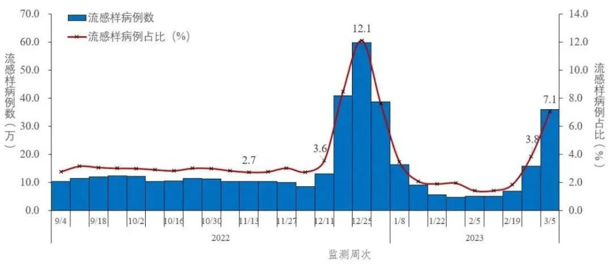
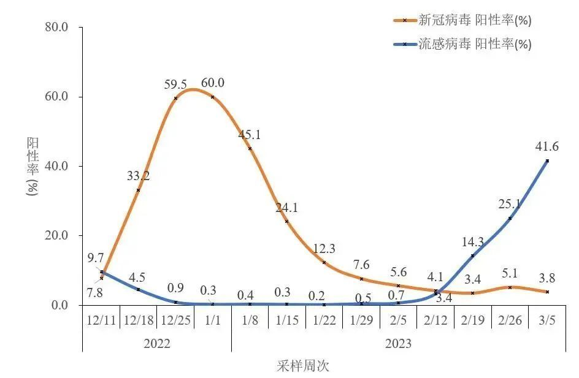
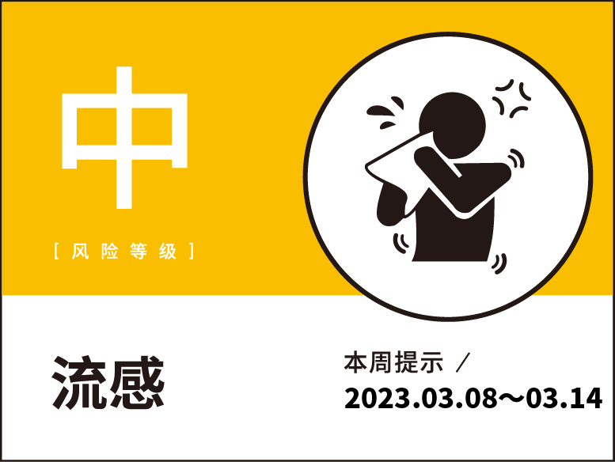
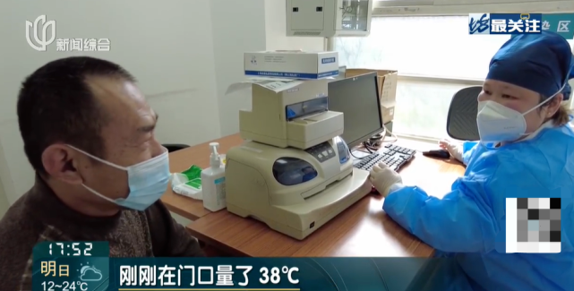
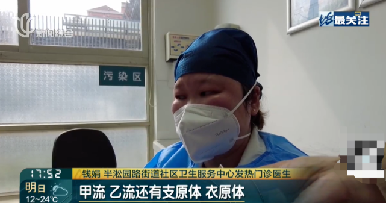
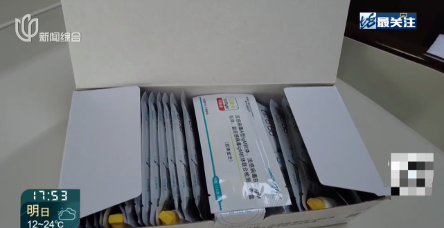

# 28天翻了近60倍！一地升至“中风险”！这波甲流是新冠变异株吗？

不少网友反映，近日身边人出现发热的情况多了起来。“ **这一波来势汹汹的甲流会不会是新冠的变异株？** ”记者发现，网络上有不少类似的担忧。

其实，甲流和新冠，虽然症状相似，但完全是两种不同的病毒。

首都医科大学宣武医院感染疾病科主任田耕告诉记者， **目前出现相关症状的70%-80%左右都是流感患者**
。“可能我们每天300多的门诊量，也只有一两例患者是新冠，多数还是以流感为主。”田耕说。

3月11日晚，中国疾病预防控制中心发布全国新型冠状病毒感染疫情情况：新冠病毒阳性率持续下降，
**2023年第9周（2月27日-3月5日）新冠病毒阳性率为3.8%；而近4周流感病毒阳性率呈上升趋势，2023年第9周为41.6%。**

_图片来源：视觉中国_

**中疾控：**

**近4周流感病毒阳性率呈上升趋势**

据中疾控发布的报告显示，2022年9月-12月上旬，全国流感哨点医院每周流感样病例（体温≥38℃，伴咳嗽或咽痛之一）数量稳定在10万左右，流感样病例占门（急）诊就诊人数比值在2.7%-3.6%区间波动。第50周（12月12日-18日）明显上升至8.5%，第51周达到最高12.1%，第52周起快速下降。2023年第7周（2月13日-19日）流感样病例占比（1.8%）开始呈现增加趋势，2023年第9周（2月27日-3月5日）流感样病例占比为7.1%（图2-4）。

_▲
图2-4 全国哨点医院报告的流感样病例数及占比变化趋势（数据来源于824家哨点医院）_

2022年第49周（12月9日），流感样病例新冠病毒阳性率开始逐渐增加，在第51和52周期间达峰值后持续下降，2023年第7周（2月13日-19日）新冠病毒阳性率下降至3.4%，之后呈低水平波动；
**2023年第9周（2月27日-3月5日）新冠病毒阳性率为3.8%** ，低于第8周（2月20日-26日）的5.1%。

2022年第49周以来，流感病毒阳性率则逐步降低，12月下旬至2023年2月初处于极低水平（低于1.0%）；
**近4周流感病毒阳性率呈上升趋势，2023年第9周为41.6%** （图2-5）。

_▲ 图2-5
全国哨点医院流感样病例新冠和流感病毒阳性率变化趋势（数据来源于402家网络实验室）_

从上图可以看出， **在2月5日至3月5日的28天内，流感病毒阳性率从0.7%激增到了41.6%，翻了近60倍** 。

**深圳流感升至“中风险”**

据深圳卫健委，深圳市疾病风险综合预报结果显示，当前深圳流感的风险等级为“中”。

最近一周，深圳全市哨点医院报告的流感个案数有上升趋势，主要由甲型流感病毒引起。根据既往年份监测结果，深圳已开始进入流感活跃期，学校、托幼机构、养老机构等单位应做好流感防控工作，尽可能降低聚集性疫情的发生。

**专家：甲流和新冠是不同病毒**

**但对症药物却是一致的**

虽然新冠和甲流都发热， **但它们是两种完全不同的病毒** 。

田耕向记者介绍，流感病毒和新型冠状病毒是两种完全不同的病毒，在基因构成上，新冠病毒是单链的RNA病毒；而甲型流感病毒则是具有8个分段的RNA病毒。

虽然新冠和甲流是两种不同的病毒，却也不乏相似之处。“ **首先当然就是新冠和甲流在感染后的症状比较类似，比如出现发热、咳嗽**
，我想这也是造成不少人误以为‘甲流就是新冠’的主要原因之一。”田耕表示，“其次，
**两种病毒都主要通过呼吸道飞沫来进行传播；两种病毒都能造成肺炎，出现相似的影像学表现** ，不过，目前门诊看到流感病毒引起肺炎的情况还是比较少见的。”

**现在去医院医生怎么治？**

田耕介绍，目前，医生接诊新冠或甲流疑似患者后，首先会询问其流行病学史，如果近期曾感染过新冠，那么甲流的概率就会大一些。“不过最
**主要还是得通过流感和新冠的核酸或抗原检测才能确认** 。”

而在治疗上，虽然 **流感和新冠的抗病毒药物有所不同** ， **但对症药物却是一致的**
。“也就是说，像对症的退热、止咳化痰等药物，无论流感还是新冠我们都会给患者用。但对于部分患者，还需配合抗病毒药物，以减少其发展成重症的风险。新冠主要使用阿兹夫定、奈玛特韦/利托那韦等；流感则要用奥司他韦、帕拉米韦这类神经氨酸酶抑制剂或者玛巴洛沙韦。”田耕说。

**“阳康”后的新冠抗体能对付甲流吗？**

最后，田耕提示大家不要抱有侥幸心理，认为自己刚刚感染过新冠就不会“中招”甲流。“就像刚才说的，两种病毒是完全不同的，
**所以即使感染过新冠，体内的抗体也对甲流无效** 。我们医院里每天确诊的流感阳性患者基本都感染过新冠，所以大家还是要在必要时做好防护。”

**如何判断是不是甲流？**

在半淞园路街道社区服务中心的发热门诊内，范先生因为发热来寻求医生的帮助。

他告诉医生，自己还有咳嗽的症状，外面现在流感高发，担心自己是不是也中招了。

接诊的医生仔细询问了患者的症状、流行病学史等，为其开出了血常规检查及甲、乙流的检查。一旦检查结果确诊是甲流，医院也可以马上给范先生开出奥司他韦，确保他可以第一时间得到治疗。

发热门诊的全科医生钱娟介绍，一般遇见有发热的病人，医生会询问他一些流行病学史、接触史，还有相关的症状等，并针对验血结果，对病人开展后续针对性的用药。

**判断是否是甲流，最重要的是判断流行病学史，如果接触过甲流患者，或身边很多人出现发烧、咳嗽、咽痛等相似症状，则有可能是甲流**
。此外，甲流的症状通常为全身症状，除发烧、咳嗽咽痛、鼻塞流涕外，往往伴有头疼、乏力、肌肉关节疼痛等症状。

医生再次提醒，奥司他韦等神经氨酸酶抑制剂是甲流的预防和治疗药物，患者在发病后48小时内服用，能够显著降低流感重症和死亡的发生率。但
**奥司他韦这类抗病毒药物属于处方药，应在医生的指导下使用，不宜自行服用** 。

来源：每日经济新闻、中疾控网站、深圳卫健委、新闻坊、人民日报健康客户端、上海电视台新闻综合频道等

