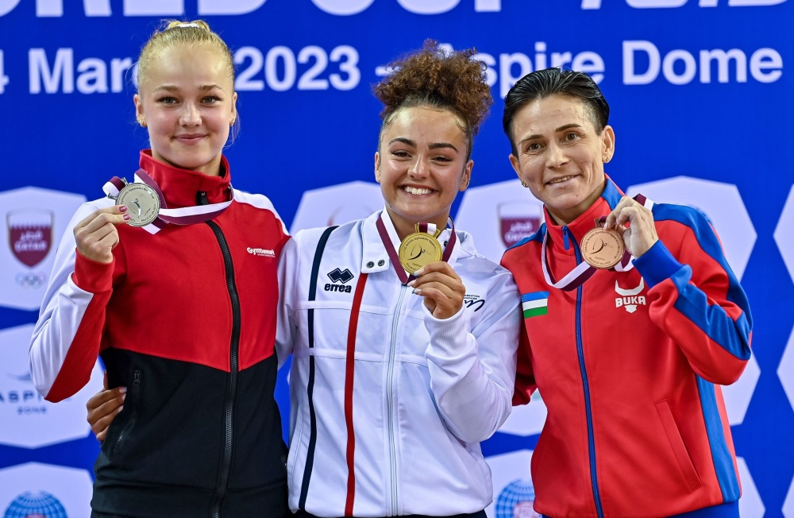
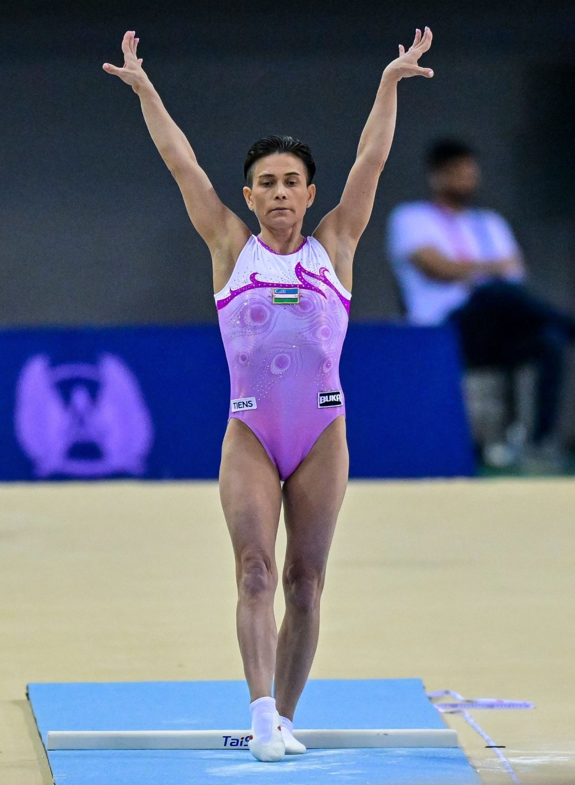
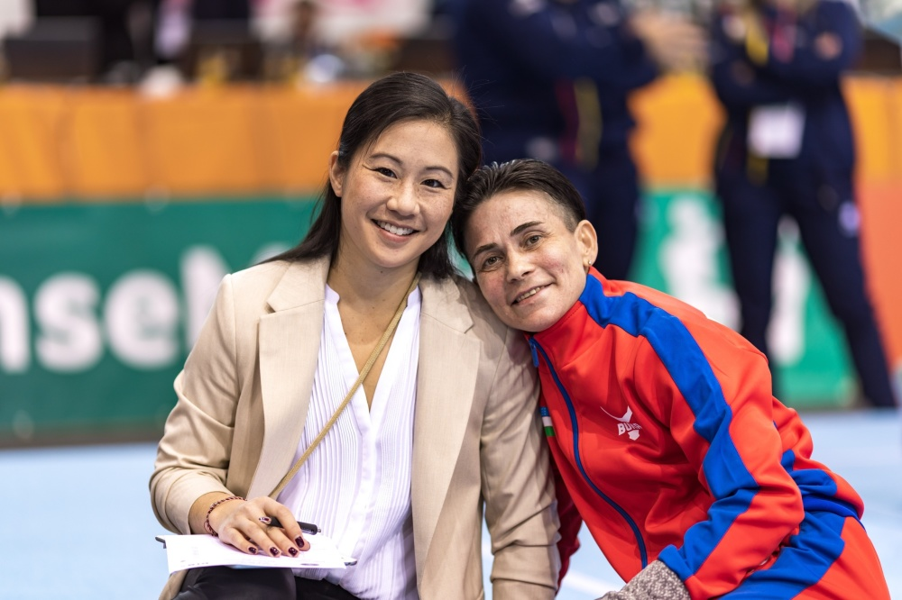

# 47岁丘索维金娜又拿奖牌了：感谢所有人，未来还有更多

_丘索维金娜（右一）。_

3月12日，2023年体操世界杯巴库站落下帷幕，中国队选手邱祺缘摘得高低杠金牌，虞琳敏则收获了跳马项目铜牌。

不过在获奖者名单中，还有一个令体操观众无比熟悉的名字，那就是老将丘索维金娜。

**这位来自乌兹别克斯坦的47岁老将再一次站上领奖台，夺得跳马银牌。**

今年六月，丘索维金娜就要年满48岁，但在赛场上她依然能量充足，这已经是她连续三站世界杯比赛收获前三。

此前在世界杯科特布斯站与多哈站，她连续收获跳马铜牌，延续自己宝刀未老的本色，也让外界对她的杭州亚运会前景有了更多的期待。

_丘索维金娜在比赛中。_

纵观职业生涯，丘索维金娜的故事堪称传奇。早在1992年巴塞罗那奥运会，年仅17岁的丘索维金娜就代表独联体获得过女子体操团体金牌。随后，她又连续两次获得体操世锦赛的奖牌。

后来她遭遇了人生中的重大挫折——儿子阿廖沙患上了白血病，为了挣钱给孩子治病，她开始逼着自己参加尽量多的比赛，争取尽量多的奖金，“为了阿廖沙我必须挣钱。”

在困难时刻，德国体操界伸出了援手，不仅为阿廖沙筹钱治病，也帮助丘索维金娜重新恢复体操训练。

她在2006年加入德国国籍，代表德国队参加了2008年和2012年的奥运会。在北京奥运会上，她凭借以自己命名的“丘索维金娜跳”摘得银牌，这也是德国62年来首枚体操奥运银牌。

北京奥运会后好消息传来，阿廖沙的疾病经过治疗康复，丘索维金娜终于可以再次单纯为了热爱而比赛，

**“当我儿子生病时，我只能靠比赛赚钱为儿子治病。但现在，我终于可以把比赛当成一种享受并获得巨大快乐。我现在为自己而比赛。”**

2012年奥运会后，丘索维金娜曾一度宣布退役，但很快就收回了这个决定——2013年她申请转回祖国乌兹别克斯坦国籍，随后的里约和东京两届奥运会，她代表乌兹别克斯坦出战。

_丘索维金娜还准备继续征战。_

东京奥运会期间，她又一次表示这会是自己的告别之战，但经过一段时间的考虑，她再度宣布自己还要继续，目标就是杭州亚运会。

**“我还没能为祖国乌兹别克斯坦拿到一枚（重要赛事的）奖牌，我不能就这样结束我的体操生涯。”**

在体操项目，从来不乏十几岁就崭露头角甚至统治赛场的小将，在她们中间，年近五旬的丘索维金娜无疑是一个令人瞩目的存在。

支撑她一路走到今天的，就是心底对于体操那份真正的热爱，如今她也用连续三战世界杯夺牌的表现证明，身经百战的老将，从来不能让人小觑。

**根据丘索维金娜自己的说法，她已经决定在杭州亚运会后，再继续备战巴黎奥运会。如果这一目标能够成真，届时她将已是49岁高龄，并同时创造参加9届奥运会的神话。**

她曾说，“虽然不知道自己有多大潜能，我只是单纯热爱这项运动。我喜欢给观众带来快乐，我也享受我在场上的每一次表演。”

“有这么多人支持着我，这让我流下了喜悦的泪水，但想要真正做好准备退役，对我来说似乎是不可能的事情。”她在东京奥运会之后表示。

而在不久前世界杯科特布斯站摘铜之后，她再一次展露了自己对于未来的期待，

**“感谢所有人，未来还会有更多。”**

