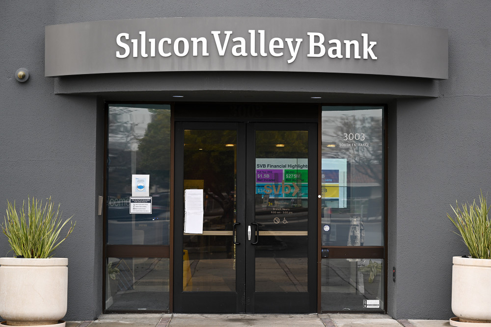
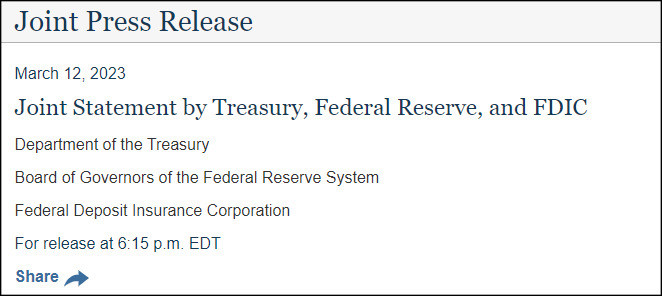

# 三天内两家美国银行被关闭，拜登发声：美国人和美国企业可以放心

（观察者网讯）继美国硅谷银行在3月10日宣布破产之后，美国监管机构又在12日以“系统性风险”为由关闭了签名银行（Signature
Bank）。三天内两家银行倒闭的危机之下，美国财政官员不得不紧急采取措施稳定局势，总统拜登也开始发声提振美国人的信心。

据美国有线电视新闻网（CNN）3月13日报道，拜登在当地时间12日晚间发表声明说，他已指示财政部长和国家经济委员会主任与金融监管机构合作，确保硅谷银行和签名银行的储户可以获得所有存款。他同时承诺，会让有关责任方承担相应的责任。

拜登还预告，将在美国东部时间13日上午针对此次银行危机发表讲话：“明天早上，我将发表关于如何维持一个有弹性银行体系的讲话，以保护我们历史性的经济复苏。”

_CNN报道截图_

“我很高兴他们迅速达成了一项解决方案，保护美国工人和小企业，并保证了我们金融体系的安全。这个解决方案还确保纳税人的钱不会受到威胁。”拜登在12日晚间的声明中说，“美国人和美国企业可以放心，他们的银行存款会在需要的时候出现。”

拜登表示，他将致力于让那些应该对这场混乱负责的人承担全部责任，并继续努力加强对美国大型银行的监督和监管，以免再次陷入类似的困境。

3月10日，美国加利福尼亚州金融保护与创新部门以“流动性不足和资不抵债”为由，宣布关闭硅谷银行。该行是美国第十八大银行，资产规模达到2090亿美元，主要为风投初创企业提供服务。这是2008年金融危机以后美国规模最大的银行倒闭案。

_美国硅谷银行 图自IC photo_

仅仅两天之后，美国财政部、美国联邦储备委员会和美国联邦储蓄保险公司（FDIC）在当地时间3月12日发布联合声明，又以“系统性风险”的理由关闭签名银行（Signature
Bank）。该行主要经营加密货币业务，在全美排名第29位，资产规模约1104亿美元。

_美国纽约市的一家签名银行支行 图自IC
photo_

三天内两家银行倒闭的消息震动整个美国金融行业，硅谷银行的倒闭更是令美国科技行业遭遇巨大的风险。FDIC为每名储户25万美元的存款提供保险，但硅谷银行作为大量初创企业的主要账户甚至唯一银行账户，绝大部分存款金额远超25万，因此并不受全额保护。

监管文件显示，硅谷银行在2022年底约有93%的存款不受存款保险保护。如果硅谷银行的存款无法恢复存取自由，将资金存放在该银行的科技公司将面临发不出工资的困境。

为应对危机，美国财政部、美联储和FDIC在12日的联合声明中表示，美国金融监管机构承诺保障储户的储蓄安全，FDIC将确保硅谷银行客户可以从当地时间13日开始支取所有资金，签名银行的存款人也将得到全额补偿。

声明强调，美联储将为符合条件的金融机构提供额外资金，以防止银行出现挤兑。美国纳税人无需承担与硅谷银行破产有关的损失，但股东和无担保债券持有人不会得到监管机构保护。

_美国财政部、美联储和FDIC联合声明截图_

美国财政部长耶伦在12日早些时候接受美国哥伦比亚广播公司（CBS）采访时则表示，她正与美国金融监管机构研究合适的政策，但拒绝提供具体细节。她仅透露，FDIC在考虑稳定局势的举措，其中可能包括让外国银行收购硅谷银行。

不过，美国政府似乎无意对硅谷银行本身提供救助。耶伦说：“在金融危机期间，系统性大银行的投资者和所有者得到了救助。然而已经实施的改革意味着，我们不会再这样做了。但我们关注储户，并将专注于努力满足他们的需求。”

但美国政府的紧急应对措施也引发了新的担忧。CNN指出，这一举措事关大量资金和影响力，如果美国政府无法如期在当地时间13日向所有储户提供全部存款，可能会造成危机向整个银行业蔓延。如果小型科技企业拿不到钱来支付工资，可能引发大规模裁员浪潮。

此外，这场银行倒闭危机也引起美国政界的高度关注。CNN称，美国民主、共和两党领导人已经在当地时间12日晚间与财政部官员通电话。国会众议院议长、共和党人麦卡锡和参议院多数党领袖、民主党人舒默都对“经济系统性失败”的风险感到担忧。

尽管硅谷银行倒闭一度引发市场恐慌，但华尔街坚持认为，此次事件不太可能重演2008年金融危机期间席卷银行业的危机。白宫行政管理和预算办公室主任莎兰达·杨（Shalanda
Young）宣称，经过改革的美国银行体系“更具弹性”，“它的基础比金融危机之前更好。”

**本文系观察者网独家稿件，未经授权，不得转载。**

