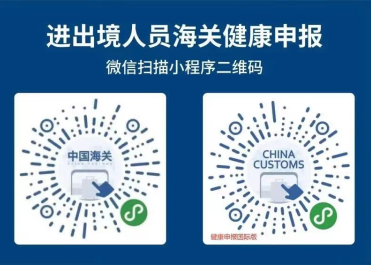

# 中国驻多国使馆通知：3月15日起，以抗原检测替代核酸检测

**关于自伊朗前往中国旅客疫情防控要求的通知**

根据新冠疫情形势发展和便利人员往来需要，自2023年3月15日起（当地时间），允许搭乘自伊朗来华直飞航班人员以抗原检测（包括用试剂盒自测）替代核酸检测。为便于旅客做好行前准备，驻伊朗使馆更新了《自伊朗前往中国旅客疫情防控指南》（附后），请认真阅读，遵照执行，以免影响行程。

自伊朗前往中国旅客疫情防控指南

一、远端检测：登机前48小时内进行核酸检测或自行使用抗原试剂盒进行检测。结果阴性者方可来华，结果阳性者请在转阴后来华。

二、海关申报：取得检测阴性结果后，通过微信小程序“海关旅客指尖服务”、掌上海关APP或网页版（https://htdecl.chinaport.gov.cn）填写《中华人民共和国出/入境健康声明卡》进行申报。

三、航空公司无需查验登机前核酸检测证明及抗原检测结果。

四、机上防疫：请在乘机过程中坚持佩戴口罩，做好个人防护，降低染疫风险。

五、入境检疫：抵达口岸后凭海关健康申报码完成必要通关手续。海关将按照一定比例进行抽样检测，并对健康申报异常或出现发热等症状人员进行检测。检测结果为阳性者，按照告知书要求进行居家、居所隔离或就医。结果为阴性者，由海关依惯例按照《国境卫生检疫法》等法律法规实施常规检疫。健康申报正常且口岸常规检疫无异常者，可进入社会面。

六、属地防疫：旅客入境后应严格遵守属地疫情防控各项要求。

中国驻伊朗大使馆

2023年3月13日

**关于自越南前往中国旅客疫情防控要求的通知**

根据新冠疫情形势发展和便利人员往来需要，自2023年3月15日起（越南时间），允许搭乘自越南赴华直飞航班人员以抗原检测（包括用试剂盒自测）替代核酸检测。为便于旅客做好行前准备，驻越南使领馆更新了《自越南前往中国旅客疫情防控指南》（附后），请认真阅读，遵照执行，以免影响行程。

自越南前往中国旅客疫情防控指南

一、远端检测：登机前48小时内进行核酸检测或自行使用抗原试剂盒进行检测，结果阴性者方可赴华，结果阳性者请在转阴后赴华。

二、海关申报：取得检测阴性结果后，通过微信小程序“海关旅客指尖服务”、掌上海关APP或网页版（https://htdecl.chinaport.gov.cn），
填写《中华人民共和国出/入境健康申明卡》进行申报。

三、航空公司无需查验登机前核酸检测证明及抗原检测结果。

四、机上防疫：请在乘机过程中坚持佩戴口罩，做好个人防护，降低染疫风险。

五、入境检疫：抵达口岸后凭海关健康申报码完成必要通关手续。海关将按照一定比例进行抽样检测，并对健康申报异常或出现发热等症状人员进行检测。检测结果为阳性者，按照告知书要求进行居家、居所隔离或就医。结果为阴性者，由海关依惯例按照《国境卫生检疫法》等法律法规实施常规检疫。健康申报正常且口岸常规检疫无异常者，可进入社会面。

六、属地防疫：旅客入境后应严格遵守属地疫情防控各项要求。

越南报警电话：0084-113；

越南急救电话：0084-115；

**关于自蒙古国前往中国旅客疫情防控要求的通知**

根据新冠疫情形势发展和便利人员往来需要，自2023年3月15日起（当地时间），允许搭乘自蒙古国来华直飞航班人员以抗原检测（包括用试剂盒自测）替代核酸检测。为便于旅客做好行前准备，驻蒙古使馆更新了《自蒙古国前往中国旅客疫情防控指南》（附后），请认真阅读，遵照执行，以免影响行程。

**关于自尼泊尔前往中国旅客疫情防控要求的通知（2023年3月15日起实施）**

根据新冠疫情形势发展和便利人员往来需要，自2023年3月15日起（当地时间），允许搭乘自尼泊尔来华直飞航班人员以抗原检测（包括用试剂盒自测）替代核酸检测。为便于旅客做好行前准备，驻尼泊尔使馆更新了《自尼泊尔前往中国旅客疫情防控指南》(附后)，请认真阅读，遵照执行，以免影响行程。

中国驻尼泊尔使馆

2023年3月13日

自尼泊尔前往中国旅客疫情防控指南

一、远端检测：登机前48小时内进行核酸检测或自行使用抗原试剂盒进行检测，结果阴性者方可赴华，结果阳性者请在转阴后赴华。

二、海关申报：取得检测阴性结果后，通过微信小程序“海关旅客指尖服务”、掌上海关APP或网页版(https://htdecl.chinaport.gov.cn）填写《中华人民共和国出/入境健康申明卡》进行申报。

三、航空公司无需查验登机前核酸检测阴性证明及抗原检测结果。

四、机上防疫：请在乘机过程中坚持佩戴口罩，做好个人防护，降低染疫风险。

五、入境检疫：抵达口岸后凭海关健康申报码完成必要通关手续。海关将按照一定比例进行抽样检测，并对健康申报异常或出现发热等症状人员进行检测。检测结果为阳性者，按照告知书要求进行居家、居所隔离或就医。结果为阴性者，由海关依惯例按照《国境卫生检疫法》等法律法规实施常规检疫。健康申报正常且口岸常规检疫无异常者，可进入社会面。

六、属地防疫：旅客入境后应严格遵守属地疫情防控各项要求。

**关于自坦桑尼亚前往中国旅客疫情防控要求的通知**

根据新冠疫情形势发展和便利人员往来需要，自2023年3月15日起（当地时间），允许搭乘自坦桑尼亚赴华直飞航班人员以抗原检测（包括用试剂盒自测）替代核酸检测。为便于旅客做好行前准备，驻坦桑尼亚使馆更新了《自坦桑尼亚前往中国旅客疫情防控指南》（附后），请认真阅读，遵照执行，以免影响行程。

自坦桑尼亚前往中国旅客疫情防控指南

一、远端检测：登机前48小时内进行核酸检测或自行使用抗原试剂盒进行检测，结果阴性者方可赴华，结果阳性者请在转阴后赴华。

二、海关申报：取得检测阴性结果后，通过微信小程序“海关旅客指尖服务”、掌上海关APP或网页版(https://htdecl.chinaport.gov.cn）填写《中华人民共和国出/入境健康申明卡》进行申报。

三、航空公司无需查验登机前核酸检测阴性证明及抗原检测结果。

四、机上防疫：请在乘机过程中坚持佩戴口罩，做好个人防护，降低染疫风险。

五、入境检疫：抵达口岸后凭海关健康申报码完成必要通关手续。海关将按照一定比例进行抽样检测，并对健康申报异常或出现发热等症状人员进行检测。检测结果为阳性者，按照告知书要求进行居家、居所隔离或就医。结果为阴性者，由海关依惯例按照《国境卫生检疫法》等法律法规实施常规检疫。健康申报正常且口岸常规检疫无异常者，可进入社会面。

六、属地防疫：旅客入境后应严格遵守属地疫情防控各项要求。

来源：环球网综合

