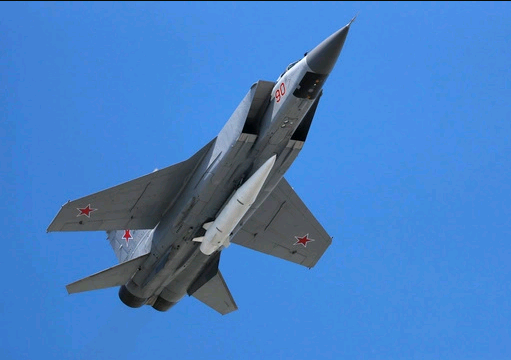
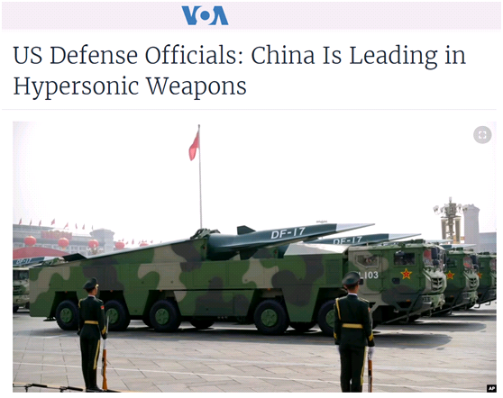

# 俄发动最大规模高超导弹袭击后，美军依然盯着中国

俄军于3月9日对乌克兰全境再次发动大规模空袭，其中首次发射了6枚“匕首”高超音速导弹，这被美国媒体称为“史无前例”的最大规模高超音速导弹袭击，“乌军无法拦截”。可就是在这样的情况下，美国军方情报部门的高级官员10日在国会接受质询时仍鼓吹称，“中国才拥有最先进的高超音速导弹”。

美联社称，俄军在9日的大规模空袭中动用了80多枚导弹，试图摧毁乌克兰的防空系统和后方基础设施。这是近几个月以来最大规模的导弹袭击，俄军极其罕见地动用了6枚“匕首”空射高超音速导弹，“它们是俄军武器库中最先进的型号”。乌克兰方面表示，乌军成功击落了34枚俄军导弹，但仍无法对付“匕首”高超音速导弹和老式Kh-22空射巡航导弹。

报道称，俄罗斯军方表示，“匕首”空射弹道导弹的射程可达2000公里，最大飞行速度是音速的10倍，很难拦截。凭借高超音速的飞行速度和重型弹头，使得它能摧毁高度设防的目标，如地下掩体或山区隧道等。尽管此前俄军已经在俄乌冲突中使用“匕首”导弹，但9日是俄军最大规模的发射该导弹。“俄军谨慎地使用这种昂贵的武器，并针对优先目标，显然反映了‘匕首’的装备数量很少。”报道还引用消息人士的话称，对于俄军导弹袭击的确切目标以及由此造成的损失，外界仍不清楚，因为乌克兰当局对此类信息严格保密，以避免给俄罗斯未来袭击计划提供线索。

不过“美国之音”网站10日注意到，就是在俄军反复出动“匕首”高超音速导弹参战、并引起了西方极大关注的情况下，美国国防官员仍警告说，“中国拥有世界领先的高超音速武器库”。

报道称，美国国防情报局负责科学技术的首席科学家保罗·弗雷斯特勒10日在对众议院军事委员会接受质询时表示：“尽管中国和俄罗斯都进行了多次成功的高超音速武器试验，并可能部署了作战系统，但中国在基础设施和支持系统的数量方面都领先俄罗斯。”“在过去的二十年中，中国通过集中投入、开发、测试和部署，极大地推进了可携带常规弹头和核武器的高超音速导弹技术发展。”

根据美国国防情报局和美国国会研究局的说法，中国拥有两个高超音速武器研究基地，至少有21个风洞，其中“部分风洞可以测试飞行速度高达12马赫的飞行器”。这成为中国在高超音速武器领域领先的重要原因。该报道称，中国的高超音速武器库包括“东风-17”，这是一种采用高超音速滑翔飞行器技术的中程弹道导弹，射程可达1600公里。“中国‘东风-41’洲际导弹也可以搭载高超音速滑翔飞行器。在2021年7月的一次系统测试中，中国发射的高超音速武器环绕全球飞行，促使美国国防部高级官员将该事件与20世纪50年代最初的太空竞赛进行比较。”

当然，针对西方舆论炒作中国进行高超音速“导弹”试验，时任中国外交部发言人赵立坚早就明确表示，此次试验是一次例行的航天器试验，用于验证航天器可重复使用技术，这对于降低航天器使用成本具有重要意义，可为人类和平利用太空提供便捷廉价的往返方式。世界上有多家公司都开展了类似试验。

就连美媒也觉得，在俄军反复动用高超音速导弹打击乌克兰的紧迫情况下，美军仍盯着中国不放的做法有些奇怪。老司机想说，美军乃至美国部分人士，近年来为了各自目的而将所有注意力都集中在中国身上，言必谈“中国威胁”，恐怕他们已经患上了强迫症，该去吃药了。

