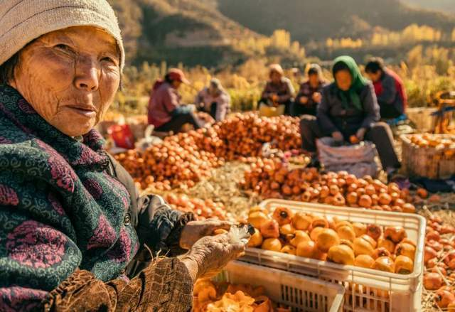

# 城乡养老金水平差异明显，如何破局？

“比如在我们辉县市的农村，60岁以上老人养老金每月180元左右，而城镇居民养老金每月在2000元左右，差别是相当大的。”全国人大代表、河南省辉县市张村乡裴寨村党支部书记裴春亮“建议实行城乡无差别养老”引发广泛关注。

今年的两会，裴春亮提议，实行城乡无差别化养老政策，大力弘扬孝道文化，并健全社会敬老公益机制。他告诉中国新闻周刊，之所以提这样的建议，是因为国家已经逐渐步入老龄化社会，两会前的调研中发现，晚年康养已经成为城市和农村共同面临的社会问题。

他提到，相对大城市的老人大都有退休金，小城市尤其是农村来说，很少有老人有退休金，大多数都是六七十岁了还在干活，仅靠现在国家给的养老金一百多块钱是根本不够生活的。他认为，就目前生活水平而言，农村老人每人每月补助800元左右就能保障他们的基本生活。

事实上，有关农村养老金的问题一直以来就备受关注。三农专家、中国人民大学农业与农村发展学院教授郑风田，此前就曾建议给年满70岁的农民，每月发放五六百元退休金，以满足老年农民最基本的需求。

_河北太行山晒秋场面。图/图虫创意_

**差距何来**

180元和2000元，这是裴春亮所在的辉县市60岁以上的农村老人与城镇居民每月分别能领取到的养老金大概数目。在全国两会前的调研中，裴春亮察觉到，这一城乡差别映照到独生子女家庭和失独老人的晚年康养上时，问题尤为突出。

他认为，伴随时代发展及国家逐步步入老龄化社会，独生子女在外工作生活压力大，少有时间陪伴老人，失独（指独生子女亡故）老人则更是面临康养的经济难题。

作为张村乡裴寨村党支部书记，他对农村老人养老状况十分了解。裴春亮说，农村老人，70岁以下的老人绝大多数还在种地干活，还有的打零工贴补收入不高的子女。

南开大学中国财富经济研究院院长陈宗胜，是收入分配领域的研究专家。他向中国新闻周刊表示，其实有的地方还没有达到裴春亮代表所说的180元每月，“农村情况千差万别，实际上差距还要更大”。

据了解，2009年国家建立了新农村养老保险制度（简称新农保），2014年并入到了城乡居民养老保险制度，包括广大农村农民在内的城乡居民养老金待遇，主要包括基础养老金和个人账户养老金两部分。

其中，基础养老金部分由中央和地方财政补贴。目前，全国基础养老金的最低标准是98元每月，各个地方可以根据当地的经济发展水平和财政负担能力提高标准，目前全国普遍在100元到200元之间。

郑风田对中国新闻周刊说，全国来讲，北京、上海等地区“是比较高的”，北京农民60岁以后能拿到850元的养老金，上海的是1250元，浙江、江苏两省是250元左右，部分中西部省份基本上是130元左右。“辉县市的农村60岁以上⽼⼈每⽉能领到180元左右养老金，比很多地区还高一点。”他说。

河北省张家口市农村一位67岁的老人告诉中国新闻周刊，他目前每月可以领到130元左右的养老金，比以前有所提高。此前，他一直在外地打工，但随着年龄的增加，现在“外出打工很多地方都已经不要了”，种地收入也比较微薄，而且也越来越力有不逮。

谈到每月130元左右的养老金，他表示感谢国家的好政策。但他也提到，这个数额的养老金，并不足以支撑他的日常生活，不过“有总比没有强”。

值得一提的是，农民能够领取到的养老金数额，除了国家和地方政府补贴的基础养老金之外，更取决于其个人账户部分缴纳数额的多少。这一部分需要农民自主缴纳，多缴多得。目前城乡居民养老金的差距，主要体现在这一部分。

城镇职工缴纳养老保险，费用一般由单位和个人共同承担，直接划入个人养老金账户。而农村养老金个人账户部分则需要个人自主缴纳。郑风田说，由于农民普遍收入水平不高，很多人自主缴纳的意愿并不强烈，尤其是超过60岁或者接近60岁的人群。

“让他们拿出一笔钱缴纳养老保险，他们觉得‘并不上算’。”郑风田说，在他们看来，现在交到时候再返还，还不如放在自己手上。他说，“城里人如果社保让个人去交，不是直接划转，估计很多人也不会交。”

基于此，农村不少60岁以上的老人，目前能够领取到的只是最低标准的养老金。前述领取130元左右养老金的老人，即属于此类。据他介绍，他所在的村庄类似的情况普遍存在。

**如何破局？**

事实上，城乡居民基础养老金近年来在不断上调。但由于各地经济发展水平和财政负担能力不同，养老金水平也差异明显。

郑风田提到，一般经济越发达的地区，地方财政收入高，基础养老金基数高，也上涨得快。而财政收入有限的中西部地区，基础养老金多维持在100元～200元左右。

近期，多地公布城乡基础养老金上调方案，比如河南提出，自2023年1月1日起，将基础养老金最低标准从每人每月113元，提高至每人每月123元；贵州将基础养老金最低标准，提高到每人每月128元；河北则由每人每月123元提高到133元，增长8.13%。

而随着老龄化的到来，农村老人养老金过低，养老难的问题，也引发越来越多的关注。

去年全国两会期间，全国政协委员、央视主持人白岩松就曾建议探索农村新模式，逐步提高农村养老金。

他说，农村养老需探索新模式。比如山东淄博在推行一种模式，把75岁以上的农村老人送到企业盖的养老院里养老，相对应的企业把农民的土地集中进行耕种，土地不撂荒，企业也能获取一定的收益，政府作为监督，形成一个良性循环。

另外，白岩松也提到，还需要探索是否以国家的方式提高农村老年人养老金水平。“这笔数额不小，但也应该有逐步提升的可能。”他说。

今年两会期间，全国政协委员、财政部管理会计咨询专家张连起接受中新社采访时表示，建议适当提高农村社会保障水平，完善待遇确定和基础养老金正常调整机制。

“当前城乡居民养老保险制度待遇水平低，不同地区之间特别是与职工养老保险之间发展不平衡。”张连起说，“我国农民为加快中国式现代化的历史进程做出了巨大贡献。新时代乡村振兴，我们有条件、有能力、更应当有历史主动，反哺农业农村农民。”

受访专家普遍认为，应该提高农村老人养老金，改善农村老人养老状况。

郑风田提到，“如果农村老人养老金能达到每个月，比如60岁以上老人能够有300元，到70岁能够有500元，80岁能够有800元，中国农民的幸福指数一定会大幅度地提升。”

根据他的估算，目前农村60岁以上的老人有1.3亿人左右，如果将基础养老金从130元左右提升到300元左右，每年的资金缺口约在一千多亿不到两千亿，“其实数额并不是很大”。

陈宗胜认为，如果真正要农村老人体会到养老保障的话，养老金至少要达到城市的一半。“假定城市是2000元的话，农村至少要达到1000元。”他说，加上农村的土地收益等，老人的养老保障就会相对充分些。

张连起建议，适当加大基础养老金中央财政分担比例，缩小地区间差距；调整优化各级财政对职工、居民养老保险补贴比例；统筹考虑提高城乡居民基础养老金最低标准的幅度和频率，逐步缩小职工与居民基本养老保险筹资与保障待遇差距，实质性缩小城乡居民在享受社会保障服务方面的差距。

他还提到，当前要把提高农村老人基础养老金水平作为改革的突破口，加快推动基础养老金全国统筹；动态提高城乡居民养老保险待遇和基础养老金水平，力争养老金增幅不低于农村居民人均可支配收入增幅和综合物价指数。

值得一提的是，国家“十四五”规划明确提出，逐步提高城乡居民基础养老金标准。对此，人社部农村社会保险司司长刘从龙表示，未来将从提高基础养老金和个人账户养老金两方面共同着力，提高城乡居民保障水平。

受访专家认为，目前实行城乡无差别养老条件可能尚未完全具备，但城乡养老金的问题应当进一步得到解决。陈宗胜说，现在一步到位也不可能，但适度提升农村老人的养老金，逐步缩小城乡差距，“是完全有可能的”，步子需要迈得更大、更快。

作者：孙晓波

