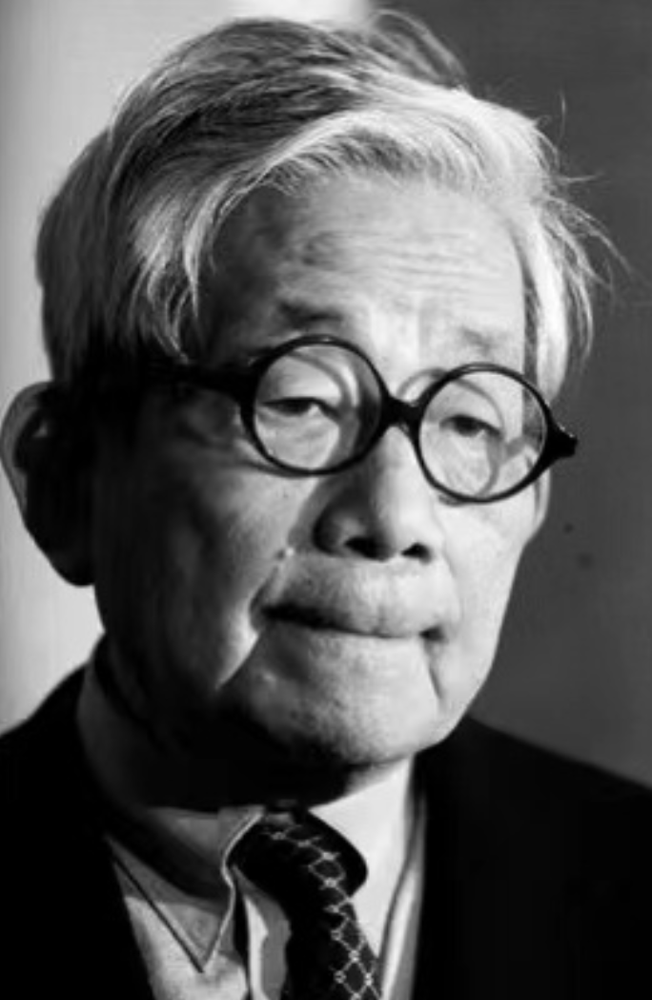

# 日本作家、诺贝尔文学奖得主大江健三郎去世，曾称一生都在思考鲁迅

3月13日，日本著名作家、诺贝尔文学奖获得者大江健三郎去世的消息传出。南都记者获悉，他于3月3日因衰老去世，终年88岁。大江健三郎的写作以先锋气质、人文色彩等，在日本文坛独树一帜。他曾多次谈及中国作家鲁迅对自己的影响，而他的写作对中国当代作家也影响颇深。

_大江健三郎。_

1935年，大江健三郎出生于日本爱媛县，童年时代经历了日本投降、美军对日本的军事占领等历史事件，为他后来反思侵略战争、用文学写作来关注政治问题及人类命运等主题，打下了深刻的烙印。1954年，他考入东京大学，两年后转入文学部法国文学专业，大学期间已在从事文学创作。有文学研究者指出，他的写作深受萨特存在主义的影响，又兼具日本文学的色彩，呈现出“和洋合璧”的特征。

1958年，他的短篇小说《饲育》发表于《文学界》，获得日本芥川文学奖，他以职业作家的身份正式登上日本文坛。此后，《个人的体验》《性的人》均获新潮文学奖，长篇三部曲《燃烧的绿树》获意大利蒙特罗文学奖。1994年，大江健三郎获得诺贝尔文学奖，成为继1968年川端康成获奖之后，第二位获得该奖项的日本作家。

大江健三郎的写作时常关注当代人的心灵之困，体现出深刻的人文关怀。他曾多次谈及中国作家鲁迅对自己的影响，“十二岁时第一次阅读的鲁迅小说中有关希望的话语，在将近六十年的时间内，一直存活于我的身体之中。”母亲寄望他写出像鲁迅《故乡》那样的文学作品，而他回应说：“我一生都在思考鲁迅。”

作为日本当代重要作家之一，大江健三郎的诸多作品都被译入中文，如小说《性的人》《空翻》，散文集《广岛札记》等，对中国当代作家影响颇深。中国作协主席铁凝曾在散文随笔集《隐匿的大师》中记录与大江健三郎的交往，谈到这位前辈作家对自己的鼓励。大江健三郎还曾向她断言，“在未来30年之内，中国文学将会在世界文学中占据一个中心位置。”

传记与随笔作家止庵评述道，与谷崎润一郎、川端康成、三岛由纪夫截然不同，大江健三郎所写的不是“日本的世界”，而是“世界的日本”。他的小说中，人物的心理、感受、思考，都是“世界性的”而不是“日本性的”。相对于前三者而言，“大江写的也许确实才是真实的。”

采写：南都记者 侯婧婧

