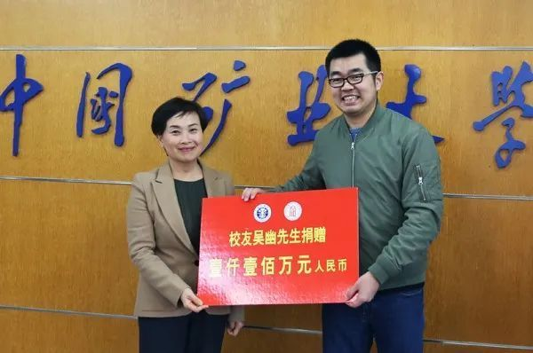
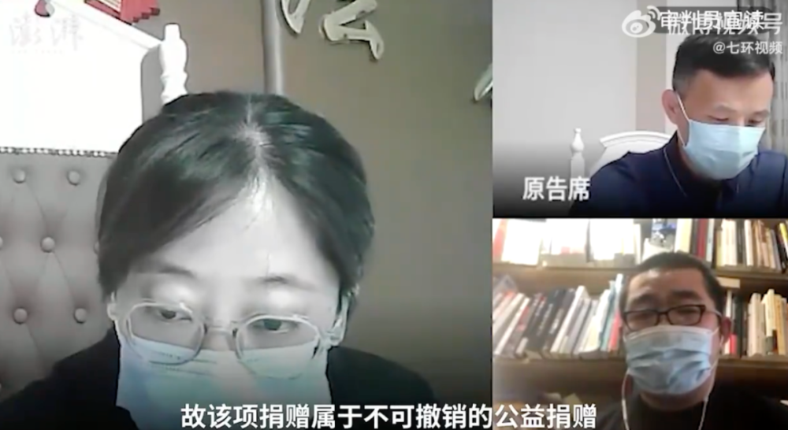

# 校友未兑现1100万捐赠被母校起诉，专家：诺而不捐危害慈善事业

近日，中国矿业大学“90后”校友吴幽因未履行1100万元捐款承诺，被母校教育发展基金会告上法庭，成为失信被执行人，被限制高消费，此事经媒体报道后，引发社会广泛关注。

上海复恩社会组织法律研究与服务中心创始人、理事长陆璇认为，无论如何，吴幽如果享受了公益捐赠给他带来的良好声誉，却没有履行捐赠承诺或义务，那就是“不诚信”的行为，言行不一可以被视作“诺而不捐”。中国矿业大学据此维护自身合法权益的行为值得称赞。

**传奇学生的最昂贵“捐赠”**

吴幽被母校告上法庭，缘起于中国矿业大学成立110年之际双方签订的一份捐赠协议。

2019年4月10日，中国矿业大学在110周年校庆之际，公开宣布其2008级校友吴幽捐赠1100万元人民币，支持学校事业发展。中国矿业大学与吴幽签署了捐赠协议，并为吴幽颁发了“中国矿业大学特别校务参事”及“中国矿业大学创新创业导师”聘书。此外，还为肄业的他赠送了大学档案材料。

据悉，这是当时中国矿业大学收到的最大单笔捐赠。捐赠将用于学校“双一流”建设和人才培养，并在学校基金会设立高端人才计划基金、家庭经济困难本科生海外实习基金、名人名师讲座基金和创新创业基金。而凭借千万级捐赠，吴幽也作为当年唯一一名“90后”登上了北师大中国公益研究院、国际公益学院发布的《中国捐赠百杰榜（2019）》，并列90位。

接受媒体采访时， **吴幽曾解释过决定捐献1100万元这个数额的理由，“母校建校110周年，110万太少，1.1亿超出了我的能力范围，1100万正好。”**

在庭审中，吴幽则讲述了捐赠的前因后果。他称自己主动提出为学校做贡献，没有任何人逼迫，也不求任何回报。“我是地道的徐州人，2008年升入大学，2009年经历了百年校庆，很受鼓舞，对母校充满了情感”。他在学校原本不知名，只是在一个偶然的机会跟校领导认识后，正好赶上了学校110周年校庆，“就想捐钱表达心意”。

吴幽对母校的捐赠事迹很快传播开去，也成为他此后接受媒体采访时的重要话题。“5岁开始学相声，16岁进入国家冰球青年队，18岁考入中国矿业大学，大二辍学创业，24岁成立镜湖资本，29岁给母校捐赠1100万。”有媒体如此勾勒出他的“传奇”人生。中国矿业大学官网对吴幽的介绍也称其为镜湖资本创始合伙人、管理46亿元基金。

_2019年4月，中国矿大110周年校庆，校友吴幽（右）表示捐款1100万元。_

学校官网在对他的专访中还提到，在大学第一学期，吴幽的7门课程中除了体育课，其他全部挂科，高数只得了4分。但吴幽显露出对创业浓厚的兴趣，在校期间卖过衣服、收音机，一年零四个月的大学生涯中，他做生意赚了七八十万元。

吴幽说，大学里他最爱去的地方有两个，一是图书馆，大学里他每年都看200多本书，还买来很多书报杂志阅读。另一个是镜湖大讲堂，他经常到镜湖大讲堂听名家大咖的讲座。这也是“镜湖资本”的由来。吴幽大二时辍学创业，“镜湖资本”创始合伙人成为吴幽此后重要的身份标签。

然而，针对“镜湖资本”这一名称，深圳市镜湖投资咨询有限公司曾发布声明，该公司称：公司无吴姓创始人、无吴姓合伙人及高管、股东。根据调查及中国证券投资基金业协会信息披露，“截至目前在中国证券投资基金业协会登记的以‘镜湖’命名的私募基金管理人有且仅有一家，即我司旗下的南京镜湖基金管理有限公司。该吴姓人士与我司无任何关联。”

按照规定，境内注册设立的私募基金管理机构，都应当向中国证券投资基金协会履行私募基金管理人登记手续，否则就不算是一个合规的私募基金管理人。而据天眼查信息显示，吴幽目前共在8家企业任职，其中4家为存续状态，包括北京镜湖管理咨询有限公司、新余镜湖和昌投资管理有限公司、深圳前海宠米科技有限公司和北京镜湖方略科技有限公司。
**吴幽担任北京镜湖管理咨询有限公司和北京镜湖方略科技有限公司的法人，两家公司均成立于2016年，但截至目前，实缴资本都为0。**

**学校把学生告了**

因1100万捐赠未兑现，中国矿业大学教育发展基金会以一纸诉状将吴幽告上了法庭。2022年8月9日上午，徐州市铜山区人民法院公开直播审理了中国矿业大学教育发展基金会与吴幽赠与合同纠纷一案。

吴幽在庭审中称，做出捐赠承诺后，整个经济大环境和他本人管理的基金都遇到了很多困难，包括几个重要的出资人面临暴雷的情况。
**“暂时是有困难，我资金压力很大，需要时间来履行。承诺捐赠这件事会跟着我一辈子，我没有一分一秒想过不捐这个钱，当时要捐是心态比较乐观。”吴幽说。**

校方律师则在法庭陈述中表示，虽然吴幽说自己遇到了一定的经济困难，但以其目前事业发展状态、管理基金的规模，事实上具备履约能力。学校如果不对这种拒不实际履约的行为采取维权行动，是对不诚信行为的放纵，同时也无法就合同履行行为向上级教育主管部门予以交代，在这种情况下，学校是迫不得已才提起了本次诉讼。希望吴幽能够言而有信，积极履约，防止以捐赠名义在获得了公众好评后，反而消费了公众信任，破坏了社会风气。

吴幽则否认自己有履行能力，并在庭审中解释称投资行业需要卖掉项目才能回笼资金。“我的公司运营正常，没有破产，但我没有现金，如果您觉得我有履行能力，可以和校方查我任何账户。”吴幽说，他希望能和校方协商一个折中方案，用他管理的一个江西的2亿规模基金的长期收益完成捐赠，但学校只要现金。

_徐州市铜山区人民法院公布的在线庭审画面。_

据中国执行信息公开网披露的调解协议，吴幽应于2022年10月20日前给付中国矿业大学教育发展基金会200万元，余款900万元于2022年12月31日前付清。如吴幽有任何一期未按上述约定按期足额履行付款义务，校方有权就吴幽未支付的款项（包括到期未付和未到期的）申请法院执行。

2023年1月3日，吴幽被列为被执行人，执行标的1100万余元，由江苏省徐州市铜山区人民法院执行。2月21日，吴幽因有履行能力而拒不履行生效法律文书确定义务被列为失信被执行人。

湖北民本律师事务所律师石磊告诉《中国慈善家》，被执行人是否有能力履行而拒不履行，主要是看被执行人在现有资金的情况下，是否积极履行法院的判决文书，而不是以现有的资金与其应该履行义务之间所占比例的高低。认定被执行人有“拒不执行”行为，必须以被执行人有“履行能力”为前提条件，即使是有部分履行能力，也应属于有“履行能力”的范畴。

《中国慈善家》多次联系中国矿业大学宣传部与教育发展基金会多位相关人士，未得到回复。吴幽则称，“几天后回复”。

**对“诺而不捐”行为说不**

《中华人民共和国民法典》规定，赠与合同是一个双方法律行为。捐赠人愿意捐赠，受赠人接受捐赠，才构成捐赠合同关系。对一般的民事赠与合同，除非事先已做了合同公证，在赠与财产权利转移之前，赠与人是可以撤销赠与的。但《慈善法》同时规定，如捐赠财产用于“扶贫、济困”“扶老、救孤、恤病、助残、优抚”“救助自然灾害、事故灾难和公共卫生事件等突发事件造成的损害”这三类慈善活动，并签订书面捐赠协议的，捐赠人不得撤销捐赠。

“根据现在的相关信息，吴幽若已经通过媒体公开承诺捐赠，或者捐赠用于帮助贫困大学生，并且达成了书面协议，是不得撤销的。”上海复恩社会组织法律研究与服务中心创始人、理事长陆璇向《中国慈善家》分析说。

陆璇长期从事捐赠行为研究，在他看来，吴幽如果享受了公益捐赠给他带来的良好声誉，却没有履行捐赠承诺或义务，那就是“不诚信”的行为，可以被视作“诺而不捐”，本质上是他在对待捐赠这件事上“言行不一”。

“‘诺而不捐’会给慈善事业带来较大的危害。”陆璇表示，首先伤害的是身处困境的受益人，公益事业捐赠通常会涉及“扶贫、济困、扶老、救孤、恤病”这类具有基础性、紧迫性的慈善事业，捐赠人的随意反悔和不履行将会影响受益人的生活，也会让提前规划好的各项公益活动难以正常开展。“诺而不捐”更会损害大众对公益事业的信心，影响到慈善组织的公信力，从而对公益事业产生怀疑。

那么，对于诺而不捐的行为，受赠方有权诉诸法庭吗？《慈善法》第四十一条规定，捐赠人通过广播、电视、报刊、互联网等媒体公开承诺捐赠的，慈善组织或者其他接受捐赠的人可以要求交付；捐赠人拒不交付的，慈善组织和其他接受捐赠的人可以依法向人民法院申请支付令或者提起诉讼。

目前，本案已经达成生效的民事调解书，吴幽未按期支付捐赠款，已经被大学基金会申请法院强制执行，法院已将其列为失信被执行人，并限制消费。

陆璇认为，
**受捐人起诉捐赠者的情况并不常见，中国矿业大学教育基金会维护自身合法权益的行为值得称赞，对其它遭遇类似情况的基金会有一定借鉴意义，但在具体实践中，其它社会力量发起的基金会可能更加审慎地考虑诉讼对自己未来募集资金的影响。**

作者：尹鑫

图片来源：视觉中国

图片编辑：张旭

值班编辑：邱宇

