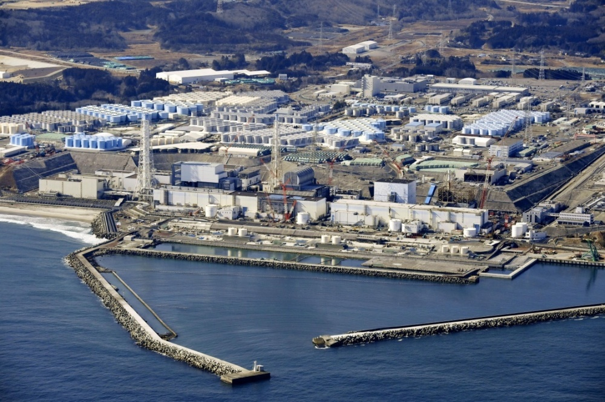
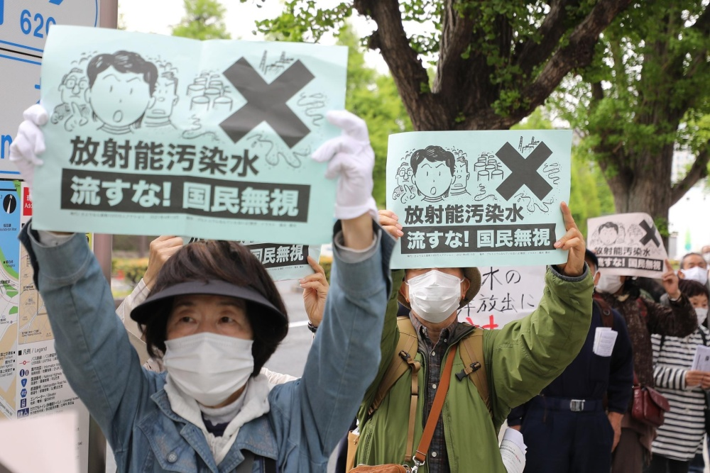

# 核污染水排海时间快到了，日本开始四处求“理解”

_▲2021年2月13日拍摄的日本福岛第一核电站和核污水储水罐。图/新华社_

据日本媒体3月12日报道，日本外务大臣林芳正计划于本月下旬访问所罗门群岛、库克群岛、基里巴斯三个太平洋岛国。这是日本外相首次访问这三个国家。

2月份以来，日本频频针对太平洋岛国展开外交动作。日本首相岸田文雄、外相林芳正已经先后与即将离任的密克罗尼西亚联邦总统帕努埃洛、库克群岛总理布朗、马绍尔群岛外交与贸易部长卡布阿举行会谈。

日本近来之所以这么急切地对太平洋岛国展开外交攻势，原因只有一个：日本拟定的核污染水排放入海的时间快到了。

_▲2021年4月13日，抗议者在日本东京的首相官邸外反对福岛核污水排入大海。图/新华社_

**日本将在春夏之际排放核污染水**

2011年日本“3·11”特大地震导致福岛第一核电站核堆芯熔毁，发生重大核泄漏事故，此后大量核污染水经简单处理后存放在高约10米的巨大储水罐里。这些储水罐的储存容量约为137万吨，而目前已储存了约132万吨，接近饱和。

储水罐迟早存储不下核污染水。所以，在2021年4月，日本政府从五种解决方案中挑选了最不负责任的一种方案，决定将这上百万吨核污染水稀释后排放入海，时间定在今年春季。

这一决定一出，就遭到了包括日本周边国家、太平洋岛国在内的众多国家和国际组织的强烈反对。但岸田文雄在前不久的内阁会议上决定，将核污染水排放入海的决定不会改变，时间是今年的“春夏之际”。

也就是说，从现在算起，大约在3个月内日本就会强行把核污染水排放入海。

日本政府和负责排水工程的东京电力公司声称，因为使用了一种叫“多核素去除设备”的过滤设备，所以能够过滤掉除氚以外的铯等62种放射性物质，而氚在一般的核废水里都有，所以不存在安全问题。

但日本媒体调查发现，东电的“多核素去除设备”经常破损，而且70%经过滤的核污染水仍达不到排放标准。至于排放入海后可能对太平洋产生的长期影响，更是缺乏相关研究论证。

_▲2021年4月14日，韩国民众在位于首尔的日本驻韩国大使馆外集会，抗议日本政府将福岛核废水排入大海。图/新华社_

**太平洋岛国本就是核灾难重灾区**

对于日本强推核污染水排海，太平洋岛国反应极其强烈。今年1月、2月，“太平洋岛国论坛”多次发出声明，表示日本此举是“打开了潘多拉的盒子”，要求日本以科学及数据来指导其核污染水排海的决定。

太平洋岛国之所以对日本排放核污染水入海屡屡发声，是因为太平洋岛国历史上就是核灾难重灾区。

1946年以来，太平洋岛国就是美英进行核试验的试验场。1946年至1958年，美国在马绍尔群岛进行了67次核试验。其中1954年3月1日实施的一次氢弹试验爆炸因当量预估失误，导致附近许多居民遭受急性辐射；1957年至1958年，英国在前殖民地基里巴斯进行了9次核试验。

美英等国还在这里倾倒过大量核废料。讽刺的是，如今一心想通过购买美国核潜艇获得核技术的澳大利亚，当年也曾是受害者。

基于这些惨痛历史记忆，早在1985年，“太平洋岛国论坛”就发起签订了《南太平洋无核区条约》，规定各缔约方不在该地区安放、试验任何核爆炸装置，也包括不倾倒放射性废料和其他放射性物质。

_▲2021年4月14日，国际原子能机构总干事格罗西在接受中国媒体采访时表示，日本向太平洋排放的核污染水不应对环境造成损害。图/新华社_

**说服南太岛国日本也只有两张牌**

今年以来，日本之所以加强了对太平洋岛国的外交攻势，就是为了减少核污染水排海的国际阻力。而因为实在没有什么说服力，所以日本有样学样，仿照美国打出了“价值观外交”和金援两张牌。

日本《读卖新闻》报道，林芳正访问所罗门群岛、库克群岛和基里巴斯期间，将试探各方是否愿意就“自由开放的印太构想”展开合作，这就是拉南太岛国加入印太战略。

日本还计划向南太岛国提供应对气候变化和基础设施建设方面的支持，也就是送钱。此外，据称日方还想扩大与南太岛国的防卫交流。

这是一套拉太平洋岛国站队的招数。但是，日本的这一算盘未必打得响。太平洋岛国对核灾难记忆犹新，就在去年，美澳还曾试图强行逼迫所罗门放弃与中国签署的相关协议，甚至发出军事威胁。除个别国家外，多数太平洋岛国对美澳日唱的红白脸也看在眼里。

可以说，日本近期针对太平洋岛国的外交动作，本质上都是想借大国博弈、地缘政治动荡之机，扯着“自由开放的印太构想”的大旗，卸掉2011年核灾的包袱。这个手法，与其想卸掉历史包袱的种种手法，其实并无二致。

撰稿 / 徐立凡（专栏作家）

编辑 / 何睿

校对 / 赵琳

