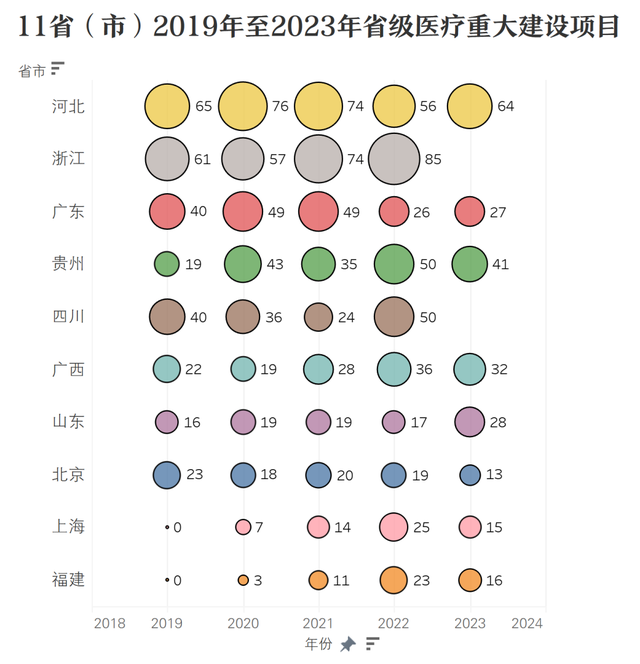
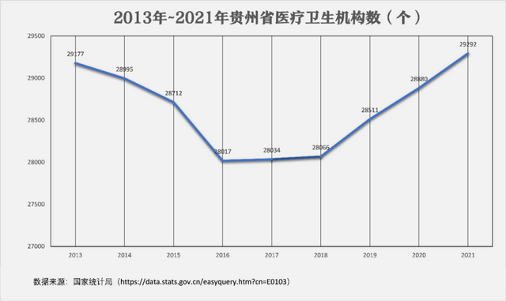
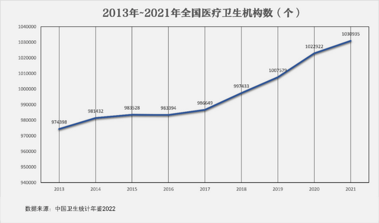

# 步履不停，今年“医院基建潮”依旧快马加鞭

河北的省级医疗基建项目从2019年的0个，跃升至2023年的15个；

广西从2019年的19个，跃升至2023年的41个；

天津从2019年的16个，跃升至2023年的28个；

而贵州，2019年省级医疗基建项目就有65个，此后多年保持高位，到2023年仍有64个……

近日，各省发改委网站陆续发布了2023年重大建设项目名单，其中亦公布了省级的医疗卫生相关建设相关项目。

八点健闻梳理当前已公开信息的11个省（市）发现，在大部分省份，近五年重大建设项目中的医院建设相关项目，或呈现螺旋式上升的趋势，或始终保持高位。不仅如此，在新冠疫情发生以来，各地还兴起了一波非常明显的“医院基建潮”，而这波潮流已经延续到了2023年，甚至将在2024年继续保持。

这突破了不少人，甚至医管专家的认知。

在他们看来，疫情三年以后，以目前困难的地方财政状况，恐怕会在基建投入的热情上有所收缩，但事实并非如此。

本次医疗新基建浪潮，依旧延续了以往医院建设项目以新建、改扩为主的趋势。

而从各省（直辖市）医疗基建项目的具体名称上看，各省的目标和偏好并不完全一致——补充基层医疗短板者有之，优化区域内医疗资源分配者有之，高水平大医院异地兴建分院者亦有之。

无法避免的是，大院强院的“跑马圈地”也在其中。比如，华西医院这一家医院在全国的挂牌医院数量就已经接近20家……跨省办医，跨市办医早已不再是“中山系”、“北大系”、“华西系”的特权。任何一个盘踞当地、具有能力的大三甲医院，都趁着卫生领域正备受瞩目的东风，纷纷伸出触角，努力向外延伸。

**从未止步的医院基建潮**

伴随着疫情3年结束，正在推进的新一轮医疗基建潮逐渐暴露在人们面前。

过去三年，卫生建设再次成为社会关注的焦点。曾经被要求防止“无序扩张”的公立医院，心照不宣地迎来了一次新发展。

多省多地的医院改扩建项目、新建项目快速上马，亦有高水平医院远赴其他省份建设分院，叠加国家医疗中心和区域医疗中心建设的顶层设计建设潮，各地区医疗新基建的热情正如日中天。

_△
2023年，9个省市重大医疗基建项目数 制图：严雨程，下同_

东方证券于2021年7月发布的一份行业研报指出，由于大中型医院项目建设周期一般在 2~3
年，所以判断2022年的医院项目竣工潮主要来自小型项目，大中型项目2023年~2024 年迎来竣工潮。

横向来看，自2019年开始，除北京以外的10个省（直辖市）的医院相关重大建设项目数量多呈现波动上升趋势，地方政府投入力度逐渐加大。

在上述省份（直辖市）中，医疗基建项目数量明显高于其他地区的主要是广西、广东、贵州，而数量明显较少的则是上海、山东和北京。

当把时间维度拉长，2019年~2023年期间，广西壮族自治区和河北省的医院相关重大项目数量上升最为明显，分别翻了数倍。广西壮族自治区从2019年的19个，翻了2倍多，达到2023年的41个；而河北从2019年的0个，猛增至2023年的15个。

_△
2019年~2023年，广西和河北的重大医疗基建项目数，成倍上涨_

通过分析各省（直辖市）重大建设项目的具体项目名称，也可以判断出该省在医疗基建项目上的大致偏好。

例如，广西的医疗基建项目多指向县（区）医院，包括新建医院、整体搬迁、新建大楼、扩建院区等。

再如北京，虽然在上述11个省（直辖市）中，医疗新基建项目的总数量并不算多，但是具体到每个项目，尤其是每年的新建项目，有相当一部分都指向高水平医院的新院区建设。

另外，这11个省（直辖市）近五年来的相当一部分的医疗基建项目，还显示出了明显的“中医院”偏好。例如在山东省最新公布的2023年省级重大项目名单中，医疗卫生相关建设项目有17个，其中6个都和“中医院”有关。

总的来看，名单中的绝大部分省（直辖市）相比医疗新基建的热情较高的2022年和2021年时，稍有回落，但仍处于高位状态。

_△
2019年~2023年，11省（市）省级医疗重大建设项目 制图：史晨瑾_

这种现象突破了不少人，甚至医管专家的认知。在他们看来，疫情三年以后，以目前困难的地方财政状况，恐怕会在基建投入的热情上有所收缩。而大量公立医院经过疫情洗礼，目前处于亏损状态，也没有额外的资金和能力去扩建、改建甚至新建院区。

实际上，即便身处疫情三年，也有许多医院没有停下扩张的脚步。例如上海九院，2021年7月21日，上海九院祝桥院区建设项目正式开工；2021年9月28日，上海九院浦东院区投入试运营。

医疗新基建项目的钱究竟从哪儿来？《“十四五”优质高效医疗卫生服务体系建设实施方案》曾提出，建设所需资金由中央预算内投资、地方财政资金、地方政府专项债券等渠道筹措安排。

这意味着，2020 年以来的医疗新基建的主要资金来源是政府卫生支出，尤其是地方政府投资。

**大兴基建，有时也是“补课”**

在席卷全国的医疗基建潮中，有一批特殊的存在，其中最典型的当属贵州省。

从数量上看，2023年的各省（直辖市）重点建设项目的医院建设项目数量，贵州省以64个重点医院建设项目，位居11省的榜首。

但贵州省大兴医疗基建的目的，更有一种“补课”的意味。

根据国家统计局数据，2013年~2021年间，贵州省仅增长医疗卫生机构数115个，增幅约为0.39%；甚至2013年~2016年间，贵州的医疗卫生机构呈现下降趋势；2016年~2018年间微弱增长，直到2018年增速才加快。

_△
2013年~2023年贵州省医疗卫生机构数 制图：严雨程，下同_

如果对比全国总的医疗卫生机构增长数据，贵州省医疗资源的“洼地”现状更加一目了然：2013年至2021年，全国医疗卫生机构数呈持续增长趋势，增幅约为5.80%，是贵州省同比增幅的近15倍。

_△
2013年~2021年全国医疗卫生机构数_

如此差距下，为了补齐医疗短板，无论贵州省还是中央相继发力。

原国家卫计委在对十二届全国人大五次会议第4575号建议的答复中提及，2016年~2017年累计安排中央预算内投资26.1亿元，支持贵州省内的459个卫生计生项目建设。随后2021年，贵州省出台了《整体提升卫生健康水平攻坚行动计划（2021—2030年）》及七个专项行动，称将以“以最高标准、最大限度投入92亿元专项资金予以保障”。其中还提及，要依托现有乡镇卫生院资源建设100个县域医疗次中心。

因此，与其他省市不同，贵州省2019年~2023年的重点医疗建设项目，并非集中在城市，大批项目而是涉及县级医院的改扩建、迁建及分院建设。

“贵州特殊在本身‘底子’比较薄，总体的医疗建设需求较高，随着这两年公路等基础设施的建设完工、经济的发展，自然而然轮到发展医疗。”一位业内专家说。

此外，他还提到，贵州省作为全国
PPP项目的主要示范点，自2016年起实施了以140个综合医院和中医院建设项目为重点的“百院工程”，“虽然ppp模式后来因为财政压力太大被叫停，但项目还在继续，而且至少重新建设了100家县医院。”

距贵州万里之外的沿海地区，近年来，同样有着一个为了补齐医疗资源短板而持续大兴医疗基建的城市——深圳。

作为一座仅有40年发展历史的城市，截至2015年末，深圳每千常住人口床位数仅3.4张，远低于全国5.1张的平均水平，而且全市只有10家三甲医院。为了弥补医疗资源，“十三五”开始，深圳开启医疗机构的大建设。深圳市政府当时定下目标：到2020年，全市三级医院数量要增加至60家以上，新增病床2.5万张以上，常住人口千人床位数达到4.3张。

可惜目标并未实现。根据《2021年深圳市卫生健康统计提要》，虽然到了2021年末，该市的医疗卫生机构增至5241家，但似乎床位数的增长始终赶不上城市的人口增长——2021年，深圳市的每千人口床位数为3.62张，与2015年的3.4张相差并不大。

2022年深圳又提出了新的目标：到2025年，千人床位数达到4.5张，三甲医院达到30家；2022年当年将投入209亿元，以推进各类医院建设项目的立项、建设和建成。

而就在深圳所在的广东省隔壁，广东省长期医疗基建冲动，也难免影响隔壁的广西壮族自治区。

据一位业内人士称，由于“两广”地区地理距离不远，广东省整体的经济条件更优越，此前广西医疗系统内人才流向广东尤其深圳的情况严重，“广西当地的政府甚至不愿意送医生来广州进修，因为送一个就走一个，都是‘有去无回’。”

从数据看，2019年~2023年，广西的省级医疗建设项目数量也开始常居高位，2022年的新建项目、续建项目之和达到了50项，远超其他省。

这或许与广西此前人才流失严重，迫切需要“筑巢引凤”的情况有所关联。

**与城市化发展“同频共振”的医院基建潮**

如果认真阅读各省（直辖市）公布的年度重点建设项目，会发现医疗建设项目中有旧医院的改建、迁建，或在新城区修建新院区。

这其中不乏有一部分是，与城市化发展“同频共振”的医院建设潮。

在一些城市，市中心三级医院资源已趋于饱和，但随着城市范围不断扩大、城市功能分区规划，集中于核心城区的医疗资源难以辐射新城区，新医院应运而生。

以北京为例，截至2020年，北京每千常住人口编制和实有床位数分别为6.27张和5.81张，比全国6.3张的平均水平还低。但在核心城区，每千人实有床位数达到了13.9张。为了打破医院资源在区域上的分布不均衡，北京已有8家医院建设分院或搬迁，在建、迁建的至少还有7家。

不仅如此，地方政府在新城区建医院的投入时，还会考虑如何拉动当地内需和GDP的增长。

多位业内专家告诉八点健闻，可以用投资回报的逻辑来理解伴随新城区建设的医院兴建潮——新城区配套好的医院，能顺势吸引更多投资、人口的涌入，随之地价、房价成倍上涨。

“比如四川大学华西厦门医院落地厦门市集美区之前，周边楼盘的开盘价格是3.5万元/平米，等到医院还有学校建成以后，房价涨到了5.3万元/平米。”华西厦门医院周边一个不愿透露姓名的居民说。

他提到，在一些城市，当下甚至还渲染出与学区房类似的“医疗区房”的概念，即住房距离医院越近，生命越安全，“比如心梗、脑梗患者，如果能在15分钟内赶到医院，基本能抢救过来，如果路上就需要3小时，死亡概率一下增高了。”

但在实际中，一座城市的区域卫生规划与城市发展之间的动态平衡，也极容易被一些急功近利的行政主导者打破。

在一些地方，出于刺激新城区经济发展和招商引资的考虑，当地政府在人口基数未达到相应标准时，就布局学校、医院等民生工程建设。

北方某市卫健委规划处工作人员就见证过这样的超前新建。大约10年前，城市新区刚新建使用，最初新区人口只有四十几万，人口数量完全不足以支撑一家三级医院。“参考医疗机构设置规划指导原则，每增加100万~150万人口才需要增加一家三级医院，当时新区配套一家社区卫生服务中心就足够了。”

但最终，新区的三级医院还是建起来了，总投资超过10个亿，筹备组运转了多年，但因为业务量不足，一直没有正常开业。2022年疫情期间，这家未启用的三级医院一时还被指定为方舱医院。

“这就是一种典型的医院盲目扩建，在新城区建医院普遍存在这种风险。”上述卫健委人员说。

而且据他透露，在十三五末期（2020年及此前），国家层面的医院建设政策似乎已悄然松动。原本，根据原国家卫计委2015年出台的《超过1500张床位公立医院备案表》要求，各地兴建较大规模的医院或院区，都需要向各省卫健委及国家卫健委上报备案，“但政策出台两三年后，几乎没有实际操作过这个流程。”他说。

而紧随而来的3年疫情催化，全国范围又兴起了一股医疗基建浪潮。并且，这股基建潮并未随着疫情的放开而退去，反而重新进入到了一个新的增长周期里。

田 为丨撰稿

严雨程丨撰稿 制图

唐卓雅丨数据收集

史晨瑾丨制图

李 琳丨责编

**本文首发于微信公众号「八点健闻」，未经授权不得转载**

