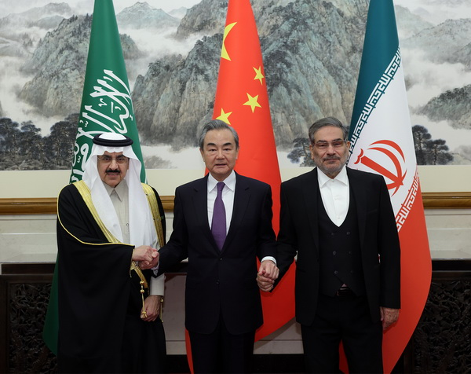
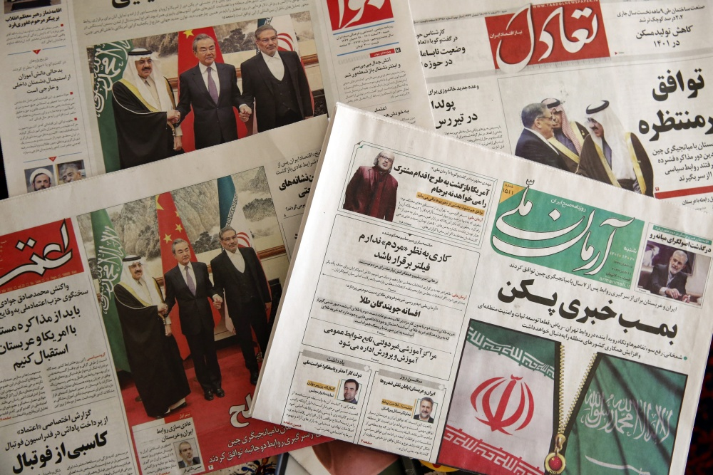
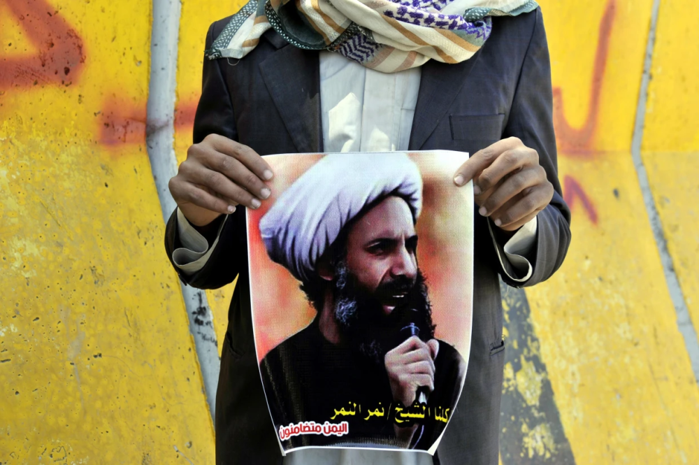
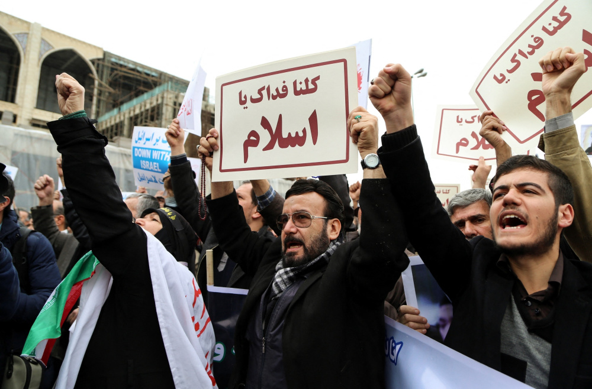
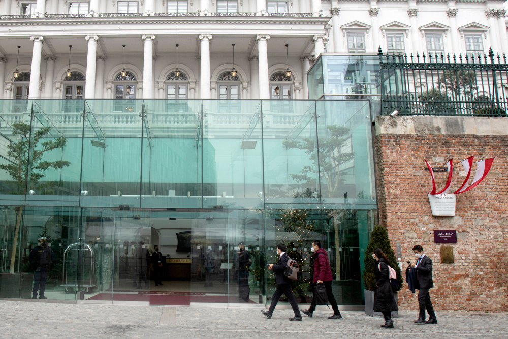
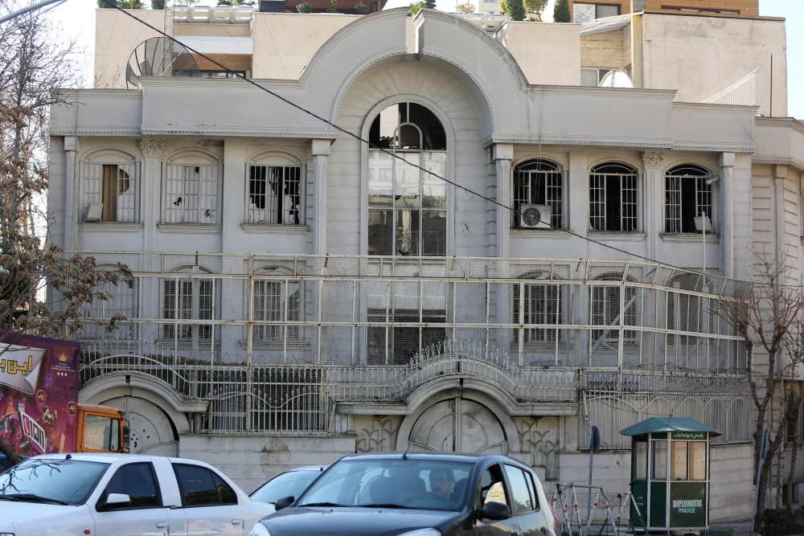
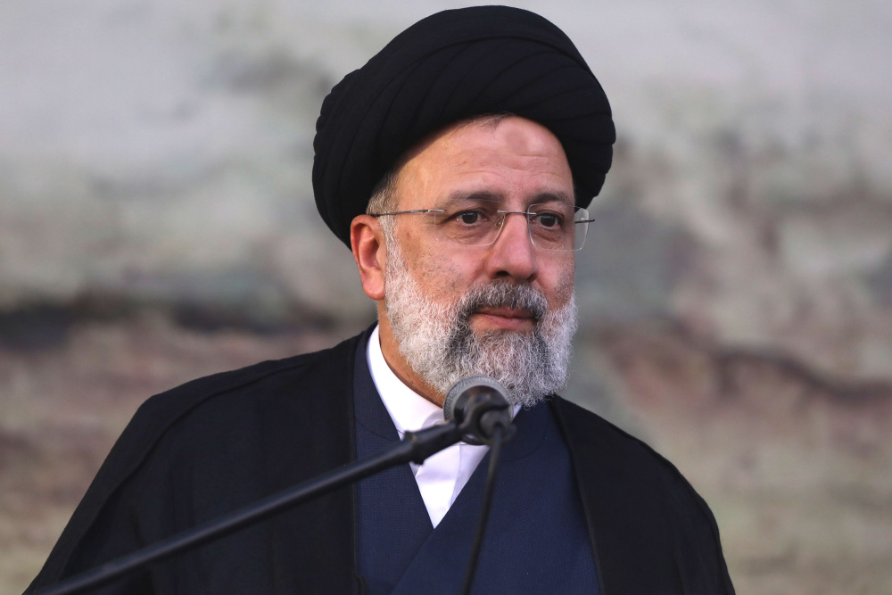
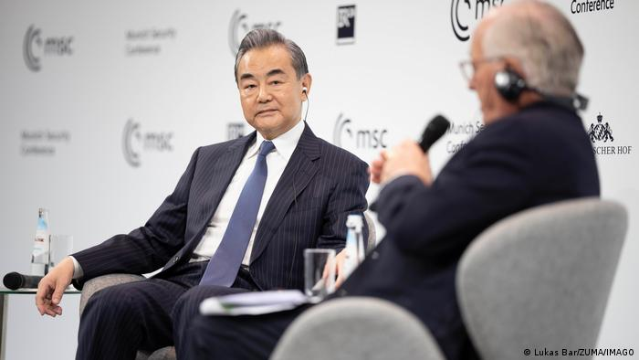
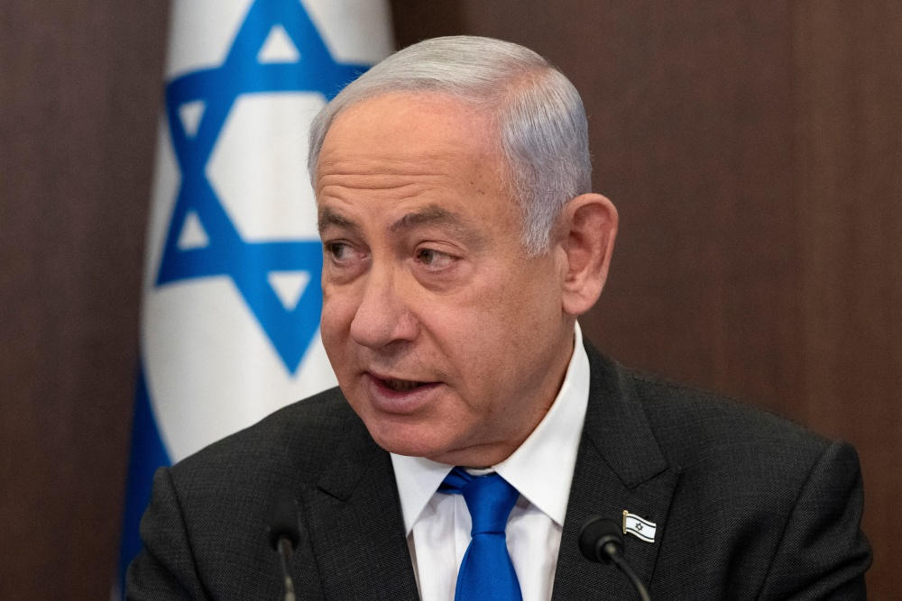
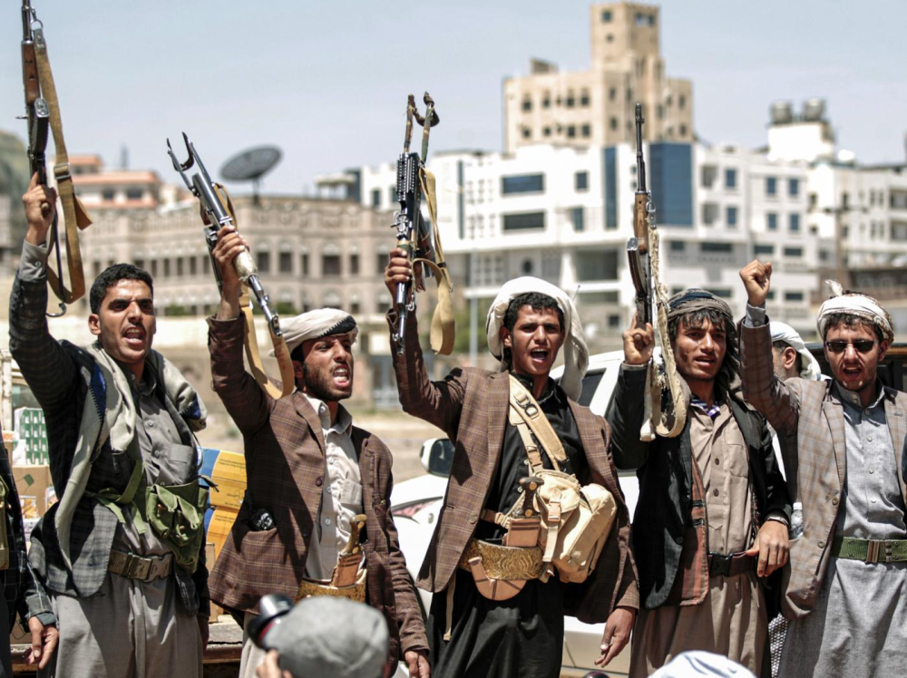

# 沙特伊朗复交：两国困境下的必然选择，中国发挥“临门一脚”关键作用

**文/程靖**

**编辑/漆菲**

断交七年后，被视为中东地区宿敌的伊朗与沙特阿拉伯同意恢复外交关系。

在中国的斡旋下，两国官员于北京进行了四天的谈判，并于3月10日晚宣布了这一令外界意想不到的消息。这不仅意味着沙伊对峙多年的冷战局面开始扭转，也标志着中国中东外交取得重大成果。

两国复交的消息受到阿拉伯国家的普遍欢迎，联合国秘书长古特雷斯也对中国斡旋促成协议表示感谢，还称“伊朗和沙特之间的睦邻关系对海湾地区的稳定至关重要”。

_3月10日，在中国斡旋下，伊朗和沙特在北京签署联合声明，双方同意恢复外交关系。_

自2016年断交以来，沙特和伊朗一边派出代理人在也门、叙利亚等国角力，一边在外交场合相互攻讦；但与此同时，两国在巴基斯坦、伊拉克、阿曼等国的斡旋下保持接触，自2021年4月起参加多轮谈判，直到达成“北京和解”。

沙伊“北京和解”背后，是中东力量平衡的此消彼长与国际秩序的“东升西降”。不论是担心失去“保护伞”并希望推动经济改革的沙特，还是受困于美国“极限施压”的伊朗，出于现实考量，都有着与对方关系正常化的诉求。

宁夏大学中国阿拉伯国家研究院院长李绍先向《凤凰周刊》指出，此前多轮谈判中，沙伊两国已经将原则问题“谈透了”，但缺少一个有影响力的大国作为“担保人”，可以说，中国的外交斡旋发挥了“临门一脚”的关键作用。

在各方为未来中东局势感到振奋之际，李绍先也提醒道，不应对局势过分乐观——沙特和伊朗矛盾根深蒂固，在地区事务上利益相悖，未来局势如何发展将取决于双方的努力。但中东两个宿敌在危机丛生的时代达成和解，如中共中央政治局委员、外办主任王毅所言，“这是对话的胜利、和平的胜利，为当前动荡不安的世界提供了重大利好消息”。

_3月11日，诸多伊朗报纸头版头条报道了沙伊复交的新闻。_

沙伊百年间有过多次断交

现代沙特阿拉伯与伊朗的外交关系，始于1929年沙特与伊朗巴列维王朝签署的《沙特-伊朗友好条约》。但在近百年内，双方有过多次断交。

第一次断交发生在1943年。当时，一名伊朗朝圣者被指控试图向麦加大清真寺的天房投掷呕吐物，从而被沙特政府处决，沙伊关系于1944年破裂。两年后，沙特国王伊本·沙特致函伊朗，要求恢复邦交。

到了20世纪六七十年代，沙特与伊朗虽在世俗化、地区军事主导地位以及油价问题上有过争端，但总体关系还算友好。

伊朗伊斯兰共和国成立后，双方的首次断交同样因宗教事务而起。1987年，402名朝觐者在沙特麦加发生的一次冲突中丧生，其中包括275名伊朗人。愤怒的伊朗民众冲击沙特驻德黑兰大使馆，导致一名沙特外交官丧生。次年4月，沙特宣布与伊朗断交，连伊朗人前往沙特朝觐都不被允许。

本轮断交则始于一次处决。2016年1月2日，沙特宣布处死47名“恐怖分子”，其中一位名叫尼姆尔的男子，是该国知名的什叶派穆斯林教士、沙特政府的坚定批评者。

尼姆尔之死很快激起中东什叶派群众的广泛抗议。在尼姆尔被处决当日，伊朗首都德黑兰的沙特大使馆前，大批示威者聚集抗议，其中一人对使馆投掷自制燃烧弹。随后，沙特以驻伊大使馆被闯入并纵火为由，宣布与伊朗断交。

_2014年，沙特驻也门使馆外，抗议者手持尼姆尔的照片，尼姆尔当年被沙特司法机关判处死刑。_

作为中东地区大国，沙特与伊朗的矛盾由来已久，断交只是其中的缩影。沙特与伊朗的主体民族分别是阿拉伯人与波斯人，早在公元7世纪阿拉伯帝国征服波斯帝国后便开始了竞争与冲突的周期循环。

16世纪初，伊朗萨非王朝宣布什叶派为伊朗国教，此后十二伊玛目什叶派成为波斯地区主流信仰。什叶派在伊斯兰教中并不占主导地位，却与伊朗民族意识紧密结合，共同塑造了伊朗人独特的身份认同。

到1979年，霍梅尼领导的伊斯兰革命推翻了伊朗巴列维王朝，建立了什叶派教士集团统治的伊斯兰共和国。彼时霍梅尼的外交政策核心理念，是通过“输出革命”改造当下的伊斯兰世界秩序，而“伊斯兰革命”本质，便是全球穆斯林和第三世界各国人民反对“压迫者”的斗争——所谓“压迫者”，即美苏以及他们扶植的傀儡政权。

1932年成立的沙特阿拉伯王国，自建国起便将原教旨主义的逊尼派瓦哈比派定为国教。在瓦哈比派眼中，什叶派是需要反对的“异端”。而在现代沙特，瓦哈比主义又被王室赋予了维护国家统一和政权稳定的功能。这种“自上而下”的宗教意识形态，自然与波斯湾对岸“自下而上”的伊斯兰革命理想水火不容。

更不用提，伊朗与沙特在地区事务上有着根本性的利益冲突。上世纪80年代的两伊战争中，沙特站在伊拉克一方，与科威特共同为后者提供了数百亿美元的战争贷款以购买武器。

1990年海湾战争期间，沙特和伊朗都对伊拉克入侵科威特表示谴责，并反对武力解决地区问题，双方关系有所解冻。1991年，两国恢复了1987年因朝觐者死亡而中断的外交关系。1997年，哈塔米当选伊朗总统后推行温和的外交政策，意图进一步改善同沙特等海湾国家的关系。

但这一和解进程在2003年被打断：当年3月，美军入侵伊拉克后推翻了逊尼派的萨达姆政权，扶植了什叶派主导的伊拉克政府——沙特的什叶派对手无疑增加了，中东逊尼派与什叶派的力量平衡再次被打破。

_2016年1月8日，伊朗人在德黑兰举行示威活动，抗议尼姆尔被沙特政府处决。_

内外交困下的必然选择

自2010年开始，席卷中东的阿拉伯革命给沙特与伊朗提供了代理人战争的舞台。在叙利亚，沙特参与资助的叙利亚自由军（FSA）与有伊朗撑腰的叙利亚政府军展开角斗；在也门，什叶派胡塞武装针对也门政府军的攻势如野火般蔓延，沙特在2015年选择亲自“下场”率领阿拉伯联军参战。

但无论叙利亚还是也门，沙特从未在代理人战争中占过上风。就连在总人口不到600万的小国黎巴嫩，由伊朗支持的什叶派武装团体真主党（Hezbollah）的政治影响力也与日俱增，还深度参与了邻国叙利亚的内战，为阿萨德政府提供兵力支持，成为伊朗主导的“什叶派新月带”中的重要一环。而国内政治危机刚刚告一段落的伊拉克，其最终上任的总理人选也是与伊朗有着深厚联系的苏达尼。

但与伊朗政治影响力崛起相对应的，是它在国际社会日益逼仄的发展空间。

自1979年伊朗人质危机以来，美国与伊朗缠斗了近半个世纪。美国单边制裁实施了一轮又一轮，伊核谈判则是反反复复。2018年，时任美国总统特朗普单方面宣布退出伊核协议，并实施“极限施压”，意图通过前所未有的制裁广度和深度迫使伊朗妥协。与此同时，特朗普还试图在中东构建“阿拉伯版北约”，企图拉拢海湾6个阿拉伯国家和埃及、约旦，共同遏制伊朗。

_2020年9月15日，在美国斡旋下，以色列、阿联酋、巴林签署《亚伯拉罕协议》。_

美伊关系在2020年降至最低点。当年1月3日，伊朗革命卫队海外分支“圣城旅”少将苏莱曼尼在伊拉克巴格达遇刺。不久后伊拉克看守总理马赫迪透露，苏莱曼尼前往巴格达，原本是作为调解人回应沙特与伊朗缓和关系的请求，不料在途中遭遇美国暗杀。

伊朗彼时面临的外部压力也影响着国内政局。美方开启的“全面施压”导致伊朗本币里亚尔贬值超过70%、25岁以下年轻人失业率超过30%。近年来，关于生活成本、基础设施缺乏和贪腐问题的抗议活动在伊朗各地屡屡发生，并在2022年秋天因“头巾法”引发的抗议浪潮中达到高峰。

转折点出现在2021年年初，拜登当选美国总统后开始调整“极限施压”政策。内外交困的伊朗也被迫反思自身的处境。

李绍先认为，2021年8月当选伊朗总统的强硬派代表人物莱希，其首要任务就是打破伊朗面临的空前孤立的局面。莱希就任后，多次公开表示与周边国家缓和关系的愿望。

但进入2022年，伊朗重返核协议的谈判未能取得长足进展。据《伊斯兰共和报》2022年8月报道，在当时的谈判中，伊朗提出的多项关键经济主张未能获得美方积极回应。

西北大学中东研究所副教授王晋认为，伊朗通过核谈判重返国际经贸社会的可能性较小，恢复与周边国家的关系以改善国内经济形势成为其现实需求。

对沙特而言，当务之急是从旷日持久的也门内战中抽身。自2015年参战，沙特率领的阿拉伯联军至今未能实现其军事干预的目的，反而让沙特的油田和重要基础设施长期遭到胡塞武装的袭击。“沙特要体面地离开也门战场，也需要伊朗的帮助，因此与伊朗直接对话的意愿增强了。”王晋向《凤凰周刊》分析道。

_2022年7月26日，也门塔伊兹，在战争中失去亲人的也门人上街游行，抗议伊朗支持的胡塞武装攻击平民。_

这对两国而言也是一种经济考量。美联社指出，两国复交或为伊朗提供绕开欧美制裁的新渠道；而沙特为“2030愿景”建造的大型基础设施免于胡塞武装袭击威胁后，其存在的合理性也就大大增加了。

沙特在2016年提出“2030愿景”，旨在减少对石油的依赖，通过发展多元经济和经济转型成为连接亚欧非的“世界枢纽”国家。美国“中东研究所”伊朗项目主任瓦坦卡（Alex
Vatanka）认为，为实现这一愿景，沙特需要开放国门，但也门内战带来的不间断袭击正在吓跑外国投资者，“沙特渴望结束这一局面”。

更大的地缘政治背景，是美国近年来对中东事务参与感的降低。“美军在2021年8月仓促撤离阿富汗、同年年底撤出伊拉克，作为美国在中东地区最重要的盟友，沙特需要试探美国的政策底线在哪里，未来是否会抛弃自己？”王晋说，“更何况，美国单方面恢复与伊朗的核协议谈判，也没有照顾到沙特的利益。”

_2021年12月17日，维也纳科堡酒店，伊朗重回核协议的谈判在这里举行。_

李绍先认为，沙特与伊朗背后的中东两大阵营对抗，正是美国中东政策的产物。“这种对抗导致海湾国家形势不断动荡，其中每个国家都深受其害；如今美国外交政策发生变化，中东国家自然会走向缓和。”

中国找到沙伊“最大公约数”

沙伊2016年断交后，巴基斯坦、阿曼、伊拉克等国都曾试图修补两国关系。

2021年4月，沙特与伊朗代表团在伊拉克举行了断交五年多来的首次对话。彼时沙特王储穆罕默德在一段电视采访中称，“我们并不希望伊朗的处境艰难，相反，我们希望伊朗发展……并推动地区和世界走向繁荣。”

后来的一年里，两国进行了5轮谈判，两国参与代表的级别越来越高，但仍然龃龉丛生。王晋认为，两国要回到2016年以前的外交关系，需要在许多历史遗留问题——如伊朗人冲击沙特大使馆、什叶派穆斯林赴沙特朝觐死亡等事件上互换意见，但很难达成一致。

_沙特驻伊朗首都德黑兰的大使馆_

其间唯一能称为成果的，是2022年1月伊朗驻沙特的伊斯兰合作组织（OIC）办公室重新开放。2021年3月，伊朗单方面宣布暂停会谈，外界猜测是因沙特执行了几年来最大规模的单日处决，死者达到81人，其中一些人被指“效忠外国恐怖组织”，包括一些加入胡塞武装的什叶派穆斯林。

2022年4月的第5轮谈判由伊朗最高国家安全委员会高级代表和沙特情报局局长参与。会后，隶属于该委员会的伊朗光明新闻网（Nournews）称，会谈“气氛积极”，“为双边关系的未来描绘了更光明的前景”。

然而，随后的谈判因伊拉克政治动荡而中断。真正转折点出现在2022年12月——在伊拉克的协调下，沙伊两国外长于约旦安曼举行会谈。伊朗外长阿卜杜拉希安（Hossein
Abdollahian）次月表示，伊朗和沙特已对双方的原则达成谅解，同意将举行促成双边关系正常化的会谈。

_近来巴以冲突持续，加沙地带武装人员向以色列发射火箭弹。_

李绍先认为，通过北京之前的多轮谈判，双方“该谈的都谈透了”，但需要一个有国际影响力的大国，作为“担保人”来促成最终的和解。“沙特希望有一个对伊朗有影响力的国家作为第三方，而伊拉克、阿曼的分量显然不足。中国与沙特、伊朗两国关系良好，两国也都清楚中国不图私利，因此促成了关键的‘临门一脚’。”

瓦坦卡指出，美国无法帮助沙特结束也门内战，因为美国在两国当中仅能对沙特施加影响力，而中国作为伊朗最大的贸易伙伴，对伊朗同样有影响力。

王晋认为，近两年来与沙伊两国元首的会谈展示了中方的诚意，成就了中国斡旋的契机。

2022年年底，中国国家领导人赴沙特出席“三环峰会”并对沙特进行国事访问。访问和会谈的高规格和高密度，标志着中国与沙特以及其他海湾国家进入一个高速发展的新阶段。今年2月14日，伊朗总统莱希应邀访华，则为中伊两国增进全面战略伙伴关系、进一步落实两国“25年合作协议”、加快后疫情时代的全方位合作等层面添砖加瓦。

李绍先高度称赞了“北京和解”背后中方所做的努力：莱希访华后才半个多月，中国就促成沙特和伊朗在北京的历史性会晤，并带来了积极结果，“其间中国穿针引线，保持了相当的忍耐力，也充满了‘中国智慧’”。

_伊朗总统莱希_

根据3月10日达成的《中华人民共和国、沙特阿拉伯王国、伊朗伊斯兰共和国三方联合声明》，沙特和伊朗强调尊重各国主权，不干涉别国内政，并同意激活两国于2001年4月17日签署的安全合作协议和于1998年5月27日签署的经济、贸易、投资、技术、科学、文化、体育和青年领域总协议。李绍先认为，这将成为未来沙伊两国合作的“最大公约数”。

“此外，北京谈判做到高度保密。因为一旦提前透露消息，风险就很大。不希望沙伊走到一起的力量不小。”李绍先解释说，如果说美国近期促成的日韩和解难度指数是3，印度和巴基斯坦缓和关系的难度指数是5，沙伊和解的难度指数可以说是9。“但中国敢于介入调解，而且抓住双方共同的需求，抓住水到渠成的机会，一举成功。”

李绍先认为，沙伊和解是中国长期推进的建设性外交的胜利，也是中国推进全球治理倡议、人类命运共同体理念的一次良好实践。“它为此前中方向俄乌冲突提出的12点和平建议加持了分量。中国将用事实使国际社会信服，即我们有公信力、有能力对俄乌冲突进行调解。”

_2023年2月，王毅出席慕尼黑安全会议时表示，中国将就乌克兰冲突提出自己的和平建议。_

带来超越两国的辐射效应

再度复交后，沙特和伊朗能有怎样的互动？李绍先指出，沙伊缓和关系既是共同需要，对地区也有积极意义，但并不代表它们能迅速建立密切的联系，毕竟双方矛盾由来已久、根深蒂固，两国在叙利亚、也门、伊拉克等地区事务上利益和观点存在巨大差异，且产业结构也没有互补性——它们都以石油天然气出口为支柱。“两国复交后能走到什么程度，需要双方共同努力，不能有不切实际的期待。”

美国资深记者和评论员戈什（Bobby
Ghosh）在彭博社的外交事务专栏指出，沙特尽管与伊朗签署了和解协议，也不会忽视来自伊朗的直接威胁。这包括伊朗的核野心、生产射程越来越远的弹道导弹，以及据报道购买最先进的俄罗斯战机。

这次外交成果也给美国总统拜登带来压力。随着拜登任期过半，渴望在外交领域做出点成绩的民主党将目光瞄向以色列。如果能推动以色列与沙特建交，无疑将成为拜登的政绩。没想到，拜登尚未达成成果，却被中国抢了风头。3月10日的白宫记者会上，被问得最多的问题便是——美国做不到的事情，中国做到了！美国对此作何感想？

对此，白宫国家安全委员会发言人约翰·柯比（John
Kirby）审慎回应说，美国政府支持“一切令地区紧张关系降级的努力”，但“伊朗是否会履行其义务，有待观望”。

路透社引述柯比的话称，对于在北京与伊朗进行复交对话，沙特一直有知会美方，但美国未直接参与相关谈判。他指目前的共识路线是此前多番对话的结果，包括过去在巴格达和阿曼进行的谈判，以及沙特有效阻止伊朗及其代理人发起的攻击，最终将伊朗带回谈判桌。为了“挽尊”，柯比还表示，“这是美国持续威慑力和外交活动有效结合的成果”。

在美国威尔逊中心基辛格中美关系研究所所长戴博（Robert
Daly）眼中，这是“德黑兰、利雅得和北京的重大外交突破”，可谓“中国外交的里程碑”。约翰斯·霍普金斯大学教授瓦利·纳斯尔（Vali
Nasr）发推称：“中国促成伊朗和沙特恢复外交关系的协议，在多个层面改变了中东的游戏规则。”

_沙特王储穆罕默德_

美国智库昆西研究所副所长特里塔·帕西（Trita
Parsi）直言，事态发展应该引发对华盛顿中东政策的反省。“如果这成为新常态，美国决策者应该担心的是：美国卷入地区伙伴的冲突，以至于机动性消失，我们过去作为和事佬的角色完全让给了中国。”

美国智库史汀生中心中东和北非杰出研究员芭芭拉·斯拉文（Barbara
Slavin）提到，若中国能在伊核谈判上进一步发挥作用，敦促后者遵守协议，“那将真正显示出，在中东和整个世界的重大外交方面，中国不再是次要角色”。

目前来看，最为忧心的当数以色列。几个月前在大选中落败的该国前总理贝内特（Naftali
Bennett）认为，沙伊复交对伊朗来说是“政治胜利”，但对以色列是一个“危险的发展”。

在美国的支持下，沙特积极推动关系正常化的昔日“敌人”还有以色列。美国咨询公司“海湾国家分析”（Gulf State
Analytics）分析师马祖科（Leonardo
Mazzucco）撰文称，沙特之所以与两个死敌同时缓和关系，是因为在美国对中东影响力减弱的背景下，沙以两国均视伊朗为日渐崛起的威胁，加上沙特年轻一代统治者越来越关注经济增长和后石油时代的发展机会，因此愿意采取务实平衡的外交政策，与以色列互动频频。

然而，沙伊复交给沙以建交进程蒙上一层阴影。

2020年8月，以色列在特朗普政府的斡旋下与四个阿拉伯国家签署和平协议，被视为内塔尼亚胡政府改善以色列在中东战略地位的绝佳尝试，也是美以在中东建立反伊朗联盟的重要突破，而以色列的下一个和解目标便是沙特。

如今，重返总理之位的内塔尼亚胡成了国内舆论的“活靶子”。贝内特抨击称，沙伊复交是内塔尼亚胡政府的惨败，“是该国政治忽视、普遍软弱和内部冲突的综合结果”，意指内塔尼亚胡今年以来忙于国内司法改革和权力斗争，全然不顾外部威胁。

_以色列总理内塔尼亚胡_

王晋向《凤凰周刊》分析说，目前以色列正在推进的司法改革，一旦通过将导致最高法院失去部分权力，或无法再约束政府推进约旦河西岸犹太人定居点的进程，这将进一步挤压巴勒斯坦人的生存空间。而巴勒斯坦人的土地与人权，是过去半个多世纪以来阿拉伯国家与以色列对抗的焦点之一。

马祖科认为，沙特舆论高度重视巴勒斯坦人的民族自决权。“沙特作为2002年‘阿拉伯和平倡议’的首席设计师，如果该协议不能为巴勒斯坦人带来切实改变，沙特或将难以与以色列实现外交关系正常化。”

截至3月12日，以色列政府尚未对沙伊复交一事发表评论。但在一片批评声中，总部设在美国的伊朗国际频道（Iran
International）引述匿名以色列官员的话称，以色列早就知道伊朗和沙特正在和谈，一直密切关注其进展。这名官员还试图澄清说，沙伊和解并不会影响到沙以建交的前景。

无论如何，沙特与伊朗两大宿敌“唱和”给危机跌宕的世界带来一抹和平的曙光。美联社指出，这次“世纪建交”将带来超越两国的辐射效应，降低地区对手之间爆发武装冲突的可能性。除也门发生的代理人战争有望结束外，沙伊复交还可能推动黎巴嫩国内真主党与逊尼派势力的和解；受伊朗支持而在12年内战中备受阿拉伯国家孤立的叙利亚政府，或将因为沙伊和解而增加与沙特的接触。

_也门胡塞武装_

