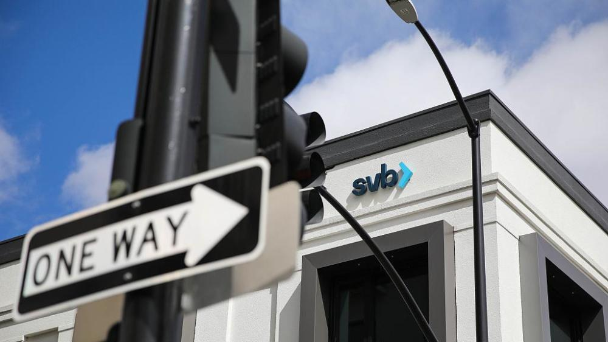

# 经济学家：硅谷银行对市场情绪的冲击，估计过两周就会消失

_当地时间2023年3月10日，美国那帕，硅谷银行。
视觉中国 图_

美国硅谷银行（Silicon Valley
Bank，SVB）突然倒下震惊全球，而这距离它3月7日刚刚再度登上福布斯年度美国最佳银行榜单仅过去了48小时，成为2008年次贷危机以来美国最大的银行关闭事件。

外界普遍将硅谷银行倒下的原因归结为美联储加息，但在上海交通大学上海高级金融学院教授、前美联储高级经济学家胡捷看来，美联储加息对每家银行的资产都有挤压作用，但此次出现流动性问题的只有硅谷银行，之所以出现这样的情形是因为“硅谷银行的存款具有特殊性，存户过于单一，个人存户很少，都是些大型公司存户。存户数量少，并且这些存户高度依赖融资来维持它们的现金流，所以存款波动非常猛烈”，3月13日，胡捷在接受澎湃科技采访时作出上述判断。

据了解，硅谷银行以主打向美国科技初创公司提供资金而闻名，是美国的第16大银行，也是科技初创公司、科技投资机构、科技工作者的主要金融渠道。

但胡捷同时表示，“这件事情属于‘茶杯里的风暴’”，他认为此次监管当局出手非常迅速和准确，硅谷银行倒下对市场情绪上的冲击估计再过两周就会消失了。

**顶级风投集体劝被投企业撤资**

“此次硅谷银行具体的爆发点可能是股权融资的路演没有成功，但事件根源仍然是银行本身的流动性危机。”胡捷向澎湃科技表示。

3月9日，硅谷银行发公告宣布，出售投资组合中的部分证券将导致18亿美元的亏损，并寻求通过出售普通股和优先股募资22.5亿美元。但比较不巧的是，就在硅谷银行发公告的同时，加密货币银行Silvergate宣告倒闭，这引发了华尔街的恐慌，认为两家银行之间存在关联，是Silvergate的倒闭让硅谷银行寻求融资脱困。尽管事实并非如此，但挤兑已经发生。当天，硅谷银行股价暴跌超60%，市值一日之内蒸发94亿美元。

“硅谷银行资产的总体质量还是不错的，没有资不抵债的问题。银行是个好银行，但是再好的银行都架不住存户挤兑。”胡捷表示。

据媒体报道，硅谷银行发布公告之前，几家顶级风投公司出于对硅谷银行财务问题的担忧，已向一些投资组合公司建议从该行撤出资金。彼得·蒂尔联合创立的风险投资基金Founders
Fund建议被投企业从硅谷银行撤资，原因是担心其财务稳定性；Union Square
Ventures告诉投资组合“只在SVB现金账户中保留最少的资金”。YC孵化器（Y Combinator）的总裁兼CEO Garry
Tan也警告其被投公司，硅谷银行的偿付能力风险是真实存在的。

而华尔街投资银行高盛为硅谷银行进行融资路演时，披露了更多原本市场并不知晓的财务数据，让更多投资人看到了客户正在大规模从硅谷银行提取存款，直接导致了挤兑。

**科创市场不景气雪上加霜**

实际上，硅谷银行存款端不断缩减的进程已经持续了几个月。美国国债收益率在2022年10月最高，硅谷银行进入资不抵债状态的时间已经持续了接近半年。

2022年3月以来，美联储启动了力度空前的加息周期，同时，科创领域的市场不景气也影响了硅谷银行服务的最主要客户——科技初创公司和风险投资机构。美联储加息不断打压科创公司估值，迫使这些公司寻找更多现金以保证流动性，不断升息的美债就成为了一个更好的选择。更多科创公司选择将原本放在硅谷银行的存款转移到收益更高的替代品中，如美国国债，这些因素都导致硅谷银行的存款下降快于预期，且下降速度越来越快。

胡捷向澎湃科技介绍，硅谷银行的这些客户对融资环境非常敏感，“过去两三年，融资环境好的时候，硅谷银行的存款猛增3倍，资产从700亿暴涨到2100亿，而现在融资环境不好了，资产就开始迅速回落。在这期间，硅谷银行为了拯救自己的流动性，也采取了一系列的措施，但都没有完全解决问题。”

胡捷介绍，硅谷银行不成功的举措主要有三个。“首先，他们已经向银行借款，但银行间拆借的额度是有限的；第二，他们降价变卖资产时，把账面损失变成了实际损失，美联储加息后，资产端又有贬值的问题，因此雪上加霜；第三，当前美联储加息后，资金环境紧缩，融资的后续跟进比原来差了，因此硅谷银行实际上是在消耗存款维生。”

**永远不要把鸡蛋放在一个篮子里**

“这件事的直接原因仍然是来自于硅谷银行本身存款的特殊性，不是系统健康的普遍问题。”胡捷向澎湃科技表示，“此事对中国的启示主要在银行层面。”

“银行的风控体系是很多层面的，其中第一个方面就是流动性风险。”胡捷认为，“此次硅谷银行的流动性风险的根源是存户过于集中，不管什么原因导致存户计提，这都是一个必须严格防范的问题。第二，如果真的出现这样的情况要如何救助银行。此次监管当局出手非常迅速和准确，硅谷银行倒下不会产生长远的大面积影响，对市场情绪上的冲击估计再过两周就会消失了。”

胡捷同时也认为，这次硅谷银行事件远不达次贷危机的严重程度。

“2008年次贷危机时，当时倒闭的两家银行贝尔斯登和雷曼兄弟持有的次贷产品违约非常严重，当时市场上很多重要的信息都不明确，于是出现了大面积的流动性恐慌和冻结，”胡捷表示，“当时的政府监管也没有相关的应对经验。而这次硅谷银行事件时，市场上具有极高的透明度，问题所在也一清二楚。”

3月12日，美联储、财政部、FDIC（联邦存款保险公司）发布联合声明称，从3月13日开始，储户可以支取他们存在硅谷银行的所有的资金，这意味着美国通过政府力量保证了硅谷银行存款的“刚兑”。这一声明，也为此次硅谷银行的倒闭风波迅速画上句号，止住了潜在酝酿的市场风暴。

“其实从2022年年底开始，行业里已经在讨论硅谷银行的流动性问题。如果是消息敏感的投资机构，已经有一些时间可以进行准备。”3月13日，云启资本合伙人陈昱向澎湃科技介绍，对于风险投资机构和创业公司来说有两点需要注意：一是永远不要把鸡蛋放在一个篮子里；二是要对行业信息敏感，增加获取信息的能力。

陈昱表示，此次硅谷银行事件，短期内对美元基金的出资可能会有影响。“因为受到影响的美元基金需要账户转移，要开新的银行账户，所以需要有两三周的时间走这些流程。但美联储这次的处理很及时，恢复了大家对市场的信心。”

