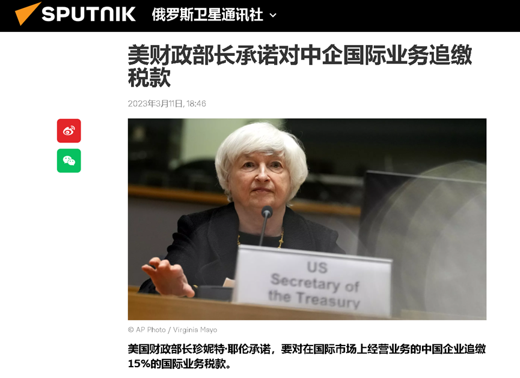
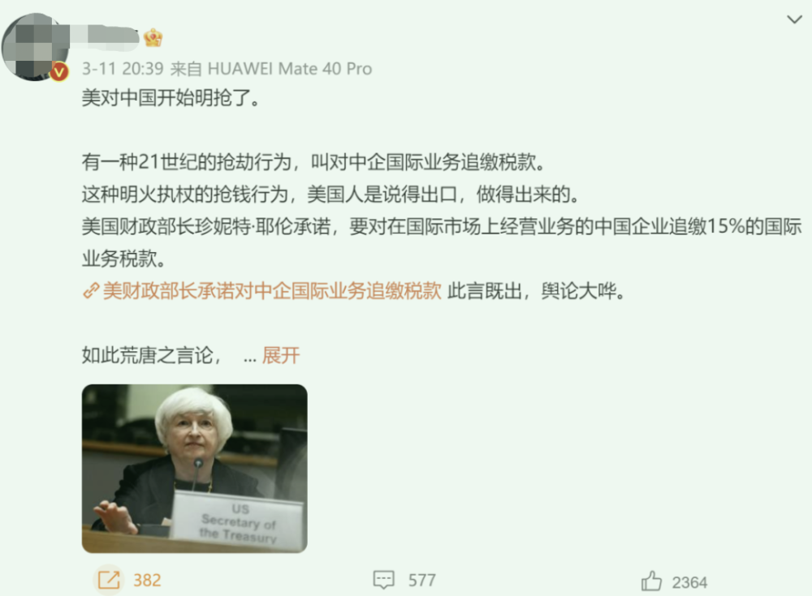
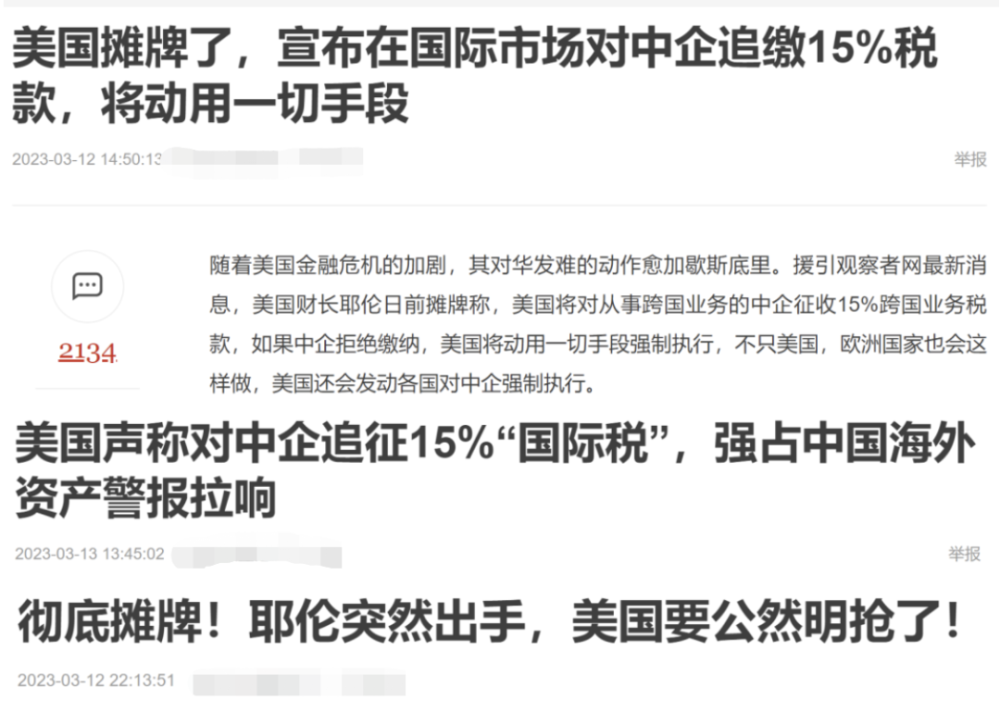

# 美国将对中国企业追缴15％“国际税”？假的！主要针对“避税天堂”

近日，中国网络上出现了一种让许多网民相当吃惊和愤怒的说法。

该说法称，美国政府要对中国“明抢”了，因为美国财长耶伦近日承诺说，她要 **对在国际市场上有业务的中国企业追缴15%的国际业务税款** 。

_图片来源：视觉中国_

随后，这一消息便被中国网络上的一些自媒体和大V传播开来，有人更怒斥耶伦对中企国际业务追缴税款 **是21世纪的强盗行为** 。

然而就在同一时间，美国的《华尔街日报》也刊登了一篇评论文章， **但内容反而是骂耶伦在帮中国坑美国的** 。

这是怎么回事？

**俄媒：耶伦称将对中企追缴15%“国际税”**

**大V：21世纪的强盗行为**

据环球时报，国内网上这一说法的源头，来自俄罗斯卫星通讯社中文网的一篇由短短四段话组成的报道，主要内容是美国财政部长珍妮特·耶伦在国会中承诺，会对在国际市场上有经营业务的中国企业追缴15%的国际业务税款。

该报道称，美国财政部长珍妮特·耶伦承诺， **要对在国际市场上经营业务的中国企业追缴15%的国际业务税款** 。

耶伦在国会的发言中评论了中国企业不支付15%国际业务税款的风险，她说道：“我们将会这样做， **保证税款征收……不管用什么方式** 。”

该项税收涵盖了在低税率国家注册的公司，包括中国。她指出， **不仅美国，欧洲也会密切监督中国企业执行国际税法的情况** 。

耶伦向国会议员表示：“执行机制规定， **如果中国企业由于某些原因无法支付该项税款，那么在美国或有中国企业经营业务的任何国家，将对中企征收额外税款** 。”

不过， **这篇报道并没有交代耶伦说出这番话的事件背景和前因后果，也没有对耶伦提到的“15%的国际业务税款”是什么进行任何交代** 。

随后，这一消息便被中国网络上的一些大V和自媒体传播开来，有大V更是怒斥耶伦对中企国际业务追缴税款 **是21世纪的强盗行为** 。

这些消息迅速引发不明真相的网友们的吃惊和愤怒。

**真相：包括中国在内136个国家支持**

**主要针对跨国巨头和“避税天堂”**

那么事实究竟如何呢？

其实，耶伦谈及的那个“15%的国际业务税款”，并不是美国政府打击中国企业的什么新手段，而是
**出自2021年的一个得到了包括中国在内的130多个国家支持的国际税收规则改革方案** 。

简而言之，这是一个针对大型跨国企业和“避税天堂”的税收方案，
**主要针对的是苹果、谷歌、脸书、亚马逊、微软等跨国科技巨头，令其不能通过维京群岛、百慕大群岛、开曼群岛等税率极低甚至不收税的“避税天堂”逃避税收** 。

据央视新闻，当地时间2021年10月8日，总部位于法国巴黎的经济合作与发展组织（OECD）发布公报称，
**由经合组织协调谈判的双支柱国际税收制度改革已获得占全球经济总量90%的136个国家和司法管辖区的赞同与认可** ，
**新税收制度预计从2023年起落实** 。

公报中表示，经过多年的谈判，为使国际税收规则适应21世纪的现实情况，136个司法管辖区签署了基于两个支柱的解决方案宣言，以解决经济数字化带来的税收挑战。该宣言最终确定了税改框架各成员国于2021年7月达成的旨在深入改革国际税收规则的政治协议，随着爱沙尼亚、匈牙利和爱尔兰签署该协议，
**协议已得到了所有经合组织国家和二十国集团成员国的支持** 。

经合组织指出，全球最低税收协定的目标不是结束税收竞争，而是对其设定多边协商限制。通过第一支柱解决方案，
**预计每年将有超过1250亿美元的利润税权重新分配给市场管辖区** ，发展中国家将从较发达经济体获得更多收入；通过第二支柱解决方案，
**引入最低的全球公司税率15%** 。这一新的最低税率将适用于营业额至少为7.5亿欧元的公司，
**预计每年将在全球产生约1500亿美元的额外税收。这一数字相当于苹果公司2020年财年净利润（574亿美元）的约3倍** 。

中国银行研究院发布的一份研报显示，长期以来，全球主要经济体将低企业税率作为吸引国际投资、扩大本地企业规模
和就业率的重要手段，甚至展开“逐底竞争”。2001年至今，全球平均企业税率由27%降至20.2%。无论是G20集团、OECD经济体还是非OECD经济体，企业税率均保持平稳下行走势，其中OECD
经济体下降幅度最大，降幅为7.88个百分点；非OECD成员国降幅较小，降幅为 6.23个百分点；G20成员国降幅为6.92个百分点。

从国别情况看，代表性的国家企业税率均保持下降趋势。其中美国、德国、英国等发达经济体企业税率下行趋势较中国、印度、越南等发展中经济体更明显，
**爱尔兰、新加坡企业税率处于全球较低水平** 。

据了解，过去几十年，得益于较低的公司税率，爱尔兰一直是许多大型科技企业的避税天堂。
**爱尔兰美国商会称，约有800家美国企业在爱尔兰开展业务，并雇佣了约18万名员工** 。

全球企业税率长期下降乃至出现国家间“逐底竞争”，给跨国公司避税活动带来 极大便利，少数低税经济体从中受益，但多数国家和地区显著受损。
**据联合国估算，每年全球各国因跨国公司利润转移行为损失的税收达到5000-6000亿美元（约合人民币3.4万亿-4.1万亿元）** 。

据英国《卫报》消息， **微软在爱尔兰的子公司Round Island
One在2020年创造了近3150亿美元（约2万亿人民币）的利润，几乎相当于爱尔兰GDP的四分之三** ，却因为在百慕大注册而没有缴税。
**百慕大不征收企业所得税** 。

OECD的研究显示， **美国跨国公司海外利润簿记在“避税天堂”的比例由2000年前后的30%提高到2019年的60%**
。发展中经济体受损情况更加突出，根据IMF测算，跨境避税对非OECD经济体带来的长期收入损失占其GDP的1.3%，高于OECD经济体1%的水平。

据界面新闻，全球最低企业税率的谈判始于2013年。面对纷纷崛起的科技巨头，各国政府希望遏制它们利用互联网业务的特点避税。特朗普担任美国总统期间，谈判一度陷入停滞。但
**拜登上台后，新一届美国政府更加重视经济平等，财长耶伦也将全球最低企业税率作为优先事项** 。

除了15%的最低企业税率之外，本次国际税收改革还将改变对科技巨头的征税方式，
**使更多的税收按企业的业务所在地来收取，而非按企业的总部或分支机构所在地来收取**
。此举也将有效遏制科技巨头通过选择低税收地区作为总部的方式来避税的行为。

**专家：对中国负面影响有限**

“全球最低企业税率”一旦实施， **受影响最大的企业将是苹果、谷歌、脸书、亚马逊和微软等美国的科技巨头** ，他们通常利用数字服务在地域上的灵活性，
**将利润转移到低税率国家达到避税的目的** 。

中国银行研究院曹鸿宇在其研报中表示，总的来看，中国落实全球最低企业税率所面临的内部障碍较小。
**中国现行企业所得税税率较高，一般标准为25%，既高于OECD包容性框架下12.5%的税率目标，也高于15%的最低税率底线** 。

另外，中国企业海外收入相对较低，受全球最低企业税率影响的企业海外利润并不大，而政府支持企业“走出去”，对企业海外利润征税也持宽松态度。推出全球最低企业税率制度
**对中国整体负面影响较为有限** 。

对于从事跨境投资的中国企业而言，“全球最低企业税率”会带来新的合规义务。中国企业“走出去”广泛采用离岸架构，根据各地税收优惠特色在不同的国际税收洼地设置中间实体（如在香港设置区域销售中心、在新加坡设置财资中心等），从而进行海外投资、上市或全球价值链布局。“全球最低企业税率”规则实施后，
**可能会要求位于低税率地区的中间实体缴纳额外的税款** 。各国为跨国公司提供的税收优惠可能被中和，影响跨国公司的全球资源配置。

**美国政客：**

**这会令中国占便宜让美国吃亏**

据环球时报，由于这个国际税收规则改革的涉及面太广，牵扯的利益太多，所以各国在方案的实施上还有不少细节要落实，比如一些发展中国家就希望该方案能照顾他们的国情和实际需要，给予一些豁免。同时，一些发达国家也在国内遇到了极大的政治阻力，有的反对者反对给发展中国家豁免，认为这会令发达国家吃亏，还有的则是完全反对这个改革方案，理由是
**这个方案会影响到的主要都是发达国家的大企业** 。

而美国——尤其是美国的国会，是其中闹得最凶的一个。上周五，在美国国会众议院的一场听证会上，控制着众议院的美国共和党的政客们就纷纷对前来参会的美国财长耶伦表示，他们不会通过这个国际税收规则改革方案。其中有政客就表示，
**他们反对的原因是担心该改革方案会允许中国的一些企业获得一些豁免，进而令中国占便宜并令美国吃亏** 。

于是，本身很希望美国国会能立法通过这项国际税收规则改革、从而彰显美国全球领导地位的耶伦，只得在听证会上给这些美国政客解释起了为何这个改革不会令中国“占便宜”和令美国“吃亏”。当时她介绍说，这个国际税收规则改革方案中有一个强制机制，
**中国作为该改革方案的签约国，假如没有对符合征税要求的中国跨国企业征收不得低于15%的企业收入税，那么相关跨国企业业务涉及的其他国家就可以采取动作**
，比如在美国有业务，那么美国政府就可以对其征收额外的税款。

记者还查阅了美国媒体给出的那场听证会完整的3小时视频，可以证实耶伦是在41分钟左右时做出的这一解释的，她的解释也是围绕国际税收规则改革的机制，在一种假定的环境下进行的。

不仅如此，美国《华尔街日报》的消息还称，耶伦此前还曾表示，
**如果美国不能尽快通过立法支持该方案，对美国的企业征收不低于15%的企业收入税的话，那么其他国家也将用同一个强制机制去对美国的跨国企业动手** 。

值得一提的是，当中国网民怒斥耶伦抢劫中国企业时，美国的《华尔街日报》也刊登了一篇评论文章，但内容反而是骂耶伦在帮中国坑美国的。

这篇题为“耶伦的全球最低税在令北京受益”的文章宣称，耶伦想在美国推进的那个全球税收规则改革
**不仅会令中国的国有企业得到很多豁免，令美国的私人企业利益受损，甚至会令很多国家更倾向于与中国的国企合作，打击美国私企的积极性**
，方案中的一些机制还会令中国进一步损害美国的国家安全。

**编辑|** 段炼 杜波

**校对|** 卢祥勇

每日经济新闻综合自环球时报、央视新闻、新华社、界面新闻、每经网、中国银行研究院研报、中国政府网、公开资料等

