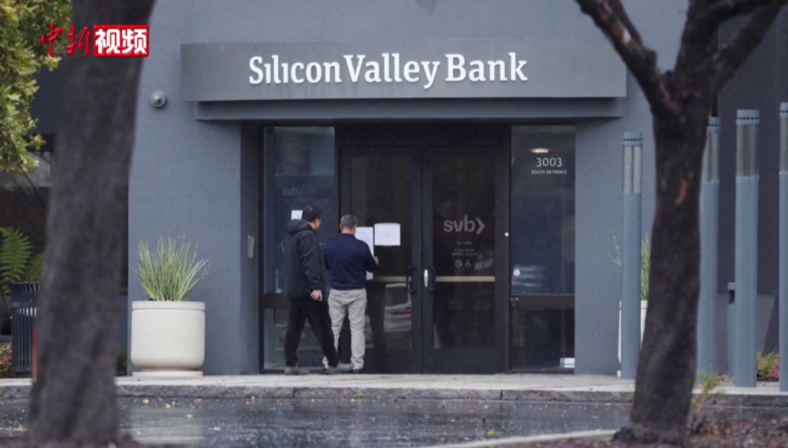

# 美国银行接连破产，金融危机会来吗？有三个问题我们必须弄清楚

硅谷银行 中新视频截图

**文/夏宾**

硅谷银行之后，又一家美国的银行“关门”了。

在美国财政部、美联储和美国联邦存款保险公司最新发表的联合声明透露，总部位于纽约的标志银行（Signature
Bank）存在和硅谷银行类似的系统性风险，该行已于当地时间12日被纽约州监管机构关闭。

这份声明也给出了美国政府应对此次危机的办法：联邦存款保险公司能以充分保护所有存款人的方式解决硅谷银行和标志银行的问题，确保硅谷银行等存款机构储户的资金安全。

对于此次美国的银行所暴露的风险，有三个问题我们必须弄清楚。

**一：存款人的钱能拿回来吗？**

存款一般而言有两方面的保障。一方面，根据存款准备金制度，银行收取存款的同时会按一定比例，缴纳一部分资金到中央银行，以应对未来可能出现的集中大量取款需求。

另一方面，根据存款保险制度，收取存款的机构会作为投保人，缴纳一定的保险费，为其储户的存款上保险，一旦出现各类危机，可以支付部分或全部存款。此前，中国央行行长易纲就表示，目前，全国所有存款类金融机构都加入了存款保险，存款保险能够为99%以上的存款人提供全额保障。

看美国的情况，2020年疫情暴发，美联储为刺激经济在启动史无前例降息措施后，还将存款准备金率下调至零。这意味着，美国的银行业在过去一段时间“狂飙”，拿着几乎不用付利息的存款，还不用缴纳存款准备金。

这一次，美国的存款保险制度发挥了作用。上述声明称，在收到美联储和联邦存款保险公司的建议并与美国总统进行协商后，财政部长耶伦批准采取行动，使联邦存款保险公司能够以充分保护所有存款人的方式解决硅谷银行问题。从3月13日起，硅谷银行储户将可以使用所有资金。与硅谷银行解决问题有关的任何损失都不由纳税人承担。

声明还称，总部位于纽约的标志银行（Signature
Bank）存在和硅谷银行类似的系统性风险，该行已于12日被纽约州监管机构关闭。美国政府将采取同样的行动，确保标志银行的储户也可以使用所有资金。

据美联社报道，这是美国政府采取的“非常规措施”，旨在预防潜在的银行业危机，相关措施将确保倒闭的银行储户能迅速提取所有存款。若没有这一措施，银行每个账户的受保资金最高额度仅为25万美元。

此外，美联储还表示，其已经“准备好应对可能出现的任何流动性压力”，将创建新的银行定期融资计划（BTFP），而财政部将从外汇稳定基金中提供高达250亿美元的资金作为BTFP的支持。

美国媒体认为，BTFP的规模将足以保护更广泛的美国银行系统中未投保的存款，但预计美联储预计不会动用上述250亿美元的资金。

**二：美联储因此改变加息节奏？**

美联储货币政策变动与此次硅谷银行的危机密切相关。

方正证券固收首席分析师张伟指出，2022年为了应对通胀，美联储开展史诗级加息，目前联邦基金目标利率升至4.5%-4.75%。美联储收紧货币，实体经济融资条件趋紧，科创企业融资环境变差，因而取现需求增加。硅谷银行面临的流动性压力增加，但此时由于利率上行硅谷银行前期投资的债券收益率却面临较大的浮亏。如果卖出债券应对取现需求，这些浮亏就变成实际的亏损。硅谷银行处境愈发艰难。

此次危机会对美联储的货币紧缩进程产生压力吗？兴业银行首席经济学家鲁政委称，未来若美联储继续收紧货币政策，存款增速持续下滑，或将有其他银行迫于无奈抛售。债券，进而侵蚀利润和资本，出现类似硅谷银行的情况。“在这其中，存款稳定性相对较差的部分中小银行风险或更容易出现风险。”

国泰君安国际首席经济学家周浩则认为，短期而言，硅谷银行爆雷带来了金融市场的波动，这很可能让美联储在本月选择加息25个基点，而非市场担心的50个基点。由于监管介入及时，以及事件本身会让金融机构更加关注风险管理，硅谷银行事件在一定程度上释放了金融风险。

但他也提到，上述情况造成了一种让人“啼笑皆非”的困境：隐藏金融风险勉力维持机构运行，硅谷银行的未实现损失会越来越大；而爆雷后带来的市场避险情绪反而会减轻类似的风险和亏损；金融风险越大，美联储停止加息甚至降息的可能性就越大。从某个角度而言，硅谷银行遇到的危机，恰恰可能要靠“爆雷”才能解决。

高盛研究报告称，鉴于最近银行体系承受的压力，不再预期美联储将在3月22日的会议上加息，但维持美联储将在5月、6月和7月加息25个基点的预期不变，现在预计终端利率为5.25-5.5%。

国金证券首席经济学家赵伟则认为，当下，美国银行业爆发系统性风险的概率较低，或有风险存在的中小银行规模占比低、高存款保险覆盖下传染性有限；硅谷银行破产风波倒逼美联储“政策转向”的可能性不高。

他给出上述判断的主要原因在于，硅谷银行事件溢出效应有限、美国联邦存款保险公司及时介入已隔离部分风险、大型商业银行相对稳定等。赵伟称，银行体系的风险暴露或更多存在于小银行中，然而小银行资产规模占比仅14.2%，同时，其较高的存款保险覆盖率也可以一定程度上缓解风险传染。结合1980年代的“储贷危机”期间美联储大幅加息的经验来看，本轮美联储货币政策就此转向的概率不大。

**三：会否产生新一轮金融危机？**

硅谷银行的危机让市场联想到雷曼银行的倒闭，后者是引发2008年金融危机的标志性事件。

国家金融与发展实验室副主任曾刚对媒体表示，当年雷曼危机爆发后，很多风险一下就扩展到了其他金融机构，所以在次贷危机后，监管开始限制银行的同业业务，对影子银行进行清理等，这是沿着降低风险扩散性的思路而来。在过去十年中，同业风险扩散关联度已极大降低。

在他看来，目前破产事件的影响范围主要还是集中于硅谷银行的客户，与金融市场的直接关联度不高，短期还不会蔓延成美国整体的系统性金融风险。

赵伟认为，硅谷银行规模小、同业少，直接溢出效应远低于雷曼兄弟银行；同时其抛售的底层资产无根本性问题，抛售底层资产导致底层资产暴跌，进而触发其他银行风险暴露的链条不会成立。

再从CDS（信用违约互换）利差、金融条件、货币市场流动性、货币市场利率等角度来看，当下美国金融市场环境仍较为稳定，暂无“流动性冲击”向“流动性风险”演化之忧。

赵伟进一步称，次贷危机后美国商业银行一级资本充足率明显提升，加之美联储更为丰富的应对工具箱，金融系统性风险爆发的概率进一步降低。

同时，有了应对前期危机的经验，美联储创设了大量结构性货币政策工具，可以将流动性直接滴灌到系统性风险积累较高的市场。丰富的工具应对下，系统性风险集中爆发概率有所下降。

张伟亦提到，硅谷银行体量和风险传染性相比于2008年金融危机要小很多，美元流动性指标也并未明显收紧，这显示硅谷银行关闭事件对美元流动性冲击可控。另外，美元指数也可用来衡量全球美元流动性松紧，美元指数近期没有明显上行。因而当下硅谷银行关闭对美元流动性并未造成明显收紧。

“但是也要看到，在美联储2022年史诗级加息影响下，债券利率明显上升。对于债券头寸比较高，并且负债端依赖批发融资的其他银行来说，面临的流动性压力也不容忽视。”张伟称，因而需要继续观察硅谷银行关闭后的影响和是否会有其他美国银行出现流动性风险，进而对美元流动性造成冲击。

来自：国是直通车

编辑：陈昊星

责编：魏晞

