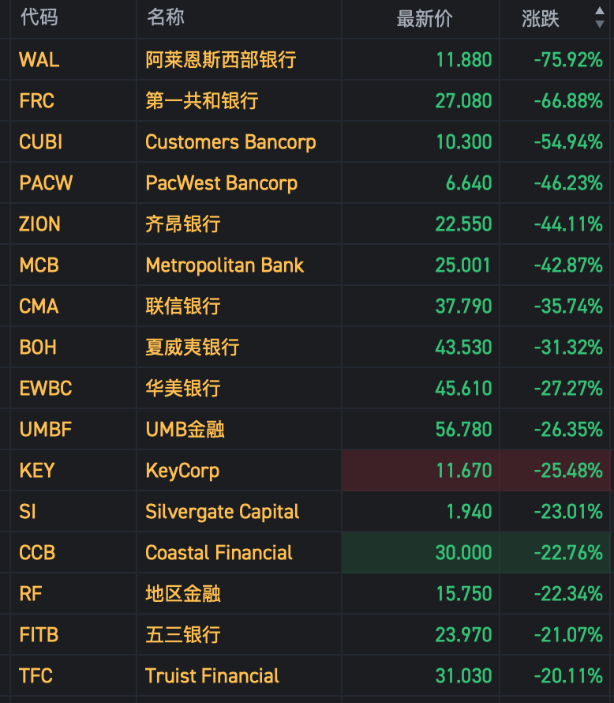

# 美股三大股指翻红 银行股遭恐慌抛售第一共和银行暴跌67%

尽管美国多个部门联手为硅谷银行储户提供了支持，但更多地区性银行爆雷引发了投资者恐慌和抛售，另一方面对于美联储可能在年内降息的预期一定程度上提振了市场情绪。

截至发稿，道琼斯指数涨0.43％，纳斯达克指数涨0.14％，此前纳指一度跌超1%，标普500指数涨0.01％。

多家银行股暴跌，第一共和银行停牌，开盘跌67%创纪录最大跌幅。西太平洋合众银行盘初触发熔断，此前跌超40%。阿莱恩斯西部银行停牌，盘初跌近76%。

_美股银行板块跌幅_

美国生物制药公司Provention
Bio大涨260%，获赛诺菲出资29亿美元收购。生物科技公司Seagen涨逾15%，据报道，辉瑞拟以430亿美元收购ADC行业龙头Seagen，加速布局ADC市场。

德国DAX指数跌超3％，英国富时100指数跌2.4％，意大利富时MIB指数、西班牙IBEX35指数跌超4％。

欧洲斯托克600指数跌2.9％。欧洲斯托克银行股指数下跌5.9％，裕信银行跌停，瑞士信贷跌10％。

美、布两油跌势不止，WTI原油跌幅扩大至5％，布伦特原油跌4.5％。

**市场迎来关键一周**

在硅谷银行引发的风波中，市场本周将迎来多项数据出炉。最重要的当属周二公布的美国2月CPI数据。市场预期，2月CPI同比上涨6％、环比上涨0.4％，预计核心CPI同比上涨5.5％、环比上涨0.4％。在硅谷银行事件引发的动荡之外，通胀能否降温成为美联储3月利率决议的关键因素之一。此外，美国2月零售销售数据、2月PPI数据、纽约联储制造业指数将于周三公布。欧洲央行3月利率决议也将于周四公布。

**美监管机构紧急出手化解硅谷银行倒闭危机**

3月13日早间，美国财政部、美联储、联邦存款保险公司（FDIC）发表联合声明，宣布对硅谷银行倒闭事件采取行动。从3月13日周一开始，储户可以支取他们所有的资金，与硅谷银行破产有关的任何损失都不会由纳税人承担。此外，美联储宣布，将向符合条件的储蓄机构提供额外资金，以确保银行有能力满足所有储户的需求。这些资金将通过新设立的、简称BTFP的银行定期融资计划提供，最长可提供一年。存款机构需要用美国国债、机构债和住房抵押贷款支持的证券等合格资产作为抵押品，获得BTFP的贷款。

**暂停加息预期浮出水面！高盛：银行系统面临压力，预计美联储3月不会加息**

高盛在最新报告中指出，硅谷银行风波让美联储等监管机构意识到了加息政策对美国银行系统的压力，因此，高盛预计美联储不会3月议息会议上加息。但同时，高盛强调，考虑到3月后美国经济前景依然存在相当大不确定性，维持美联储将在5月、6月和7月加息25个基点的预期不变；高盛将终端利率较此前预期下降25个基点至5.25-5.5％。

**市场对于欧美央行加息的预期大幅降温**

芝商所美联储观察工具显示，下周不加息的可能性升至40％，加息25基点的可能性为60％。另外，市场对欧洲央行利率峰值的预期跌破3.5％，对英国央行终端利率的定价首次低于4.5％。

**杰富瑞：不认为硅谷银行事件会触发金融海啸，合并是最佳方案**

华尔街知名金融机构杰富瑞表示，解决SVB金融集团旗下硅谷银行破产事件的最佳解决方案是“现在就进行合并”。杰富瑞的首席执行官汉德勒（Rich
Handler）和总裁弗里德曼（Brian
Friedman）强调，他们认为过去一周的硅谷银行事件不会导致2008年的全球金融海啸重现。“2008年，几乎整个金融体系的杠杆过高，充斥着流动性匮乏的负责资产，但今时不同往日。我们认为，在接受审查的这些金融机构范围内，任何问题都是有限和特殊的，换句话说，只要我们保持冷静，它们就不会威胁到整个体系，也不会无休止地蔓延。”

**FDIC前主席敲警钟：继硅谷银行之后，还可能有更多银行倒下！**

自硅谷银行上周五倒闭后，市场上就出现了两种声音：部分人士认为，银行业将面临多米诺骨牌效应，更多银行将面临倒闭；也有人士认为，此次暴雷事件不会影响到整个银行体系。在前者观点中，值得注意的是美国联邦存款保险公司（FDIC）前主席威廉·艾萨克（William
Isaac）的说法。目前FDIC被指定为硅谷银行事件的接管方。当Isaac谈到硅谷银行的倒闭时称，“在我心中毫无疑问，还会有更多的倒闭…在我看来，这很像上世纪80年代。”策略咨询机构The
Bear Traps Report的创始人Larry McDonald也警告称，在SVB破产后，地区性银行可能面临传染风险。

**荷兰国际银行：硅谷银行爆雷后，美元料追随美国银行股走低**

荷兰国际集团说，在硅谷银行倒闭促使投资者下调美联储利率预期后，美元可能会追随美国银行股的走势。分析师克里斯·特纳在一份报告中说，随着美联储为美国银行系统引入新的流动性措施，市场不再预期3月22日的会议上加息50个基点，而是预计加息25个基点。他说，美指周一可能会追随美国KBW银行股指数，尤其是地区银行股指数一起走低。本周，美元指数DXY面临跌破103.5，甚至是102.5的风险。截至发稿，3个月期美元Libor下跌27个基点，为2020年3月以来最大跌幅。

**“新债王”Gundlach：指标“急剧恶化”，强烈暗示美国衰退在即**

有着“新债王”之称的DoubleLine Capital首席投资官Jeffrey
Gundlach在推特发文表示：“美国国债在持续倒挂之后‘急剧变陡’，这强烈暗示这美国经济衰退即将来临。”此外，Gundlach还在推特上表示，正如Dick
Bove在采访中所言，美联储的“净资产”是-1.1万亿美元，因为美联储和硅谷银行有一样的负债/投资期限错配问题，所以美联储能支撑整个系统的办法只有一个：印钱。

**SVB会引发下一场08年金融危机吗？前桥水投委会成员：多虑了！**

硅谷银行（SVB）倒闭后的短短48小时内，FDIC迅速出手接管，美联储推出BTFP救助工具，美财政部为其提供援助资金，储户在硅谷银行的存款得到暂时的安全。随着恐慌情绪的蔓延，尤其是Signature银行接力倒下，投资者还是担心，一场类似2008年的全球性金融危机可能已经来临。Elliott在当地时间周一发布推文表示，美联储、FDIC以及财政部采取的大规模支持措施能够阻止挤兑再次发生，没有保险托底的存款人受到了“全方位”保护。Elliott表示，Elliott认为美国监管机构此次采取的措施“相当不错”，能够避免引发系统性恐慌。虽然这可能远远超过了阻止恐慌的实际需要，但当前形势紧急，大规模的举措可能起到立竿见影的效果。

**美监管机构宣布关闭最大加密货币银行Signature Bank**

美国监管机构当地时间上周日晚间宣布，关闭了总部位于纽约的地区银行Signature
Bank，这是硅谷银行之后被关闭的第二家金融机构。国财政部、美联储和联邦保险存款公司在一份联合声明中表示：“我们还宣布纽约州Signature
Bank也有类似的系统性风险例外，该银行今天被其州特许机构关闭。”这些监管机构表示，Signature
Bank的储户将可以完全提取他们的存款。“这家机构的所有储户都将得到补偿。与硅谷银行的决议一样，纳税人不会承担任何损失。”

**汇丰控股以1英镑收购硅谷银行英国子公司**

汇丰控股周一宣布以1英镑的价格收购硅谷银行英国子公司SVB UK。报道称，出售受灾的硅谷银行英国子公司是英国财政大臣杰里米·亨特（Jeremy
Hunt）的首选，因为这样可以避免政府不得不进行大规模干预来保护储户。硅谷银行英国子公司的有形股本预计约为14亿英镑。收购交易将以现有资源提供资金。该收购事宜不涉及纳税人资金。

**辉瑞拟以每股229美元现金收购Seagen**

辉瑞将以每股229美元现金的价格，按430亿美元的总企业价值收购Seagen。预计在2030年，Seagen的经风险调整后营收贡献将超过100亿美元。辉瑞预计将主要通过新举借310亿美元的长期债务为交易提供资金，剩余资金将来自短期融资和手头现金。

**苹果面临新挑战：超10位关键高管离职**

知名苹果爆料专栏作家Mark Gurman近日发文称，美国科技巨头苹果公司正面临着前所未有的高管离职浪潮。Mark
Gurman表示，从2022年下半年开始的一段时间里，苹果已经失去了11名高管。其中大多数人的头衔都是副总裁，略低于向首席执行官蒂姆·库克（Tim
Cook）汇报的苹果高级副总裁。据了解，他们可以说是苹果公司最重要的人物，负责公司产品的许多核心功能的日常运营。

**Qualtrics同意银湖125亿美元收购要约，溢价高达73％**

国软件技术公司Qualtrics国际国际同意接受私募股权公司银湖和加拿大养老金计划投资委员会（CPP投资）的收购，交易价值为125亿美元。根据协议条款，Qualtrics股东将获得每股18.15美元的现金。

**“车载ChatGPT”正在探索中？通用微软寻求更广泛合作**

据美国汽车制造商通用汽车的一位高管透露，该公司正在探索ChatGPT在汽车领域的用途，这将是其与微软公司更广泛合作计划的一部分。通用汽车副总裁Scott
Miller上周在一次采访中表示，“ChatGPT将应用于所有领域。”据悉，通用汽车正在开发一款虚拟个人助理，使用ChatGPT背后的人工智能模型。Miller认为，聊天机器人可以用来获取有关如何使用车辆功能的信息，也可以帮助了解车内的各项功能，或者安排日程。

**摩根士丹利：仍看好欧洲银行业**

摩根士丹利在一份报告中表示，欧洲强劲的流动性以及欧洲银行的资产负债表结构，应能使其避免出现任何银行被迫抛售债券投资组合的情况。摩根士丹利预计，到今年年底，欧元区的存款贝塔值（银行传递给客户的市场利率变化的百分比），将从目前的14％逐渐增至30％，这将在今年下半年推动欧元区银行业利润率达到峰值，并在2024年继续保持健康的盈利能力。个股首选Caixa银行、联合商业银行、德国商业银行、荷兰国际集团和法国农业信贷银行，波动性和市场信心可能在短期内影响股价，但仍看好该行业。

