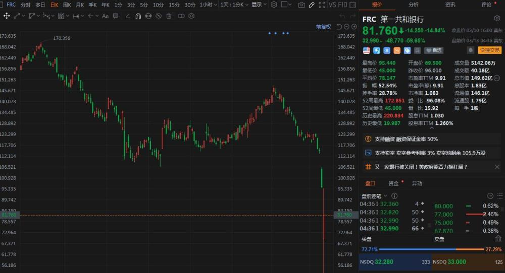

# 美股第一共和银行盘前一度跌超60％：继硅谷银行后，上周遭到挤兑

美股第一共和银行盘前跌超60％，此前两个交易日，最大跌幅一度达60%。继硅谷银行后，该行上周晚些时候亦遭到挤兑。第一共和银行此前称，目前所有可用未使用的流动性资金超过700亿美元。

美国第一共和国银行股价在周五交易中一度下跌52％，最终收盘下跌了15％。投资者对该银行资产的未实现损失以及其对存款的严重依赖表示担忧，这些存款可能会变得不稳定。

投资者对第一共和国越来越警惕，原因与引起硅谷银行担忧的原因类似。与硅谷银行一样，第一共和国在其资产的公平市场价值和资产负债表价值之间显示出巨大的差距。与硅谷银行不同的是，硅谷银行最大的分歧在于其债务证券组合，第一共和国银行的差距主要在于其贷款账簿。

第一共和国银行在其年度报告中表示，截至1月5日，其“房地产担保抵押贷款”的公平市场价值为31亿美元，比其19亿美元的资产负债表价值低3亿美元。该单一资产类别的公允价值差距大于第一共和国136亿美元的总权益。

第一共和国金融资产的公允价值比其资产负债表价值少26亿美元。金融资产包括公允价值为9亿美元的“其他贷款”，比账面价值26亿美元低4亿美元。所谓的持有至到期证券主要由市政债券组成，其公允价值为2亿美元，比其9亿美元的账面价值少29亿美元。

截至1月4日，第一共和国的总存款为90亿美元，占其总负债的31％。大约35％的存款是非生息的。其存款中有119亿美元（5％）没有保险，这意味着它们超过了联邦存款保险公司的限额。

来源：金融界

