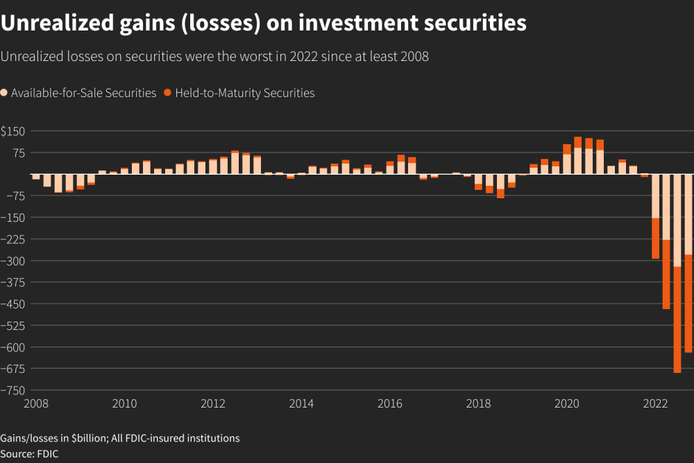

# 耶伦否认救市8小时后，美联储出手，硅谷银行危机解除了吗？

每经记者：蔡鼎 每经编辑：兰素英

整个周末，由硅谷银行（下称SVB）破产导致引发的恐慌情绪和传导效应一直在不断蔓延。

对冲基金大佬比尔·阿克曼持续呼吁美国政府在3月13日亚洲早市开盘前拿出稳定市场信心的方案来，但美国财政部长耶伦12日上午在接受采访时明确否定了政府救市的可能性。这让市场情绪更是紧张万分，一场全美中小银行的提款危机似乎近在咫尺。

就在12日，另一家面临流动性危机的银行Signature Bank也被纽约金融服务局接管。这是继Silvergate
Bank和硅谷银行之后的第三大银行倒闭案。

然而，耶伦这话放出约8小时左右，事情却出现了意想不到的转机。

美东时间12日下午6时许，美国财政部、美联储和美国联邦存款保险公司（FDIC）发表联合声明，称经过各部门讨论并通过美国总统协商之后决定，财长耶伦批准了一些行动，将全力保护SVB所有储户的存款。美联储和美国财政部还利用紧急贷款权限建立了一个新工具，以帮助满足储户的提款需求。

这快速的转变背后到底有着什么样的考量？

尽管有美国政府出面“兜底”，但券商Wedbush董事总经理、高级股票分析师Daniel
Ives在发给《每日经济新闻》记者的置评邮件中指出，SVB事件的影响仍将在整个硅谷持续多年。长期来看，SVB事件后，科技领域未来的融资环境预计将更加紧张，在整体融资环境趋紧的情况下，这仍将增加许多初创企业削减成本的压力。

美联储“祭出”新危机工具：BTFP

美东时间3月12日（周日）晚间，也就是在亚洲市场开始交易前，美国金融监管机构表示，由于人们担心SVB周末发生的挤兑破产会蔓延，SVB的储户可以支取他们的所有资金，同时还宣布了新的措施，以支持整个银行提供的存款提取。

美联储、美国财政部和联邦存款保险公司发布的联合声明 图片来源：美国财政部官网截图

在一份联合声明中，美联储、美国财政部和联邦存款保险公司（FDIC）表示，“
**在收到FDIC和美联储董事会的建议，并与总统协商后，财长耶伦批准了一些行动，使FDIC能够以充分保护所有储户的方式完成对SVB的清算。** ”

声明还称，“从3月13日（周一）开始，储户可以使用他们所有（在SVB）的存款。与SVB破产有关的任何损失都不会由纳税人来承担。”

美联储还表示，将通过一项新安排向银行提供流动性，帮助确保各大银行能够满足储户的取款需求。简单来说，美联储的这种做法是为美国金融系统的所有存款提供担保，无论其有无存款保险。

具体来讲， **美联储将通过创建新的银行定期融资计划（the Bank Term Funding
Program，下称BTFP）提供资金，向银行、储蓄协会和信用合作社提供最长一年的贷款，将用美债、机构债务和抵押贷款支持证券以及其他合格资产作为抵押品。**

根据美联储的说法， BTFP将成为高质量证券的额外流动性来源，让机构不必在面临压力时急着出售这些证券。美联储还表示，该行正在密切关注金融市场的发展。

“美联储准备应对任何可能出现的流动性压力，这一举措将增强银行系统保护存款的能力，并确保向经济持续提供货币和信贷。”美联储在一份新闻稿中表示。

图片来源：路透社

这对陷入危机的银行来说无疑是救命稻草，根据FDIC的数据，今年2月，美国各大银行在可售证券和持有至到期证券上面临超过6200亿美元的未实现亏损。就在一年前，同样的账目亏损仅为80亿美元。

美联储官员：措施旨在减少SVB事件的传导效应

《华尔街日报》报道称，由于SVB破产造成的恐慌情绪在上周末持续蔓延，美联储主席鲍威尔取消了原定于周日在瑞士巴塞尔召开的央行行长例会的计划，而是留在华盛顿处理危机。

彭博社报道中称，该贷款安排由美联储设计，旨在覆盖美国银行系统中所有承保存款，并将得到美国财政部250亿美元外汇稳定基金的支持，不过官员们预计不会动用该基金。美联储官员在美东时间周日晚间的电话会议上对媒体表示，
**这些措施旨在提供更多流动性，减少SVB事件的传导效应，并有助于防止恐慌情绪蔓延到中小型银行。**

《每日经济新闻》记者注意到，美联储并不是在购买银行的证券，而是根据银行的账面价值来发放贷款。而银行获得了估值更高、风险更低的长期流动性保证。

美东时间周日晚些时候，一位美国财政部官员在与媒体的通话时也指出，政府确实寻求竞购SVB的资产，但考虑到形势的不稳定性，官员们选择不进行竞购。由于政府机构计划于周一上午开始营业，监管机构认为，最好依靠存款保险基金来确保储户可以正常取款。

财政部官员指出，一些机构与SVB银行有相似之处，因此对这些机构储户的担忧仍然存在。

与美联储的立场类似， **美国财政部官员强调，这些措施保护的是储户，而不是投资者，**
并否认这些措施构成纾困的说法，因为SVB的股权和债券持有人仍将会蒙受亏损。

又一家银行倒闭

美联储、美国财政部和FDIC的联合声明同时还宣布了另一家面临流动性危机的银行倒闭。

声明显示，总部位于的纽约的Signature
Bank也已经被纽约金融服务局接管，所有储户都将得到全额补偿。纳税人不会承担任何损失，储户13日起可以提取他们的存款，但Signature的股东和无担保债权人将不受保护，此外该行管理层已被撤职。

数据显示，截至2022年年末，Signature Bank总资产约为1103.6亿美元，存款总额约为885.9亿美元，近四分之一的存款来自加密货币领域。

Signature Bank是一周内第三家倒下的美国银行，Silvergate Bank和硅谷银行分别于上周三和周五倒闭。纽约州金融服务局负责人
Adrianne Harris表示，采取这一行动是为了保护储户。

FDIC当地时间12日发布声明称，已设立Signature Bridge Bank接管Signature Bank，已将Signature
Bank的所有存款和几乎所有资产转移至Signature Bridge Bank，后者由FDIC运营。此外，FDIC任命Greg D.
Carmichael为Signature Bridge Bank的首席执行官，Carmichael此前担任Fifth Third
Bancorp的总裁兼首席执行官。

华尔街机构：科技领域未来融资环境将更紧张

《华尔街日报》报道中还称，联邦政府的强力干预可能会结束近年来对中小银行实施的“后金融危机”时代监管措施的退步。官员们周日表示，他们正在考虑更为严格的资本要求和流动性规则，至少扭转了特朗普政府期间为放松对小银行的限制而采取的部分措施。

与此同时，联邦监管机构正试图在 **防止更广泛的金融危机的蔓延** 以及 **避免牺牲纳税人利益来救助金融机构而造成负面政治后果** 这两者之间取得平衡。

《华尔街日报》报道截图

美国券商Wedbush董事总经理、高级股票分析师Daniel
Ives在发给《每日经济新闻》记者的置评邮件中指出，“自从上世纪90年代末以来，SVB一直是科技领域不可或缺的一部分，该行被视为硅谷科技生态系统的重要动脉，在科技初创公司的涌现中发挥了不可或缺的作用，尤其是在互联网泡沫之后。随着SVB的爆雷，我们相信这家美国史上第二大银行倒闭案将对科技行业产生长期的影响。”

Daniel
Ives对记者指出，SVB事件造成的短期系统性影响可能很小，因为美联储已经“兜底”。尽管他们覆盖的很多上市公司在银行关系方面似乎都很多元化，但有消息称，拥有信贷额度的私营科技公司被要求整合它们在SVB的存款，这就造成了这些公司无法提取存款和发放员工工资的风险。“但是，
**随着美联储的介入，并表示储户能够提取存款，这消除了上周引发银行挤兑的最大风险因素，因此短期的影响应该很小。** ”

“ **SVB事件后，我们预计科技领域未来的融资环境将更加紧张。**
对于最终面临更高现金消耗、未来环境更加不确定的初创企业来说，未来银行贷款和其他形式的债务融资面临的障碍将是另外一码事。在整体融资环境趋紧的情况下，这将增加许多初创企业削减成本的压力，人们将更加关注那些未经验证的科技初创企业的各种信贷额度。”Daniel
Ives对《每日经济新闻》记者补充道。

每日经济新闻

