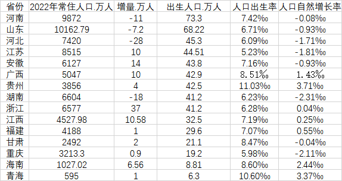

# 15省份去年人口数据出炉：河南、山东等8个省份人口自然增长率为负

近期，各省份正陆续发布2022年的人口数据。

根据第一财经记者梳理发现，目前已有15个省份公布了2022年的人口数据。在15个省份中，有11个省份实现常住人口正增长。从出生人口来看，各省人口出生率全部下滑，人口死亡率普遍略有上升，河南等地人口自然增长率多年来首次转负。

3月14日，福建省统计局发布的《2022年福建省国民经济和社会发展统计公报》显示，2022年末常住人口4188万人，比上年末增加1万人。其中，城镇常住人口2937万人，占总人口比重（常住人口城镇化率）为
70.11%，比上年末提高0.41个百分点。

这也是福建省城镇化率首次突破70%大关。第一财经记者梳理发现， **福建也是全国第9个城镇化率超过70%的省份。**
这其中，上海、北京、天津三个直辖市城镇化率超过了80%，广东、江苏、辽宁、浙江、重庆和福建城镇化率在70%-80%之间。

在出生人口方面，数据显示，去年全年福建人口出生率为7.07‰，人口死亡率为6.52‰，自然增长率为0.55‰。年末户籍人口数为3961.59万人，比上年末增加15.7万人。

第一财经记者据此计算，去年福建出生人口为29.6万人，比上一年减少4.9万人，
**这也是多年来福建出生人口首次跌破30万大关。相比2017年，近5年来福建出生人口下滑51.2%。**

去年，福建人口出生率比上一年下降1.19个千分点，人口自然增长率下降了1.43个千分点。与全国水平相比，福建人口出生率比全国水平高0.3个千分点，人口自然增长率比全国水平高1.15个千分点。

厦门大学经济学系副教授丁长发对第一财经分析，受传统宗族文化、生育文化影响,福建东南部的泉州、莆田等地生育意愿比较高。另外，福建原有的国有经济占比低，计划生育政策影响比较小，生育率较高，这也形成了一定的惯性。不过，虽然福建的出生率和自然增长率仍高于全国水平，但与全国一样，福建的人口出生率也显著下滑。随着经济社会的发展，城镇化率的不断提高，婚育成本的提高，人们生育意愿也在不断下降。“即使像闽南地区，很多人进入城市后，生育观念也改变了。”

包括福建在内， **目前已有15个省份发布了2022年人口数据。**
其中，有11个省份实现常住人口正增长，浙江、安徽、江西、广西、江苏人口增量均达到或超过了10万人。其中，浙江增加37万人，在已公布的省份中增量位居第一。

在出生人口方面，15个省份中，去年出生人口超过50万省份有河南和山东，其中河南去年出生人口为73.3万人。山东去年出生人口近几十年来首次跌破70万大关，为68.22万人。其他省份中，河北、江苏、安徽、广西、贵州、湖南和浙江出生人口位于40-50万之间，其中河北是近几十年来首次跌破50万。

相较于上一年，已公布数据的15个省份2022年人口出生率全部下滑，人口死亡率普遍略有上升。在出生率普遍下滑、死亡率上升的同时，有多个省份人口自然增长率近几十年来首现负增长。15个省份中，有8个省份人口自然增长率为负。其中河南人口自然增长率62年来（自1961年开始）首次出现负增长。山东、安徽和甘肃的人口自然增长率也是多年来首次转负。

_15省份2022年人口数据（来源：第一财经记者根据各地统计局数据整理）_

