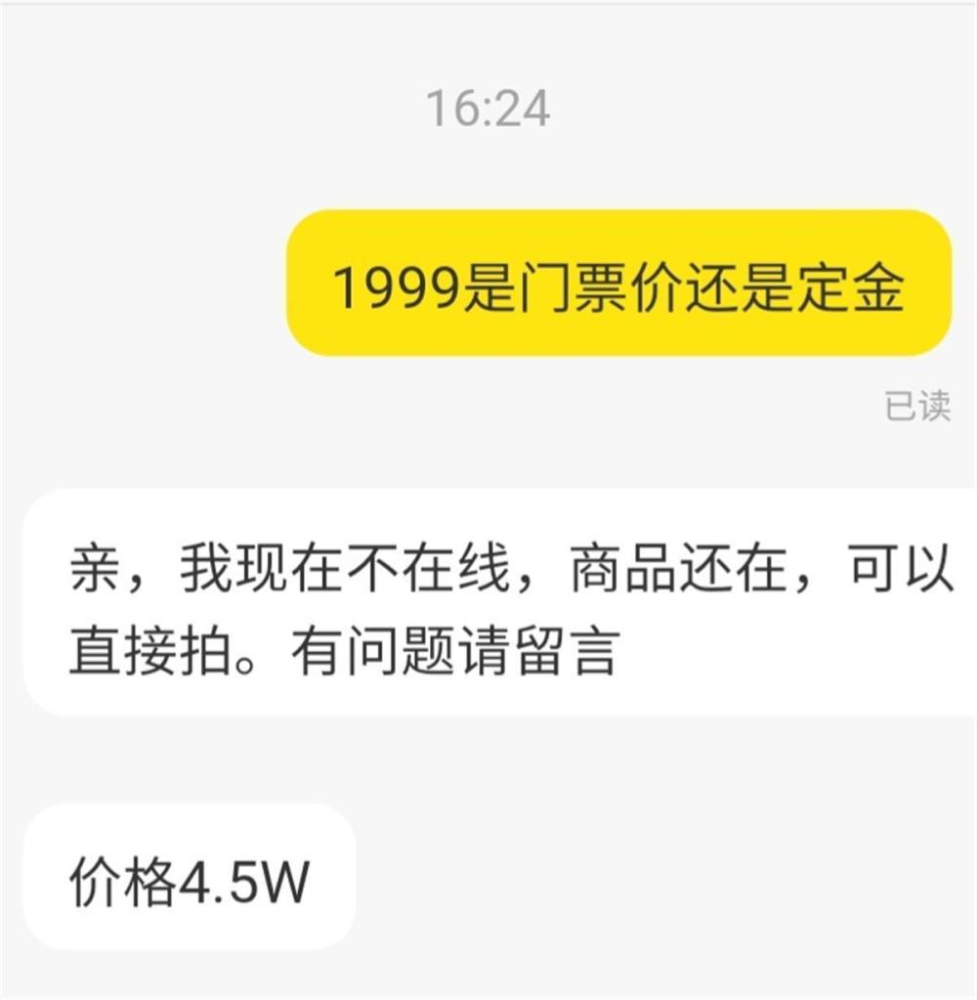
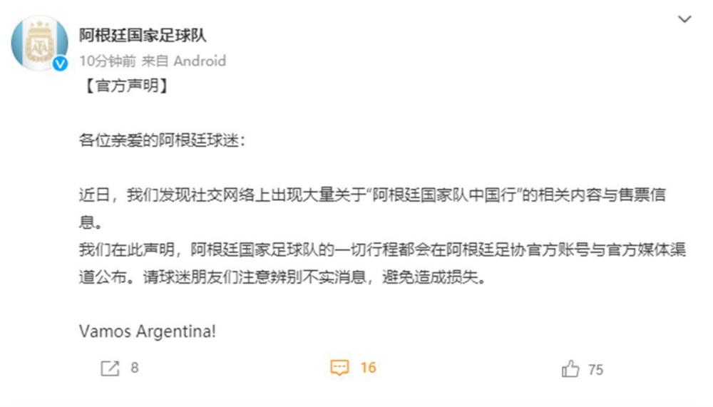

# “阿根廷国家队中国行”门票被炒至4.5万元？球队官微发声

极目新闻记者 满达

阿根廷国家足球队官方微博3月14日发布消息称，近日，社交网络上出现大量关于“阿根廷国家队中国行”的相关内容与售票信息，阿根廷国家足球队的一切行程都会在阿根廷足协官方账号与官方媒体渠道公布，请球迷朋友们注意辨别不实消息，避免造成损失。

_商家售卖门票的展示页_

_记者和商家的对话_

极目新闻记者注意到，在一些二手交易平台和社交网络，已有人在叫卖阿根廷国家队中国行的门票，称6月12日西安站为阿根廷队对战中国队，6月20日深圳站为阿根廷队对战巴拉圭队。有的商品售价为1999元，极目新闻记者私信该卖家，询问1999元是定金还是门票，对方回复称价格为4.5万元。

_商家称门票、签名和合影均可安排_

还有的商品标价为500元，内容为需要门票、签名、合影均可安排。有网友称，这个只是随便标价，具体价格估计要和商家详谈。

_阿根廷国家队官方微博的声明_

对此，阿根廷国家队官方微博提醒阿根廷球迷称：近日，我们发现社交网络上出现大量关于“阿根廷国家队中国行”的相关内容与售票信息。我们在此声明，阿根廷国家足球队的一切行程都会在阿根廷足协官方账号与官方媒体渠道公布。请球迷朋友们注意辨别不实消息，避免造成损失。

极目新闻记者注意到，目前该官方微博暂无“阿根廷国家队中国行”的行程消息。

（来源：极目新闻）

