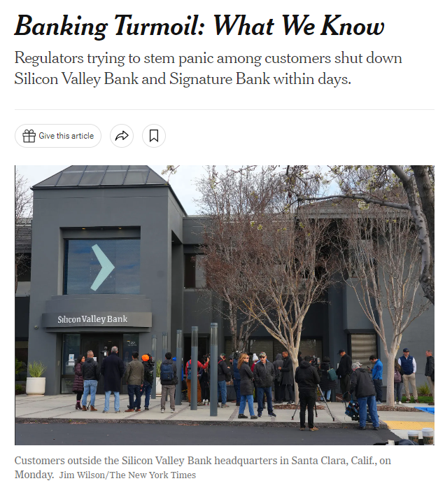
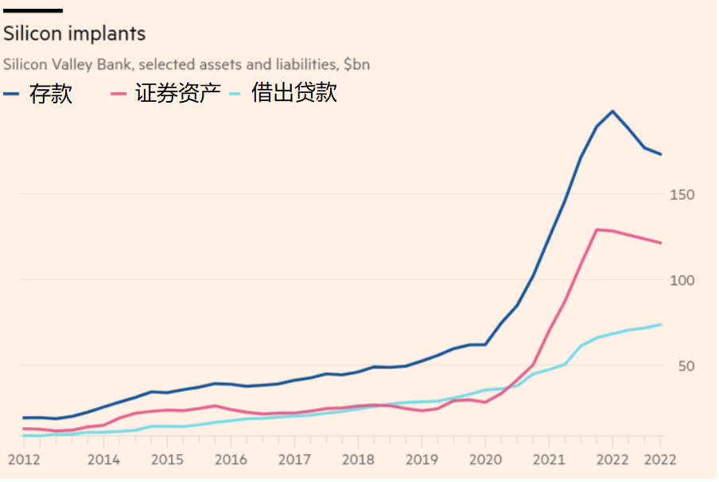
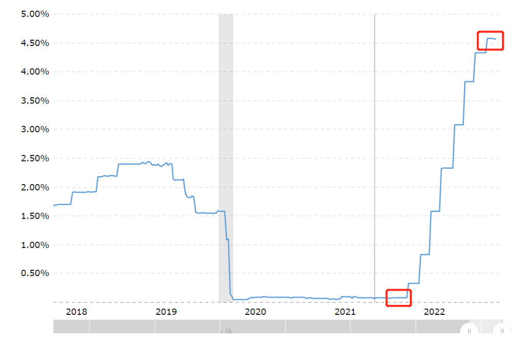
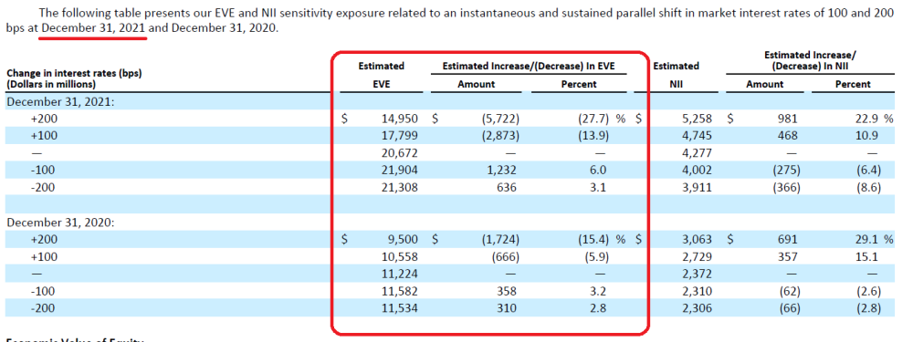

# 一文读懂硅谷银行破产事件背后原因，为什么说它成不了“雷曼第二”

【文/观察者网专栏作者 闻博】

近日，国际金融圈的头号新闻无疑是美国硅谷银行暴雷。

从上周三（3月8日）开始仅仅经过两天，资产规模超千亿美元的硅谷银行（Silicon Valley
Bank，SVB）便宣布因资不抵债，被美国监管机构接管。美国股指应声大跌，中文自媒体纷纷跟进，其中不乏大喊“第二次雷曼时刻”的鼓噪。

_美媒相关报道_

这次暴雷究竟是怎么回事？真的是“雷曼第二”么？更重要的是，中国金融业是否会受到牵连？

虽然目前事态还在发展中，但是有必要静下心来梳理一遍来龙去脉，避免没有必要的恐慌情绪。

**问题出在哪里？**

首先，简单回顾一下硅谷银行的问题是怎么产生和发酵的。

大家都知道银行的利润主要来自于借贷业务的利息差，因此只要有机会，银行是不会把客户的存款留在自己账上的，而是会尽量借贷出去，特别是通过购买各种债券。

_硅谷银行的主要资产与负债变化
（图源：金融时报）_

而如上图所示，自疫情开始以来，硅谷银行就开始面临烦恼：美国的刺激政策带来大量存款，而宽松政策又把利率打到几乎为零（0.08%），手里的钱开始变多而市场上的钱更多，很难贷出去；于是硅谷银行选择一股脑儿地用这些钱买了各类债券，其总量高达910亿美元，而且其中大部分是中长期的房贷抵押证券和美国国债。

这里解释一下国债的一些金融属性，具备一定金融基础的读者可以跳过。

简单来说，国债就是以一定价格买入，比如95元，国家承诺购买人在国债到期时，比如两年后偿付面值100元，其中的价差5元便是利息，利率是5/95/2=2.63%。如果在到期前国债不能交易，那这种国债就没啥流动性，持有者只能持有到期换取本息。但很多情况下，国债在到期前是可以自由买卖的，因为在金融市场上一切有价值的东西都可以买卖，国债这种非常安全的产品自然也不例外。

有买卖自然有价格，而到期前国债的价格则取决于市场当时的利率。这里我们设想一下利息上升到了3%会如何：如果此时存一笔94.34元在银行，两年后可得本息共100元，因此，投资人是不会接受出价高于94.34元的国债转让的。换句话说，利息上升，国债的市场价会下跌。而且通过类似计算不难得出：债券的期限越长，其价格受到利率变化的影响越大，当利率上升时，长期债券的价值会比短期债券下降得更快。

如果理解了以上内容，那恭喜你，你已经了解了硅谷银行的主要问题了。

随着去年美国利息大幅攀升，一方面，各类中长期债券的市场价值迅速缩水；另一方面，由于利息高企，市场上的融资越来越困难，存款资金自然越来越少。偏偏硅谷银行的客户又主要都是科技公司和初创企业，融资是这些企业的生命。

因此，美联储的加息政策构成了对硅谷银行的双杀：既给它的资产端造成不小损失，又迫使它的客户不断收回存款，最终导致上周硅谷银行的技术性资不抵债，随之而来的是一天420亿美元的挤兑，使得流动性危机彻底爆发。

_一年多来美联储的加息力度_

但是，这并不是问题的全部。

以上问题可以说很多美国银行多少都会面临，并不是硅谷银行所独有，而这次偏偏是硅谷银行捅了篓子。目前来看，导致其短短两天内被接管的主要原因必然不仅限于此。

比如，经营业务过于单一。

作为硅谷本地的银行，硅谷银行所服务的客户，自然也就集中于创业公司、高科技公司等类型的企业。这些企业在过去长达10多年的经济繁荣中获得了惊人的增长，这无疑给硅谷银行带来了巨大的业务增量，但同时也让硅谷银行的业务越来越趋向于同质化，换句话说就是分散风险的功能远弱于一般的银行。

同时，正是由于硅谷银行的主要客户都是类似的高科技企业，因此大量企业客户使得硅谷银行的客户结构高度趋向于大客户，也就是说大部分客户存款都是大于25万美元的存款保险限额。这使得一旦危机爆发，有95%的存款是不能直接被美国的存款保险保障的。

此外，银行的风控也出了大问题。

经过2008年经济危机以后，不论是监管机构还是银行自身，对于风险管理的要求都远高于以往。因此，如今在银行内部，风控部门或者说风险管理部门，往往是独立于财务部门，并单独向CEO汇报的。绝大多数银行都会设立一个首席风险官（Chief
Risk Officer，CRO）的职位平行于首席财务官（Chief Financial
Officer，CFO），两者平行向CEO汇报，以保证风控业务的独立性。

然而，根据过去两年的监管报告，硅谷银行从去年4月到今年1月间，有长达8个多月的CRO空缺，而回过头看，这段时间又正好是该银行风险迅速积累恶化的阶段。虽然现在要评价CRO的缺位究竟对这次暴雷事件起到多大作用还为时尚早，但对于一家中等规模的银行来说，这种缺位是极不正常的。进一步挖掘之下，可能会有更多内部管理和不作为的情况被曝光出来。

目前国内很多舆论把焦点放在曾在雷曼兄弟担任过投资高管、现任硅谷银行首席行政官（CAO）的Joseph
Gentile身上，但CAO不是CEO，他只负责行政事务，并不参与投资决策和风险管理，因此仅仅因为其雷曼的履历就言之凿凿，有背景歧视的嫌疑。这种“奇妙的关联”确实是很多吃瓜群众的兴奋点，不过不能因此忽视关键时期长期空缺首席风险官这一重大异常。

更详细的情况，其实从硅谷银行每年度按要求提交的监管报告就能看出端倪。

按照美国联邦监管法案要求，所有上市公司，包括银行，每年度都要向美国证监会提交被称为10-K表的披露报告，这份报告会详细反映该公司的财务运行状况，其中自然包括各项风险披露。笔者对比了2021和2022会计年度的10-K表，注意到了两年度中在关于利息风险的评估上存在不小瑕疵和信息缺失。

例如，在2021年度的报告里，硅谷银行披露了在利息上升200个基点（也就是2%）的情况下，公司的金融资产和利息收入的变化预测。可以看到，硅谷银行所做的最坏假设也不过是利息增长2%，而实际上美联储加息达到了4%以上，远远超出了风险预测的最坏假设。即使在2%的加息假设下，硅谷银行的权益经济价值也会向下打七折，可想而知在4.5%的加息力度之下，其资产减值会有多严重了。

_2021年度硅谷银行（SVB）的利息风险评估报告（图源：2022年初SVB提交的10-K表）_

同时，在危机爆发前1个月提交的2022年度披露中，同一部分的表格中却缺失了关键的资产价值风险评估，这部分就像从表格里被人抠去了一般。

照理来说，这种类型的信息披露报告应当做到连续年度的信息连贯和一致性，这一重要信息缺失显得极不正常，不知信息披露时是否已经引起监管部门的关注。

_2022年度SVB的利息风险评估报告（图源2023年初SVB提交的10-K表）_

换句话说，硅谷银行既严重低估了加息的可能幅度，也在关键年份没有提供详细的资产风险评估。这点联系到CRO职位的长期空缺，可以预测在事后责任追溯上，相关高管逃不了责任。

**监管上的疏失**

另一个问题是，为什么作为银行业监督标准的《巴塞尔协议》（Basel III）没能预防这次事件？

要知道Basel
III有两个核心指标：LCR与NSFR。前者叫流动性覆盖率，衡量高质量可流动性资产对于银行短期现金流的支持程度；后者是净稳定资金比率，评估按照流动性加权后的资产负债情况，其中对于长期债券的权重赋值为0。

通俗点说，如果按照这两个核心监管指标披露，资产端大半是长期债券的SVB早就应该在流动性指标上报红灯了。然而，市场和监管为何没能通过披露信息提前发现问题？

关于这点，也不难从SVB的公开披露中找到关键：

呃……“由于资产少于2500亿美元，本银行属于监管要求的第四类银行，故不必遵守美联储关于LCR及NSFR的监管要求。”

本来，虽然Basel III作为非强制规范是针对大型的国际银行的，但是国家在实践中会对整个银行业实施Basel
III，从严监管没有问题。但美国作为金融业游说事业繁荣的国度，监管机构便真的只对大型国际银行“从严”，SVB这种地方性银行自然成了监管死角。

**金融危机又要来了吗？**

以目前的情况来看，SVB和纽约签字银行的关闭可以说是近期重大事件，已经震动了银行业，并引发了对金融系统稳定性的担忧。这两家银行是科技公司和加密货币公司最大和最突出的贷款人之一，它们的倒闭使许多客户和债权人陷入困境。

然而，现在还很难说是否会引发更深层次的危机，影响其他银行或市场。

目前暴露出来的资金缺口有限，美国政府和监管部门已经迅速采取了救市行动填补缺口，以安抚储户并防止事态扩散和危机蔓延。

美联储、财政部和联邦存款保险公司宣布了紧急措施，以支持所有的存款，提供流动性支持，促进有序的解决和监测市场发展。拜登也表示，他会与国会合作，通过立法来加强金融监督和消费者保护。

鉴于拜登本人并不具备深厚的金融背景，估计他的决策也不会偏离目前银行业与行业监督机构的决策建议。并且，明年的美国大选也很大程度上取决于今年的经济形势，因此虽然情况严重，但美国当局为了各种利益，也有动机进行积极协调、应对和干预，以控制损失、恢复信心。结果如何将取决于这些措施的效果如何，以及是否有任何不可预见的冲击或并发症可能使危机恶化。

同样，此事对亚洲金融市场及其稳定性的影响将是负面的，但还是比较有限；主要的传播渠道是通过贸易、投资和市场情绪波动。

贸易方面，这两家银行是在亚洲有大量业务和客户的科技公司和加密货币公司的主要贷款人。它们的失败可能会扰乱这些行业的供应链、支付和融资运行，影响亚洲的出口商和进口商。

投资方面，这两家银行也是亚洲初创企业的积极投资者，特别是在金融技术、电子商务和生物技术领域。它们的倒闭可能会减少这些企业的资金供应，并降低其估值和退出机会。

市场情绪上，可能会削弱投资者对美国银行系统的信心，并引发全球投资者向安全地带逃离。这可能会导致一些亚洲经济体的资本外流、货币贬值和借贷成本上升，特别是那些基本面较弱或对美国市场风险较高的经济体。

然而，这些影响可能会被几个因素所缓解，比如：

1.美国市场对问题的有效遏制，阻止危机蔓延；

2.亚洲经济体的复原力，疫情基本结束后，这些经济体都恢复得不错；

3.亚洲贸易和投资伙伴本来就更具多样化；

4.大多数亚洲中央银行充足的外汇储备和政策缓冲；

5.对黄金的强劲需求，这是亚洲投资者的传统避险资产。

因此，虽然短期内可能会有一些波动和不确定性，但亚洲金融市场有望保持稳定，并经受住硅谷银行和纽约签字银行破产所带来的冲击。

对中国金融市场来说，硅谷银行的风险事件也具有相当大的参考意义。

对于经常关注金融新闻的读者来说，想必对去年以来存款总量不断上升以及越来越多的大规模提前还贷并不陌生。可以说，这和硅谷银行在2020年出现存款大量增加，而同时又很难借出贷款的情况是非常相似的。

特别是考虑到硅谷银行和一些地方的村镇银行在各自的金融系统中都算不大不小的金融机构，又在一定程度上处于监管的焦点之外，因此它们所面临的系统性问题也是类似的。

虽然眼下的基本经济和金融形势决定了我们短期内不会出现大幅加息的情况，但是美国的前车之鉴对我国的金融业和监管部门仍具有不可忽视的借鉴意义。

**本文系观察者网独家稿件，文章内容纯属作者个人观点，不代表平台观点，未经授权，不得转载，否则将追究法律责任。关注观察者网微信guanchacn，每日阅读趣味文章。**

