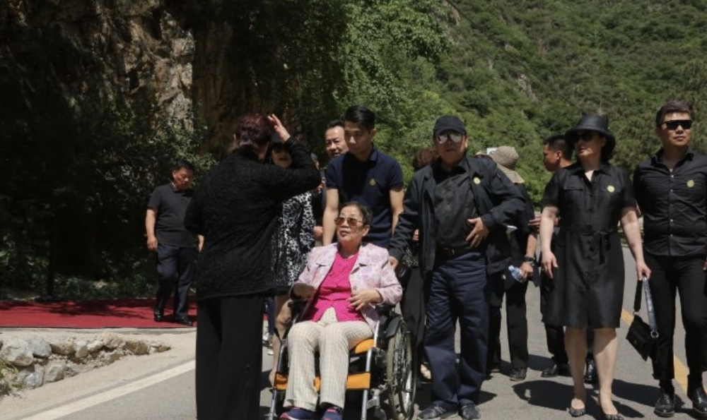

# 一路走好！86版《西游记》编剧之一戴英禄去世，六小龄童发文痛悼

3月14日，根据六小龄童透露的消息，国家一级编剧，央视版《西游记》编剧之一，戴英禄先生辞世，与另两位编剧杨洁导演、邹忆青老师天上相聚。

此外六小龄童还晒出一张与戴英禄先生的昔日黑白合照。照片中的六小龄童风华正茂年少有为，根据面部状态来看，戴英禄要比六小龄童年长十几岁。

当年戴英禄从黑龙江大学中文系毕业后便去了中国京剧院工作，这一干就是三十多年。他是中国内地男编剧、国家一级编剧、中国戏剧家协会理事、中国戏剧文学会理事。担任过电视连续剧《西游记》的编剧，曾与同僚合作编写京剧《贞观盛世》、剧集《乐昌公主》等，曾获得多个大奖。

当初杨洁筹拍《西游记》的时候找到戴英禄参与编剧工作的时候，剧院的负责人十分不解为什么要找京剧剧作家参与电视剧的创作。后来是央视的领导出面，才成功将戴英禄借调到《西游记》的剧组。

之后他和邹忆青一起从1980年开始，创作了25集《西游记》，直到1986年才拍摄完成，耗时6年。

当时因为要拍摄电视剧，而这也是首部基于名著拍摄的电视剧，所以如何改编十分谨慎。在他和邹忆青工作开始最初，便定下了“忠于原著，慎于翻新”的原则。正是因为这个原则，才造就了成为经典的一大元素。在《三打白骨精》《大圣闹天宫》中能清晰地看到些许京剧的影子。

后来戴英禄又和邹忆青一起改编了新戏《北国红姑娘》，此剧后来获得了“五个一工程奖”。

此外，86版《西游记》的片尾曲《取经归来》也有戴英禄的身影哦。该歌曲是由戴英禄作词，蒋大为演唱。

在过去的30年间，戴英禄与老搭档邹忆青一起合作编写了近三十部戏曲剧本，圈内地位可见不一般。

正如六小龄童所说，戴英禄先生可以与杨洁老师和邹忆青老师相聚了，一路走好！

