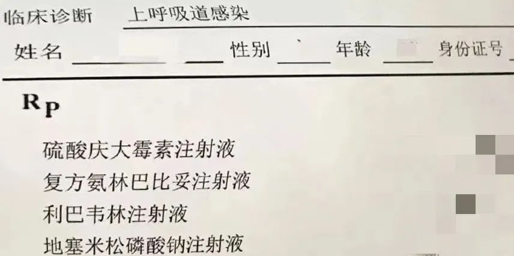
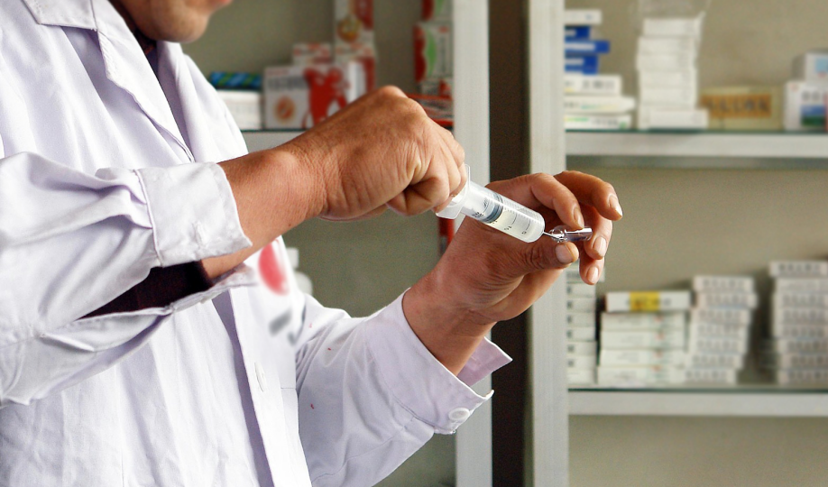
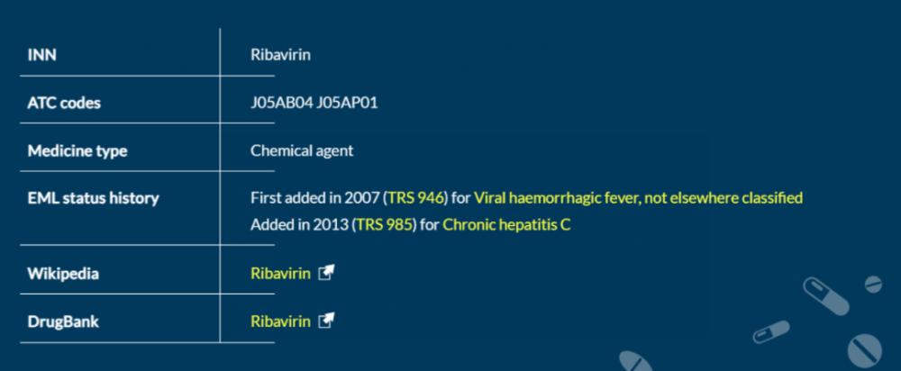
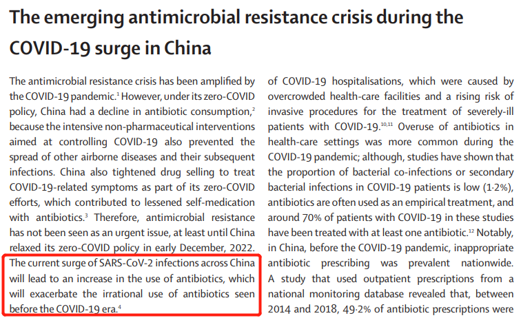

# 一针见效的“神针”，到今天已经被滥用30年

新冠高峰才过去月余，近两周各地又迎来流感季。城市里，有发热门诊彻夜的长队、医院药房断货的奥司他韦，而农村和乡镇也在以不同的方式度过。

在华东某村，卫生院并不是多数村民治感冒的首选，上罗大夫那儿打一针才是——罗大夫是村里的赤脚医生，「一针治感冒」，撑起了他的「神医」口碑。

村民陈丽琴也和大家一样信任罗大夫：「他连新冠都只要几针就能治好，而我过年在县医院治的新冠，拖足了两个星期。」

「我以前到乡卫生院问过能不能给打『感冒针』，医生说不能，想打消炎药也要先做检查、抽血。」

可是在村里大多数人眼中，感冒发烧还要做检查，钱和时间都消耗不起。
**卫生院医生说的耐药性、毒副作用，他们大多一知半解，甚至将信将疑。生活要求他们尽快消除症状，省钱和好得快就是最核心的诉求。**

同样的事，在许多不同的农村和乡镇都正在发生。从卫生院的候诊区，到诊所门口的一排排塑料椅，都坐满了等着打针的病人。没有谁期待测了抗原用什么药抗病毒、血检后决定要不要抗生素。

**一针「感冒针」，是基层最主流、最有口碑的治疗方案。**

**新冠高峰后的流感季，「感冒针」还是主角**

所谓「感冒针」，是「抗生素＋抗病毒＋解热镇痛＋激素」的肌肉注射组合，不同医生组方会有些许不同。

首先，抗生素并不会先查血再决定如何选择，而会使用克林霉素、林可霉素、庆大霉素等相对广谱、便宜的种类，甚至联合使用。第二，抗病毒用药也不会通过症状经验性选择，更不会测抗原判断流感类型，而是使用广谱的利巴韦林。

第三，解热镇痛不使用布洛芬、乙酰氨基酚这些单一成分的药品，而用安痛定。安痛定本身就是一种复方药物，含有安替比林、氨基比林和巴比妥钠。

前两种为 NSAIDs，氨基比林半衰期长（12 小时）但起效慢，安替比林则半衰期短（1～4
小时）但起效快，两者配伍实现既速效、又长效。而第三种成分巴比妥纳，则既有镇静作用，又能协同解热镇痛。

而糖皮质激素地塞米松兼具抗炎、免疫调节、抑制下丘脑对致热原的反应的作用，则加成了其他组分的效果。

**似乎可以这么总结：所有和感冒症状相关的药，「感冒针」做到了一针打尽。**

_「感冒针」处方 图源：医生提供_

华中某镇卫生院医生徐卫宁，今天看了三十几个病人，近一半处方用了「感冒针」。

「几乎都是病人自己要求，说就开上次的针。」

在刚刚过去的新冠高峰期，徐卫宁所在的卫生所病人骤增，在几天之内从每天三四十直奔两三百。很多老人发热三四天了才来，缺设备看不明白到底有没有肺炎，甚至因为患者太多，连查血都难以保证。

「在卫生院四年多，『感冒针』早有耳闻，但我从不主动开。」徐卫宁说，
**「但当时缺人、缺药、缺检查设备，新冠特效的抗病毒药就不用说了，输液器都缺，布洛芬也只撑了两三天。到了什么都缺的时候，就顾不得了。」**

发烧到 39℃ 以上的病人、六十岁以上的老人，徐卫宁和同事尽量了解基础疾病情况，看看血象、胸片。而更多的病人会直接开「感冒针」。

「感冒针」通过肌肉注射给药，相比输液大大缩短了病人在院时间；没了头孢、克林，还可以用林可、庆大，药品就显得相对充足；用上安痛定和激素，病人一定能退烧、周身疼痛能快速缓解；足够「广谱」的用药，也减少了问诊、检查所需要的时间和精力。

**在高峰中的那几个星期，徐卫宁在现实的挣扎中，还是接受「感冒针」的一项项「优点」。**

_图源：视觉中国_

高峰过去后，徐卫宁不止一次反思过给病人打「感冒针」，是不是自己的科学意识开始滑坡。
**但被他形容为「兔子急了咬人」的应急措施，却收获了比往常多得多的肯定：** 「一位大娘还夸我治新冠比平时治感冒强，年轻人也进步了、有两把刷子了。」

「他们（病人）只知道赞『感冒针』好用、良心医生良心诊所，其实很多都不知道用的哪些药。」现在应急时期过去了，今年的流感季却让徐卫宁感觉到了空前的为难。

因为新冠时遗留的好印象，要求打「感冒针」的病人比原先多得多。对此，徐卫宁依然有自己的坚持：
**「新冠高峰是一时的，但感冒不是，我不会主动开『感冒针』。」**

**「当然了，我的坚持不一定有多大用，到了诊所和赤脚医生那里，只会用得更多。」**

其实就算是诊所的大夫，也并非不懂「感冒针」存在的规范性、安全性问题。「这个处方不必是呼吸科专家，很多医生看到都会觉得离谱。但所幸也没出过事，就一直用下来了。」华南某镇诊所医生郑昌林表示。

「虽然在用，但一般也不会和患者说明这针里都有哪些药。」

**一边劝熟人不要打，一边每天开出十几针**

「患者开玩笑说，诊所医生比我会治病。」

华北某三甲医院副主任医师陈延聊起「感冒针」在基层的使用，觉得情有可原，又十分无奈：「这一大套药当然会见效，但显然既不规范又不安全。」

感冒一般分为「普通感冒」和「流行性感冒」，可能需要且有特异性抗病毒治疗药物的是流行性感冒，由甲、乙、丙三型流感病毒引起。而普通感冒病原体为鼻病毒、冠状病毒、副流感病毒等，一方面尚无特异性抗病毒药物，另一方面免疫系统在
3～5 天内就可以把病毒清除。

1972 年广谱抗病毒药利巴韦林问世，「病毒唑」这个俗称，让人以为它对什么病毒都管用。事实上，国食药监注 [2006] 69 号文件已写明：
**本品适用于呼吸道合胞病毒引起的病毒性肺炎与支气管炎，皮肤疱疹病毒感染** [1] **。** WHO 现行基本药物标准清单提示：
**「利巴韦林用于治疗丙型肝炎和一些病毒性出血热的治疗。」**

_利巴韦林用药信息 图源：WHO
基本药物标准清单电子版_

同时，在 WHO 药品不良反应数据库中，利巴韦林的不良反应报告共 96353 份（截至 2023 年 3 月 5 日），涉及不良反应 23 万余例次。早在
2006 年国家药监局已通报警惕利巴韦林的安全性问题，指出「应对其生殖毒性和溶血性贫血等安全性问题予以关注」[2]。

因此不论病因和症状，使用利巴韦林无差别治疗感冒，既不规范也不安全。

「感冒针」中必备的抗生素，更是存在根本性问题： **抗生素只对细菌有效，对病毒引起的感冒并无效果。不加区分的给感冒患者用抗生素，对病情无益。**

抗生素的诞生曾大大降低了许多感染性疾病的死亡率。这样的「神奇」作用让人们无比信赖抗生素，我国逐渐成为生产大国后，也使抗生素迅速普及。

2021 年， Lancet Infectious Disease 发布了中国二级和三级医院门诊抗生素处方合理性大型研究结果。研究纳入 28 个省级地区
139 家医院的 1.7 亿门诊数据。结果显示，近 1900 万张（10.9%）抗生素处方中，高达 51.4%（968 万张）不合理，能直接判定为合理的仅
15.3% [3]。

2 月 10 日，the Lancet 刚刚刊登了一篇中国发展研究基金会所撰文章，提示防控措施调整后，
**短时间内新冠患者的激增，让我国抗生素的不合理使用很快回到疫情之前，甚至更加严峻** [4] **。**

_图源：the Lancet_

而在解热镇痛部分，国家药监局曾要求临床应用安痛定务必加强用药监护，建议仅限短期应用、加强血象监测以免因血液系统反应造成严重后果。而很显然在打「感冒针」的地方，多数不具备血象监测的条件
[5]。

另外，安痛定的组分巴比妥还会加快地塞米松代谢影响药效，同时地塞米松本身的使用又有诸多禁忌。2015 年 11
月，国家食药监局关于修订地塞米松注射剂说明书的公告中，要求细菌性、病毒性感染者慎用，提醒在选择用药时，应进行充分的效益/风险分析 [6]。

**这样有问题的「神针」，患者要打，医生就不劝吗？**

林珍是华东某乡卫生院医生，上周表姑感冒了也来问林珍能不能也给打「感冒针」。

根据以往的劝说经验，要都解释清楚显然会收获一句「听不懂」。最终林珍只能从表姑在意的体重下手，告诉她那针有激素，打了人会胖。而表姑却并未完全被劝服：「说实话，要是别的医生，我真可能认为是想让我做检查、用贵的药。」

对此林珍却也能够理解。在乡镇和农村，更多是被生活追着不能停歇的人们。相比缥缈的耐药性、所谓的安全和长期的健康，一家人的三餐、小店里的生意、田地里的活计，显然更迫在眉睫。

**因此，林珍每天还是会开出十几个「感冒针」：「如果患者说要打，大多数时候我也就不劝了。」**

**急速见效的「神针」，和不得不担忧的后患**

如果仅从症状上看，「感冒针」的确可以极速见效，才有了患者口中「神针」的说法。

华南某县中心医院退休医生肖德望就说到：「这针确实是 30
年前一直用到现在。不怪病人认可，抗生素、抗病毒都是广谱的，安痛定有三个成分，加地塞米松这么一放大，对付头疼脑热就是大炮打蚊子，怎么不觉得好得快？」

对于普通感冒，《普通感冒规范诊治的专家共识》指出「不建议用抗菌药物治疗，且抗菌药物预防细菌感染是无效的」、「无需抗病毒药物治疗，过度使用有明显增加相关不良反应的风险」
[7]。

而「一老一小」和基础疾病患者，2015 年发布的《特殊人群普通感冒规范用药专家共识》，
**提出同样无需使用抗病毒药物、抗生素使用应遵循指征，同时对安痛定的使用风险做出了警示** [8] **。**

_普通感冒抗感染药物选择、安痛定风险提示
图源：文献 8_

针对流行性感冒，现行 2020
版诊疗方案明确要求：避免盲目或不恰当使用抗菌药物，仅在有细菌感染指征时使用；非重症且无高危因素者，应充分评价风险收益，考虑是否给予抗病毒治疗；合理选择退热药物，解热镇痛药物仅在高热患者中明确需应用；除重症急性坏死性脑病患者以外，均未推荐糖皮质激素
[9]。

国家药监局也曾发文提醒抗炎、抗感染药物需合理应用， **普通感染最好不要使用抗炎药物，如地塞米松等，以免掩盖病情** [10] **。**

不论是普通感冒还是流感，都有不同程度的自限性，「感冒针」对症状立竿见影的消除效果很大程度上只是表象。
**对于健康状况良好的人，一年一两次「感冒针」或许不足以让个人体会到危害，但一些有基础疾病的患者，却已经开始尝到苦果。**

54
岁的陈兰芬患有支气管哮喘等基础疾病，上了年纪「感冒针」打得多了，渐渐自觉出现了其他问题：「原来一两针就好，现在咳得越来越久。背上还总长疖子，这脸和肚子也越肿越厉害。」

直到被女儿拖去县医院看病，医生说病因很可能是长期使用糖皮质激素， **她才意识到自己眼中的「神针」是罪魁，卫生所不给开「感冒针」的医生，并不是在吓唬她。**

如何治感冒，医生和患者都有各自的意愿和为难，让大有问题的「感冒针」，在基层的应用有了肥沃土壤。

陈延对此谈到：「和基层医生、患者交流时，不得不感慨「感冒针」真的很受认可。 **患者认可，医生也缺少改进的动力，或许只有从制度上监管才能立竿见影。」**

「『感冒针』的危害更多在安全性和公卫层面，所以老百姓个人总觉得不会立时三刻应验在自己身上，甚至认为劝阻他们打针的医生有私心。」肖德望这样理解「感冒针」拥有的口碑。

与此同时，他也在前两个月的新冠疫情中，看到了变化的可能：「新冠疫情推动了基层设备和药物的普及。继续让患者需要承担的检查和药物费用降下去，用得起、也用得到药，如果监管制度能配合上，这很可能就是个东风。」

患者的口碑因为不懂，医生的选择源于现实。无论是用规范来管理，还是用宣教来引导，都需要时间，但也不容停步。

**致谢：本文经 北京佑安医院呼吸与感染疾病科 主任医师 李侗曾、延安市人民医院耳鼻咽喉科 副主任医师 高宏飞 专业审核**

文中陈丽琴、徐卫宁、郑昌林、陈延、林珍、肖德望、陈兰芬均为化名

策划：云也｜监制：gyouza

本文作者：云也

题图来源：视觉中国

参考资料：

[1]https://www.nmpa.gov.cn/xxgk/ggtg/ypshmshxdgg/20060221010101401.html

[2]https://www.nmpa.gov.cn/xxgk/yjjsh/ypblfytb/20061117010101866.html

[3]Zhao H, Wei L, Li H, et al. Appropriateness of antibiotic prescriptions in
ambulatory care in China: a nationwide descriptive database study. Lancet
Infect Dis. 2021;21(6):847-857.

[4]Wang Z, Yu M, Lin L. The emerging antimicrobial resistance crisis during
the COVID-19 surge in China [published online ahead of print, 2023 Feb 10].
Lancet Microbe. 2023;S2666-5247(23)00038-1.

[5]https://www.nmpa.gov.cn/directory/web/nmpa/xxgk/yjjsh/ypblfytb/20030901125601660.html

[6]https://www.nmpa.gov.cn/yaopin/ypggtg/ypqtgg/20151120120001868.html

[7]中国医师协会呼吸医师分会, 林江涛. 普通感冒规范诊治的专家共识[J]. 中国急救医学 2012年32卷11期, 961-965页, ISTIC
PKU CSCD CA, 2013, 51(4):330-333.

[8]特殊人群普通感冒规范用药的专家共识[J]. 国际呼吸杂志, 2015, 35(1):5.

[9]http://www.gov.cn/zhengce/zhengceku/2020-11/05/5557639/files/74899af960ff4f228e280d08b60d2af1.pdf

[10]https://www.nmpa.gov.cn/xxgk/kpzhsh/kpzhshyp/20171026173601567.html

