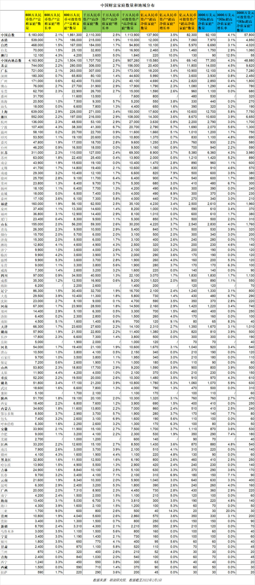

# 中国拥有600万资产“富裕家庭”有518万户，都集中在哪些城市？

**文｜《财经》记者 张颖馨 陈洪杰**

**编辑｜袁满**

中国拥有600万人民币资产的“富裕家庭”数量达到518万户，拥有千万人民币资产的“高净值家庭”数量达到211万户，拥有亿元人民币资产的“超高净值家庭”数量达到13.8万户……

上述数据来源于3月10日胡润研究院发布的《2022意才·胡润财富报告》（下称《报告》）。《报告》同时显示，疫情叠加宏观环境因素影响下，现阶段财富人群更倾向于重视资产的安全性和流动性，在资产配置上注重多元化，与值得信赖的财富管理合作伙伴共同采取行动，积极应对风险挑战。

**可以看到，近年来，尽管面临多重不确定性因素，中国财富人群在资产保值增值的需求上仍表现出强大的韧性，这为财富管理机构提供了广阔的发展机遇。**

**但需要注意，在财富管理行业迅速发展的同时，“无照驾驶”乱象仍较为突出。**
就此，两会期间，多名代表委员提出要加快财富管理领域相关立法及监管体系构建，采取“疏堵结合”策略，打开财富管理“正门”。

**“富裕家庭”达518万户，北京位列第一**

**根据《报告》，截至2022年1月1日，中国拥有600万人民币资产的“富裕家庭”数量已经达到518万户，比上年增加10万户，增长率为2.1%。**
其中，拥有600万人民币可投资资产的“富裕家庭”数量达到186万户，增长率为1.9%。

对此，胡润百富董事长兼首席调研官胡润表示，2021年中国富裕家庭数量增加10万户，其中增加最多的是上海、北京、广东和浙江，占全国增加总数的六成。

**胡润进一步指出，一方面是房地产市场的推动，特别是在一线城市。**
“房住不炒”政策之下，国内房地产市场整体发展步伐放缓，但豪宅市场火热。单价15万元以上的豪宅成交量翻了一倍，分布在上海、苏州、北京、深圳和广州。

**另一方面，国内股市也带动了富裕家庭数量的增长。**
疫情冲击、美联储加息、地缘政治等多方面因素影响下，对于金融投资来说压力较大，然而上证综指和深证成指依然上涨了5%和3%，创业板上涨了12%。

“中国富裕家庭最集中的前30名城市，占全国富裕家庭总数的68%。北京位列全国第一，在前30名城市中，其他北方城市还有天津、大连、青岛、徐州和沈阳。”胡润说。

**中国财富家庭数量和地域分布**

_图源：胡润研究院_

《报告》同时显示，拥有千万人民币资产的“高净值家庭”数量达到211万户，比上年增加5万户，增加2.5%。其中，拥有千万人民币可投资资产的“高净值家庭”数量达到111万户，增长率为1.3%。

**胡润透露，目前中国高净值家庭最集中的城市呈现“3+2+2”格局，前三大是北京、上海和香港，其次是深圳和广州，再次是杭州和宁波。**

另据《报告》，拥有亿元人民币资产的“超高净值家庭”数量达到13.8万户，比上年增加4600户，增加3.5%。其中，拥有亿元人民币可投资资产的“超高净值家庭”数量达到8.2万户，增长率为3.7%。

**拥有3000万美元的“国际超高净值家庭”数量达到9.2万户，比上年增加3600户，增加4.1%。**
其中，拥有3000万美元可投资资产的“国际超高净值家庭”数量达到5.8万户，增长率为3%。

值得注意的是，《报告》亦呈现了中国财富群体生态圈关注的其他内容，如愈发注重知识整合、兴趣投资、身心健康管理等。

从投资心态上看，四成以上财富人群（43%）表示“更积极”，接近上年比例（47%），他们认为危中有机，投资好机会、新机会不断涌现。从资产水平来看，家庭净资产5000万以上的财富人群寻找新投资途径、新赛道的心情相对“更急切”（20%）。

**与此同时，财富人群对于身心健康状况、个体生活质量的关注度持续攀升。**
根据《报告》，居家健康管理咨询（38%）、专家电话问诊（32%）、情绪调节与心理疏导（32%）等身心健康管理类衍生服务需求，超过体检类（17%）和挂号、会诊等就医安排类服务（25%）。

此外，伴随“直播热”蔓延至金融业，在直播内容选题上，“投资答疑”（44%）、“大咖对谈”（43%）和“时政解读”（37%）获得最高选。同时，“情感心理”（30%）和“养生健康”（28%）具备可观受众。

**“无照驾驶”现象突出，立法监管待加强**

可以看到，近年来，尽管面临多重不确定性因素，中国财富人群在资产保值增值的需求上仍表现出强大的韧性，这亦为财富管理机构提供了广阔的机遇。

据中金公司测算，2030年，中国居民个人金融资产规模或将达到486万亿元，2021年至2030年复合增速为9%。参考国际经验，财富积累是财富管理行业发展的根本动力，中国财富管理行业正迎来前所未有的战略机遇期。

**不过，财富管理迎来发展机遇的背后，仍有不小风险亟待关注。这其中，尤以“无照驾驶”乱象较为突出。**

相关数据显示，截至2020年底，企业名称或经营范围带有财富管理且不持有相关金融牌照（投资咨询、基金销售、私募基金管理人等）的公司有6194家。这些所谓的财富管理公司大部分设立在北京、上海、广州、深圳、南京、青岛等相对发达城市，且呈现出越来越“山寨化”和跨地域展业的特点。

**另一面，行业人士指出，近年来，各种打着财富管理名义的产品被爆出“违规宣传”“风控裸奔”等问题，投资者在购买问题产品后，遭受了不小的财产损失。**

就此，两会期间，多位代表委员建议加强构建财富管理业务立法和监管体系。

**2018年以来，随着资管新规、理财新规等系列规则落地实施，中国金融机构资产管理业务的监管体系趋于完备，而财富管理领域却存在立法空白。**

“在当前各方热议资产管理领域相关工作的背景下，的确有必要将财富管理领域立法工作加快提上研究日程。”全国人大代表，重庆农商行党委书记、董事长谢文辉认为，中国居民财富金融发展还存在很多值得探讨、研究的空间。

谢文辉进一步指出，财富管理行业立法体系的研究和完善，一方面有利于保护居民投资者合法权益。通过有效的财富管理立法，明确财富管理业务由持牌金融机构经营，强化客户利益为先的行为监管原则，切实提升投资者的获得感、幸福感。另一方面，也有利于促进财富管理行业的可持续发展。优化行业发展环境，改善投资者的投资环境，减少非必要的市场波动，促进行业健康发展，维护金融市场稳定。

另有全国政协委员表示，参考国际经验，财富积累是财富管理行业发展的根本动力，中国财富管理行业正迎来前所未有的战略机遇期。面对老百姓巨大的财富管理需求，建议采取“疏堵结合”策略，打开财富管理“正门”。

上述全国政协委员建议，有关部门从顶层设计上做好规划，加快财富管理领域相关立法及监管体系构建，引导金融机构真正立足“以客户为中心”，从目前单纯的卖方代销模式往广义投顾模式进阶。在服务好老百姓的财富管理需求上，应引流资金进入实体经济，形成财富管理和资产管理的良性循环。

责编 | 田洁

