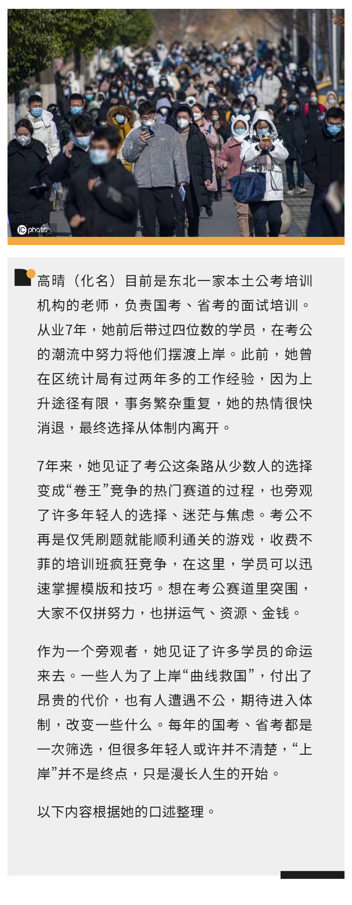

# 公考培训师见证的一万种“上岸”方式

**文|** 殷盛琳

**编辑|** 王珊瑚

**一个文科生的“宇宙尽头”**

我是2012年毕业的，大学在本地一所普通高校读政治学与行政学，一个乍一听就会和政府机关联系起来的专业。毕业的时候，我们的选择并不多，班里三分之一的学生选择考研，剩下的要么去考公务员，要么就是走企业或创业这条路。我们专业考公还挺顺理成章的，公文写作是我们的必修课之一。

但当时对于整个应届生群体来说，考公还不是非常主流的选项。我当时是自学的，市面上没什么培训机构。遗憾的是，从2012年到2017年，我前前后后一共参加了十几次国考、省考、事业单位考试，最终也没能考上行政编。

2013年，我考上了区里的统计局，事业编制，那会儿还允许在编人员考公，我一边工作一边考，最后没成功，我也从体制内离开了。

最开始，我特别想考到宣传类的岗位，那也是我对体制最初的印象。大三实习的时候，学院把我分配到区政府的宣传口，主要负责把关于本区的各项报道汇编整理，做存档，撰写舆情信息，给媒体提供一些新闻通稿，有时候还会跟他们一起去现场采访。对于一个大三的学生来说，这些特别新颖，我能看到自己写的东西在报纸上出现。这种感受特别吸引我。

像组织部、宣传部，或者机关工委、县委办，这种党群机关，在考公体系里的竞争压力都很高。它并不轻松，考上之后会特别累，时间也不规律。但它离权威很近，跟领导接触的机会很多。当你和其他单位有工作交集的时候，你是领导他们的，处在金字塔的上层。所以大家对这些单位有莫名的喜欢，是卷王的首选，分数一定高。

现在我一般会提前告诉孩子们这些岗位很难考，如果没有这类考试经验，或者没有很强的底气的话，我建议他求稳，避开这种高竞争的单位。

在宣传口实习的时候，我要写材料，和word打交道，但到了统计局，我每天都在做表格，换成了Excel。你所了解的那些人口普查、经济普查、农业普查，都是我们牵头组织的。

我主要负责工业口，了解辖区内企业每月生产情况、财务情况，要求他们把数据及时上报。刚接触的时候，我对这些还有新鲜感，但熟悉了就会觉得消耗。我只是在重复报表过程，每个月5号都知道下个月5号要做什么。而且很无力，数据不好看肯定是企业出现了问题，但我们又没有能力去左右什么。

而且事业编上升渠道也非常有限。我是1990年的，是当时办公室最年轻的，大家都叫我“90后小妹”。如果想往上升职，那就是副科长、主任科长，当了领导之后再看能不能转成行政编。但当时和我一样是事业编的有20几个人，竞争副科长的时候，一个是80年的，另一个是坐我旁边的85年的哥哥，他是我们专业的“大拿”，除非他不在这个单位，要不然我怎么能竞争得过他呢？当时会有看不到头的感觉。

所以我一直在坚持考公，想寻找一个解法。为了上岸，我尝试过市里的街道办，这个岗位竞争压力小，那次我进了面试，差点考上。到了2015年，我又一次进了面试，对自己的裸考有点没底，去报了面试培训，就是我现在任教的学校。那时候学校并不是很大，也在起步的阶段，校长就是我当时的老师。他向我抛出橄榄枝，说学校很需要人，而且答应我可以边教边考。我决定从体制内离开。

_●考生经过培训机构宣传广告 图/IC
photo_

**体制到底欢迎什么样的年轻人？**

这几年，我一直在做国考、省考的面试培训。目前我们的机构已经算是当地一线，像国考这种限制条件和要求比较高的培训，我们全校区大概能有1000多人，省考的学员数量翻倍。

另外的同城热门机构，就是全国连锁的那几家，中公、华图一类的。最近三年，他们甚至下沉到了县城。你能在城乡结合部，18线小县城里看到他们的上课分校地点。我们的规模肯定没那么大，主打一个“妈系”教学，班主任全程督学。

为了竞争学员，考公培训机构之间也越来越卷。为了做宣传，我们会在考点雇一些兼职发传单。去年夏天，我们突然发现兼职阿姨们不够用了——赶上宣传期，阿姨们特别抢手，一不注意，她可能就跑去别人家干了。

●2018年5月12日，山东德州市事业单位招聘考试现场，各培训机构宣传招数让人眼花缭乱。图/IC photo

现在大家为了考公都在学习，报培训班，刷题的时间周期会很长。分数也水涨船高，同样一个岗位，五年前和现在的上岸分数差别很大。

无论是国考还是省考，疫情之后报名人数都翻倍增长，大家渴望稳定性，看来看去还是体制内比较稳妥。我们省往年限制当年毕业的为“应届”，疫情之后放宽了限制，只要没有签订三方，户口或档案仍在学校或者户籍所在地，就能以应届生身份报考，也是为了解决就业问题。放宽之后，这个赛道涌进的人更多了。这里面也包括被裁员的教培机构员工，行业黄了，他们也加入了考公大军。

因为国考和各个省考的时间不一致，国考先考，转年山东、江苏、浙江、上海、北京这些重要省份再考，最后是其他联考省份。有些学生为了提前熟悉题型和考试内容，会像“巡考”一样，参加多个考试，尽可能将自己的分数刷高。这几年联考的时间拉齐，也是为了减少这种情况，的确浪费考试资源。

各个地方为了把本省人才留下，也做了很多政策上的倾斜，对岗位限制户籍、限制生源地等，之前为了能更好的上岸，有些学生会为此专门提前转户籍所在地。这几年这种情况少些了。

无论如何，相对于许多工作来说，考公务员仍然算是一条非常公平的路径。

公考面试环节这几年的形势是，考察环节在增加。之前都是结构化面试，一名考生进入到考场之后和考官进行答题互动，结束后考生离场。但是现在，个别省份，以及在国考的税务、海关这些系统中，会采用小组的形式，让三四名考生同时进入考场，按照相应的顺序作答，结束之后还要对彼此刚才的答题内容进行点评。

通过这样的环节，可以考察学生的临场应变能力和情商。在体制内，在团队协作的时候，你将会以什么样的态度来应对。有时候作为培训师，我也会思考一个问题，就是我们教的内容到底有没有用？

我们只能帮助学员理解考试流程，告诉他们哪里是重点，分享一些技巧。像结构化小组面试，很多人一起讨论，如果两个人因为意见相左，现场吵起来，赢的那方不一定算是表现好。这是一场考试，需要协同来完成对题目的讨论，考官不会在意谁争得过谁。

至于现场互动的部分，我们作为培训师也无能为力。不可能在短时间内培养一个学员独立思考的能力。他如果能够学会独立分析问题，多一些思考，考场中一定是高分，这样的学生太少了。模版化的面试“故事”不再受欢迎，最佳答题状态是一种有训练的真诚。让考官觉得你有真情实感，但可能在背后那些讲述是经过大量训练的。

一些学员比较腼腆，不太敢说话，我们会带他们找一些人流密集的地方，让他说一些平时不敢说的话。之前在国考面试培训的时候，我带过一个女孩，她本身瘦瘦小小，一说话就脸红，但是长得很漂亮。我问她觉得自己好看吗？她说从小爸爸妈妈就不怎么夸她，一直是打压式教育。我就带她到每一个班级走一圈，敲门发言，让女孩当众跟大家说：各位同学大家好，我觉得自己长得很漂亮，我也有底气这次一定能考上。那会儿大家能共情她，都是一起学习的战友，每个班的同学会给她鼓掌加油。

以往我们省的笔试和面试分数所占比例悬殊，笔试占70%，面试占30%。有些学员擅长答题，可能比较社恐，不太会表达，也能考上。到了今年，这两部分比例调整到各占50%。

通过筛选标准的变化，你会发现，体制还是欢迎那些性格开朗、能独立面对一些事情的年轻人。

_●2月25日，在安徽省阜阳市第十五中学考点，考生进场参加考试前复习。图/IC
photo_

**你以为成功上岸就一劳永逸了吗？**

现在一个普通的应届毕业生，一次性通过公务员考试的比例，不到一半。很多人都需要经历一次两次的失败才能上岸。这个成本还挺高的，报培训班很贵，还要付出昂贵的沉默成本。在精力、时间和金钱上都要有一定的支撑才行。

每年考前我们都会做一次报考指导。前些年信息还没那么发达的时候，培训机构可能会影响“考情”。比如那年某个岗位不是很热门，机构会告诉学员那里竞争压力小，然后可能大家就扎堆。现在招生体量变大，我们也没办法左右了，只能希望他们能够结合自己的实际情况做理性选择。

我一般会问学生三个问题。第一，你想要什么？有没有职业理想一类的。如果有特别想去的地方或者岗位，事情会顺利很多，但事实是大部分人都没想明白自己到底要什么；第二，你有什么条件优势？包括你的专业，你的户籍，你能考多少分，这些都需要做个平衡；第三，如果失败了，能不能承受代价？

想明白这些，才适合做出下一步的判断。

_●2022年12月17日，江苏镇江市高等专科学校，参加2023年江苏省公务员笔试考试的考生走出考场。图/IC
photo_

有人会为了上岸选择“曲线救国”，去考报名人数少的乡镇政府，非常偏远的边陲，工作环境和条件可能不是理想状态。这两年我遇到过好几个这种案例，有个女孩在偏远的镇里做选调生，工作了5年，才遴选到省里一个没有实权的单位。还有我一个女同学，毕业后考到家里一个地级市的单位，蛰伏5年才遴选到省会城市的单位来。这5年里，她没有谈对象，没有成家，放弃了很多个人生活，到了省会才开始解决一些个人问题。这种代价到底值不值得？也有很多人在中途放弃了，和生活妥协，留在了并不满意的地方消耗自己。

这个圈子里有句准则，“考编不异地，异地不乡镇”。2021年我送上岸一个学生，他考到了非常偏远的异地基层，在整个系统里，他的薪资待遇很高，但钱根本没处花。当地条件很差，非常枯燥单调，下班之后就是回宿舍。他在当地处理人际关系也很不开心，最后决定辞职从体制内离开了。他想再考合适的岗位试试，如果考不上，想回来一起从事考公培训师行业。

对考公人来说，如果你没想明白自己要什么，到最后可能不是“围城”的问题，体制会变成一座牢笼。公务员只是一个执行者，一个运维者，很难做出什么改变。不仅要受规章制度的约束，还要接受监督。我会告诉学员，你不要想着去体制内“躺平”，一张报纸一杯茶就是一天的清闲日子早就过去了，不复存在了。现在的体制内年轻人面临很多工作的残酷和压力。

我之前碰到过一个非常笃定自己要当警察的男生。他有过两年做保险的工作经历，遇到过暴力执法的工作人员，遇到过一些不公平，很想自己去参与其中，做一些改变。他辞职之后脱产备考，最后上岸了。我后来有去问过他现在的工作状态怎么样，一年多过去了，他的热情还没有被磨灭，目前还是很有干劲。

想明白自己要什么，主动去追求，是非常重要的。

在东北，选择回来考公务员的大部分是工作竞争力不强的年轻人。一般去外省读书，能去大厂工作的，很少会回来。在培训机构学习，等待上岸的孩子们，可能在就业上本身就没什么优势。回到家乡，又没有相应的岗位和大企业收纳他们，所以不得不考公务员。

我从统计局离开后，办公室里陆续来了好多95后。2021年，我还送了一个学生到了我原来的单位。当我得知他考虑报考统计局的时候，我就跟单位同事们说，今年我不回去，我送人去。

这些年过去，我当时的同事们还在做一样的事情。可能用的设备更先进了，但业务还是那些，都是在做一些数据统计。我送进去的年轻人，和我当年做的工作也是一样的。

离开体制，我还真没想过失业的风险。公务员考试只要存在，就一定会有学习的需求，我们就有存在的合理性。这些年，考公越来越卷，报名人数也逐年上涨。大家对体制内的工作非常向往，觉得有稳定的收入，风险小一点。

另外，实在不行的话，我还有考回体制这条路可以选择。很多培训机构的老师都有这个想法，我先当培训机构的老师，带领同学们去上岸，去考试，自己最终也会走到“宇宙的尽头”，回到编制之内。

我今年33岁了，按照考公务员的要求，快到“35岁分界线”了。我这两年会有点焦虑，想要不再去试一试，体验一下考场，找到考试的手感和热度。

版权声明：本文所有内容著作权归属极昼工作室，未经书面许可，不得转载、摘编或以其他形式使用，另有声明除外。

