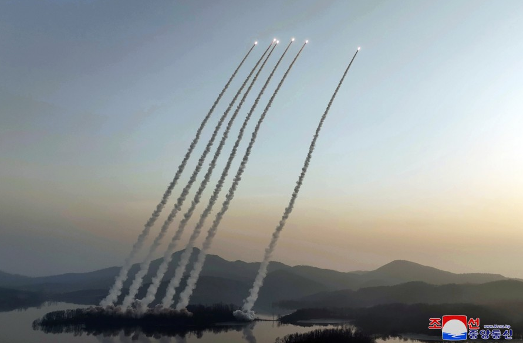

# 六弹齐发：朝鲜首次公开新型战术弹道导弹齐射训练照片

_朝鲜首次公开新型战术导弹齐射的训练照片。_

朝鲜首次公开新型战术弹道导弹齐射训练的照片。

据朝中社3月10日报道，朝鲜最高领导人金正恩9日对承担朝鲜人民军西部前线重要作战任务的火星炮兵部队进行了视察，观摩了火力袭击训练。

从朝中社公布的照片来看，此次进行火力袭击训练的武器是朝鲜的新型战术弹道导弹，该导弹在上个月庆祝朝鲜人民军成立75周年阅兵式上进行了展示，导弹采用6轴发射车，每辆发射车拥有4个导弹发射箱，具备较高的火力密度。

近期，朝鲜半岛轮番上演导弹发射和联合军演，针锋相对。韩国与美国进行了多次空中联合演习，美国出动B-52H、B-1B等轰炸机参演，美日韩还进行了联合反导演习；而朝鲜则从2月开始进行了洲际导弹、战术弹道导弹、巡航导弹以及超远程火箭炮的发射。

3月13日，美韩“自由护盾”大规模联合军事演习正式开始，演习时间将持续至本月23日。据悉，演习规模将超以往“秃鹫”等联合军演的范围及规模，这是韩美时隔5年后再度重启战区级大规模实战机动演习。

3月10日外交部发言人毛宁对韩媒关于朝鲜向半岛西部海域发射导弹的报道进行了回应。毛宁表示，中方注意到有关方在本地区持续军演。望各方正视半岛问题症结，共同推动政治解决进程。

