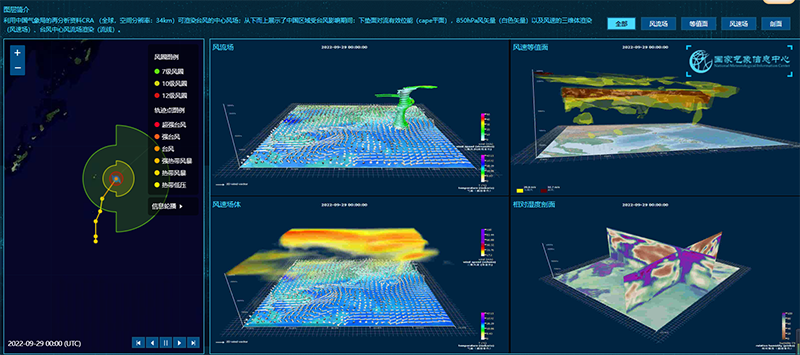

# 刮风下雨也能做多做空了？广东政府发文支持广州期交所研发天气期货

“支持广州期货交易所研发上市 **天气期货** 。”

3月14日，广东省人民政府印发《广东省加快推进气象高质量发展实施意见》（以下简称实施意见）提出探索建设气候投融资研究机构，发展碳信用气象服务技术。支持广州期货交易所研发上市天气期货，开展新能源产业极端天气风险规避服务。

**何为天气期货？**

天气期货，是天气指数期货的简称，与大宗商品期货，如原油、棉花、白糖等期货品种的交易原理相同。

作为一种创新型衍生品，天气期货采用期货交易形式，以各类天气指数为交易标的。

农业经营主体或其他实体企业，可以依据天气风险对自身生产经营的影响情况，通过“天气期货”套期保值操作来规避天气变化带来的生产经营风险和不确定性。

_图说：国家气象信息中心研制的全球大气再分析产品，展示台风洛克运行过程_

天气期货出现在20世纪90年代，基于对气候变化和各行各业强烈的风险管理需求，国际市场推出了天气指数及其衍生品。

1997年，世界上第一笔天气期货以场外交易（OTC）的形式在安然公司（Enron）和科氏工业集团（Koch
Industry）之间开展，合约规定了在一定天气指数条件下作为能源生产商的科氏工业将会得到一定赔偿的条款。

1999年，美国芝加哥商业交易所（CME）最早引入天气期货合约。后来，天气期货逐渐发展至包括日本、欧美等多个国家和地区，市场规模和影响力持续提升。

2003年到2005年，天气期货的规模不断扩张，到2007年，CME推出了飓风期货（Hurricane Future）和降雪期货（Snowfall
Future）等其他品种的天气期货。不过再往后天气期货的发展逐步放缓，交易量一直比较低，属于非主流的期货类型。目前也只有以CME为代表的少数几个交易所开展交易。

全球目前最活跃的天气期货是CME的天气指数期货，具体包括取暖度日（Heating Degree Days）HDD指数期货，制冷度日（Cooling
Degree Days）CDD指数期货，取暖季节指数期货和制冷季节指数期货，吸引了包括农业、能源、电力行业，管理基金，对冲基金等的参与。

与境外市场相比，我国目前尚未开展标准化的天气期货交易，但随着我国农业、能源、旅游和零售等天气敏感型行业的逐步发展，国民经济运行中的天气避险风险需求在持续增长。

财政支持的天气灾害风险保障机制，被写入各地的气象灾害防御条例。业内人士也不断呼吁要研发天气衍生品。目前来看，这类产品的研究和开发已经开始纳入议程。

例如，湖南省在2022年12月发布的推动气象高质量发展的实施意见中也明确提出，积极发展金融、保险和农产品期货气象服务。

**争相研究布局**

天气期货，正成为国内多个期货交易所的“香饽饽”。

2021年6月，郑州商品交易所与国家气象信息中心签署战略合作框架协议。双方将充分发挥各自专业优势，全面启动天气指数编制与应用、天气衍生品研发上市、“期货+气象”复合型人才培养等系列合作。

彼时，郑州商品交易所还表示，“中国版”天气期货正处于大力研发阶段。

2022年3月，大连商品交易所表示，正将天气指数衍生品作为其指数板块业务拓展的重点品种之一。

目前，大连商品交易所与中央气象台联合编制的温度指数包括我国多个城市的月度累积平均温度（CAT）指数和制冷/制热（HDD/CDD）指数。

之所以被各大期交所垂青，主要是因为，天气期货是气象和期货两个领域携手服务实体经济的重要抓手。

有了天气期货，多个国民经济领域主体可以基于气象数据资料和历史财务数据，通过参与天气期货市场开展套期保值，进一步稳定农业生产和企业经营。

天气变化会对农业生产带来直接影响，这一影响将作用于大宗农产品供需关系，最终体现为大宗农产品期货价格波动，通过对气象历史数据的研究和对未来气象条件的预测，可以更好地发挥气象数据指导农业生产经营的作用，进一步促进大宗农产品期现货市场稳定运行，进一步提升期货市场价格发现和风险管理功能。

大连商品交易所举例介绍，以温度衍生品为例，如果农户担心自家大豆或玉米因持续晴热高温而减产，为了规避风险，可以根据自身情况买入温度指数期货。如果出现异常高温，则温度指数相应上涨，平仓后就能获得相应补偿，在一定程度上可以对冲高温带来的减产风险。

业内人士分析称，天气期货具有较为广阔的发展空间。从潜力方面看，中国地处东亚季风区，受地理位置、地形地貌及气候特征等因素影响，气象灾害种类之多、发生之频、范围之广、影响之重超过世界上绝大多数国家。在全球气候变化的影响下，中国高温、干旱、暴雨洪涝、强台风等极端天气气候事件频次增多、强度增强的变化趋势明显。农业、能源、旅游、零售和运输等行业对极端天气变化较为敏感。受极端天气变化影响，这些行业生产经营成本和市场需求将发生巨大波动，从而使得产业链企业面临利润的不可控和流动资金不足等风险。

责编：邵子怡 校对：冯雯君

制作：何永欣 图编：尤霏霏

审读：朱建华 监制：张晓光 签发：潘林青

**版权声明**

上海证券报微信保留本作品的所有权利，未经书面授权，任何单位或个人不得转载、摘编、链接或以其他方式复制发表，否则将被依法追究法律责任。

