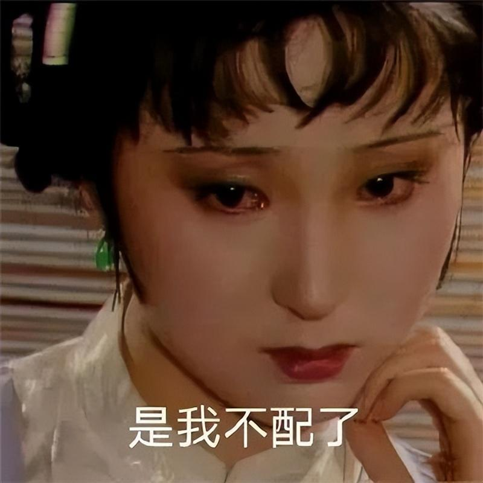
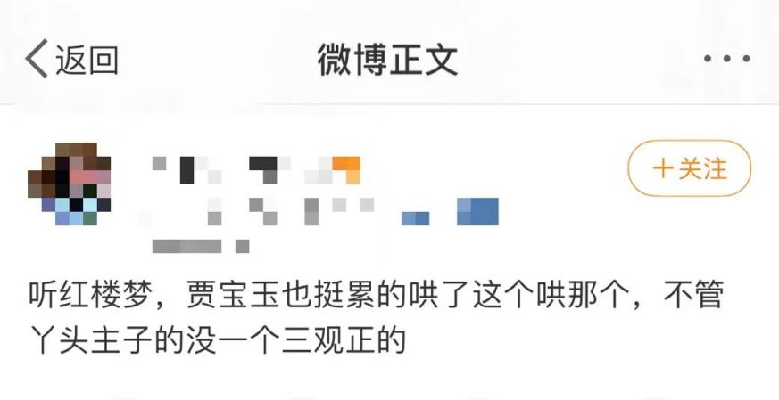
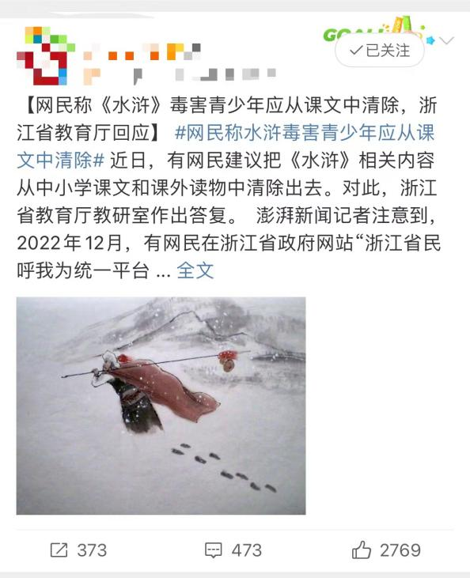
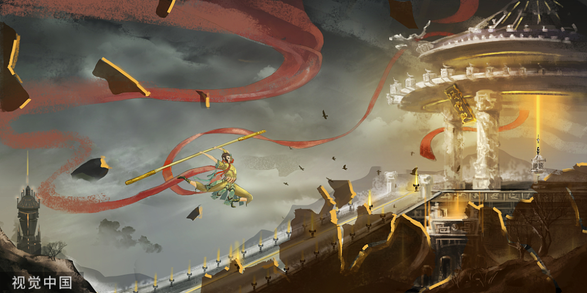
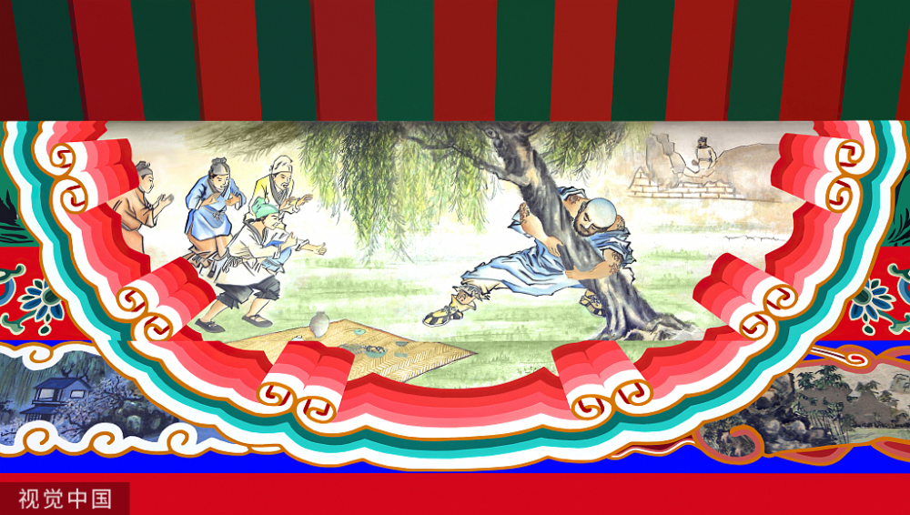
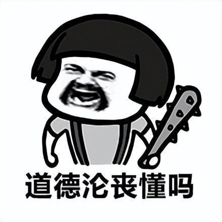
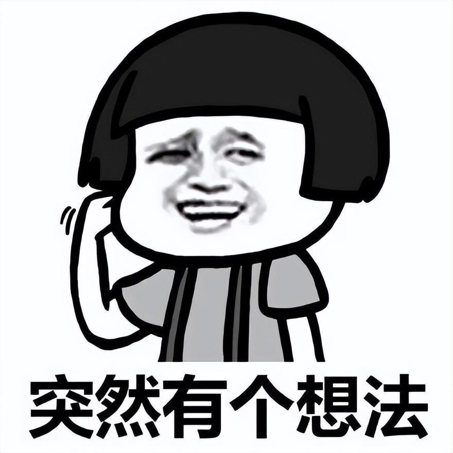

# 好好的名著，怎么就“三观不正”了？

有人调侃说，如果按照当下一些网民的“三观审查”标准，我们的四大名著也好，世界文学经典也好，还有那些大众耳熟能详的文学作品， **没一个合格的。**

**这不，不少名著都遭遇到来自网络的“三观审查”**
：先有人说《水浒传》丑化女性、歌颂滥杀无辜，建议从中小学教材中删减；又有人说《红楼梦》中的林黛玉和贾宝玉早恋、朱自清的《背影》涉嫌违反交规。

按这些让人哭笑不得的标准，鲁迅先生得战战兢兢了：他那些冷嘲热讽的杂文时评，是不是要以“阴阳怪气”的定性被清除出课本了？蒲松龄先生得不知所措了，他的《聊斋》是在宣扬封建迷信，不问苍生问鬼神啊？吴承恩也得“吓跪”了，美化孙悟空“大闹天宫”，孩子受到鼓励，那还得了啊？全都从课本中删除！

还好，这种磨刀霍霍向名著的“三观审查”， **只是在网络上掀起了一些话题波澜，教育部门理性地拒绝了这些“审查标准”。**

比如之前面对“删除水浒”的建议，浙江教育部门就说，《水浒》文学价值巨大，即使某些内容从现代视角看有问题，应当成批判性阅读的对象。它没有给我们展现一个“正确”的世界，而是一个多样的世界，镌刻着人性的复杂，能培养学生的思辨性视角。

**经典之所以能成为经典，不仅在于其文学艺术性上的nice，对复杂人性的揭示，具有深刻的“耐思性”，更在于其历久弥坚的“耐撕性”**
——经得起不同时代、角度刁钻的“撕”。

无论是《三国》，还是《红楼梦》，艺术表现，人物描写，细节问题，哪个没被激烈争论和苛刻审视过？老不看三国，少不看水浒，男不看西游，女不看红楼，但种种争论并没有对经典形成挑战，
**“引起讨论”作为一种文学资本，反而更确证了经典的地位。**

不过， **当下网络上很多对经典的讨论，实际上已经脱离了“讨论”的轨道，而沦为一种意义消解和文学扼杀。**
动不动就建议“请出教材”“从课本删除”，动不动就扣“三观有严重问题”的大帽子，这是以种种“正确”之名，扼杀名著的生存空间，也是缩减青少年对经典名著的接近权。

**不能用“网络社会标准”扼杀名著的生存空间。**
“网络社会标准”这个词是清华大学教授阎学通提出的，他针对我国国际关系研究中出现的问题，提出四个建议，前三个建议是，第一，多研究原理，少搞政策建议。第二，多学习不会的，少反对不懂的。第三，多追求专业的，少沉迷时评的。——尤其促人思考的是第四点：
**多信奉学术标准，少在意“网络社会标准”。**

阎教授在另外一个演讲中提到的观点，可与之形成互文映衬，他批评说：00后大学生深受网络观念影响，把经济决定论、阴谋论、债权武器等网红们的观点当作常识。“以网络为准，他的脑子里已经灌进去了大量网红们的言论”。以网络社会为标准，学术水平就可能会不断下降。

面对来势汹汹、无坚不摧的“网络社会标准”，阎教授捍卫的是学术标准，也值得其他领域反思。比如文学领域、教育领域、法律领域、新闻领域，
**有没有自身坚硬的专业标准，借此抗拒侵略性很强的“网络社会标准”？**

实际上，有些对《水浒》之类名著的讨论，并非没有道理，比如“丑化女性”、“歌颂滥杀无辜”，还有《背影》中内容涉嫌违反交规——但这些“道理”，多是当下网络视角的“片面的道理”。

这正是“网络社会标准”的第一个特征： **把片面的、某个细节上的瑕疵，当成对整体价值的否定。**
《背影》中父亲穿越铁路违反了交规，那老师在讲授时引导学生判断一下，不就行了，岂能以无关文章整体价值的“小细节”，否定整个文章？

《水浒》也是如此，丑化也好，“滥杀无辜”也好，呈现的是当时之社会现实（并非“鼓励滥杀”），也并非这部经典小说的主旨。拿着挑刺的放大镜去审查每一个细节上的“三观倾向”，
**用“直男癌”之类网络撕裂式标签搅动某种敏感情绪，这就是对名著整体的文学价值、精神价值的消解。**

“网络社会标准”的第二个特征是：把争议当舆情，再把这种舆情当成“需要灭的火”。争议不是什么坏事，不同观点也不是否定，百家争鸣百花齐放嘛，
**实际上，“多元讨论价值”也是经典价值的一部分。**

**但“网络社会”泛化了一种标准，很容易把某种争议定义为“引发舆情”。**
如果是“正常争议”，那就争辩呗，摆事实讲道理，在观点的自由市场上争取自己的听众，真理越辩越明嘛。但一上升到“舆情”，那就麻烦了，
**特别是上升到“价值观”层面的舆情，就变得“不可讨论了”。**

其实，那些对名著不同角度的阐释，哪怕极端、无厘头、偏离主旨一点，是很正常的，七嘴八舌本就是网络基本生态。觉得那是胡说八道，可以不理它，但如果在“网络社会标准”下将其上升为舆情，就制造了一种巨大的凝视压力。

“网络社会标准”第三个特征是：流量、声量和网红主导，声高就显得“很有理”， **“流量大”似乎“更有理”。** 流量裹挟下，
**严肃的学术讨论和理性分析，很容易被激愤的口水所淹没。**
对《背影》这篇美文的专业分析，有很多文章，但可能没有哪一篇专业分析有“背影涉嫌违反交规”这种判断更吸引眼球。

拉到网络舆论场上，有认知门槛的文学标准和学术标准，肯定无法“下沉兼容”，必然敌不过“语不惊人死不休”的流量标准。

“网络社会标准”第四个特征，即兴的、当下的、流动的、短瞬的激情。突然间，某个判断不知触碰了哪根舆论神经，突然就火了。某个人看到一段内容，灵机一动，突发奇想，这不就是那什么什么吗？未经深思熟虑，某个惊人判断就横空出世。

对名著经典的那些“三观审查”，多不是坐冷板凳、读海量文献、经过深思熟虑、有充分论据支撑的结论，
**而是“一拍脑袋”的网络即兴判断。时间有强大的反脆弱性，是筛选和检验经典的最硬核标准，** 那些追时效、抢热度、蹭流量的即兴网络判断，就算了吧！

网络争论，那就争呗辩呗，没有什么经典能免于这种网络凝视。网络讨论甚至可以延伸到对经典的课堂讨论中，扩展学生的思辨阅读。但网络的归网络，学术的归学术，不同领域有不同标准，不要动不动就诉诸于“从课本删除”，这是界限！

