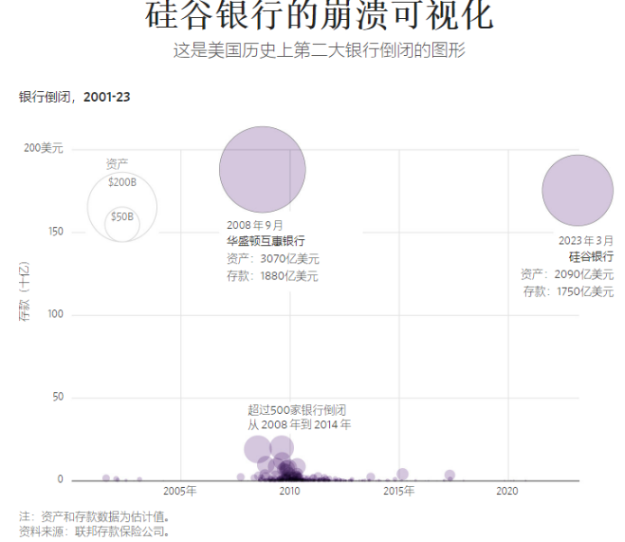

# 如何看待硅谷银行危机？ 复旦教授：悲剧还在蔓延

近期，硅谷银行破产事件震惊全球，其引发的冲击已蔓延至英国、加拿大等地。作为一家拥有40年悠久历史的银行，硅谷银行至今已帮助逾3万家初创企业进行融资，对接全球600家风险投资机构、120家私募股权机构，在初创企业信贷市场占有率超过50%。然而从暴雷到挤兑再到破产，硅谷银行在仅仅48小时内便轰然倒塌，酿成了2008年以来美国最大的一宗银行倒闭案。我们就硅谷银行破产事件专访了复旦发展研究院金融研究中心主任孙立坚教授，整理成以下文字，供读者参考。

**Q1**

**请问您如何评价硅谷银行的商业模式？**

**孙立坚：**
在美国，每一轮大危机之后，都会出现资本和职业赛道破坏性的重构，新一轮瞄准新企业的投资热潮会带来新型企业估值较高的格局。而由于这类创新企业无法通过抵押品来获得正常的信贷，要投资新格局中的创新型企业，不仅需要天使投资、风险投资（VC）、私募股权投资（PE）的参与，还需要一定量的银行资金作为资金补充，以对冲企业创新过程中失败的风险。这种强大的资金需求，是一般商业银行无法满足的。硅谷银行正是看到了当时环境给自己带来的绝佳的商机，开始吸收这类高成长性、高估值的初创企业作为吸金的客户，令它们源源不断进场的资金成为存款的支柱，同时跟随各类风险投资机构的投资标的对其进行追加贷款，从而形成了一种创意的“平衡模式”——存贷联动模式。这正是其区别于一般传统商业银行的一大特点。

**Q2**

**据您来了解，此次危机背后，硅谷银行的资产负债情况如何？**

**孙立坚：**
虽然当初创新赛道的估值很高，但由于投资的都是不确定性较高的初创企业，硅谷银行的存款来源较为单一，不具备储户的多元化，资金流动性较差，无法有效分散金融风险。尽管硅谷银行的创始人们意识到了相关的风险问题，并对此做出了其自认为的最安全的投资组合：在投资风险标的的同时布局中长期安全资产债券投资，意图通过此举夯实银行的资本充足率，以抵御无抵押贷款带来的风险。因美联储激进的加息进程，资产端债券账面浮亏而负债端存款利息上升，当挤兑的风险变为现实时，资产负债期限严重错配导致其无法避免还款压力带来的流动性危机。

**Q3**

**您认为美国监管系统是否在此次危机事前发挥作用？**

**孙立坚：**
我认为，美国监管系统对这类银行过于包容的态度又放大了这种商业模式的缺陷。一方面，美国监管系统对传统银行有着非常严苛的监管要求，从资本充足率、损失的拨备以及关联交易等方面限制了这类银行去做风险类的投资。尤其是在恐怖活动和金融危机爆发以后，传统银行的大额存款更是受到了美国监管部门的穿透式问责和监管。而硅谷银行这类创新型的中小银行则没有受到相关管束，因此初创企业便会更倾向于向这类存款利率不高但交易成本较低的银行存放资金。另一方面，硅谷银行虽不必遵守这种高监管标准，却也因不恰当的管束而面临巨大的安全隐患。由于硅谷银行受美国监管系统所限，不能涉及传统银行的储蓄业务，即不能够吸收一般储户的存款，其存款保险制度和最后贷款人功能也相对弱化，从而无法如传统银行一般扛过市场、利率、汇率等风险的波动。

**Q4**

**您如何看待危机后政府的救市决策？**

**孙立坚：**
硅谷银行应对挤兑的手段正是它如今自身无法留住存款客户的一个重要理由。剩下的应对方法便是自救，即贱卖资产、收缩业务，而这反而会引发更猛烈的挤兑。另外一个方法就是他救，即依靠市场力量和国家力量解决现金流短缺问题。这需要国家进行托底，否则市场收购和重组的力量就很难进场。

而政府救助又会引发两重道德风险。其一是事前道德风险。市场会在得知政府救助的消息后加速挤兑硅谷银行，让其估值探底，等政府接盘后再抄底获取暴利。这将严重侵害了纳税人的利益。其二则是事后道德风险。一旦硅谷银行起死回生，企业便可能都会打着创新的旗号效仿这种高收益高风险的商业模式，将收益提前套现，让政府买单由此造成的风险代价。前一种行为是顺势而为的道德风险，但它不救反推的后果非常严重，会将局部风险升级为系统性风险。后者则是主动为之的行为，它会不会引来系统性风险这一后果，全看政府救助是否及时与完全，这在某种意义上绑架了政府。

由于硅谷银行的投资人比较单一，加之其受到初创企业资产质量下降的影响，投资人不愿再做资本金的补充和寻找新的买家注资硅谷银行。这使得硅谷银行没有充足的补充资本金来应对流动性不足和挤兑风潮，要想自救就不得不把自己持有的资本在目前的利率水平下贱卖。

而这会使得原本账面上的浮亏变为事实上的亏损，进而引发更加猛烈的挤兑，甚至导致整个系统的过度反应，连带其他不是这种商业模式的银行，也因为客户对此问题认知的不足和信息不对称而导致大规模的挤兑。

如果美联储能够及时进行大力度的救助，或者完全接盘硅谷银行的存款客户的损失，那么这种恐慌性的引发挤兑的行为可能就会戛然而止。

但其一，救助将面对事前道德风险。如果市场判断美国政府会接盘救助，那么他们自身行业之间的风险分担的行为就会减弱。相反，其他商业银行会通过先撤资令硅谷银行的估值更加恶化，使得其资不抵债的风险更加严峻，然后在政府接盘后利用其估值被过度低估的时机，再进行收购抄底。这种通过趁人之危来牟取大利的商业模式牺牲了纳税人的利益。

其二，由于这类特殊银行的存款没有得到规范约束与保护，政府如果在这个时候全面接盘硅谷银行的损失，可能会导致未来金融生态系统的混乱，即事后道德风险。如果市场判断美国政府未来都会加大救助力度，那么市场行业间的风险分担的行为就会减弱。对于这一道德风险，美国的监管部门在几次金融危机当中都深有感触，其当初选择不救助雷曼兄弟的行为，便是为压制这种风险的不得已之举。当前，面对硅谷银行内部的挤兑的风险与国家救助可能导致的未来金融生态变得越来越坏的道德风险，美国金融监管机构正处于一种痛苦的两难之中。

文字整理 | 王天行

排版 | 刘 宣

