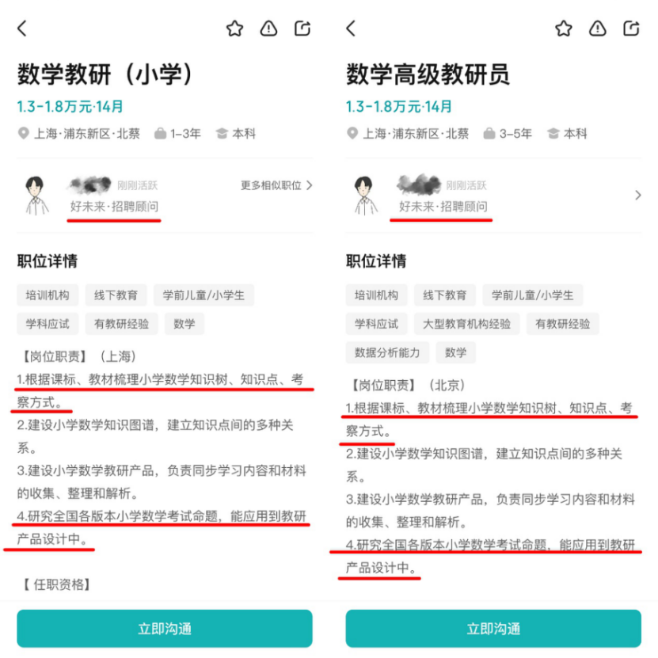
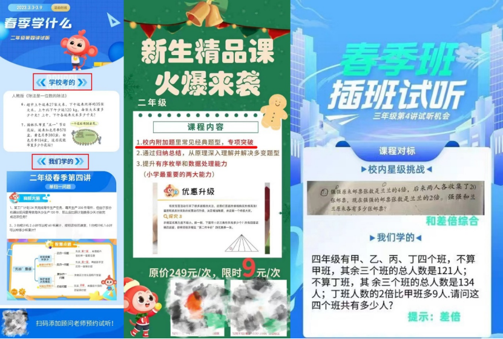
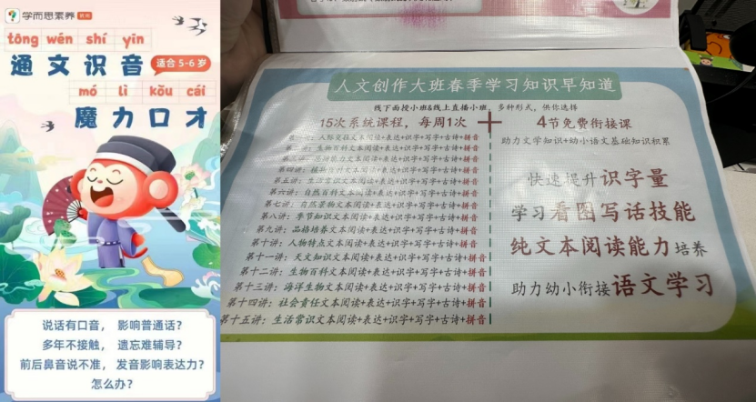
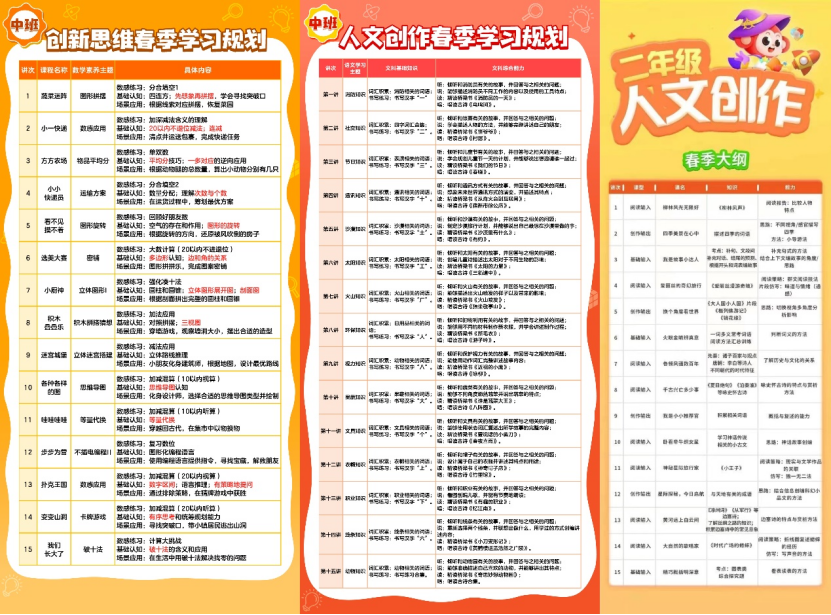

# 学而思大规模重启线下招生 “素养课”将超前、超纲内容纳入教学

**财联社3月14日讯（记者 陈默）**
教幼儿园孩子拼音写字，向低年级学生讲解高年级古诗词，给小学三年级出的数学题连家长看了都挠头……财联社记者近日赴多地调查了解到，正重启大规模线下招生的校外培训龙头企业学而思，在所谓“素养课”包装下，将超前、超纲内容纳入教学培训，把“幼小衔接”“应对考试”作为课程卖点，与国家“双减”政策要求背道而驰，更和相关文件细则存在诸多冲突抵牾。

如此种种，距离学而思宣布停止义务教育阶段的学科类校外培训仅仅刚过一年时间。

而今，在“人文”“思维”“口才”等等外衣、面具之下，学而思涉及语数英内容的教学究竟是属于严格受限且不得以营利为目的的“学科类培训”，还是可算作操作空间更大的“非学科类培训”？这个亟待厘清的问题，已成为影响“双减”成效的关键。

**“非学科”培训为何研究校内考试？**

“我们（的课）有周一到周五的，也有周末的，现在应该都报满了。你先看看想报哪种（班），我再帮你查一下能不能插班、补报。”近日，上海一家学而思教学点的课程顾问向现场咨询的财联社记者表示。

此时，也有别的家长前来咨询报名，得到的同样是“名额紧张”的信息。“我们线下大规模回归也就是从春季班刚开始，面授课开得少，”该课程顾问解释道，“‘双减’之后，我们一直都有（线上课）的。原来上海点挺多的，有八九十家校区，现在还有十几家。”

这名课程顾问所说的“双减”，即2021年7月，中办、国办发布《关于进一步减轻义务教育阶段学生作业负担和校外培训负担的意见》后，对校外培训机构的规范整顿。根据“双减通知”，为“坚持从严治理，全面规范校外培训行为”，明确要求：义务教育阶段的校外学科类培训机构必须是“非营利性”，且不得占用国家法定节假日、休息日开课，更严禁资本化运作，外资亦不得利用可变利益实体等方式控参股学科类培训机构……

“双减通知”落地后，作为覆盖幼儿园到高中阶段、囊括语数英理化等诸多科目的学科类培训龙头公司，学而思不得不作出“重大调整”，宣布于2021年底退出K9（小学到初中）的学科类培训。而此番线下课“大规模回归”，学而思主要靠的是“素养课”的非学科类包装。

财联社记者昨日查阅学而思App发现，在“素养课”招牌下，学而思线下培训设有“创新思维”“人文创作”等科目，主要面向幼儿园、小学阶段，收费多为单科12至13节课3000元以上，北京、上海等多个城市皆有开班。“现在一般是提前1-2个月开始报名，大概4、5月份就可以报暑期班了。”前述课程顾问补充道。

近日，在北京、上海等地的学而思现场教学点，财联社记者看到，不少家长周末来咨询报课，休息区也坐满了等孩子下课的家长。“说是素养课，其实我们家长看中的主要还是课程对孩子语数英能力的提升。”在北京一个教学点，有家长对记者表示。据现场另一位家长说，孩子小学上学期的期末考试里，还出现了学而思之前教过的内容。

在号称为“非学科类”的培训中，怎会讲到学校要考的内容？带着这一疑问，财联社记者昨日查阅招聘类App有关学而思的职位信息，发现其面向学龄前儿童及小学生的“数学教研”的岗位职责竟包括：“根据课标、教材梳理小学数学知识点、考察方式”，以及“研究全国各版本小学数学考试命题，能应用到教研产品设计中”。

_学而思在京沪两地对“数学教研员”岗位的招聘要求包括“研究小学考试命题”_

**多个维度显露“学科类”特征**

“严禁超标超前培训，严禁非学科类培训机构从事学科类培训，严禁提供境外教育课程。”
2021年的“双减通知”用了三个“严禁”来规范校外培训。但在学而思的培训内容宣传中，财联社记者发现诸多与“双减”政策要求背道而驰之处。

以上文的“应试研究”为例，在学而思课程顾问所提供的宣传材料中，其二年级培训课程中，就有将“我们学的”和“学校考的”作题型对照，还有“校内附加题常见经典题型，专项突破”字样的内容介绍。

而纵观上海、广东、浙江等地对学科及非学科类培训的鉴别细则（附注1、2、3），在培训内容、方式、目的、结果的多维度综合鉴别中，是否围绕国家课程标准规定的学科类学习内容教学，是否以提高相关科目（校内闭卷）考试分数为主要目标和结果，都是评判认定构成学科类培训的核心要件。

_学而思课程宣传海报特别突出其培训内容与校内教学的“衔接”_

再看培训方式，当记者咨询小学三年级“素养课”的课堂详情时，北京学而思一名课程顾问直言：“（课程内容）同步年级，比学校拓展得多，”并补充道，“老师会有课前测、课后测，一般最后一次课是评估，可以检测孩子的学习情况。”记者追问如何评估，该课程顾问一语概括：“（做）卷子，还是得落到笔头上。”

对照上述省市的鉴别细则，讲授示范，练习、测试等课堂培训方式均被认为具有“学科类”特征。

**“幼小衔接”教拼音涉嫌违规**

除了在培训中包含大量校内知识点，进行应试题型训练外，学而思明显涉嫌违规之处还有其“幼小衔接”课程。

“双减通知”明确提出：不得开展面向学龄前儿童的线上培训，严禁以学前班、幼小衔接班、思维训练班等名义面向学龄前儿童开展线下学科类（含外语）培训。但在对上海、杭州等地线下教学点的走访中，记者发现，学而思向幼儿园家长“力推”的正是其拼音、思维等“幼小衔接”内容。

_学而思旗下机构的学龄前“拼音”教学内容设置_

“我们人文创作（幼儿园）大班下学期的每节课还会教10分钟拼音，你如果一直跟着上的话，不用担心幼小衔接问题”，上海学而思一名课程顾问推介道。记者发现，其展示的线下课程资料中，“拼音”二字被特别标红。

在杭州学而思，拼音学习则被纳入所谓“魔力口才”课，当地的课程顾问向记者强调：“拼音和思维是幼升小的刚需，（一定）要报的。”

但是，按教育部门规定，小学一年级才开始汉语拼音教学，幼儿园阶段不得提前教授小学课程。

_学而思中班春季学习规划、二年级“人文创作”春季大纲_

“抢跑”教学的内容不止有拼音，在财联社记者拿到的一份学而思中班春季素养课“创新思维”学习规划中，等量代换、立体图形展开图和剖面图、破十法等小学学习内容赫然在列。

类似情况还有，在所谓“人文创作”的语文学习中，学而思二年级春季班就要阅读《凉州词》《从军行》等边塞诗，而同题古诗是出现于小学高年级的语文课本。更有甚者，在上海学而思微信号的宣传文章中，一身汉服的老师正对着小学生讲授李清照的《如梦令》（绿肥红瘦）。不知这个年纪的孩子能否理解李清照“伤春”的少女情怀，只知她另一首相对浅白的《如梦令》是直到中学课本才出现的。

_学而思教师向小学生讲授李清照《如梦令》
图片来自上海学而思微信号宣传文章_

同时，目前学而思的素养课还采取分班制，即所谓A班、A+班、S班。“S班是天才班吗？”有家长在教学点向课程顾问提出质疑。据课程顾问解释，S班必须经过学而思统一的选拔考试，只有被录取才能报名，下次选拔时间预计在4月份。“S班的知识点非常深。”
课程顾问着重强调。

据了解，在“双减”政策发布前，学而思的学科类培训即划分所谓敏学班、勤思班和S班，其中S班也是学而思内部选拔“学习尖子”组成的。

“其实家长也知道，让孩子提前学就是拔苗助长，但当今的氛围让很多家长觉得提前学数学、学识字甚至学阅读，都是幼儿园小朋友的‘标配’。短期看，孩子可能在初入小学时会比那些没‘抢跑’的孩子学得更轻松。但从长远看，这种单纯地学习知识会降低孩子的可塑性，破坏孩子的想象力。作为一名小学老师和两个小学生的家长，我认为在幼儿园包括小学阶段，培养孩子的良好行为习惯、生活自理能力，激发孩子的学习兴趣，增加户外活动帮他们养成健康体格，远比提前学习知识点重要得多。”一位资深小学教师对财联社记者表示，超前学习长期看其实并无益处。

在政策层面，对于义务教育阶段培训中的超前学习、拔苗助长，教育部早在2020年便下发通知（附注4），要求依据负面清单严肃查处超标超前培训行为。其负面清单明确：培训不得超过所在县（市、区）语数英等科目教学的同期进度和要求，禁止在寒暑假培训下学期教科书的知识内容。

**跳出学而思，才有好未来……**

《校外培训路在何方？跳出学而思，才有好未来》，2021年“双减通知”发布后不久，就有央媒记者曾以此为题，向学而思等校外培训机构发出灵魂之问：是彻底转变过去的商业模式，还是搞点“换汤不换药”的小动作？

对学而思来说，这道题的难度或许不亚于让一个学龄前孩子去参加S班选拔。

“双减”对教培行业尤其是K9校外培训产生了根本性的影响。学而思母公司好未来便首当其冲，2021财年Q4财报数据显示，K12（包括高中）业务收入占好未来总收入的九成，据摩根士丹利（2021年6月）的报告，其中K9业务收入在公司总收入中的比重高达80%。

以奥数课起家，主攻中低年级辅导、开创小班教学的学而思，曾推动好未来创造了美股上市时市值不到10亿美元，一路涨至最高点市值达586亿美元的“辉煌”。此后，好未来一度经历断崖式巨幅下跌。但在过去一年（2022/3/10-2023/3/11），好未来股价又从2.5美元涨至6.8美元。有机构认为，公司将“东山再起”，而评估其成长性的重要依据是：以（培养学生）底层能力为导向的素养教育符合大方向，市场规模将超千亿元级别。目前公司的素养课程已初具规模。

在2022年4月举行的2022财年Q4财报电话会上，好未来管理层也表示，公司2021年底全面退出K9学科类培训市场后，重新自我定位于“智能学习解决方案提供商”，将业务梳理为学习服务、学习技术解决方案和学习内容解决方案三项。其中，学习服务主要是指提供素养课程。

据好未来管理层表述，公司从学科类向非学科类的转变，最主要就是围绕上述三项业务商业模式的转变，提供了与此前不同的产品、内容。

但作为一家需要通过营利来回馈股东、支撑估值的上市公司，好未来的管理层在2023财年Q2财报电话会上也坦言，公司还“处于业务转型的早期阶段”，其在2023财年Q3财报电话会上又再次强调，“由于转型，暂时没有专注于提升盈利能力”
。

即便好未来（学而思）业已完成向非学科类培训的转变，政策所要求的“公益属性”也与资本的“逐利天性”相抵牾。

2021年的“双减通知”就提到：坚持校外培训公益属性。去年，《教育部等十三部门关于规范面向中小学生的非学科类校外培训的意见》又进一步明确：“非学科类培训机构要坚持公益属性，遵循公平、合法、诚实信用的原则，根据培训成本、市场供需等因素，合理确定收费项目和标准，控制调价频率和幅度，并报送主管部门。”

此外，“各地要对照非学科类培训机构设置标准，对现有机构进行全面排查，不符合设置标准的要对标整改。对2023年6月底前仍不能完成整改的培训机构依法依规严肃处理。”

再看好未来的另两项业务——学习技术解决方案和学习内容解决方案，似乎也有游走于“灰色地带”的嫌疑。如近期热卖的学而思学习机，约4600元售价的背后，核心卖点就是从学前到初中的学而思S级教师授课内容。

而此前，教育部针对变相违规开展学科类校外培训已有通知（附注5），对“变异形态”的查处方向即包括：违反培训时间有关规定，通过“直播变录播”等方式违规开展学科类培训。

将连线观看此前学而思教师授课作为卖点的这款学习机，究竟算不算变相的“直播变录播”，亦尚待甄别。

附注：

1，上海市教委关于印发《上海市中小学生校外培训服务类别鉴定指引》的通知

2，浙江省教育厅办公室关于印发《浙江省义务教育阶段校外培训机构学科类和非学科类项目鉴别指引（试行）》的通知

3，广东省教育厅关于印发《广东省中小学校外培训项目学科和非学科类别鉴定工作指引》的通知

4，教育部办公厅关于印发义务教育六科超标超前培训负面清单（试行）的通知

5，教育部办公厅关于坚决查处变相违规开展学科类校外培训问题的通知

（财联社记者 陈默）

