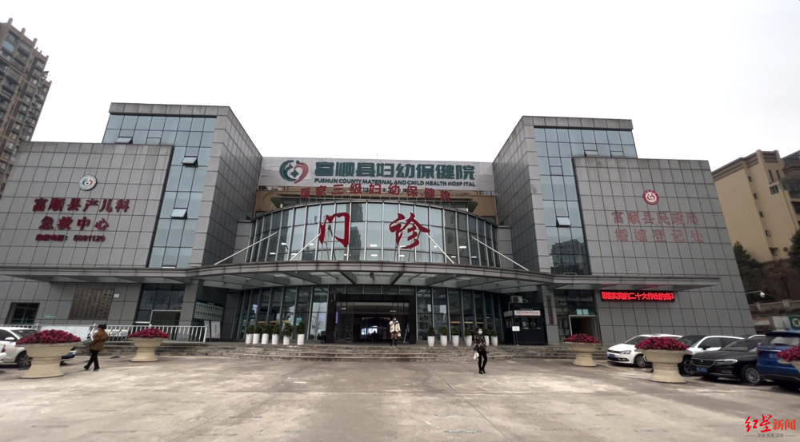
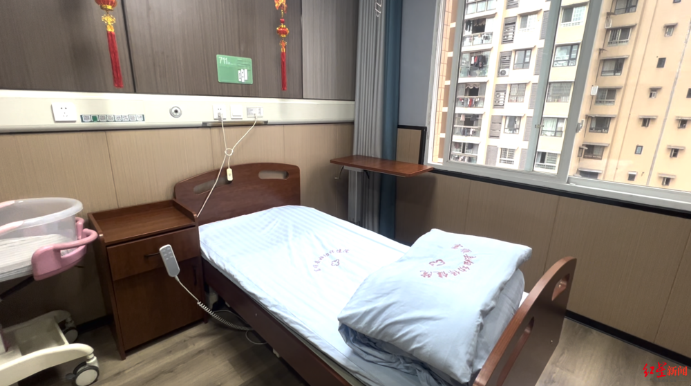

# 生育低潮中的基层妇产医院：分娩量下滑，发展儿保、医美业务谋变

在中国，产科向来不被当作看病的地方，而是喜宴奏鸣曲的谱写地，容纳着人们对生育这一古老问题的认知。

2022年，中国有956万个新生儿降临，人口自然增长率为-0.6%。61年来，这个世界上人口最多的国家首次出现人口负增长。

生育低潮袭来，处于行业洼地的基层专科医院，最能感受到冲击和变化。

**冲击：凉热各异，基层医院影响大**

2008年毕业后，王雪琴来到自贡富顺县妇幼保健院。那时这家县城的专科医院只设有两个科室——儿科和妇产科，王雪琴自此做了十多年的妇产科医生。

_2023年3月2日，星期四，下午3时，富顺县妇幼保健院门诊楼
冯泽洋 摄_

十年前的妇产科，王雪琴每晚至少出去接三四次急诊。她更怕过年，正月初一的凌晨到早上，富顺县妇幼保健院要接诊十几二十个产妇。夜班被手写病历、无缝衔接的手术拉长。通宵忙碌后，时间接近早上八点，王雪琴再度和同事交班，查房、做择期手术、写病历，次日凌晨一点才能走进家门。

2016年，全面两孩政策施行，新政刺激下，一波生育热潮掀起，这一年中国有超1700万新生儿降临。同时，“建档难”“一床难求”等现象出现。

也是这年10月，国家卫计委等部委发文，加快产科医师、助产士人才培养，力争“十三五”时期增加产科医生和助产士14万名；加强省、地市、县三级妇幼保健机构建设，在县级医院建设项目中着力提高产科服务能力，新增产科床位8.9万张。

2018年，两孩政策落地第三年，富顺县妇幼保健院全年的分娩量达到历史高峰，接近5000，占整个自贡市分娩量的四分之一。2019年成为产科护士的黄倩，起初体会到和王雪琴相同的忙碌，“从来没有正常下过班，晚上加班两三个小时是常有的事，能休息的时间都在屋头睡觉。”

**但基层医院没有被这股热潮淹没太久。** 王雪琴注意到，之前上午产检的孕妇下午一点才能看完，但如今刚过上午10点，就已经没什么人了。
**富顺县妇幼保健院2021年的分娩量是3262，2022年这一数字降至2841，较2018年下滑了43%。医院预计，今年的分娩量最多在2600左右。**
据黄倩观察，有时一天只有两三个产妇住院。

全国范围上看，自2016年后，出生人口呈逐年下滑态势。2022年，中国全年出生人口956万人，人口自然增长率为-0.6‰。这是61年以来中国首次出现人口负增长。

分化则在不同医疗机构中显现。身处金字塔塔尖的三甲医院，显然还没被低生育率的潮水打湿。西南一家知名三甲医院产科主治医师汤凌（化名）告诉红星资本局，他所在医院门诊号源依旧紧张，分娩量在小幅上升，去年同比增长4%，产科床位还有所增加，“基层医院是最快下降的地方”。

一位29岁的四川籍老板对民营妇产医院前景颇为乐观，他是成都温江区一家单体民营妇产医院的大股东，还投资了一家金牛区的莆田系连锁妇产医院，两家医院都设有月子中心、医美中心配套。他向红星资本局透露，生育政策放开后，其温江区医院的分娩量在增长，一个月能达到上百个。

_2023年3月2日，星期四，下午3时，富顺县妇幼保健院外墙
冯泽洋 摄_

**现象：初产妇年龄推后 危重症处理是考验**

妇产科医护大多数是女性，与产妇性别的一致建构了医患间特殊的情感连接。

初进产科时，王雪琴24岁，生孩子不过是专业书上的理论，离她还有段距离。28岁时，一段不那么顺畅的生产经历，也令王雪琴理解了女性对于生育的畏怯，“身为妇产科医生，在生孩子的时候，都已经将所有的专业经验和注意事项抛之脑后，普通孕妇只会更加恐惧。”

采访当天，富顺县妇幼保健院产科主任邓秋在门诊遇到一位25岁的初产妇，检查还没做，就问什么时候可以人流。询问原因，对方回答说没有时间照顾。邓秋不时就能在门诊遇到类似情况的孕妇，她们总说现在“时机还不成熟”“还不稳定”。

分娩量变少，基层医院感受到的压力不仅是在收入上。邓秋在富顺县妇幼保健院工作了22年，她见证了初产妇的年龄从20岁，逐渐推至30岁。

妇女初育年龄推迟，导致高龄孕产妇占比直线上升，尤其全面二孩政策放开后，生育压力得以释放。原卫计委公布的数据显示，以高危产妇人数与活产数之比来计算，我国高危产妇比重整体呈上升趋势，从1996年的7.3%到2016年的24.7%，20年间增长到原先的3倍多。其中，高危产妇比重最高的是北京，2016年达62.8%，这一数字在2008年还是34%。

孕产妇建档后，其妊娠风险会按照“五色”分级，绿色意味着妊娠风险低，黄色、橙色、红色，风险递级增加。而自2017年“五色”管理办法实行至今，富顺县妇幼保健院黄、橙、红、紫级别的孕妇占比一直超过90%。大龄和高危产妇占比高，对基层医院的专业水平形成挑战。

2019年10月的一次急救让邓秋记忆犹新。当时保健院正在参加三级乙等医院评审，436床的产妇手术，第三次剖宫产，由评审专家跟台，考核手术操作、院感、急诊处理能力等指标。

术后次日，保健院被告知评审通过，众人欢欣，准备下班去庆祝。但始料未及的，头天顺利分娩的产妇发生全肺栓塞，肺部损伤严重，伴随肾功能衰弱。短短几分钟，心跳呼吸都已停止。医护立刻着手急救，县里各大医院的ICU、血液科、呼吸科专家前来支援。抢救时长超过了24小时，从下午五点持续到第二天傍晚。病人最终被救活，转院自贡市第一人民医院治疗。邓秋事后了解到，同年华西医院也出现一起严重的肺栓塞，一名双胎孕妇死亡。

尽管抢救成功是在“疲惫中感受到喜悦”，但也暴露出基层专科医院的短板，危重症综合处理能力不及综合医院。富顺县妇幼保健院探索出的应对方法是，对辖区内孕龄妇女展开孕前排查、三病（乙肝、梅毒、艾滋病）检查、高危评估，及时发现危重症潜在人群。另一方面是提升临床能力，医院每季度会和其他医院联合举行危机重症救治演练，并把麻醉医师、手术室护士分批派往重症医学科学习。

**谋变：发展儿保业务，开设医美中心**

面对生育低潮，很多基层妇产医院都有相似的惶惑。2月下旬，王雪琴参加川渝两地妇幼保健院绩效考核会议，有约四十家左右三级妇幼保健院参会。私下交流时，大家都谈及分娩量下滑的现状，有些医院去年一整年的分娩量只有几百个或一千多。

谋变其实早已开始。2017年7月，富顺县妇幼保健院迁往新址，一改老院区的逼仄陈旧。从产妇注重隐私与舒适感的需求出发，新院区将住院部7楼的一整层用作产科VIP病房，分为单间与套间两个档位，套间价格是388元/天，相较普通三人间病房20元/天高出18倍。王雪琴透露，分娩量虽然下降，但VIP病房基本是住满的。

_2023年3月2日，星期四，下午3时，富顺县妇幼保健院VIP病房
冯泽洋 摄_

连云港某县妇幼保健院工作的孔思文（化名）也说到，自己所在的医院正筹备新院区开张，她发现产科病房装修得很温馨，不再是单调的水泥墙，“是小孩喜欢的那种风格，让人心情愉悦”。医院还将周边乡镇农村的孕产妇设为目标人群，派人员对接乡镇医生，拉动这部分人到院分娩，与同类专科医院抢人。内部会议上，领导专门强调要注意服务态度。

延展业务链条更是基层专科医院的转型重心。2020年，意识到分娩量减少将是大趋势，富顺县妇幼保健院决心壮大妇科，将妇产科拆分，原科室三分之一的医生分流至妇科。近年医院投入大量精力发展妇女和儿童保健业务，目前这部分业务占比在五成左右。保健院还有一栋1.5万平米的综合大楼在建，计划开设儿童早教基地、残疾儿童康复中心、月子中心。今年年初，商业化项目医美中心营业。

红星新闻记者 俞瑶 实习记者 胡安墉

编辑 肖子琦

