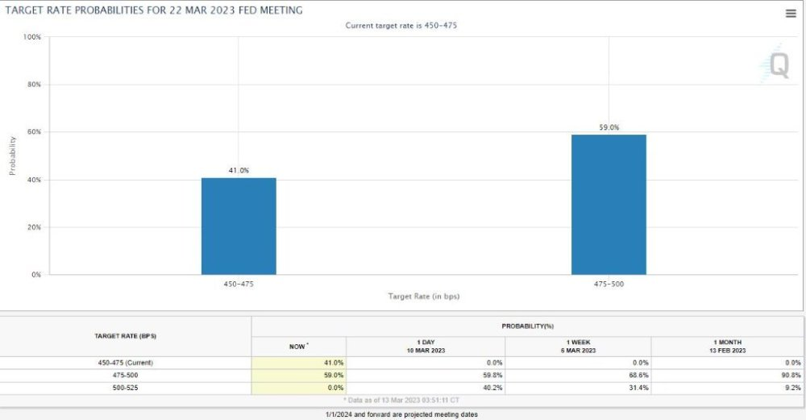
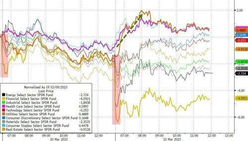
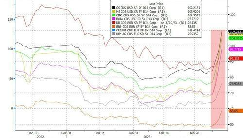
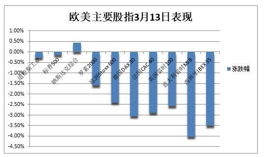
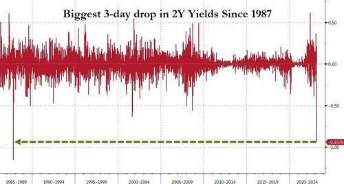
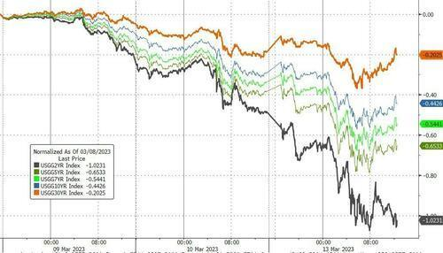
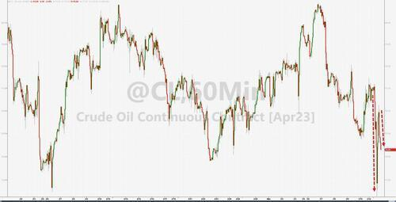
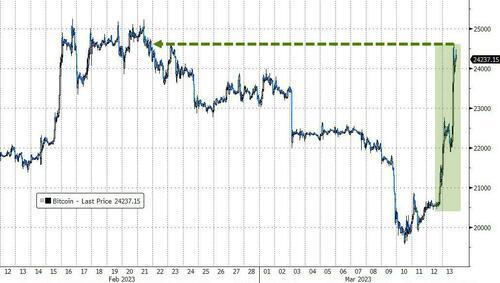
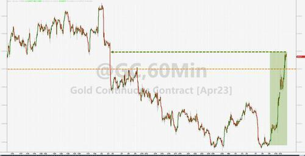

# 美股收盘：道指五连跌，地区银行再遭屠戮，第一共和银行跌近62%

尽管周末美国财政部、美联储和联邦存款保险公司等政府部门联手保障硅谷银行和纽约币圈银行Signature
Bank所有储户的存款安全，美国地区银行股继续惨遭屠戮。

美国总统拜登重申美国银行系统是安全的，监管机构介入救助没有动用纳税人的税款，需要对银行业发生的事情进行全面问责，并呼吁国会加强对银行的监管。

**鉴于三家银行相继倒闭突显了激进加息对金融业的压力，市场对欧美央行的加息预期急速降温**
，甚至完全定价了美联储今年底前降息50个基点，欧洲央行本周加息50个基点概率仅剩50%。

高盛不再预计美联储下周会宣布加息，但维持利率峰值预期在5.25%至5.5%，可能改为5月、6月和7月各加息25个基点。Evercore
ISI也支持暂停加息的论调，还有分析称，美国三家银行快速倒闭可能令美联储比预期更早结束加息行动，科技行业也会深陷持续不断的衰退之中。

芝加哥商交所的FedWatch工具显示，3月美联储不加息概率为41%，一天前尚为0；加息25个基点的概率为59%，与一天前持平，一个月前为90%；加息50个基点的概率降至0，在硅谷银行倒闭之前的可能性曾高达70%，即上周交易员还认为3月加息50个基点为“板上钉钉”。

互换合约显示市场预计美联储政策利率5月见顶至4.83%，代表还有25个基点便结束加息周期，之后到年底或降息75个基点。相比之下，上周四的利率峰值押注为7月达到约5.5%。

美国银行危机为美联储利率路径增添不确定性， **投资者因此格外关注周二发布的美国2月CPI，这是下周美联储FOMC开会前最后一份重磅通胀数据，**
预计同比增6%，核心CPI增5.5%，均将弱于前值。纽约联储调查显示，2月美国人对未来一年的通胀预期下滑0.8个百分点至4.2%。

标普和道指震荡后收跌，道指连跌五日，标普三连跌，KBW银行指数跌12%创三年最大跌幅

3月13日周一，在政府机构介入救助硅谷银行的储户之后，美股主要指数期货隔夜一度齐涨超1%，但美股盘前扭转涨势并集体低开。道指盘初跌近285点或跌0.9%，纳指跌1.4%并失守1.1万点，金融股占据12%比重的标普500指数跌1.4%，下逼3800点并一度抹去今年以来全部涨幅。

**美股全天震荡**
。开盘20分钟时，美股短线拉升，道指率先转涨，主要股指在开盘半小时全线转涨。虽然15分钟后再度转跌，但在午盘前重新齐涨至日高，随后涨幅又显著收窄、接近平盘。衡量标普短期内隐含波动率的“恐慌指数”VIX一度涨24%并上逼31，创去年10月16日以来的五个月新高，年初曾下逼17的低位，VIX超过30通常与高波动性和风险相关。

最终，标普大盘和道指收跌，纳指收涨。标普连跌三日，再创1月5日以来的九周半新低，道指连跌五日，再创去年10月24日以来的四个半月最低。

纳指止步两日连跌，从1月19日以来的七周新低反弹。纳指100止步两日连跌，从1月25日以来的逾六周低位反弹。罗素小盘股连跌三日，至去年12月28日以来的两个半月新低：

标普500指数收跌5.83点，跌幅0.15%，报3855.76点。道指收跌90.50点，跌幅0.28%，报31819.14点。纳指收涨49.95点，涨幅0.45%，报11188.84点。纳指100涨0.8%，罗素2000小盘股跌1.6%表现最差。

_标普500指数盘中一度抹去年内涨幅，最终纳指和纳指100收涨_

标普11个板块走势分化巨大，金融板块继续垫底、重挫3.8%，能源板块跌近2%，原材料跌1%。但房地产和公用事业涨超1.5%，医疗健康涨近1%，可见防御型板块表现更好。

_金融板块继续垫底、重挫3.8%，防御型板块表现更好_

作为银行股基准的费城证交所KBW银行指数（BKX）盘初跌近14%，收跌11.7%，创2020年3月以来最大跌幅。SPDR标普地区银行ETF（KRE）盘初跌超17%，收跌超12%。

两个指数均连跌六日至2020年11月6日以来的逾两年新低，上周均累跌约16%，分别创2020年3月以来和2008年9月雷曼危机以来的最大周跌幅。

_KBW银行指数和SPDR标普地区银行ETF均收跌12%_

**大型银行中**
，美国资产值最大的摩根大通跌超3%后收跌1.8%，距离上周四所创的去年12月19日以来两个半月最低不远。美国银行跌8%后收跌近6%，连跌六日至2020年12月下旬来最低。花旗跌超7%，连跌六日至去年12月末以来最低。富国银行跌超7%，创去年6月下旬来最低。

同时，摩根士丹利跌近4%后跌幅砍半，连跌五日至1月9日来最低。高盛跌近4%，连跌三日至去年10月20日以来最低。

_不仅是小银行违约风险增加，全球所有大型银行都看到CDS利差上升_

**地区银行中，**
总部位于旧金山的第一共和银行盘初跌近79%，收跌近62%，连跌六日至2012年以来最低，创上市来最大单日跌幅。阿莱恩斯西部银行（Western
Alliance Bancorp）一度跌85%，收跌47%至2020年3月来最低。西太平洋合众银行（PacWest
Bancorp）一度跌近60%，收跌21%至2011年来新低。总部位于田纳西州的First Horizon银行一度跌33%，至2021年12月来最低。

这些个股均因跌幅过大而多次熔断，上周累跌33%且盘前领跌银行股的第一共和银行2046年到期债券跌至不足53美分，突显市场信心不足。此外，总部位于犹他州的Zions
Bancorporation跌44%后收跌近26%，总部位于俄亥俄州的KeyCorp一度跌近39%至2020年5月来最低。

**同样因暴跌而盘中数次熔断的还有资管巨头、资产值为美国第八大银行的嘉信理财**
，盘初最深跌23%，创史上最大单日抛售幅度，收跌超11%，连跌三日至2021年1月以来的逾两年新低。公司称拥有充足的流动性渠道和较低的存贷比，花旗上调评级至“买入”，因存款挤兑风险有限。

_多家地区银行和资管巨头嘉信理财盘中因暴跌而数次熔断_

消息面上：

汇丰银行以1英镑收购硅谷银行的英国子公司客户存款，另有一个私募股权公司财团向英国财政部和英国央行提交正式的收购提案，汇丰欧股跌超4%、美股跌2%。

总部位于匹兹堡的PNC金融服务集团跌超9%后跌幅砍半，至去年11月20日以来最低，上周曾寻求收购硅谷银行，但经过初步尽职调查后决定不再推进。

美联储将调查其对硅谷银行的监管，并于5月1日发布调查结果，央行副主席巴尔领导调查。美国联邦存款保险公司（FDIC）计划对硅谷银行举行第二次拍卖。

第一共和银行周日表示已从美联储和摩根大通获得额外流动资金，不算美联储新的银行定期融资工具，其未使用的流动性安排增至700亿美元，资本保持强劲且“明显高于监管要求”。

上周跌超24%的嘉信理财称超过80%的存款符合FDIC全保指标，并向投资者保证“可以获得大量流动性”，称没有看到大量资金外流，预计一季度收入同比增10%，调整后税前利润率超45%。

阿莱恩斯西部银行周一称储户存款“适度”流出，现金储备超过250亿美元且仍在增长，受保存款超过五成。华美银行集团（East West
Bancorp）称截至周一的可用融资额度高达280亿美元。

华尔街分析师称，存款来源较为单一、且未投保存款比例较高的中型银行仍可能面临挤兑风险，周末的纽约币圈银行Signature
Bank被接管是美国历史上第三大银行倒闭事件。 **在脆弱的环境中，银行将提高存款利率来吸储，但这可能释放负面信号、加剧恐慌并侵蚀银行盈利能力。**

周二收盘后，医疗设备制造商Insulet将取代硅谷银行成为标普500成分股，周一涨超8%至1月13日以来的八周新高，平均评级为增持目标价338.40美元暗示有逾10%的涨幅空间。

亿万富翁投资人Bill
Ackman和瑞银都认为，近期银行股、特别是大型银行股被抛售过度，系统性风险“不太可能”，地区银行已是“令人难以置信的便宜货”，利率下降会使其成为更好的投资。

**几家欢喜几家愁，在银行股愁云惨淡的当下，明星科技股齐涨，但尾盘涨幅普遍砍半。**
“元宇宙”Meta涨近1%，亚马逊和微软涨约2%，苹果涨超1%，奈飞涨0.3%，谷歌A涨0.5%，特斯拉盘初跌超5%后转涨超2%，最终收涨0.6%。
**芯片股也尾盘重新转跌。** 费城半导体指数跌超2%后转涨超1%，最终微跌，刷新2月22日以来的近三周最低。

**热门中概全天跑赢。** 中概ETF
KWEB涨1.6%，CQQQ涨1.7%，纳斯达克金龙中国指数（HXC）涨超1%。纳斯达克100四只成份股中，京东跌近1%，拼多多涨超6%，百度和网易涨1%。其他个股中，阿里巴巴微跌，腾讯ADR涨超2%，B站涨7%。蔚来汽车涨0.5%，小鹏汽车涨1%，理想汽车涨超4%领跑“造车三傻”，携程涨超3%。

纳斯达克生物科技指数涨超3%，创去年11月10日以来最大涨幅，行业并购活跃强化投资者信心。辉瑞将以430亿美元收购癌症药物制造商Seagen，为2009年以来该巨头最大收购案，支付现金每股229美元，较上周五收盘溢价近33%。辉瑞涨超1%，Seagen涨超14%逼近历史最高。

避险需求推动金银等贵金属飙升，美股贵金属板块大涨，哈莫尼黄金最高涨16%创四个月最大涨幅，泛美白银涨8%，
VanEck金矿商ETF涨7%至一个月新高，和年初以来最大涨幅。此外，强生、宝洁、可口可乐和百事可乐等防御型个股均涨1%，礼来涨3%。

**受美国银行业危机溢出拖累，欧股收盘全线重挫。** 富时泛欧绩优300指数收跌2.36%，泛欧STOXX
600指数收跌2.41%，连跌三日至1月5日来最低。欧元区STOXX 50指数跌超3%。意大利股指跌超4%领跌主要国家股指。

上周五跌近4%的欧股银行股再跌5.7%，创去年3月4日以来的逾一年最大跌幅，当时曾因警告资产质量将受俄乌冲突影响而下跌6.7%。今日，德国商业银行跌近13%，西班牙萨瓦德尔银行跌近12%，瑞士信贷一度跌15%，其信用违约互换（CDS）触及纪录高点。

两年期美债收益率跌60个基点一度失守4%，三日连跌100个基点为1987年股灾来最深

避险需求涌入美国国债市场，结合交易员大幅下调对美联储的加息预期，对货币政策更敏感的两年期美债收益率周一最深跌65个基点，至少创2008年以来最大单日跌幅，并一度失守4%关口，至去年9月18日以来的半年新低。

周一盘中，两年期美债收益率在三个交易日里累跌超100个基点，为1987年10月美股“黑色星期一”股灾以来的最大三日跌幅，并超过2001年9月11日之后三天的累跌63个基点。上周该收益率曾升至5.084%，创下2007年6月以来的近十六年最高。

_两年期美债收益率三日里跌超100个基点，为1987年10月美股“黑色星期一”以来最大三日跌幅_

10年期基准美债收益率最深下行近28个基点，一度失守3.50%并下逼3.41%，创2月3日以来的五周新低。同时，投资者押注加拿大央行到7月降息50个基点，以应对美国地区银行倒闭的影响，两年期加债收益率创1990年代以来最大两日跌幅近61个基点，周一跌超41个基点。

_加息预期降温，欧美短债收益率周一跌幅普遍深于长债收益率_

**欧债收益率同样大幅跳水。**
欧元区基准的10年期德债收益率一度跌近30个基点至2.168%，创2月3日以来最低，两年期德债收益率从日高最深跌52个基点并一度失守2.50%，创1995年以来最大单日跌幅且连跌三日，上周四曾站上3.30%创2008年以来最高。

有分析称，交易员们现在押注周四欧洲央行更有可能加息25个基点，而非行长拉加德一直强调的50个基点，低久期、高质量的债券正成为被青睐选择，但欧洲央行加息之路尚未完成，德债收益率可能重回3%的高位。

油价盘中跌超5%后跌幅砍半，欧洲天然气盘中跌超9%脱离三周高位，美气涨超7%

同属于风险资产的油价一度集体跌超5%或跌超4美元，美股盘初跌幅收窄至2%左右，主要受到中国等消费大国用油需求快速反弹的提振。

WTI
4月原油期货收跌1.88美元，跌幅2.45%，报74.80美元/桶，盘中曾创2月5日以来最低且下逼72美元。布伦特5月原油期货收跌2.01美元，跌幅2.43%，报80.77美元/桶，盘中曾创1月6日以来最低且一度失守80美元。

_风险偏好退潮，油价一度跌超5%或跌超4美元_

欧洲基准的荷兰TTF天然气期货盘中跌超9%，失守50欧元/兆瓦时整数位，ICE英国天然气盘中跌8.7%，均脱离逾三周高位。美国NYMEX
4月天然气期货涨超7%，脱离两周低位。

美元跌近1%至四周最低，日元涨超2%至一个月新高，离岸人民币跃升千点至三周半最高

市场加息预期骤然降温，衡量兑六种主要货币的一篮子美元指数DXY跌近1%并一度失守103.50，跌穿104关口，连跌四日至2月15日以来的四周新低。

_美元跌近1%至四周最低_

避险资产大涨。日元兑美元最高涨2%，升穿134关口，日高一度升破133，至2月14日以来的一个月新高。瑞郎兑美元涨超1%至2月2日以来的逾五周最高。

欧元兑美元涨1%或涨超百点，升破1.07至逾三周最高。英镑兑美元最高涨1.4%或涨超170点，升破1.21并一度触及1.22，创2月3日以来的五周最高。离岸人民币最高涨1064点或涨1.5%，日高上逼6.83元，创2月15日以来的三周半最高。澳元兑美元涨超2%创五周最大涨幅。

主流加密数字货币不少两位数百分比跳涨，整体市值涨超700亿美元并重上1万亿美元。市值最大的龙头比特币尾盘涨超15%，日内接连升破2.2万至2.4万美元三道整数位，至2月21日以来的三周高位。第二大的以太坊涨9%并升破1680美元，至2月20日以来最高。全球第二大稳定币USDC接近恢复与1美元价格挂钩，发行商Circle称在硅谷银行33亿美元存款得以返还。

_比特币尾盘涨超15%，接连升破2.2万至2.4万美元至三周高位_

**黄金大涨近50美元或涨超2.5%，升破1910美元至逾五周最高，伦敦工业金属低位反弹**

在避险情绪推动下，金银等贵金属跳涨。上周五涨约2%的COMEX
4月黄金期货再涨2.6%，涨幅49.30美元，报收1916.50美元/盎司。现货黄金最高涨47美元或涨2.5%，同样升破1910美元整数位，创2月3日以来的逾五周最高。期银和现货白银最高涨约7%至三周新高。

_黄金大涨近50美元或涨超2.5%，升破1910美元至逾五周最高_

美元下跌令伦敦工业基本金属齐涨：

伦铜涨0.7%并升破8900美元，重回一周高位。伦铝涨0.9%，从1月初以来新低反弹。伦锌涨0.3%，从去年11月底以来低位反弹。伦铅微涨，脱离三周低位。伦镍涨近2%并重上2.3万美元，从去年11月初以来低位反弹。伦锡涨1.3%也重上2.3万美元，从去年11月末以来低位反弹。

